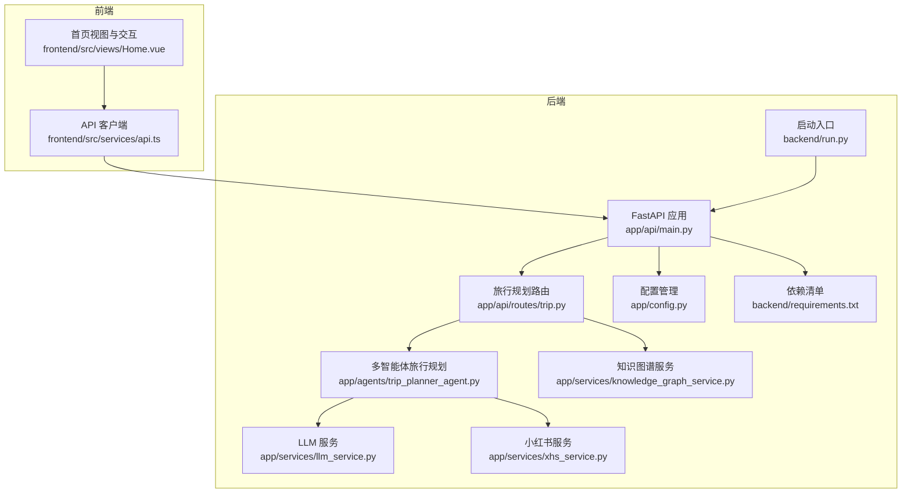
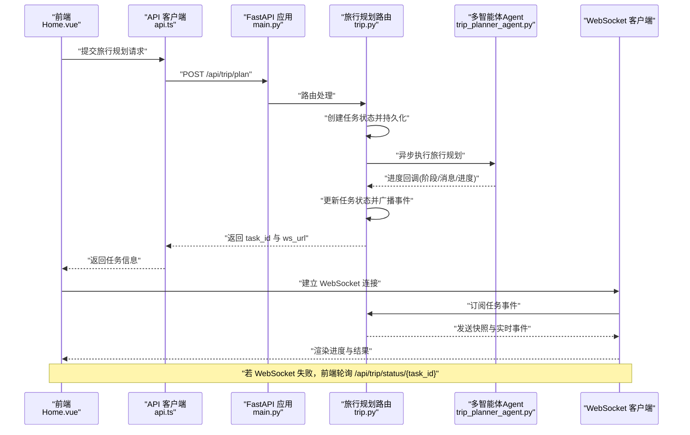
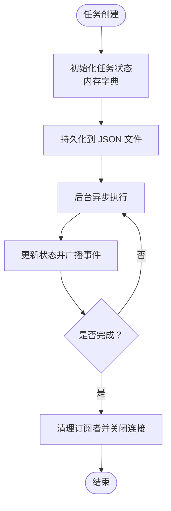
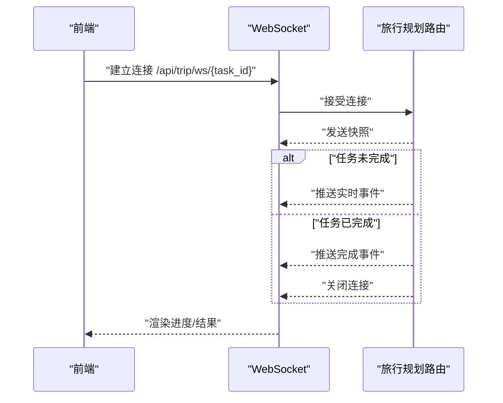
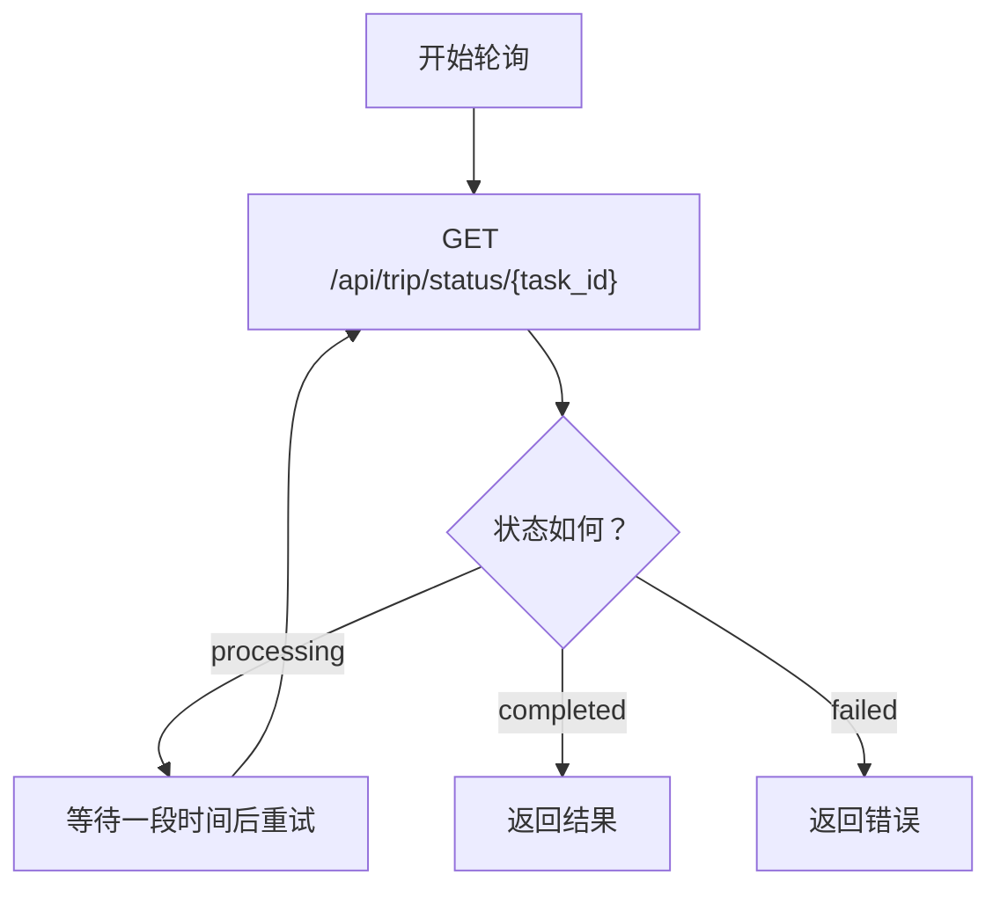
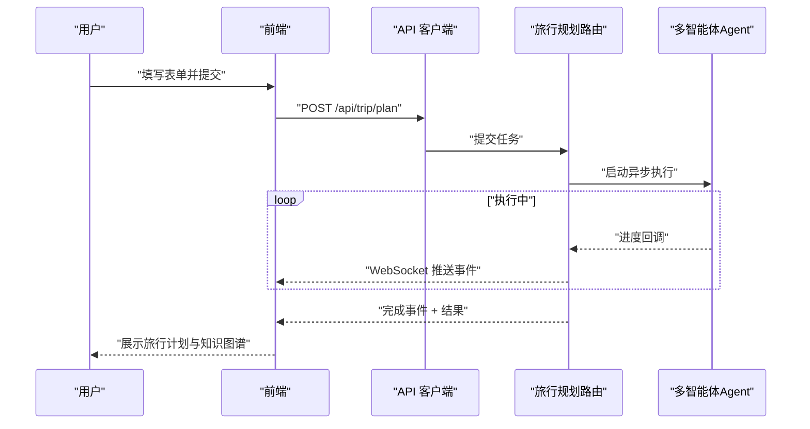
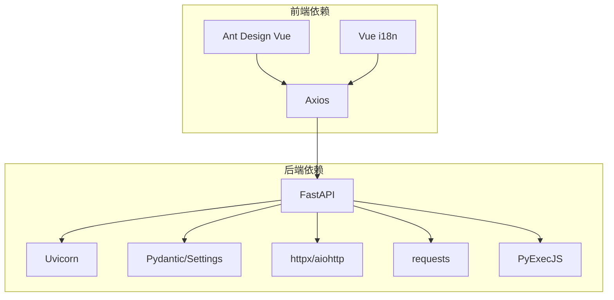

# 异步任务处理

<cite>
**本文引用的文件**
- [backend/app/api/main.py](file://backend/app/api/main.py)
- [backend/app/api/routes/trip.py](file://backend/app/api/routes/trip.py)
- [backend/app/models/schemas.py](file://backend/app/models/schemas.py)
- [backend/app/agents/trip_planner_agent.py](file://backend/app/agents/trip_planner_agent.py)
- [backend/app/services/knowledge_graph_service.py](file://backend/app/services/knowledge_graph_service.py)
- [backend/app/services/llm_service.py](file://backend/app/services/llm_service.py)
- [backend/app/services/xhs_service.py](file://backend/app/services/xhs_service.py)
- [backend/app/config.py](file://backend/app/config.py)
- [backend/run.py](file://backend/run.py)
- [backend/requirements.txt](file://backend/requirements.txt)
- [frontend/src/services/api.ts](file://frontend/src/services/api.ts)
- [frontend/src/views/Home.vue](file://frontend/src/views/Home.vue)
</cite>

## 目录
1. [简介](#简介)
2. [项目结构](#项目结构)
3. [核心组件](#核心组件)
4. [架构总览](#架构总览)
5. [详细组件分析](#详细组件分析)
6. [依赖分析](#依赖分析)
7. [性能考虑](#性能考虑)
8. [故障排查指南](#故障排查指南)
9. [结论](#结论)
10. [附录](#附录)

## 简介
本文件面向 TripStar 项目的异步任务处理机制，围绕基于 asyncio 的异步任务架构、WebSocket 实时通信、轮询降级方案、任务状态持久化策略、任务生命周期示例以及并发控制与性能监控最佳实践进行系统化说明。读者无需深入技术背景即可理解整体流程与关键实现要点。

## 项目结构
后端采用 FastAPI + Uvicorn，前端使用 Vue 3 + TypeScript。异步任务处理集中在旅行规划路由模块，结合多智能体 Agent 协作与知识图谱构建服务，形成完整的任务生命周期闭环。

**图表来源**
- [backend/app/api/main.py:1-147](file://backend/app/api/main.py#L1-L147)
- [backend/app/api/routes/trip.py:1-511](file://backend/app/api/routes/trip.py#L1-L511)
- [backend/app/agents/trip_planner_agent.py:1-826](file://backend/app/agents/trip_planner_agent.py#L1-L826)
- [backend/app/services/knowledge_graph_service.py:1-169](file://backend/app/services/knowledge_graph_service.py#L1-L169)
- [backend/app/services/llm_service.py:1-75](file://backend/app/services/llm_service.py#L1-L75)
- [backend/app/services/xhs_service.py:1-444](file://backend/app/services/xhs_service.py#L1-L444)
- [backend/app/config.py:1-202](file://backend/app/config.py#L1-L202)
- [backend/run.py:1-17](file://backend/run.py#L1-L17)
- [backend/requirements.txt:1-18](file://backend/requirements.txt#L1-L18)
- [frontend/src/services/api.ts:1-335](file://frontend/src/services/api.ts#L1-L335)
- [frontend/src/views/Home.vue:1-883](file://frontend/src/views/Home.vue#L1-L883)

**章节来源**
- [backend/app/api/main.py:1-147](file://backend/app/api/main.py#L1-L147)
- [backend/app/api/routes/trip.py:1-511](file://backend/app/api/routes/trip.py#L1-L511)
- [backend/app/config.py:1-202](file://backend/app/config.py#L1-L202)
- [backend/run.py:1-17](file://backend/run.py#L1-L17)
- [backend/requirements.txt:1-18](file://backend/requirements.txt#L1-L18)
- [frontend/src/services/api.ts:1-335](file://frontend/src/services/api.ts#L1-L335)
- [frontend/src/views/Home.vue:1-883](file://frontend/src/views/Home.vue#L1-L883)

## 核心组件
- 任务状态存储与广播
  - 内存字典作为任务容器，配合 asyncio.Queue 维护订阅者队列，实现事件广播。
  - 任务持久化采用本地 JSON 文件，路径位于后端数据目录，支持服务重启后的状态恢复与历史查询。
- 异步任务执行
  - 提交任务后立即返回 task_id，后台通过 asyncio.create_task 启动旅行规划流程。
  - 任务执行过程中通过回调推进进度，实时更新状态并持久化。
- WebSocket 实时通信
  - 前端通过 WebSocket 订阅任务事件，后端在连接建立时发送快照，结束后自动清理订阅者。
- 轮询降级方案
  - 若 WebSocket 不可用，前端通过轮询 /api/trip/status/{task_id} 获取状态，兼容旧客户端。
- 知识图谱与多智能体协作
  - 旅行规划完成后构建知识图谱，前端可展示可视化图谱。
  - 多智能体 Agent 并发执行不同子任务，提升整体吞吐与稳定性。

**章节来源**
- [backend/app/api/routes/trip.py:19-104](file://backend/app/api/routes/trip.py#L19-L104)
- [backend/app/api/routes/trip.py:207-274](file://backend/app/api/routes/trip.py#L207-L274)
- [backend/app/api/routes/trip.py:315-388](file://backend/app/api/routes/trip.py#L315-L388)
- [backend/app/api/routes/trip.py:390-440](file://backend/app/api/routes/trip.py#L390-L440)
- [backend/app/api/routes/trip.py:455-488](file://backend/app/api/routes/trip.py#L455-L488)
- [backend/app/services/knowledge_graph_service.py:34-169](file://backend/app/services/knowledge_graph_service.py#L34-L169)
- [backend/app/agents/trip_planner_agent.py:257-339](file://backend/app/agents/trip_planner_agent.py#L257-L339)

## 架构总览
下图展示了从前端发起任务到后端执行与结果返回的端到端流程，涵盖 WebSocket 实时推送与轮询降级路径。

**图表来源**
- [frontend/src/views/Home.vue:292-371](file://frontend/src/views/Home.vue#L292-L371)
- [frontend/src/services/api.ts:257-318](file://frontend/src/services/api.ts#L257-L318)
- [backend/app/api/main.py:138-147](file://backend/app/api/main.py#L138-L147)
- [backend/app/api/routes/trip.py:276-313](file://backend/app/api/routes/trip.py#L276-L313)
- [backend/app/api/routes/trip.py:315-388](file://backend/app/api/routes/trip.py#L315-L388)
- [backend/app/api/routes/trip.py:390-440](file://backend/app/api/routes/trip.py#L390-L440)
- [backend/app/api/routes/trip.py:455-488](file://backend/app/api/routes/trip.py#L455-L488)

## 详细组件分析

### 任务状态管理与持久化
- 内存存储
  - 使用字典维护任务状态，包含任务 ID、状态、阶段、进度、消息、结果、错误、请求载荷与订阅者队列。
- 磁盘持久化
  - 任务状态序列化为 JSON 文件，写入临时文件后原子替换，确保写入一致性。
  - 服务启动时扫描数据目录，将历史任务恢复至内存；重启后未完成的任务标记为失败，避免前端无限等待。
- 事件广播
  - 通过 asyncio.Queue 将事件推送给所有订阅者，自动清理失效队列，降低耦合度。

**图表来源**
- [backend/app/api/routes/trip.py:25-38](file://backend/app/api/routes/trip.py#L25-L38)
- [backend/app/api/routes/trip.py:82-104](file://backend/app/api/routes/trip.py#L82-L104)
- [backend/app/api/routes/trip.py:125-145](file://backend/app/api/routes/trip.py#L125-L145)
- [backend/app/api/routes/trip.py:226-241](file://backend/app/api/routes/trip.py#L226-L241)
- [backend/app/api/routes/trip.py:243-274](file://backend/app/api/routes/trip.py#L243-L274)

**章节来源**
- [backend/app/api/routes/trip.py:19-104](file://backend/app/api/routes/trip.py#L19-L104)
- [backend/app/api/routes/trip.py:125-145](file://backend/app/api/routes/trip.py#L125-L145)
- [backend/app/api/routes/trip.py:226-274](file://backend/app/api/routes/trip.py#L226-L274)

### WebSocket 实时通信机制
- 连接建立
  - 前端根据返回的 ws_url 建立 WebSocket 连接；后端接受连接后，先发送当前任务快照，再持续推送后续事件。
- 消息推送
  - 事件对象包含任务 ID、状态、阶段、进度、消息、错误与结果；后端通过队列广播，自动剔除失效订阅者。
- 断线重连策略
  - 前端在连接断开或关闭时主动关闭 socket 并拒绝重复处理；若 WebSocket 不可用，前端切换为轮询模式。

**图表来源**
- [backend/app/api/routes/trip.py:390-440](file://backend/app/api/routes/trip.py#L390-L440)
- [frontend/src/services/api.ts:268-318](file://frontend/src/services/api.ts#L268-L318)

**章节来源**
- [backend/app/api/routes/trip.py:390-440](file://backend/app/api/routes/trip.py#L390-L440)
- [frontend/src/services/api.ts:268-318](file://frontend/src/services/api.ts#L268-L318)

### 轮询降级方案
- 轮询接口
  - /api/trip/status/{task_id} 提供任务状态查询，返回当前状态、阶段、进度与消息；任务完成后返回结果；失败时返回错误与原始请求载荷。
- 前端实现
  - 若 WebSocket 连接失败或不可用，前端自动切换为轮询模式，定时请求状态接口，直至任务完成或失败。

**图表来源**
- [backend/app/api/routes/trip.py:455-488](file://backend/app/api/routes/trip.py#L455-L488)
- [frontend/src/services/api.ts:232-240](file://frontend/src/services/api.ts#L232-L240)

**章节来源**
- [backend/app/api/routes/trip.py:455-488](file://backend/app/api/routes/trip.py#L455-L488)
- [frontend/src/services/api.ts:232-240](file://frontend/src/services/api.ts#L232-L240)

### 任务生命周期示例（从提交到结果返回）
- 提交任务
  - 前端调用 /api/trip/plan，后端返回 task_id 与 ws_url。
- 执行与进度
  - 后端启动异步任务，Agent 并发执行子任务，周期性回调推进进度。
- 实时反馈
  - WebSocket 推送快照与实时事件；前端更新进度条与状态文案。
- 完成与结果
  - 任务完成后，后端持久化最终结果；WebSocket 发送完成事件并关闭连接；前端保存结果并跳转。

**图表来源**
- [frontend/src/views/Home.vue:292-371](file://frontend/src/views/Home.vue#L292-L371)
- [frontend/src/services/api.ts:257-318](file://frontend/src/services/api.ts#L257-L318)
- [backend/app/api/routes/trip.py:276-313](file://backend/app/api/routes/trip.py#L276-L313)
- [backend/app/api/routes/trip.py:315-388](file://backend/app/api/routes/trip.py#L315-L388)

**章节来源**
- [frontend/src/views/Home.vue:292-371](file://frontend/src/views/Home.vue#L292-L371)
- [frontend/src/services/api.ts:257-318](file://frontend/src/services/api.ts#L257-L318)
- [backend/app/api/routes/trip.py:276-388](file://backend/app/api/routes/trip.py#L276-L388)

### 并发控制、资源管理与性能监控最佳实践
- 并发控制
  - 多智能体 Agent 在不同子任务上并发执行，减少总耗时；对高并发外部服务调用使用线程池包装，避免阻塞事件循环。
- 资源管理
  - LLM 客户端单例化，避免重复初始化；高德 MCP 工具仅创建一次并复用。
- 性能监控
  - 任务状态持久化便于审计与排障；WebSocket 快照确保断线重连后能及时同步状态；轮询接口提供降级保障。
- 错误处理
  - 小红书 Cookie 过期等特定异常进行特殊处理并返回前端友好提示；Agent 超时自动重试一次；JSON 解析失败时多轮修复与 LLM 修复兜底。

**章节来源**
- [backend/app/agents/trip_planner_agent.py:257-339](file://backend/app/agents/trip_planner_agent.py#L257-L339)
- [backend/app/services/llm_service.py:12-67](file://backend/app/services/llm_service.py#L12-L67)
- [backend/app/services/xhs_service.py:22-25](file://backend/app/services/xhs_service.py#L22-L25)
- [backend/app/api/routes/trip.py:365-387](file://backend/app/api/routes/trip.py#L365-L387)

## 依赖分析
- 后端依赖
  - FastAPI、Uvicorn、Pydantic、Pydantic-Settings、httpx、aiohttp、requests、PyExecJS 等，满足异步 Web 服务、HTTP 客户端与 JS 签名需求。
- 前端依赖
  - Axios 用于 HTTP 与 WebSocket 通信封装；Ant Design Vue 与 Vue i18n 提供 UI 与国际化能力。

**图表来源**
- [backend/requirements.txt:1-18](file://backend/requirements.txt#L1-L18)
- [frontend/src/services/api.ts:1-335](file://frontend/src/services/api.ts#L1-L335)

**章节来源**
- [backend/requirements.txt:1-18](file://backend/requirements.txt#L1-L18)
- [frontend/src/services/api.ts:1-335](file://frontend/src/services/api.ts#L1-L335)

## 性能考虑
- 异步执行与并发
  - 使用 asyncio.create_task 与 asyncio.gather 提升吞吐；对外部服务调用使用线程池包装，避免阻塞。
- I/O 与持久化
  - 任务状态写入采用临时文件 + 原子替换，降低竞态风险；磁盘 IO 仅在状态变更时触发。
- WebSocket 与轮询
  - WebSocket 优先推送，轮询作为降级；前端在连接失败时自动切换，保证用户体验。
- 超时与重试
  - Agent 规划阶段超时自动重试一次；小红书接口失败时抛出特定异常，前端可识别并提示更换 Cookie。

[本节为通用指导，无需列出具体文件来源]

## 故障排查指南
- WebSocket 连接失败
  - 检查 ws_url 是否正确；确认后端路由 /api/trip/ws/{task_id} 可达；查看后端日志与前端控制台错误。
- 任务长时间处于 processing
  - 查看任务持久化文件是否更新；确认多智能体 Agent 是否正常工作；检查外部服务（高德、小红书）可用性。
- 小红书 Cookie 失效
  - 后端抛出特定异常，前端显示认证失败提示；需在设置页更新 Cookie。
- 轮询无响应
  - 确认 /api/trip/status/{task_id} 可访问；检查任务 ID 是否有效；查看后端错误日志。

**章节来源**
- [backend/app/api/routes/trip.py:365-387](file://backend/app/api/routes/trip.py#L365-L387)
- [backend/app/services/xhs_service.py:22-25](file://backend/app/services/xhs_service.py#L22-L25)
- [frontend/src/services/api.ts:232-240](file://frontend/src/services/api.ts#L232-L240)

## 结论
TripStar 的异步任务处理机制以 FastAPI + asyncio 为核心，结合内存与磁盘双重状态持久化、WebSocket 实时推送与轮询降级，实现了高可用、可观测的旅行规划服务。通过多智能体并发执行与完善的错误处理策略，系统在复杂外部依赖环境下仍能保持稳定与高效。

## 附录
- 配置管理
  - 支持运行时配置覆盖与持久化，兼容前端设置页与环境变量；启动时打印配置信息，便于调试。
- 启动与部署
  - Uvicorn 直接运行应用入口；Docker 环境下挂载前端构建产物，支持静态文件服务与 SPA 回退。

**章节来源**
- [backend/app/config.py:70-202](file://backend/app/config.py#L70-L202)
- [backend/run.py:1-17](file://backend/run.py#L1-L17)
- [backend/app/api/main.py:96-136](file://backend/app/api/main.py#L96-L136)