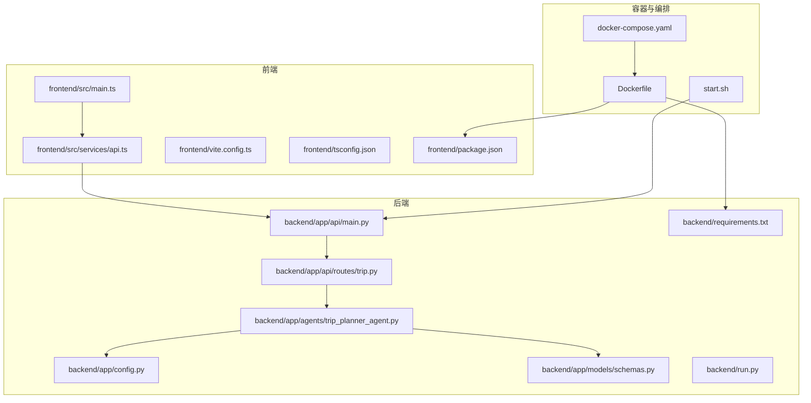
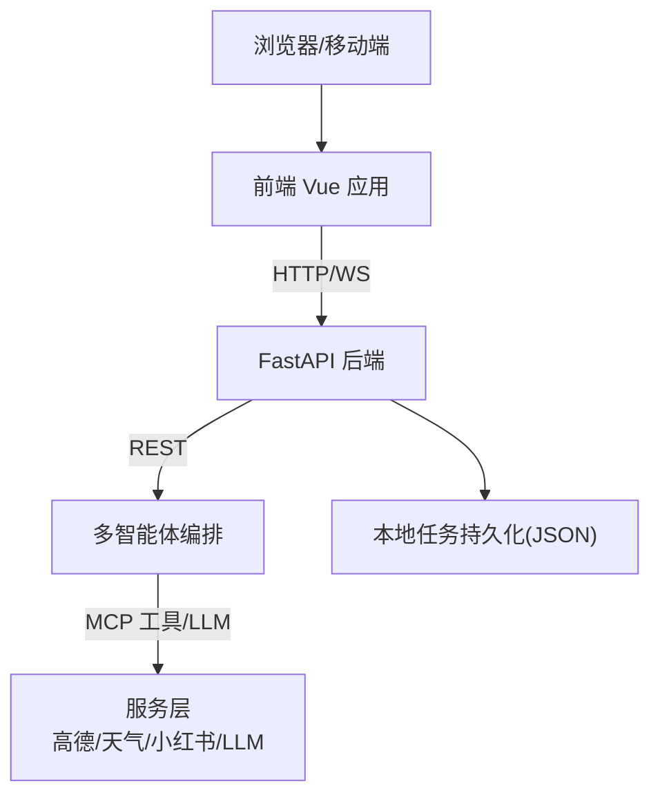
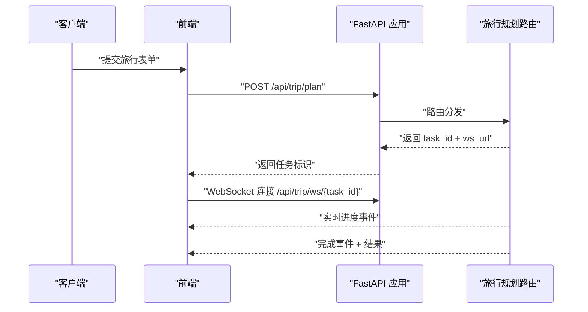
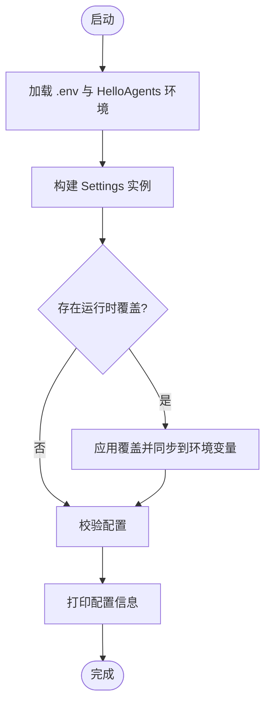
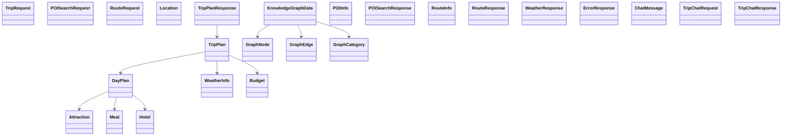
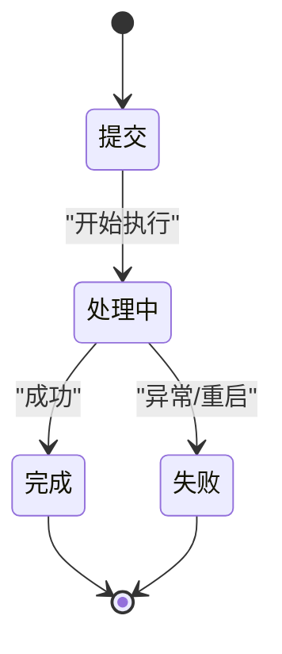
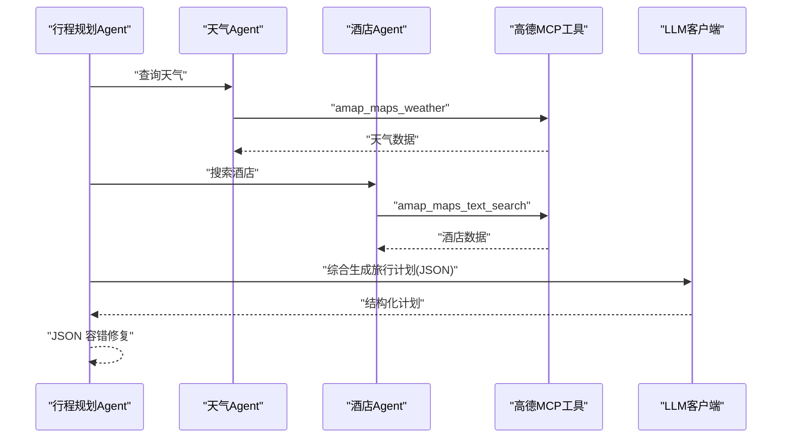
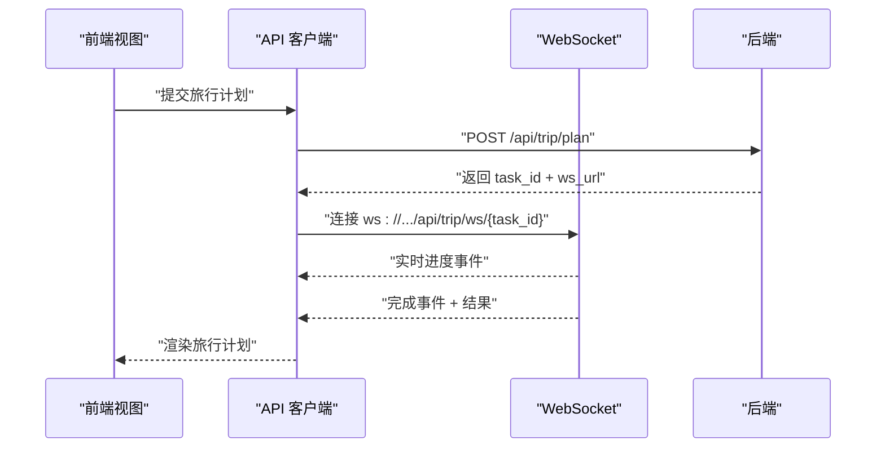
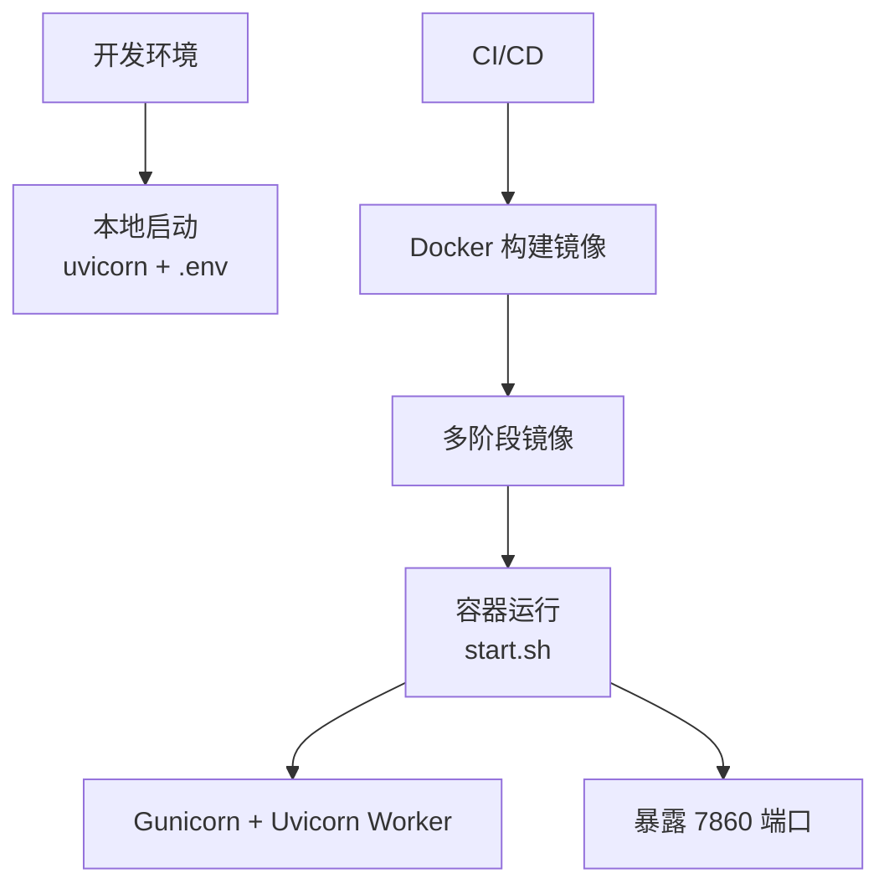

# 技术栈详解

<cite>
**本文引用的文件**
- [README.md](file://README.md)
- [backend/requirements.txt](file://backend/requirements.txt)
- [frontend/package.json](file://frontend/package.json)
- [Dockerfile](file://Dockerfile)
- [docker-compose.yaml](file://docker-compose.yaml)
- [backend/app/api/main.py](file://backend/app/api/main.py)
- [backend/app/config.py](file://backend/app/config.py)
- [backend/app/models/schemas.py](file://backend/app/models/schemas.py)
- [backend/app/api/routes/trip.py](file://backend/app/api/routes/trip.py)
- [backend/app/agents/trip_planner_agent.py](file://backend/app/agents/trip_planner_agent.py)
- [backend/run.py](file://backend/run.py)
- [frontend/vite.config.ts](file://frontend/vite.config.ts)
- [frontend/src/main.ts](file://frontend/src/main.ts)
- [frontend/src/services/api.ts](file://frontend/src/services/api.ts)
- [frontend/tsconfig.json](file://frontend/tsconfig.json)
- [start.sh](file://start.sh)
</cite>

## 目录
1. [简介](#简介)
2. [项目结构](#项目结构)
3. [核心组件](#核心组件)
4. [架构总览](#架构总览)
5. [详细组件分析](#详细组件分析)
6. [依赖分析](#依赖分析)
7. [性能考量](#性能考量)
8. [故障排查指南](#故障排查指南)
9. [结论](#结论)
10. [附录](#附录)

## 简介
TripStar 是一个基于 HelloAgents 框架的多智能体协作旅行规划平台，采用前后端分离架构，后端基于 FastAPI，前端基于 Vue 3 + TypeScript，结合容器化与现代化开发工具链，提供从旅行计划生成、知识图谱可视化到沉浸式 AI 问答的完整体验。

## 项目结构
- 后端（Python 3.10+，FastAPI，HelloAgents，Pydantic，PyExecJS 等）
  - 应用入口与路由：backend/app/api/main.py
  - 配置管理：backend/app/config.py
  - 数据模型（Pydantic）：backend/app/models/schemas.py
  - 旅行规划路由与任务系统：backend/app/api/routes/trip.py
  - 多智能体编排与 LLM 集成：backend/app/agents/trip_planner_agent.py
  - 启动脚本：backend/run.py
  - 依赖清单：backend/requirements.txt
- 前端（Vue 3.5.13，TypeScript，Ant Design Vue，ECharts 等）
  - 应用入口与路由：frontend/src/main.ts
  - API 客户端与轮询：frontend/src/services/api.ts
  - 构建配置：frontend/vite.config.ts、frontend/tsconfig.json
  - 依赖清单：frontend/package.json
- 容器化与编排
  - Dockerfile（多阶段构建，前置缓存 MCP 服务）
  - docker-compose.yaml（环境变量注入与端口映射）
  - start.sh（Gunicorn + Uvicorn Worker 启动）
- 其他
  - README.md（功能说明、架构图、部署指引）

图表来源
- [backend/app/api/main.py:1-147](file://backend/app/api/main.py#L1-L147)
- [backend/app/config.py:1-202](file://backend/app/config.py#L1-L202)
- [backend/app/models/schemas.py:1-264](file://backend/app/models/schemas.py#L1-L264)
- [backend/app/api/routes/trip.py:1-511](file://backend/app/api/routes/trip.py#L1-L511)
- [backend/app/agents/trip_planner_agent.py:1-826](file://backend/app/agents/trip_planner_agent.py#L1-L826)
- [backend/run.py:1-17](file://backend/run.py#L1-L17)
- [frontend/src/main.ts:1-35](file://frontend/src/main.ts#L1-L35)
- [frontend/src/services/api.ts:1-335](file://frontend/src/services/api.ts#L1-L335)
- [frontend/vite.config.ts:1-24](file://frontend/vite.config.ts#L1-L24)
- [frontend/tsconfig.json:1-34](file://frontend/tsconfig.json#L1-L34)
- [Dockerfile:1-64](file://Dockerfile#L1-L64)
- [docker-compose.yaml:1-24](file://docker-compose.yaml#L1-L24)
- [start.sh:1-20](file://start.sh#L1-L20)

章节来源
- [README.md:1-263](file://README.md#L1-L263)
- [backend/app/api/main.py:1-147](file://backend/app/api/main.py#L1-L147)
- [backend/app/config.py:1-202](file://backend/app/config.py#L1-L202)
- [backend/app/models/schemas.py:1-264](file://backend/app/models/schemas.py#L1-L264)
- [backend/app/api/routes/trip.py:1-511](file://backend/app/api/routes/trip.py#L1-L511)
- [backend/app/agents/trip_planner_agent.py:1-826](file://backend/app/agents/trip_planner_agent.py#L1-L826)
- [backend/run.py:1-17](file://backend/run.py#L1-L17)
- [frontend/src/main.ts:1-35](file://frontend/src/main.ts#L1-L35)
- [frontend/src/services/api.ts:1-335](file://frontend/src/services/api.ts#L1-L335)
- [frontend/vite.config.ts:1-24](file://frontend/vite.config.ts#L1-L24)
- [frontend/tsconfig.json:1-34](file://frontend/tsconfig.json#L1-L34)
- [Dockerfile:1-64](file://Dockerfile#L1-L64)
- [docker-compose.yaml:1-24](file://docker-compose.yaml#L1-L24)
- [start.sh:1-20](file://start.sh#L1-L20)

## 核心组件
- 后端核心
  - FastAPI 应用与中间件：CORS、静态文件挂载、健康检查、根路径回退
  - 配置系统：基于 pydantic-settings 的 Settings 类，支持 .env 与 HelloAgents 环境叠加
  - 数据模型：Pydantic 模型定义旅行计划、POI、天气、预算、知识图谱等结构
  - 旅行规划路由：异步任务提交、WebSocket 实时事件、轮询兼容、历史计划
  - 多智能体编排：基于 HelloAgents 的 Agent 流水线，结合高德 MCP 工具与 LLM
- 前端核心
  - 应用入口：Vue 3 + 路由 + Ant Design Vue + 国际化
  - API 客户端：Axios 封装，WebSocket 轮播事件，运行时配置持久化
  - 构建与类型：Vite + TypeScript，代理到后端 8000 端口
- 容器化与运行
  - 多阶段 Docker 构建：前端构建、后端依赖安装、MCP 服务预热、Gunicorn + Uvicorn Worker
  - docker-compose：环境变量注入、端口映射、重启策略
  - start.sh：统一启动入口，日志与超时配置

章节来源
- [backend/app/api/main.py:1-147](file://backend/app/api/main.py#L1-L147)
- [backend/app/config.py:21-127](file://backend/app/config.py#L21-L127)
- [backend/app/models/schemas.py:10-264](file://backend/app/models/schemas.py#L10-L264)
- [backend/app/api/routes/trip.py:25-511](file://backend/app/api/routes/trip.py#L25-L511)
- [backend/app/agents/trip_planner_agent.py:173-826](file://backend/app/agents/trip_planner_agent.py#L173-L826)
- [frontend/src/main.ts:1-35](file://frontend/src/main.ts#L1-L35)
- [frontend/src/services/api.ts:1-335](file://frontend/src/services/api.ts#L1-L335)
- [frontend/vite.config.ts:1-24](file://frontend/vite.config.ts#L1-L24)
- [Dockerfile:1-64](file://Dockerfile#L1-L64)
- [docker-compose.yaml:1-24](file://docker-compose.yaml#L1-L24)
- [start.sh:1-20](file://start.sh#L1-L20)

## 架构总览
系统采用前后端分离，后端提供 REST/WS 接口，前端负责交互与可视化，多智能体在后端完成复杂推理与数据整合。

图表来源
- [backend/app/api/main.py:55-60](file://backend/app/api/main.py#L55-L60)
- [backend/app/api/routes/trip.py:276-313](file://backend/app/api/routes/trip.py#L276-L313)
- [backend/app/agents/trip_planner_agent.py:173-242](file://backend/app/agents/trip_planner_agent.py#L173-L242)
- [backend/app/config.py:184-196](file://backend/app/config.py#L184-L196)

章节来源
- [README.md:43-97](file://README.md#L43-L97)
- [backend/app/api/main.py:1-147](file://backend/app/api/main.py#L1-L147)
- [backend/app/api/routes/trip.py:1-511](file://backend/app/api/routes/trip.py#L1-L511)
- [backend/app/agents/trip_planner_agent.py:1-826](file://backend/app/agents/trip_planner_agent.py#L1-L826)

## 详细组件分析

### 后端应用与路由（FastAPI）
- 中间件与静态资源
  - CORS 配置、路径重写中间件、静态文件挂载、SPA 回退
- 路由注册
  - 旅行规划、POI、地图、聊天、设置等路由前缀统一为 /api
- 启动与健康检查
  - 启动事件打印配置与校验，健康检查返回服务状态

图表来源
- [backend/app/api/main.py:55-60](file://backend/app/api/main.py#L55-L60)
- [backend/app/api/routes/trip.py:276-313](file://backend/app/api/routes/trip.py#L276-L313)
- [frontend/src/services/api.ts:268-318](file://frontend/src/services/api.ts#L268-L318)

章节来源
- [backend/app/api/main.py:33-136](file://backend/app/api/main.py#L33-L136)
- [backend/app/api/routes/trip.py:276-488](file://backend/app/api/routes/trip.py#L276-L488)

### 配置管理（pydantic-settings）
- 配置类 Settings：应用名、版本、主机端口、CORS、高德与小红书密钥、LLM 参数别名
- 运行时设置：支持本地持久化覆盖、同步到环境变量、打印与校验
- 环境加载：优先加载项目 .env，再叠加 HelloAgents 环境

图表来源
- [backend/app/config.py:11-127](file://backend/app/config.py#L11-L127)
- [backend/app/config.py:162-201](file://backend/app/config.py#L162-L201)

章节来源
- [backend/app/config.py:21-127](file://backend/app/config.py#L21-L127)
- [backend/app/config.py:162-201](file://backend/app/config.py#L162-L201)

### 数据模型（Pydantic）
- 请求模型：旅行计划请求、POI 搜索、路线规划
- 响应模型：位置、景点、餐饮、酒店、单日行程、天气、预算、旅行计划
- 知识图谱模型：节点、边、分类、整体数据
- 错误与聊天模型：错误响应、消息与问答请求/响应

图表来源
- [backend/app/models/schemas.py:10-264](file://backend/app/models/schemas.py#L10-L264)

章节来源
- [backend/app/models/schemas.py:1-264](file://backend/app/models/schemas.py#L1-L264)

### 旅行规划路由与任务系统
- 任务状态机：提交、处理中、完成、失败
- 事件广播：WebSocket 订阅者队列、快照与增量事件
- 历史计划：按更新时间排序的摘要列表
- 健康检查：返回 Agent 名称与工具数量

图表来源
- [backend/app/api/routes/trip.py:19-38](file://backend/app/api/routes/trip.py#L19-L38)
- [backend/app/api/routes/trip.py:243-274](file://backend/app/api/routes/trip.py#L243-L274)
- [backend/app/api/routes/trip.py:442-452](file://backend/app/api/routes/trip.py#L442-L452)

章节来源
- [backend/app/api/routes/trip.py:1-511](file://backend/app/api/routes/trip.py#L1-L511)

### 多智能体编排与 LLM 集成
- Agent 分工：天气查询、酒店推荐、行程规划
- 工具集成：高德 MCP 工具（amap-mcp-server），通过 uvx 预热
- JSON 容错：多轮清洗与修复（引号、截断、算术表达式），必要时 LLM 自修复
- 并发优化：景点/天气/酒店三路并发，规划串行

图表来源
- [backend/app/agents/trip_planner_agent.py:173-242](file://backend/app/agents/trip_planner_agent.py#L173-L242)
- [backend/app/agents/trip_planner_agent.py:257-339](file://backend/app/agents/trip_planner_agent.py#L257-L339)
- [backend/app/agents/trip_planner_agent.py:424-758](file://backend/app/agents/trip_planner_agent.py#L424-L758)

章节来源
- [backend/app/agents/trip_planner_agent.py:1-826](file://backend/app/agents/trip_planner_agent.py#L1-L826)

### 前端应用与 API 客户端
- 应用入口：Vue 3 + 路由 + Ant Design Vue + 国际化
- API 客户端：Axios 封装，WebSocket 轮播事件，运行时配置持久化
- 构建配置：Vite 代理到后端 8000 端口，TypeScript 严格模式

图表来源
- [frontend/src/main.ts:1-35](file://frontend/src/main.ts#L1-L35)
- [frontend/src/services/api.ts:219-318](file://frontend/src/services/api.ts#L219-L318)
- [backend/app/api/routes/trip.py:390-440](file://backend/app/api/routes/trip.py#L390-L440)

章节来源
- [frontend/src/main.ts:1-35](file://frontend/src/main.ts#L1-L35)
- [frontend/src/services/api.ts:1-335](file://frontend/src/services/api.ts#L1-L335)
- [frontend/vite.config.ts:1-24](file://frontend/vite.config.ts#L1-L24)

### 容器化与运行（Docker / docker-compose / start.sh）
- Dockerfile
  - 前端阶段：安装 Node 依赖并构建，传递 VITE_AMAP_WEB_JS_KEY
  - 最终阶段：安装 Python 依赖、gunicorn/uvicorn、预热 amap-mcp-server、复制后端与前端产物
  - EXPOSE 7860，CMD 启动 start.sh
- docker-compose
  - 构建参数注入前端 JS Key，环境变量注入后端运行时配置
  - 端口映射 7860:7860，重启策略
- start.sh
  - Gunicorn + Uvicorn Worker，绑定 HOST/PORT，超时与日志配置

图表来源
- [Dockerfile:1-64](file://Dockerfile#L1-L64)
- [docker-compose.yaml:1-24](file://docker-compose.yaml#L1-L24)
- [start.sh:1-20](file://start.sh#L1-L20)

章节来源
- [Dockerfile:1-64](file://Dockerfile#L1-L64)
- [docker-compose.yaml:1-24](file://docker-compose.yaml#L1-L24)
- [start.sh:1-20](file://start.sh#L1-L20)

## 依赖分析
- 后端依赖（节选）
  - hello-agents：多智能体框架与协议
  - fastapi / uvicorn：高性能异步 Web 框架与 ASGI 服务器
  - pydantic / pydantic-settings：强类型数据模型与配置管理
  - httpx / aiohttp / requests：HTTP 客户端
  - loguru：结构化日志
  - fastmcp / uv：高德 MCP 工具与 amap-mcp-server 预热
  - python-dateutil / huggingface_hub / pypinyin：日期解析、模型仓库、拼音
  - PyExecJS：JavaScript 执行（小红书签名引擎）
- 前端依赖（节选）
  - vue / vue-router / vue-i18n：核心框架与国际化
  - ant-design-vue / @ant-design/icons-vue：UI 组件库
  - axios：HTTP 客户端
  - echarts：知识图谱可视化
  - dayjs：日期处理
  - swiper：轮播组件
  - html2canvas / jspdf：截图与 PDF 导出

章节来源
- [backend/requirements.txt:1-18](file://backend/requirements.txt#L1-L18)
- [frontend/package.json:11-33](file://frontend/package.json#L11-L33)

## 性能考量
- 异步任务与并发
  - 旅行规划任务通过 asyncio.create_task 异步执行，WebSocket 实时反馈进度
  - 景点/天气/酒店三路并发，缩短总耗时
- 容器启动优化
  - Dockerfile 预热 amap-mcp-server，避免首次请求超时
  - 多阶段构建减少镜像体积与构建时间
- LLM 与 JSON 容错
  - 多轮清洗与修复策略，降低 JSON 解析失败率
  - 超时重试与 LLM 自修复作为兜底
- 前端轮询与 WebSocket
  - WebSocket 优先，兼容轮询，避免频繁短连接带来的开销

章节来源
- [backend/app/api/routes/trip.py:304-387](file://backend/app/api/routes/trip.py#L304-L387)
- [backend/app/agents/trip_planner_agent.py:257-339](file://backend/app/agents/trip_planner_agent.py#L257-L339)
- [Dockerfile:45-47](file://Dockerfile#L45-L47)
- [frontend/src/services/api.ts:268-318](file://frontend/src/services/api.ts#L268-L318)

## 故障排查指南
- 配置相关
  - LLM API Key 未配置：校验函数给出警告，需在 .env 或容器环境变量中提供
  - 高德 Web Key/JS Key 未配置：地理编码与地图功能受限
- 任务状态
  - 服务重启后未完成任务会被标记为失败，需重新生成
  - WebSocket 断开或轮询超时：检查后端日志与网络连通性
- 小红书 Cookie
  - Cookie 过期会触发特定错误消息，需更新 Cookie
- 健康检查
  - /health 返回服务状态，便于自动化探活

章节来源
- [backend/app/config.py:162-179](file://backend/app/config.py#L162-L179)
- [backend/app/api/routes/trip.py:365-387](file://backend/app/api/routes/trip.py#L365-L387)
- [backend/app/api/main.py:112-119](file://backend/app/api/main.py#L112-L119)

## 结论
TripStar 通过现代技术栈实现了高扩展性的旅行规划平台：后端以 FastAPI + HelloAgents + Pydantic 为核心，具备强类型与多智能体编排能力；前端以 Vue 3 + TypeScript + Ant Design Vue + ECharts 构建交互与可视化；容器化与编排确保了部署一致性与可观测性。整体方案在性能、可维护性与可扩展性之间取得良好平衡。

## 附录

### 版本兼容性矩阵（基于仓库文件）
- Python：3.10+（后端）
- Node.js：18+（前端）
- FastAPI：≥0.115.0
- Uvicorn：≥0.32.0
- Pydantic：≥2.0.0
- Pydantic Settings：≥2.0.0
- HelloAgents：≥0.2.4, ≤0.2.9
- Vue：^3.5.13
- TypeScript：^5.7.3
- Vite：^6.0.7
- Ant Design Vue：^4.2.6
- ECharts：^5.5.1
- Docker：官方镜像 node:18-slim、python:3.10-slim

章节来源
- [backend/requirements.txt:1-18](file://backend/requirements.txt#L1-L18)
- [frontend/package.json:11-33](file://frontend/package.json#L11-L33)
- [Dockerfile:4-29](file://Dockerfile#L4-L29)

### 升级指南
- 后端
  - 依赖升级：遵循 requirements.txt 版本范围，优先升级补丁版本，谨慎升级主版本
  - 配置迁移：如新增字段，确保 Settings 类与运行时覆盖逻辑兼容
  - LLM 模型：调整 LLM_MODEL_ID 与结构化输出能力
- 前端
  - Vue/TS/Vite：遵循 package.json 版本范围，关注 breaking changes
  - Ant Design Vue：注意组件 API 变更与样式差异
- 容器化
  - 更新 Dockerfile 中基础镜像与依赖安装源
  - docker-compose 环境变量保持一致，必要时添加新变量

章节来源
- [backend/requirements.txt:1-18](file://backend/requirements.txt#L1-L18)
- [frontend/package.json:11-33](file://frontend/package.json#L11-L33)
- [Dockerfile:1-64](file://Dockerfile#L1-L64)
- [docker-compose.yaml:1-24](file://docker-compose.yaml#L1-L24)

### 性能基准与优化建议（概念性）
- 基准指标（示例）
  - 任务平均耗时：建议在不同硬件与并发场景下测量
  - WebSocket 延迟：建议监控事件到达时间与前端渲染耗时
  - LLM 成功率：统计 JSON 容错修复次数与 LLM 自修复触发频率
- 优化建议
  - 缓存热点数据（如高德 POI、天气、小红书搜索结果）
  - 增加任务队列与限流策略，避免 LLM 与外部服务过载
  - 前端懒加载与虚拟滚动，提升大数据量下的交互性能
  - 使用 CDN 与静态资源压缩，缩短首屏加载时间

[本节为通用指导，无需具体文件分析]