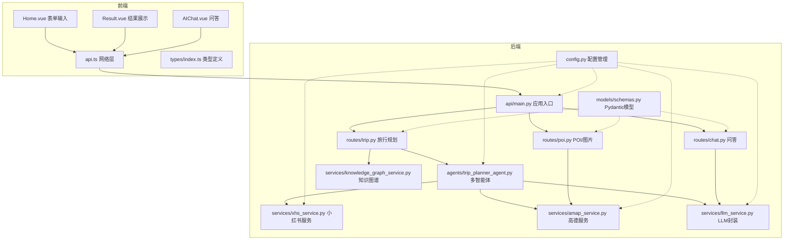
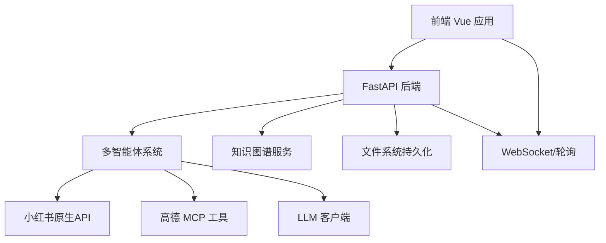
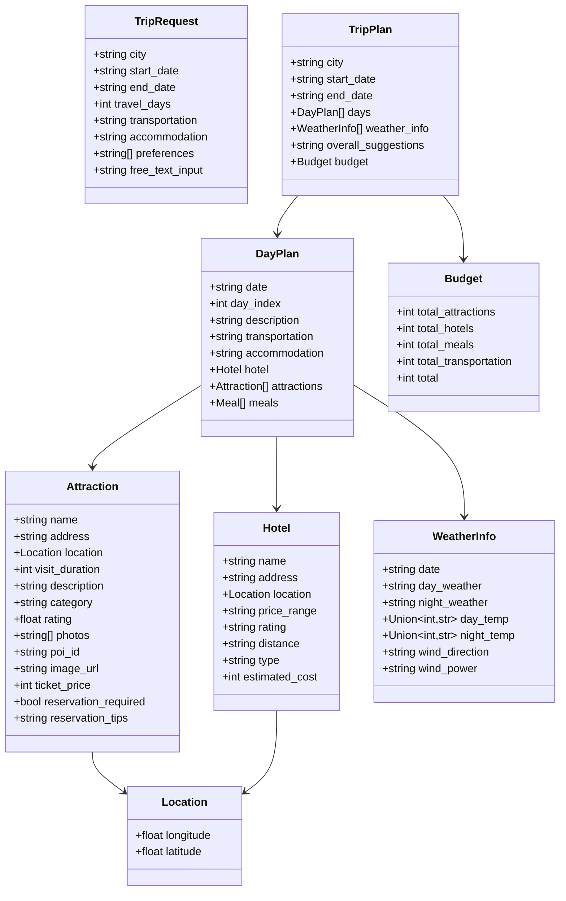
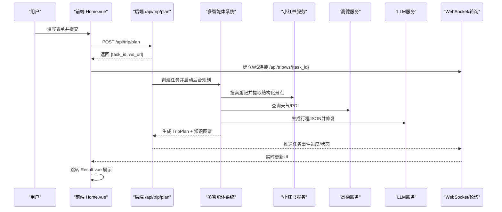
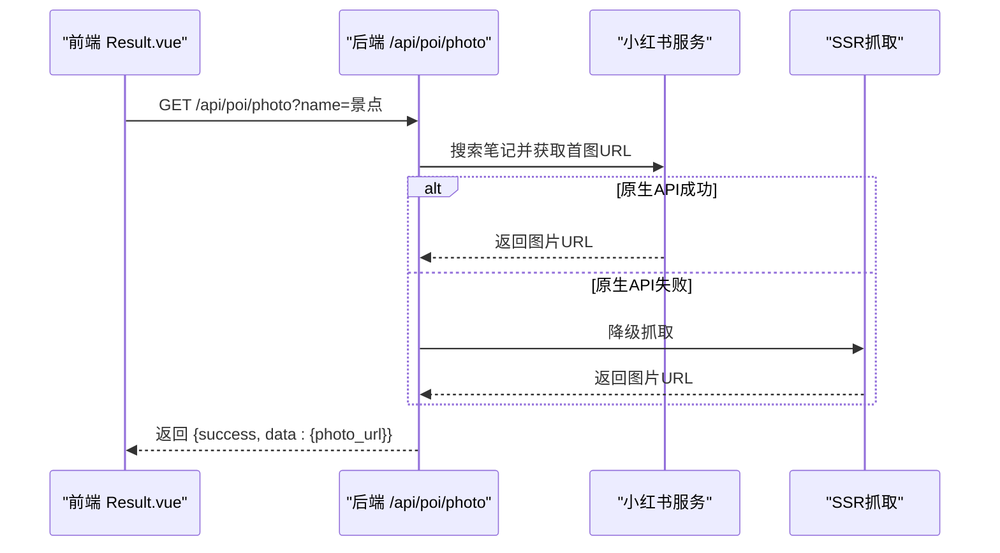
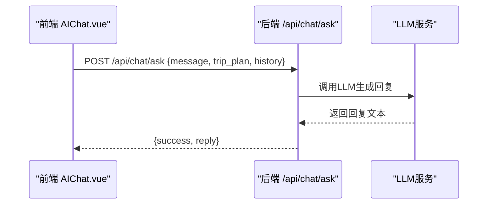
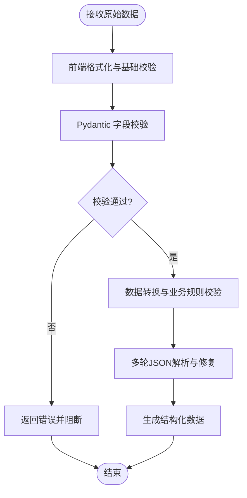
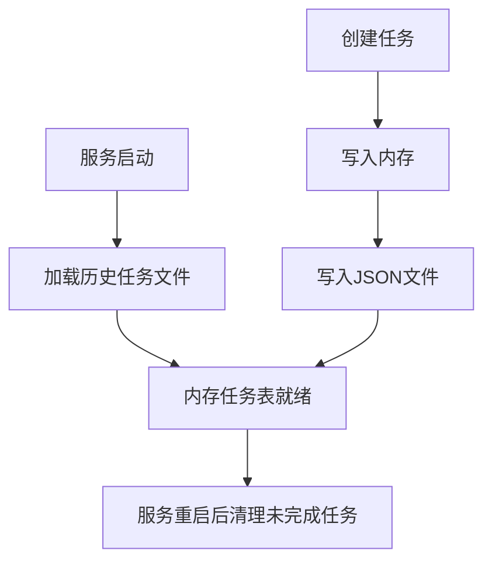
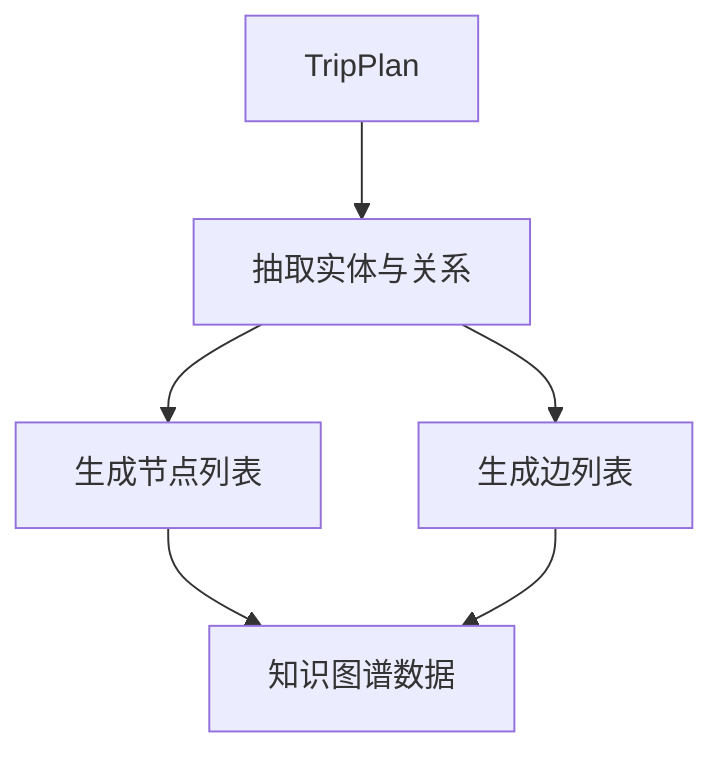
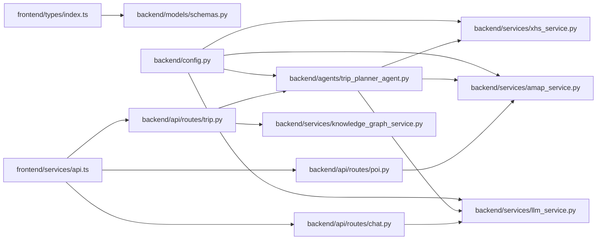

# 数据流管理

<cite>
**本文档引用的文件**
- [README.md](file://README.md)
- [backend/app/models/schemas.py](file://backend/app/models/schemas.py)
- [backend/app/api/main.py](file://backend/app/api/main.py)
- [backend/app/api/routes/trip.py](file://backend/app/api/routes/trip.py)
- [backend/app/api/routes/poi.py](file://backend/app/api/routes/poi.py)
- [backend/app/api/routes/chat.py](file://backend/app/api/routes/chat.py)
- [backend/app/config.py](file://backend/app/config.py)
- [backend/app/agents/trip_planner_agent.py](file://backend/app/agents/trip_planner_agent.py)
- [backend/app/services/xhs_service.py](file://backend/app/services/xhs_service.py)
- [backend/app/services/amap_service.py](file://backend/app/services/amap_service.py)
- [backend/app/services/llm_service.py](file://backend/app/services/llm_service.py)
- [backend/app/services/knowledge_graph_service.py](file://backend/app/services/knowledge_graph_service.py)
- [frontend/src/types/index.ts](file://frontend/src/types/index.ts)
- [frontend/src/services/api.ts](file://frontend/src/services/api.ts)
- [frontend/src/views/Home.vue](file://frontend/src/views/Home.vue)
- [frontend/src/views/Result.vue](file://frontend/src/views/Result.vue)
- [frontend/src/components/AIChat.vue](file://frontend/src/components/AIChat.vue)
</cite>

## 目录
1. [简介](#简介)
2. [项目结构](#项目结构)
3. [核心组件](#核心组件)
4. [架构总览](#架构总览)
5. [详细组件分析](#详细组件分析)
6. [依赖关系分析](#依赖关系分析)
7. [性能考量](#性能考量)
8. [故障排查指南](#故障排查指南)
9. [结论](#结论)
10. [附录](#附录)

## 简介
本文件聚焦 TripStar 项目的“数据流管理”，系统性梳理从用户输入到最终结果输出的完整数据流转过程，涵盖前端表单校验、后端数据处理、外部 API 调用与结果整合。文档详细说明数据模型设计（Pydantic 模型与 TypeScript 类型）、数据转换与验证机制（输入清洗、格式转换、业务规则校验）、缓存策略与持久化方案（内存缓存、文件系统持久化、外部服务调用），并提供数据流图与时序图，帮助读者快速理解端到端数据路径。

## 项目结构
项目采用前后端分离架构，前端 Vue 3 应用负责用户交互与可视化，后端 FastAPI 服务负责任务编排、数据处理与外部服务集成，多智能体系统（Agent）负责复杂推理与规划。

图表来源
- [backend/app/api/main.py:1-147](file://backend/app/api/main.py#L1-L147)
- [backend/app/api/routes/trip.py:1-511](file://backend/app/api/routes/trip.py#L1-L511)
- [backend/app/api/routes/poi.py:1-133](file://backend/app/api/routes/poi.py#L1-L133)
- [backend/app/api/routes/chat.py:1-53](file://backend/app/api/routes/chat.py#L1-L53)
- [backend/app/agents/trip_planner_agent.py:1-826](file://backend/app/agents/trip_planner_agent.py#L1-L826)
- [backend/app/services/xhs_service.py:1-444](file://backend/app/services/xhs_service.py#L1-L444)
- [backend/app/services/amap_service.py:1-276](file://backend/app/services/amap_service.py#L1-L276)
- [backend/app/services/llm_service.py:1-75](file://backend/app/services/llm_service.py#L1-L75)
- [backend/app/services/knowledge_graph_service.py:1-169](file://backend/app/services/knowledge_graph_service.py#L1-L169)
- [backend/app/models/schemas.py:1-264](file://backend/app/models/schemas.py#L1-L264)
- [backend/app/config.py:1-202](file://backend/app/config.py#L1-L202)
- [frontend/src/views/Home.vue:1-883](file://frontend/src/views/Home.vue#L1-L883)
- [frontend/src/views/Result.vue:1-4312](file://frontend/src/views/Result.vue#L1-L4312)
- [frontend/src/components/AIChat.vue:1-1161](file://frontend/src/components/AIChat.vue#L1-L1161)
- [frontend/src/services/api.ts:1-335](file://frontend/src/services/api.ts#L1-L335)
- [frontend/src/types/index.ts:1-196](file://frontend/src/types/index.ts#L1-L196)

章节来源
- [README.md:43-127](file://README.md#L43-L127)
- [backend/app/api/main.py:1-147](file://backend/app/api/main.py#L1-L147)

## 核心组件
- 数据模型层（Pydantic）：统一定义请求/响应结构，内置字段校验与序列化，保障前后端契约一致性。
- 路由与任务编排：旅行规划路由负责异步任务创建、状态轮询与 WebSocket 推送，POI/图片路由负责外部服务调用，问答路由负责上下文问答。
- 多智能体系统：协调小红书搜索、天气查询、酒店推荐与行程规划，实现端到端数据整合。
- 外部服务集成：小红书原生签名直连 API、高德 MCP 工具、LLM 客户端封装。
- 前端类型与网络层：TypeScript 类型定义与 Axios 封装，支持 WebSocket 实时状态订阅与轮询兼容。
- 知识图谱服务：从旅行计划中抽取节点与边，生成 ECharts 可视化数据。

章节来源
- [backend/app/models/schemas.py:1-264](file://backend/app/models/schemas.py#L1-L264)
- [backend/app/api/routes/trip.py:1-511](file://backend/app/api/routes/trip.py#L1-L511)
- [backend/app/api/routes/poi.py:1-133](file://backend/app/api/routes/poi.py#L1-L133)
- [backend/app/api/routes/chat.py:1-53](file://backend/app/api/routes/chat.py#L1-L53)
- [backend/app/agents/trip_planner_agent.py:1-826](file://backend/app/agents/trip_planner_agent.py#L1-L826)
- [backend/app/services/xhs_service.py:1-444](file://backend/app/services/xhs_service.py#L1-L444)
- [backend/app/services/amap_service.py:1-276](file://backend/app/services/amap_service.py#L1-L276)
- [backend/app/services/llm_service.py:1-75](file://backend/app/services/llm_service.py#L1-L75)
- [backend/app/services/knowledge_graph_service.py:1-169](file://backend/app/services/knowledge_graph_service.py#L1-L169)
- [frontend/src/types/index.ts:1-196](file://frontend/src/types/index.ts#L1-L196)
- [frontend/src/services/api.ts:1-335](file://frontend/src/services/api.ts#L1-L335)

## 架构总览
系统采用“前端交互 + 后端任务编排 + 多智能体 + 外部服务”的分层架构。前端通过 REST/WS 与后端交互，后端通过 Agent 协作与外部服务对接，最终将结构化旅行计划与知识图谱数据返回前端渲染。

图表来源
- [backend/app/api/main.py:1-147](file://backend/app/api/main.py#L1-L147)
- [backend/app/agents/trip_planner_agent.py:1-826](file://backend/app/agents/trip_planner_agent.py#L1-L826)
- [backend/app/services/xhs_service.py:1-444](file://backend/app/services/xhs_service.py#L1-L444)
- [backend/app/services/amap_service.py:1-276](file://backend/app/services/amap_service.py#L1-L276)
- [backend/app/services/llm_service.py:1-75](file://backend/app/services/llm_service.py#L1-L75)
- [backend/app/services/knowledge_graph_service.py:1-169](file://backend/app/services/knowledge_graph_service.py#L1-L169)
- [frontend/src/services/api.ts:1-335](file://frontend/src/services/api.ts#L1-L335)

## 详细组件分析

### 数据模型与类型系统
- Pydantic 模型（后端）：定义请求/响应结构，包含字段校验（范围、类型、格式）、示例数据与序列化钩子，确保输入输出一致性与可追踪性。
- TypeScript 类型（前端）：与后端模型一一对应，保障前端组件与 API 的类型安全。

图表来源
- [backend/app/models/schemas.py:1-264](file://backend/app/models/schemas.py#L1-L264)

章节来源
- [backend/app/models/schemas.py:1-264](file://backend/app/models/schemas.py#L1-L264)
- [frontend/src/types/index.ts:1-196](file://frontend/src/types/index.ts#L1-L196)

### 旅行规划任务流（异步 + WebSocket）
- 前端 Home.vue 收集用户输入，调用 api.ts 发起 POST /api/trip/plan，立即返回 task_id 与 ws_url。
- 后端 trip.py 创建任务状态（内存 + 文件持久化），并发执行多智能体任务，周期性更新状态。
- 前端通过 WebSocket 或轮询获取实时进度，完成后跳转 Result.vue 展示旅行计划与知识图谱。

图表来源
- [frontend/src/views/Home.vue:292-370](file://frontend/src/views/Home.vue#L292-L370)
- [frontend/src/services/api.ts:218-318](file://frontend/src/services/api.ts#L218-L318)
- [backend/app/api/routes/trip.py:276-488](file://backend/app/api/routes/trip.py#L276-L488)
- [backend/app/agents/trip_planner_agent.py:257-338](file://backend/app/agents/trip_planner_agent.py#L257-L338)
- [backend/app/services/xhs_service.py:247-354](file://backend/app/services/xhs_service.py#L247-L354)
- [backend/app/services/amap_service.py:1-276](file://backend/app/services/amap_service.py#L1-L276)
- [backend/app/services/llm_service.py:1-75](file://backend/app/services/llm_service.py#L1-L75)

章节来源
- [frontend/src/views/Home.vue:292-370](file://frontend/src/views/Home.vue#L292-L370)
- [frontend/src/services/api.ts:218-318](file://frontend/src/services/api.ts#L218-L318)
- [backend/app/api/routes/trip.py:276-488](file://backend/app/api/routes/trip.py#L276-L488)
- [backend/app/agents/trip_planner_agent.py:257-338](file://backend/app/agents/trip_planner_agent.py#L257-L338)

### POI 搜索与景点图片
- POI 搜索：调用高德 MCP 工具获取 POI 列表与详情。
- 景点图片：通过小红书原生 API 或 SSR 抓取首图 URL，前端按需异步拉取。

图表来源
- [backend/app/api/routes/poi.py:88-132](file://backend/app/api/routes/poi.py#L88-L132)
- [backend/app/services/xhs_service.py:356-444](file://backend/app/services/xhs_service.py#L356-L444)

章节来源
- [backend/app/api/routes/poi.py:1-133](file://backend/app/api/routes/poi.py#L1-L133)
- [backend/app/services/xhs_service.py:1-444](file://backend/app/services/xhs_service.py#L1-L444)

### AI 行程问答
- 前端 AIChat.vue 将当前旅行计划与历史对话上下文发送至后端 /api/chat/ask。
- 后端调用 LLM 服务生成回复，返回给前端展示。

图表来源
- [frontend/src/components/AIChat.vue:219-248](file://frontend/src/components/AIChat.vue#L219-L248)
- [backend/app/api/routes/chat.py:10-52](file://backend/app/api/routes/chat.py#L10-L52)
- [backend/app/services/llm_service.py:1-75](file://backend/app/services/llm_service.py#L1-L75)

章节来源
- [frontend/src/components/AIChat.vue:219-248](file://frontend/src/components/AIChat.vue#L219-L248)
- [backend/app/api/routes/chat.py:1-53](file://backend/app/api/routes/chat.py#L1-L53)
- [backend/app/services/llm_service.py:1-75](file://backend/app/services/llm_service.py#L1-L75)

### 数据转换与验证机制
- 输入清洗与格式转换：前端对日期、偏好等进行格式化与范围校验；后端 Pydantic 模型进行字段约束与默认值处理。
- 业务规则验证：旅行天数范围、日期合法性、偏好标签集合等在前端与后端双重校验。
- JSON 解析与修复：多智能体输出的 JSON 可能被截断或包含非标准字符，后端提供多轮修复策略（清理、引号修复、截断修复、LLM 修复）。

图表来源
- [frontend/src/views/Home.vue:232-290](file://frontend/src/views/Home.vue#L232-L290)
- [backend/app/models/schemas.py:1-264](file://backend/app/models/schemas.py#L1-L264)
- [backend/app/agents/trip_planner_agent.py:424-758](file://backend/app/agents/trip_planner_agent.py#L424-L758)

章节来源
- [frontend/src/views/Home.vue:232-290](file://frontend/src/views/Home.vue#L232-L290)
- [backend/app/models/schemas.py:1-264](file://backend/app/models/schemas.py#L1-L264)
- [backend/app/agents/trip_planner_agent.py:424-758](file://backend/app/agents/trip_planner_agent.py#L424-L758)

### 缓存策略与持久化
- 内存缓存：旅行任务状态（task_id -> 任务对象）驻留内存，便于快速查询与广播。
- 文件系统持久化：任务状态定期写入 data/trip_tasks 目录下的 JSON 文件，服务重启后可恢复状态（仅保留最终状态）。
- 外部服务缓存：小红书与高德服务调用结果未在代码中发现本地缓存实现，建议在业务层引入短期缓存以降低外部依赖压力。

图表来源
- [backend/app/api/routes/trip.py:125-145](file://backend/app/api/routes/trip.py#L125-L145)
- [backend/app/api/routes/trip.py:82-104](file://backend/app/api/routes/trip.py#L82-L104)

章节来源
- [backend/app/api/routes/trip.py:1-511](file://backend/app/api/routes/trip.py#L1-L511)

### 知识图谱构建
- 从 TripPlan 中抽取节点（城市、天、景点、酒店、餐饮、天气、预算、建议）与边（关系标签），生成 ECharts 可视化数据。
- 节点样式与尺寸按类别配置，便于前端渲染。

图表来源
- [backend/app/services/knowledge_graph_service.py:34-168](file://backend/app/services/knowledge_graph_service.py#L34-L168)

章节来源
- [backend/app/services/knowledge_graph_service.py:1-169](file://backend/app/services/knowledge_graph_service.py#L1-L169)

### 数据安全与隐私保护
- 配置管理：敏感配置（如 LLM Key、小红书 Cookie、高德 Key）通过环境变量注入，支持运行时覆盖与持久化，避免硬编码。
- 前端本地存储：运行时设置与 API 基础地址等保存在 localStorage，注意仅存储必要信息，避免泄露敏感数据。
- 外部 API 伪装：LLM 客户端设置浏览器 UA，降低被 WAF/风控拦截风险。
- Cookie 处理：小红书 Cookie 支持多种输入格式并进行标准化，异常时抛出自定义异常以便前端友好提示。

章节来源
- [backend/app/config.py:1-202](file://backend/app/config.py#L1-L202)
- [backend/app/services/llm_service.py:1-75](file://backend/app/services/llm_service.py#L1-L75)
- [backend/app/services/xhs_service.py:29-64](file://backend/app/services/xhs_service.py#L29-L64)
- [frontend/src/services/api.ts:1-335](file://frontend/src/services/api.ts#L1-L335)

## 依赖关系分析
- 路由依赖：trip.py 依赖 agents 与 knowledge_graph_service；poi.py 依赖 amap_service；chat.py 依赖 llm_service。
- 服务依赖：agents 依赖 llm_service、xhs_service、amap_service；xhs_service 依赖 config 与 llm_service；amap_service 依赖 config；llm_service 依赖 config。
- 前后端类型映射：frontend/types 与 backend/models/schemas 对应字段保持一致，确保序列化/反序列化安全。

图表来源
- [frontend/src/types/index.ts:1-196](file://frontend/src/types/index.ts#L1-L196)
- [frontend/src/services/api.ts:1-335](file://frontend/src/services/api.ts#L1-L335)
- [backend/app/api/routes/trip.py:1-511](file://backend/app/api/routes/trip.py#L1-L511)
- [backend/app/api/routes/poi.py:1-133](file://backend/app/api/routes/poi.py#L1-L133)
- [backend/app/api/routes/chat.py:1-53](file://backend/app/api/routes/chat.py#L1-L53)
- [backend/app/agents/trip_planner_agent.py:1-826](file://backend/app/agents/trip_planner_agent.py#L1-L826)
- [backend/app/services/amap_service.py:1-276](file://backend/app/services/amap_service.py#L1-L276)
- [backend/app/services/llm_service.py:1-75](file://backend/app/services/llm_service.py#L1-L75)
- [backend/app/services/xhs_service.py:1-444](file://backend/app/services/xhs_service.py#L1-L444)
- [backend/app/services/knowledge_graph_service.py:1-169](file://backend/app/services/knowledge_graph_service.py#L1-L169)
- [backend/app/models/schemas.py:1-264](file://backend/app/models/schemas.py#L1-L264)
- [backend/app/config.py:1-202](file://backend/app/config.py#L1-L202)

章节来源
- [frontend/src/types/index.ts:1-196](file://frontend/src/types/index.ts#L1-L196)
- [frontend/src/services/api.ts:1-335](file://frontend/src/services/api.ts#L1-L335)
- [backend/app/api/routes/trip.py:1-511](file://backend/app/api/routes/trip.py#L1-L511)
- [backend/app/api/routes/poi.py:1-133](file://backend/app/api/routes/poi.py#L1-L133)
- [backend/app/api/routes/chat.py:1-53](file://backend/app/api/routes/chat.py#L1-L53)
- [backend/app/agents/trip_planner_agent.py:1-826](file://backend/app/agents/trip_planner_agent.py#L1-L826)
- [backend/app/services/amap_service.py:1-276](file://backend/app/services/amap_service.py#L1-L276)
- [backend/app/services/llm_service.py:1-75](file://backend/app/services/llm_service.py#L1-L75)
- [backend/app/services/xhs_service.py:1-444](file://backend/app/services/xhs_service.py#L1-L444)
- [backend/app/services/knowledge_graph_service.py:1-169](file://backend/app/services/knowledge_graph_service.py#L1-L169)
- [backend/app/models/schemas.py:1-264](file://backend/app/models/schemas.py#L1-L264)
- [backend/app/config.py:1-202](file://backend/app/config.py#L1-L202)

## 性能考量
- 异步任务与并发：旅行规划任务通过 asyncio.create_task 与并发执行（如小红书搜索、天气查询、酒店搜索），缩短总耗时。
- 超时与重试：规划阶段设置较长超时并支持一次重试，提升稳定性。
- WebSocket 与轮询：前端优先使用 WebSocket 实时订阅，兼容旧客户端使用轮询，避免频繁请求。
- 外部服务调用：小红书与高德服务调用成本较高，建议在业务层引入短期缓存与批量请求策略。

章节来源
- [backend/app/api/routes/trip.py:303-387](file://backend/app/api/routes/trip.py#L303-L387)
- [backend/app/agents/trip_planner_agent.py:354-387](file://backend/app/agents/trip_planner_agent.py#L354-L387)
- [frontend/src/services/api.ts:268-318](file://frontend/src/services/api.ts#L268-L318)

## 故障排查指南
- 任务状态异常：检查任务持久化文件是否存在、服务重启后状态是否被标记为 failed。
- 小红书 Cookie 失效：捕获 XHSCookieExpiredError 并提示更换 Cookie。
- 外部服务超时：检查高德/小红书/LLM 服务可用性与网络连通性。
- JSON 解析失败：查看多轮修复日志，确认是否为截断或非标准字符导致。

章节来源
- [backend/app/api/routes/trip.py:125-145](file://backend/app/api/routes/trip.py#L125-L145)
- [backend/app/api/routes/trip.py:365-387](file://backend/app/api/routes/trip.py#L365-L387)
- [backend/app/services/xhs_service.py:134-141](file://backend/app/services/xhs_service.py#L134-L141)
- [backend/app/agents/trip_planner_agent.py:604-758](file://backend/app/agents/trip_planner_agent.py#L604-L758)

## 结论
TripStar 的数据流管理通过“强类型模型 + 异步任务 + 多智能体 + 外部服务集成”的组合，实现了从用户输入到结构化旅行计划与知识图谱可视化的完整闭环。前端与后端类型契约清晰，任务状态持久化与多轮 JSON 修复提升了鲁棒性。建议后续在外部服务调用层面引入缓存与批量策略，进一步优化性能与稳定性。

## 附录
- 关键流程参考路径
  - 旅行规划任务创建与状态推送：[backend/app/api/routes/trip.py:276-488](file://backend/app/api/routes/trip.py#L276-L488)
  - 多智能体规划与 JSON 修复：[backend/app/agents/trip_planner_agent.py:257-758](file://backend/app/agents/trip_planner_agent.py#L257-L758)
  - 小红书服务与 Cookie 处理：[backend/app/services/xhs_service.py:29-141](file://backend/app/services/xhs_service.py#L29-L141)
  - 高德 MCP 工具封装：[backend/app/services/amap_service.py:12-276](file://backend/app/services/amap_service.py#L12-L276)
  - LLM 客户端封装与伪装：[backend/app/services/llm_service.py:12-67](file://backend/app/services/llm_service.py#L12-L67)
  - 知识图谱构建：[backend/app/services/knowledge_graph_service.py:34-168](file://backend/app/services/knowledge_graph_service.py#L34-L168)
  - 前端类型与网络层：[frontend/src/types/index.ts:1-196](file://frontend/src/types/index.ts#L1-L196)、[frontend/src/services/api.ts:1-335](file://frontend/src/services/api.ts#L1-L335)
  - 前端旅行计划展示：[frontend/src/views/Result.vue:1-800](file://frontend/src/views/Result.vue#L1-L800)