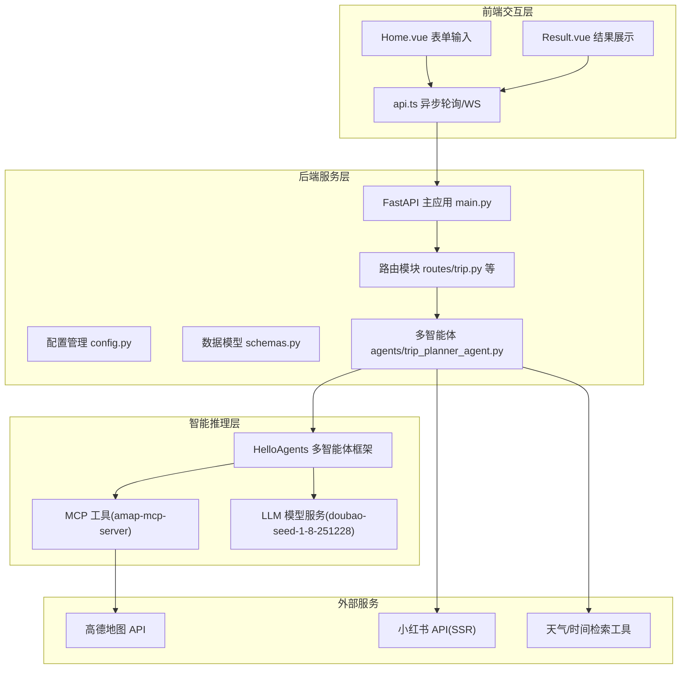
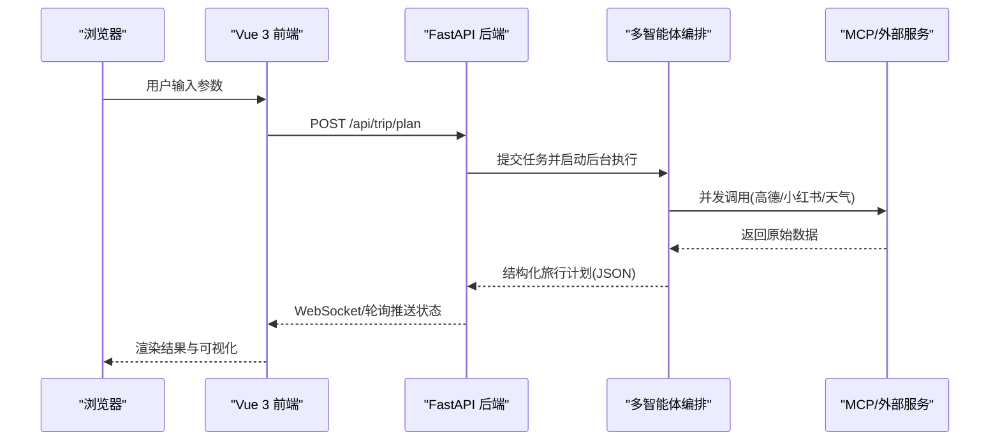
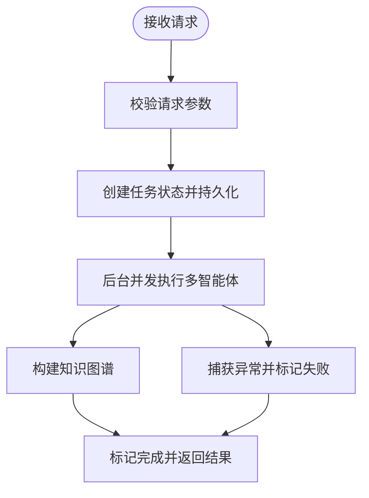
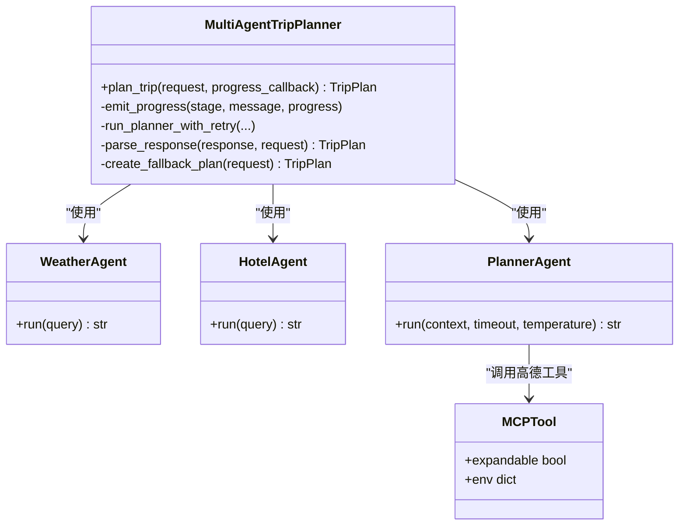
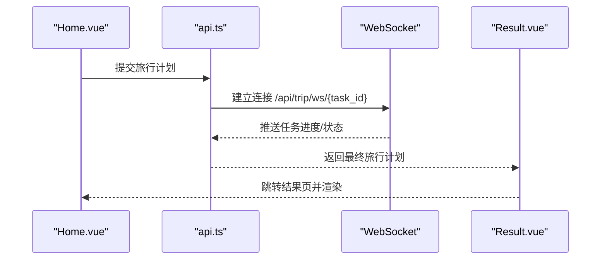
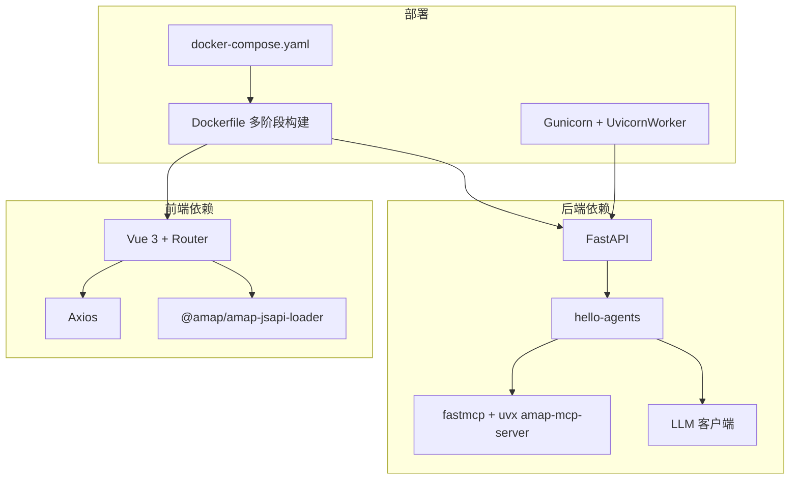

# 整体架构设计

<cite>
**本文档引用的文件**
- [README.md](file://README.md)
- [Dockerfile](file://Dockerfile)
- [docker-compose.yaml](file://docker-compose.yaml)
- [start.sh](file://start.sh)
- [backend/app/api/main.py](file://backend/app/api/main.py)
- [backend/app/config.py](file://backend/app/config.py)
- [backend/requirements.txt](file://backend/requirements.txt)
- [backend/app/api/routes/trip.py](file://backend/app/api/routes/trip.py)
- [backend/app/models/schemas.py](file://backend/app/models/schemas.py)
- [backend/app/agents/trip_planner_agent.py](file://backend/app/agents/trip_planner_agent.py)
- [frontend/package.json](file://frontend/package.json)
- [frontend/src/services/api.ts](file://frontend/src/services/api.ts)
- [frontend/src/views/Home.vue](file://frontend/src/views/Home.vue)
- [frontend/src/views/Result.vue](file://frontend/src/views/Result.vue)
</cite>

## 目录
1. [引言](#引言)
2. [项目结构](#项目结构)
3. [核心组件](#核心组件)
4. [架构总览](#架构总览)
5. [详细组件分析](#详细组件分析)
6. [依赖关系分析](#依赖关系分析)
7. [性能考量](#性能考量)
8. [故障排查指南](#故障排查指南)
9. [结论](#结论)
10. [附录](#附录)

## 引言
TripStar 是一个基于前后端分离的三层架构系统，结合 FastAPI 后端服务与 Vue 3 前端交互，通过 HelloAgents 多智能体框架实现旅行规划的智能推理与协同。系统围绕“异步任务 + 多智能体 + 外部服务”的核心模式，提供从参数输入到结果呈现的完整闭环。

技术选型理由（简述）：
- 后端选择 FastAPI：具备高性能、自动生成交互式 API 文档、强类型校验与异步支持，适合复杂推理任务的并发与稳定性需求。
- 前端选择 Vue 3：组合式 API、响应式系统与生态完善，便于构建高交互性的旅行规划界面与可视化组件。
- 智能推理层采用 HelloAgents：提供多智能体编排、工具调用与结构化输出保障，满足旅行规划中对多源数据整合与任务分解的需求。

## 项目结构
项目采用前后端分离的目录组织，后端以 FastAPI 为核心，前端以 Vue 3 为基础，配合 Docker 与 docker-compose 实现统一打包与部署。

图表来源
- [backend/app/api/main.py:1-147](file://backend/app/api/main.py#L1-L147)
- [backend/app/api/routes/trip.py:1-511](file://backend/app/api/routes/trip.py#L1-L511)
- [backend/app/agents/trip_planner_agent.py:1-826](file://backend/app/agents/trip_planner_agent.py#L1-L826)
- [backend/app/config.py:1-202](file://backend/app/config.py#L1-L202)
- [frontend/src/services/api.ts:1-335](file://frontend/src/services/api.ts#L1-L335)

章节来源
- [README.md:205-232](file://README.md#L205-L232)
- [backend/app/api/main.py:1-147](file://backend/app/api/main.py#L1-L147)
- [frontend/package.json:1-35](file://frontend/package.json#L1-L35)

## 核心组件
- 前端交互层（Vue 3 SPA）
  - Home.vue：参数表单收集（城市、日期、偏好、额外需求等），触发旅行规划任务。
  - Result.vue：结果展示（概览、预算、地图、每日行程、知识图谱、天气等），支持导出与编辑。
  - api.ts：Axios 客户端封装，负责任务提交、轮询与 WebSocket 订阅，以及运行时配置读写。
- 后端服务层（FastAPI）
  - main.py：应用入口，注册路由、CORS、静态资源与健康检查，支持代理路径重写。
  - routes/trip.py：旅行规划路由，提供任务提交、状态轮询、WebSocket 订阅与历史查询。
  - agents/trip_planner_agent.py：多智能体编排核心，负责并发执行景点搜索、天气查询、酒店推荐与行程规划。
  - config.py：集中式配置管理，支持环境变量与运行时配置持久化。
  - models/schemas.py：Pydantic 数据模型，统一请求/响应结构与校验。
- 智能推理层（HelloAgents）
  - 多智能体协作：天气、酒店、行程规划等 Agent 协同工作，结合 MCP 工具与 LLM 实现结构化输出。
  - 工具链：高德地图 MCP 工具、小红书 SSR 抓取与 LLM 提纯、知识图谱构建。

章节来源
- [frontend/src/views/Home.vue:197-371](file://frontend/src/views/Home.vue#L197-L371)
- [frontend/src/views/Result.vue:1-800](file://frontend/src/views/Result.vue#L1-L800)
- [frontend/src/services/api.ts:1-335](file://frontend/src/services/api.ts#L1-L335)
- [backend/app/api/main.py:1-147](file://backend/app/api/main.py#L1-L147)
- [backend/app/api/routes/trip.py:1-511](file://backend/app/api/routes/trip.py#L1-L511)
- [backend/app/agents/trip_planner_agent.py:1-826](file://backend/app/agents/trip_planner_agent.py#L1-L826)
- [backend/app/config.py:1-202](file://backend/app/config.py#L1-L202)
- [backend/app/models/schemas.py:1-264](file://backend/app/models/schemas.py#L1-L264)

## 架构总览
系统采用三层架构：前端交互层、后端服务层、智能推理层。数据流从浏览器到后端 API，再到多智能体与外部服务，最终回传结构化结果并渲染至前端。

图表来源
- [backend/app/api/routes/trip.py:276-388](file://backend/app/api/routes/trip.py#L276-L388)
- [backend/app/agents/trip_planner_agent.py:257-339](file://backend/app/agents/trip_planner_agent.py#L257-L339)
- [frontend/src/services/api.ts:218-318](file://frontend/src/services/api.ts#L218-L318)

## 详细组件分析

### 后端服务层（FastAPI）
- 应用入口与中间件
  - 启动事件打印配置与健康检查，CORS 配置支持多源访问，代理路径重写适配云部署。
  - 静态资源挂载与 SPA 回退，根路径在生产环境返回前端页面。
- 路由与任务系统
  - 旅行规划路由提供任务提交（立即返回 task_id）、状态轮询、WebSocket 订阅与历史查询。
  - 任务状态内存存储 + 磁盘持久化，支持服务重启后的状态恢复与失败兜底。
- 配置管理
  - 支持 .env 与 HelloAgents 环境叠加，运行时配置持久化与同步，便于前端设置页读取与修改。

图表来源
- [backend/app/api/routes/trip.py:276-388](file://backend/app/api/routes/trip.py#L276-L388)
- [backend/app/api/routes/trip.py:315-388](file://backend/app/api/routes/trip.py#L315-L388)

章节来源
- [backend/app/api/main.py:33-136](file://backend/app/api/main.py#L33-L136)
- [backend/app/api/routes/trip.py:1-511](file://backend/app/api/routes/trip.py#L1-L511)
- [backend/app/config.py:70-202](file://backend/app/config.py#L70-L202)

### 智能推理层（HelloAgents 多智能体）
- 多智能体编排
  - 天气查询 Agent、酒店推荐 Agent、行程规划 Agent，通过 MCP 工具与 LLM 协作。
  - 并发优化：景点搜索、天气查询、酒店搜索并行执行，降低总耗时。
- 输出解析与修复
  - 多轮 JSON 清洗与修复（引号、截断、算术表达式、尾逗号等），必要时使用 LLM 自修复。
  - 失败回退：生成备用计划，保证用户体验。

图表来源
- [backend/app/agents/trip_planner_agent.py:173-242](file://backend/app/agents/trip_planner_agent.py#L173-L242)
- [backend/app/agents/trip_planner_agent.py:354-423](file://backend/app/agents/trip_planner_agent.py#L354-L423)
- [backend/app/agents/trip_planner_agent.py:650-759](file://backend/app/agents/trip_planner_agent.py#L650-L759)

章节来源
- [backend/app/agents/trip_planner_agent.py:1-826](file://backend/app/agents/trip_planner_agent.py#L1-L826)

### 前端交互层（Vue 3 SPA）
- 表单与状态
  - Home.vue 收集旅行参数，触发生成流程，显示实时进度与状态。
  - Result.vue 展示概览、预算、地图、每日行程、知识图谱与天气，支持导出与编辑。
- 通信与数据流
  - api.ts 封装任务提交、轮询与 WebSocket 订阅，支持运行时配置读写与本地持久化。
  - 与后端通过 /api 前缀通信，支持跨域与代理路径。

图表来源
- [frontend/src/views/Home.vue:292-371](file://frontend/src/views/Home.vue#L292-L371)
- [frontend/src/services/api.ts:257-318](file://frontend/src/services/api.ts#L257-L318)
- [frontend/src/views/Result.vue:569-606](file://frontend/src/views/Result.vue#L569-L606)

章节来源
- [frontend/src/views/Home.vue:197-371](file://frontend/src/views/Home.vue#L197-L371)
- [frontend/src/views/Result.vue:1-800](file://frontend/src/views/Result.vue#L1-L800)
- [frontend/src/services/api.ts:1-335](file://frontend/src/services/api.ts#L1-L335)

### 数据模型与接口契约
- 请求模型：TripRequest（城市、日期、偏好、额外需求等）。
- 响应模型：TripPlan（每日行程、预算、天气、总体建议等），配套知识图谱数据模型。
- 错误模型：ErrorResponse，统一错误响应格式。

章节来源
- [backend/app/models/schemas.py:10-264](file://backend/app/models/schemas.py#L10-L264)

## 依赖关系分析
- 后端依赖
  - FastAPI、uvicorn、pydantic、pydantic-settings、httpx/aiohttp、loguru、hello-agents、fastmcp、uv 等。
- 前端依赖
  - Vue 3、Vue Router、Ant Design Vue、Axios、ECharts、高德 JSAPI Loader、i18n 等。
- 部署与运行
  - Dockerfile 多阶段构建，前端构建产物注入后端镜像，Gunicorn + Uvicorn Worker 运行，暴露 7860 端口。
  - docker-compose 通过环境变量注入 LLM、高德、小红书 Cookie 等配置。

图表来源
- [backend/requirements.txt:1-18](file://backend/requirements.txt#L1-L18)
- [frontend/package.json:11-24](file://frontend/package.json#L11-L24)
- [Dockerfile:1-64](file://Dockerfile#L1-L64)
- [docker-compose.yaml:1-24](file://docker-compose.yaml#L1-L24)
- [start.sh:1-20](file://start.sh#L1-L20)

章节来源
- [backend/requirements.txt:1-18](file://backend/requirements.txt#L1-L18)
- [frontend/package.json:1-35](file://frontend/package.json#L1-L35)
- [Dockerfile:1-64](file://Dockerfile#L1-L64)
- [docker-compose.yaml:1-24](file://docker-compose.yaml#L1-L24)
- [start.sh:1-20](file://start.sh#L1-L20)

## 性能考量
- 异步与并发
  - 旅行规划任务通过 asyncio.create_task 异步执行，WebSocket/轮询实时反馈进度。
  - 多智能体阶段（景点/天气/酒店）并发执行，缩短总耗时。
- 超时与重试
  - 行程规划阶段设置较长超时并支持一次重试，提升稳定性。
- 前端体验
  - 轮播图、地图、知识图谱等组件按需渲染，减少首屏压力。
- 部署性能
  - 多阶段 Docker 构建减少镜像体积，预下载 amap-mcp-server 避免首次请求超时。

## 故障排查指南
- 配置问题
  - 高德 Web Key、JS Key、LLM API Key、小红书 Cookie 未配置会导致相应功能不可用。
  - 运行时配置可通过后端设置页更新并持久化，前端可读取与覆盖。
- 任务失败
  - 旅行规划任务失败时，后端会返回错误信息与原始请求参数，前端可据此重试或调整输入。
  - 小红书 Cookie 过期会返回特定错误提示，需重新登录获取。
- 健康检查
  - /health 接口可用于快速判断服务与多智能体可用性。

章节来源
- [backend/app/config.py:162-180](file://backend/app/config.py#L162-L180)
- [backend/app/api/routes/trip.py:369-388](file://backend/app/api/routes/trip.py#L369-L388)
- [backend/app/api/main.py:112-119](file://backend/app/api/main.py#L112-L119)

## 结论
TripStar 通过前后端分离与多智能体协作，实现了从参数输入到结构化旅行计划的完整自动化流程。FastAPI 提供稳定可靠的后端支撑，Vue 3 前端带来流畅的用户体验，HelloAgents 框架确保多源数据整合与结构化输出的可靠性。系统具备良好的可扩展性与可维护性，适合进一步演进为微服务化架构。

## 附录
- 环境变量与部署要点
  - Docker 部署通过环境变量注入配置，前端构建期变量通过 build.args 注入。
  - 本地开发可使用 .env 文件，容器内忽略前端 .env 与 .env.*。
- 端口与协议
  - 默认端口 7860（魔搭创空间要求），HTTP/HTTPS 与 WebSocket 均支持。
- 微服务化建议
  - 模块化设计：将多智能体 Agent、外部服务调用、知识图谱服务拆分为独立服务。
  - 解耦策略：通过消息队列或事件总线解耦任务调度与执行，引入服务发现与限流熔断。
  - 可扩展性：按需扩展 Agent 与工具，支持多语言与多地区旅行场景。

章节来源
- [README.md:129-200](file://README.md#L129-L200)
- [Dockerfile:16-23](file://Dockerfile#L16-L23)
- [docker-compose.yaml:8-23](file://docker-compose.yaml#L8-L23)
- [backend/app/config.py:104-160](file://backend/app/config.py#L104-L160)