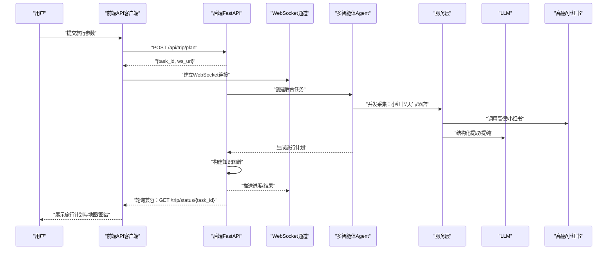
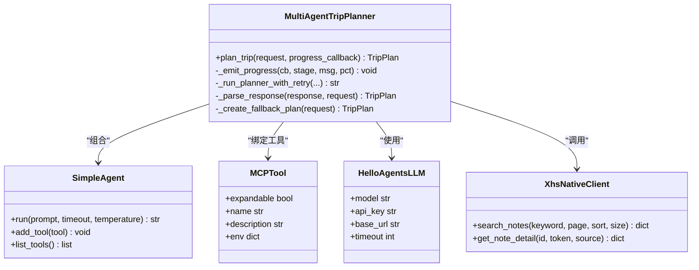
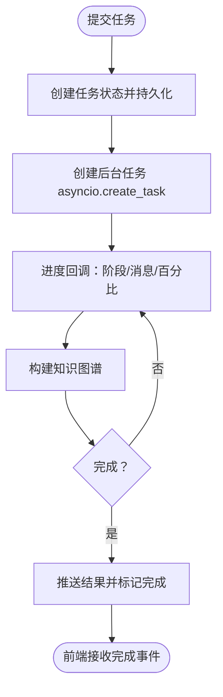
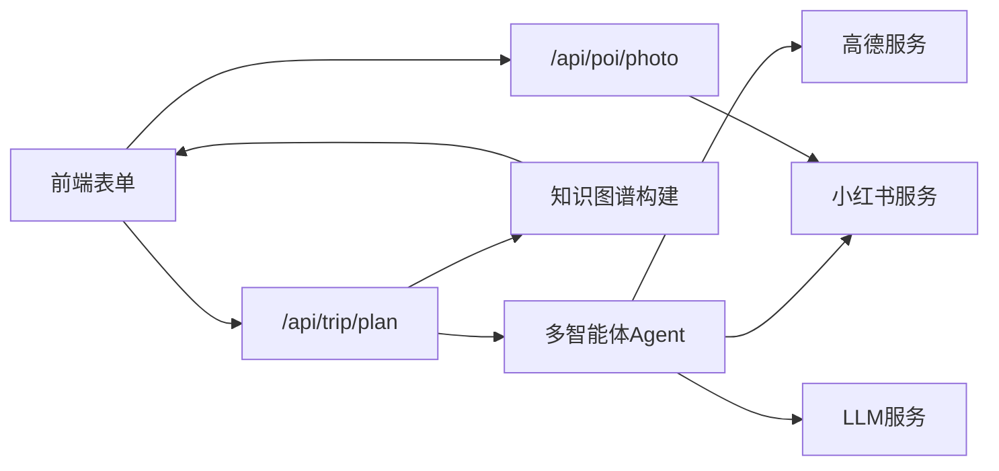
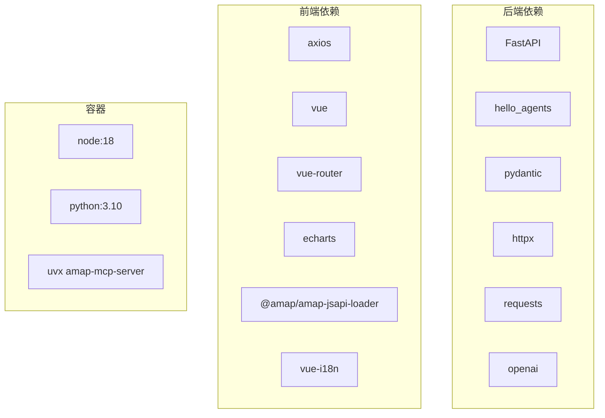
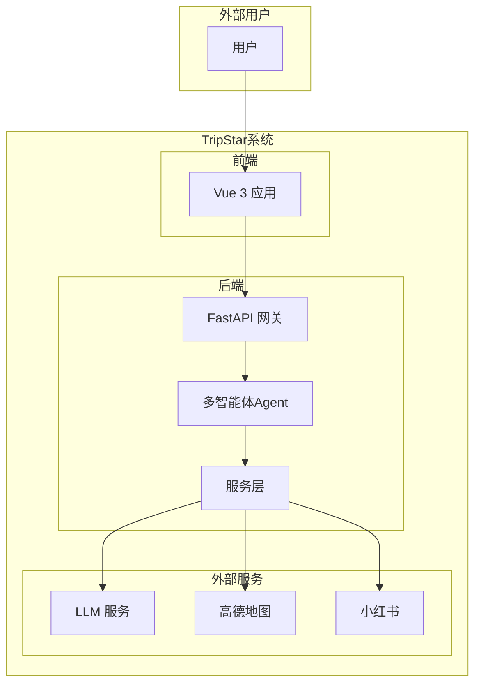

# 系统架构

<cite>
**本文引用的文件**
- [README.md](file://README.md)
- [Dockerfile](file://Dockerfile)
- [docker-compose.yaml](file://docker-compose.yaml)
- [backend/app/api/main.py](file://backend/app/api/main.py)
- [backend/app/api/routes/trip.py](file://backend/app/api/routes/trip.py)
- [backend/app/api/routes/poi.py](file://backend/app/api/routes/poi.py)
- [backend/app/api/routes/chat.py](file://backend/app/api/routes/chat.py)
- [backend/app/agents/trip_planner_agent.py](file://backend/app/agents/trip_planner_agent.py)
- [backend/app/services/xhs_service.py](file://backend/app/services/xhs_service.py)
- [backend/app/services/llm_service.py](file://backend/app/services/llm_service.py)
- [backend/app/models/schemas.py](file://backend/app/models/schemas.py)
- [backend/app/config.py](file://backend/app/config.py)
- [backend/run.py](file://backend/run.py)
- [frontend/src/services/api.ts](file://frontend/src/services/api.ts)
</cite>

## 目录
1. [简介](#简介)
2. [项目结构](#项目结构)
3. [核心组件](#核心组件)
4. [架构总览](#架构总览)
5. [详细组件分析](#详细组件分析)
6. [依赖分析](#依赖分析)
7. [性能考量](#性能考量)
8. [故障排查指南](#故障排查指南)
9. [结论](#结论)
10. [附录](#附录)

## 简介
本项目“旅途星辰（TripStar）”是一个基于 HelloAgents 框架的多智能体协作文旅规划平台，采用前后端分离的三层架构设计：
- 前端交互层：Vue 3 + Vite，负责用户输入、实时状态展示、地图与知识图谱可视化、AI 问答等。
- 后端服务层：FastAPI，提供 REST API、WebSocket 实时状态推送、任务调度与持久化、CORS 与健康检查等。
- 智能推理层：多智能体协作（天气、酒店、小红书景点提取、行程规划），结合 LLM 与 MCP 工具链。

系统通过异步任务机制解决长文本生成导致的网关超时问题，前端通过 WebSocket 或轮询获取实时进度；数据从用户输入到最终结果输出形成闭环。

## 项目结构
- 后端（Python + FastAPI）位于 backend/，包含路由、Agent、服务层、模型与配置。
- 前端（Vue 3 + TypeScript）位于 frontend/，包含视图、组件、国际化、Axios 封装的 API 客户端。
- 容器化部署通过 Dockerfile 与 docker-compose.yaml 实现，统一暴露 7860 端口。

```mermaid
graph TB
subgraph "前端"
FE_API["前端API客户端<br/>frontend/src/services/api.ts"]
Views["视图与组件<br/>frontend/src/views/*, components/*"]
end
subgraph "后端"
FastAPI["FastAPI 应用<br/>backend/app/api/main.py"]
Routes["路由模块<br/>routes/trip.py, poi.py, chat.py"]
Agent["多智能体Agent<br/>agents/trip_planner_agent.py"]
Services["服务层<br/>xhs_service.py, llm_service.py, ..."]
Models["数据模型<br/>models/schemas.py"]
Config["配置管理<br/>config.py"]
end
subgraph "外部服务"
LLM["LLM 服务兼容OpenAI格式"]
AMap["高德地图 MCP/服务"]
XHS["小红书 API/SSR"]
end
FE_API --> FastAPI
FastAPI --> Routes
Routes --> Agent
Agent --> Services
Services --> LLM
Services --> AMap
Services --> XHS
FastAPI --> Config
FastAPI --> Models
```

图表来源
- [backend/app/api/main.py:1-147](file://backend/app/api/main.py#L1-L147)
- [backend/app/api/routes/trip.py:1-511](file://backend/app/api/routes/trip.py#L1-L511)
- [backend/app/agents/trip_planner_agent.py:1-826](file://backend/app/agents/trip_planner_agent.py#L1-L826)
- [backend/app/services/xhs_service.py:1-444](file://backend/app/services/xhs_service.py#L1-L444)
- [backend/app/services/llm_service.py:1-75](file://backend/app/services/llm_service.py#L1-L75)
- [backend/app/models/schemas.py:1-264](file://backend/app/models/schemas.py#L1-L264)
- [backend/app/config.py:1-202](file://backend/app/config.py#L1-L202)
- [frontend/src/services/api.ts:1-335](file://frontend/src/services/api.ts#L1-L335)

章节来源
- [README.md:43-97](file://README.md#L43-L97)
- [Dockerfile:1-64](file://Dockerfile#L1-L64)
- [docker-compose.yaml:1-24](file://docker-compose.yaml#L1-L24)

## 核心组件
- 配置中心：集中管理运行时配置（LLM、高德、小红书等），支持持久化覆盖与环境变量注入。
- FastAPI 应用：CORS、中间件、路由注册、健康检查、静态资源挂载（生产环境）。
- 旅行规划路由：异步任务提交、WebSocket 实时推送、轮询兼容、历史计划加载、健康检查。
- 多智能体旅行规划器：天气、酒店、小红书景点提取、行程规划 Agent，MCP 工具集成，进度回调与 JSON 容错解析。
- 小红书服务：原生签名直连 API、SSR 降级、结构化提取、地理编码补齐、图片抓取。
- LLM 服务：HelloAgents LLM 封装，单例模式，UA 伪装以规避 WAF。
- 数据模型：Pydantic 模型定义旅行计划、知识图谱、问答等结构。
- 前端 API 客户端：Axios 封装、WebSocket 订阅、轮询兼容、运行时配置读写。

章节来源
- [backend/app/config.py:1-202](file://backend/app/config.py#L1-L202)
- [backend/app/api/main.py:1-147](file://backend/app/api/main.py#L1-L147)
- [backend/app/api/routes/trip.py:1-511](file://backend/app/api/routes/trip.py#L1-L511)
- [backend/app/agents/trip_planner_agent.py:1-826](file://backend/app/agents/trip_planner_agent.py#L1-L826)
- [backend/app/services/xhs_service.py:1-444](file://backend/app/services/xhs_service.py#L1-L444)
- [backend/app/services/llm_service.py:1-75](file://backend/app/services/llm_service.py#L1-L75)
- [backend/app/models/schemas.py:1-264](file://backend/app/models/schemas.py#L1-L264)
- [frontend/src/services/api.ts:1-335](file://frontend/src/services/api.ts#L1-L335)

## 架构总览
系统采用“前端交互层—后端服务层—智能推理层”的分层设计，核心交互如下：
- 用户在前端填写旅行参数，提交至后端 /api/trip/plan。
- 后端立即返回 task_id，并在后台异步执行多智能体协作，通过 WebSocket 或轮询推送进度。
- 任务完成后，后端构建知识图谱并返回完整旅行计划。
- 前端在结果页调用 /api/poi/photo 为每个景点拉取图片，实现“所见即所得”。

图表来源
- [backend/app/api/routes/trip.py:276-388](file://backend/app/api/routes/trip.py#L276-L388)
- [backend/app/agents/trip_planner_agent.py:257-339](file://backend/app/agents/trip_planner_agent.py#L257-L339)
- [backend/app/services/xhs_service.py:247-354](file://backend/app/services/xhs_service.py#L247-L354)
- [backend/app/services/llm_service.py:12-67](file://backend/app/services/llm_service.py#L12-L67)
- [frontend/src/services/api.ts:257-318](file://frontend/src/services/api.ts#L257-L318)

章节来源
- [README.md:101-127](file://README.md#L101-L127)

## 详细组件分析

### 多智能体协作架构
- Agent 设计模式：天气查询专家、酒店推荐专家、行程规划专家，分别承担不同子任务。
- Tool 集成机制：通过 MCPTool 绑定高德地图工具集，Agent 严格遵循固定格式调用工具，确保可控与可观测。
- Workflow 编排流程：小红书景点提取（异步线程池）、天气查询、酒店搜索并发执行，最后由行程规划 Agent 聚合生成结构化旅行计划。
- JSON 容错解析：多轮清洗（引号修复、截断修复、正则提取、LLM 修复），确保大模型输出的稳定性。

图表来源
- [backend/app/agents/trip_planner_agent.py:173-242](file://backend/app/agents/trip_planner_agent.py#L173-L242)
- [backend/app/agents/trip_planner_agent.py:354-422](file://backend/app/agents/trip_planner_agent.py#L354-L422)
- [backend/app/agents/trip_planner_agent.py:650-759](file://backend/app/agents/trip_planner_agent.py#L650-L759)
- [backend/app/services/xhs_service.py:68-198](file://backend/app/services/xhs_service.py#L68-L198)
- [backend/app/services/llm_service.py:12-67](file://backend/app/services/llm_service.py#L12-L67)

章节来源
- [backend/app/agents/trip_planner_agent.py:173-339](file://backend/app/agents/trip_planner_agent.py#L173-L339)

### 异步任务处理机制
- 任务提交：POST /api/trip/plan 立即返回 task_id，并持久化任务状态。
- WebSocket 实时通信：/api/trip/ws/{task_id} 推送阶段性进度与最终结果，支持断线重连与快照同步。
- 轮询兼容：GET /api/trip/status/{task_id} 供旧客户端使用。
- 历史计划：/api/trip/history 返回最近完成的计划摘要，便于快速找回。
- 健康检查：/api/trip/health 与根路径 /health 检查服务可用性。

图表来源
- [backend/app/api/routes/trip.py:276-388](file://backend/app/api/routes/trip.py#L276-L388)
- [backend/app/api/routes/trip.py:390-440](file://backend/app/api/routes/trip.py#L390-L440)
- [backend/app/api/routes/trip.py:442-488](file://backend/app/api/routes/trip.py#L442-L488)

章节来源
- [backend/app/api/routes/trip.py:19-204](file://backend/app/api/routes/trip.py#L19-L204)

### 数据流向与组件交互
- 输入：前端表单数据（城市、日期、偏好等）经校验后提交至后端。
- 处理：多智能体并发采集数据，LLM 提纯结构化信息，高德补齐地理信息，小红书提供图片与游记。
- 输出：旅行计划（含每日行程、预算、天气、知识图谱）通过 WebSocket 或轮询返回前端。
- 展示：前端动态渲染地图、知识图谱、AI 问答与图片。

图表来源
- [backend/app/api/routes/trip.py:276-388](file://backend/app/api/routes/trip.py#L276-L388)
- [backend/app/api/routes/poi.py:88-133](file://backend/app/api/routes/poi.py#L88-L133)
- [backend/app/services/xhs_service.py:356-444](file://backend/app/services/xhs_service.py#L356-L444)

章节来源
- [backend/app/api/routes/poi.py:1-133](file://backend/app/api/routes/poi.py#L1-L133)
- [backend/app/services/xhs_service.py:1-444](file://backend/app/services/xhs_service.py#L1-L444)

### 技术选型与架构权衡
- HelloAgents 框架：提供稳定的多智能体与工具集成能力，简化 Agent 编排与 MCP 工具绑定。
- FastAPI：高性能、自动生成交互文档、类型安全、中间件与 CORS 配置灵活，适合 API 网关层。
- Vue 3 + Vite：现代化前端栈，组件化与响应式数据模型契合旅行计划的数据驱动渲染。
- 异步任务与 WebSocket：解决长任务超时与实时反馈，兼顾兼容性（轮询）。
- MCP 工具链：将高德地图能力以标准化工具形式注入 Agent，降低耦合与提升可扩展性。
- LLM 服务封装：单例与 UA 伪装，适配多种第三方服务商，提升稳定性。

章节来源
- [README.md:43-97](file://README.md#L43-L97)
- [backend/app/services/llm_service.py:12-67](file://backend/app/services/llm_service.py#L12-L67)
- [backend/app/agents/trip_planner_agent.py:184-196](file://backend/app/agents/trip_planner_agent.py#L184-L196)

## 依赖分析
- 后端依赖：FastAPI、hello_agents、pydantic、httpx、requests、openai 等。
- 前端依赖：axios、vue、vue-router、echarts、@amap/amap-jsapi-loader、vue-i18n 等。
- 容器化：Node 18（前端构建）、Python 3.10（后端）、uvx amap-mcp-server 预热、gunicorn/uvicorn。

图表来源
- [Dockerfile:29-63](file://Dockerfile#L29-L63)
- [frontend/package.json:11-35](file://frontend/package.json#L11-L35)
- [backend/app/api/main.py:14-20](file://backend/app/api/main.py#L14-L20)

章节来源
- [Dockerfile:1-64](file://Dockerfile#L1-L64)
- [frontend/package.json:1-35](file://frontend/package.json#L1-L35)

## 性能考量
- 异步并发：多智能体阶段 1-3 并发执行，显著缩短总耗时。
- 超时与重试：行程规划阶段具备超时检测与一次性重试，提升鲁棒性。
- JSON 容错：多轮清洗与 LLM 修复，降低大模型输出不稳定带来的失败率。
- MCP 预热：容器构建阶段预下载 amap-mcp-server，减少首次调用延迟。
- 前端轮询间隔：建议 3 秒轮询，兼顾实时性与服务端压力。

章节来源
- [backend/app/agents/trip_planner_agent.py:265-267](file://backend/app/agents/trip_planner_agent.py#L265-L267)
- [backend/app/agents/trip_planner_agent.py:362-387](file://backend/app/agents/trip_planner_agent.py#L362-L387)
- [Dockerfile:45-47](file://Dockerfile#L45-L47)

## 故障排查指南
- 配置问题：检查 LLM API Key、高德 Web/JS Key、小红书 Cookie 是否正确配置与持久化。
- 小红书风控：Cookie 过期或被拦截会触发特定异常，需更新 Cookie。
- WebSocket 断开：前端会自动关闭并提示失败，可切换轮询兼容接口。
- 服务不可用：使用 /api/trip/health 与 /health 检查服务状态。
- 任务恢复：服务重启会将处理中任务标记为失败，避免前端无限等待。

章节来源
- [backend/app/config.py:162-179](file://backend/app/config.py#L162-L179)
- [backend/app/api/routes/trip.py:369-387](file://backend/app/api/routes/trip.py#L369-L387)
- [backend/app/api/routes/trip.py:495-507](file://backend/app/api/routes/trip.py#L495-L507)

## 结论
TripStar 通过“前后端分离 + 多智能体 + 异步任务 + 实时通信”的架构，实现了从用户输入到旅行计划输出的高效闭环。HelloAgents 与 MCP 工具链降低了复杂度，FastAPI 与 Vue 3 提供了良好的工程化与用户体验。系统在稳定性、可扩展性与可维护性方面具备良好平衡，适合进一步拓展为通用的智能体编排平台。

## 附录
- 系统边界图（概念示意）
