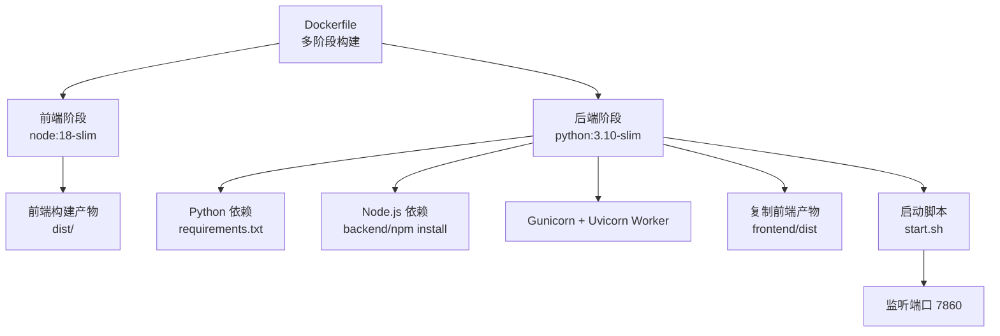
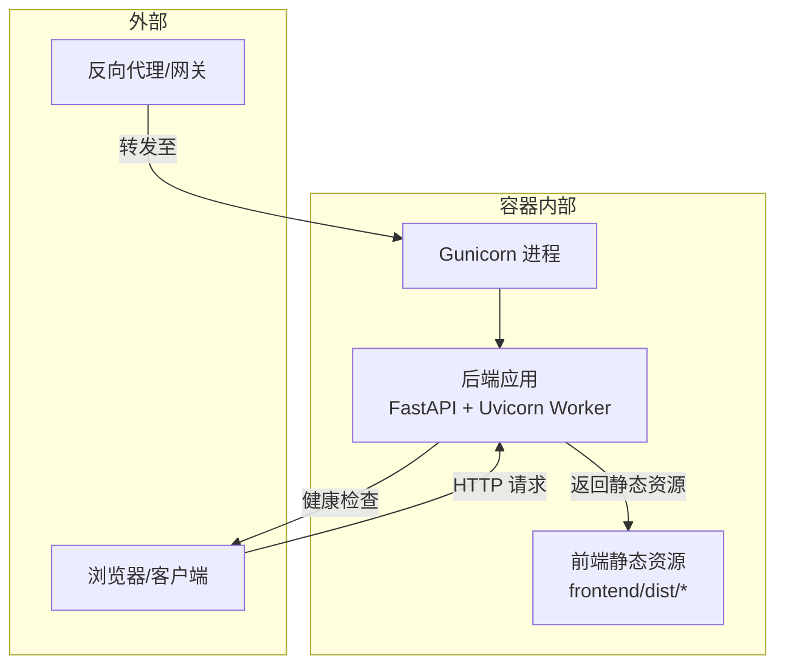
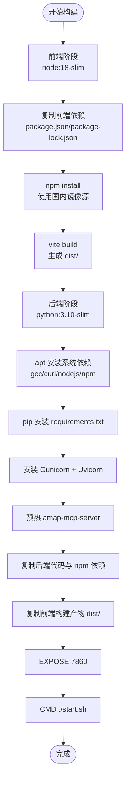
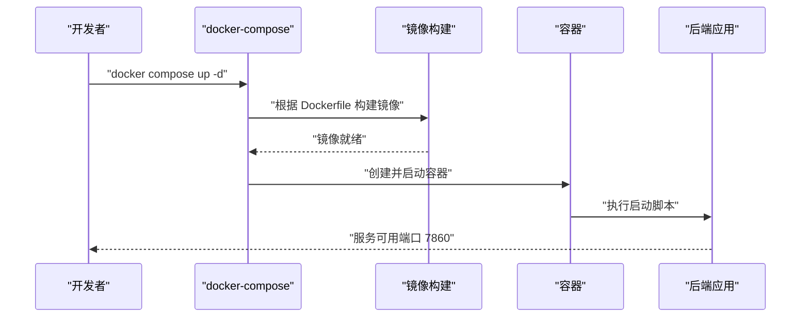
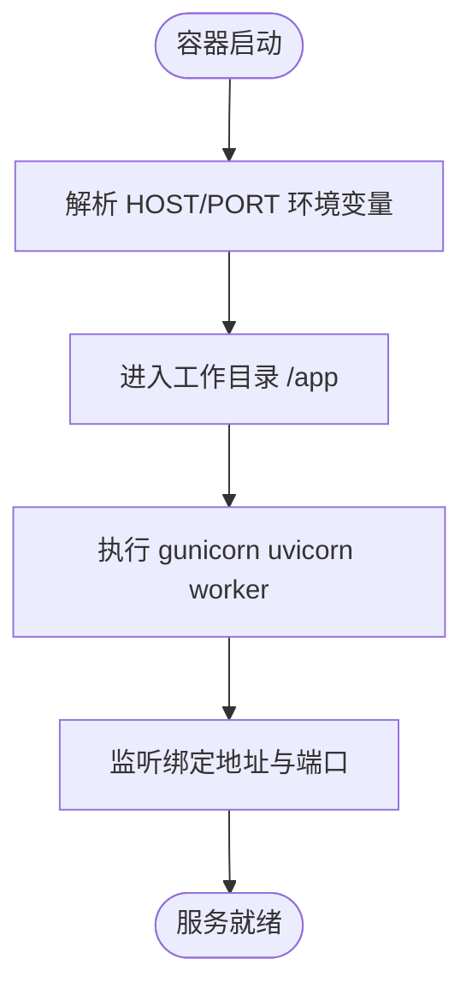
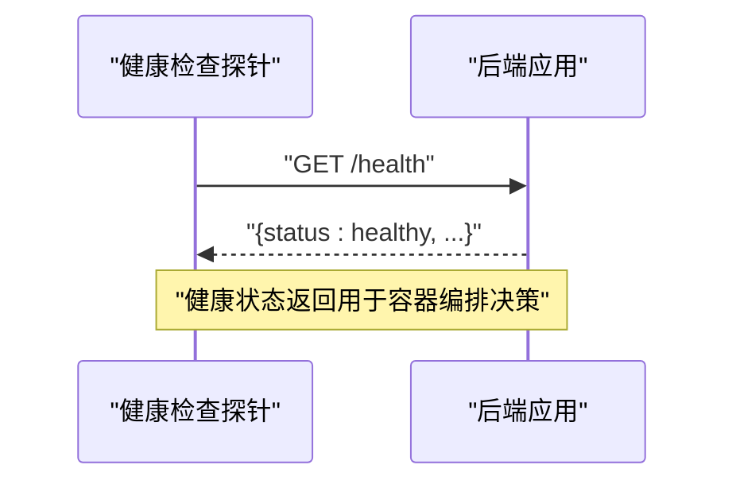
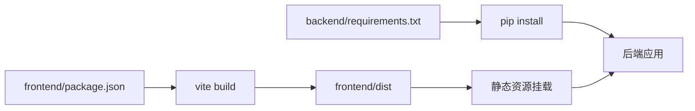

# 容器化部署

<cite>
**本文引用的文件**
- [Dockerfile](file://Dockerfile)
- [docker-compose.yaml](file://docker-compose.yaml)
- [start.sh](file://start.sh)
- [.dockerignore](file://.dockerignore)
- [backend/requirements.txt](file://backend/requirements.txt)
- [frontend/package.json](file://frontend/package.json)
- [backend/app/api/main.py](file://backend/app/api/main.py)
- [backend/app/config.py](file://backend/app/config.py)
</cite>

## 目录
1. [简介](#简介)
2. [项目结构](#项目结构)
3. [核心组件](#核心组件)
4. [架构总览](#架构总览)
5. [详细组件分析](#详细组件分析)
6. [依赖关系分析](#依赖关系分析)
7. [性能考虑](#性能考虑)
8. [故障排查指南](#故障排查指南)
9. [结论](#结论)
10. [附录](#附录)

## 简介
本指南面向希望以容器方式部署 TripStar（旅途星辰）项目的工程与运维人员。内容涵盖镜像构建（含多阶段构建、前端构建优化、后端依赖安装）、docker-compose 编排（服务定义、网络、卷、环境变量）、容器生命周期管理（启动/停止/日志/进入）、不同部署场景（开发/测试/生产）的编排示例、资源限制与健康检查、端口映射最佳实践，以及常见问题的排查方法。

## 项目结构
TripStar 采用前后端分离的多阶段 Docker 构建策略：
- 前端阶段：使用 Node.js 基础镜像构建前端产物，支持通过构建参数注入前端密钥。
- 后端阶段：基于 Python 3.10 slim 镜像，安装系统依赖与 Python 依赖，集成 Gunicorn + Uvicorn worker，挂载前端构建产物，暴露固定端口并通过启动脚本统一入口。

图表来源
- [Dockerfile:1-64](file://Dockerfile#L1-L64)
- [backend/requirements.txt:1-18](file://backend/requirements.txt#L1-L18)
- [frontend/package.json:1-35](file://frontend/package.json#L1-L35)
- [start.sh:1-20](file://start.sh#L1-L20)

章节来源
- [Dockerfile:1-64](file://Dockerfile#L1-L64)
- [.dockerignore:1-16](file://.dockerignore#L1-L16)

## 核心组件
- 多阶段 Dockerfile：前端阶段负责打包前端产物；后端阶段安装系统与 Python 依赖、准备运行时环境、复制前端产物并启动服务。
- docker-compose：定义单服务容器，绑定端口、注入环境变量、设置重启策略。
- 启动脚本：统一以 Gunicorn + Uvicorn worker 方式启动后端服务，支持通过环境变量控制绑定地址与端口。
- 配置与健康检查：后端应用内置健康检查接口，便于容器编排进行健康探针配置。

章节来源
- [Dockerfile:1-64](file://Dockerfile#L1-L64)
- [docker-compose.yaml:1-24](file://docker-compose.yaml#L1-L24)
- [start.sh:1-20](file://start.sh#L1-L20)
- [backend/app/api/main.py:112-119](file://backend/app/api/main.py#L112-L119)

## 架构总览
下图展示容器内运行时的整体交互：前端静态资源由后端挂载并作为 SPA 返回；后端通过 Gunicorn/Uvicorn 承载 FastAPI 应用；容器对外暴露固定端口，compose 进行端口映射。

图表来源
- [backend/app/api/main.py:121-135](file://backend/app/api/main.py#L121-L135)
- [backend/app/api/main.py:112-119](file://backend/app/api/main.py#L112-L119)
- [start.sh:13-19](file://start.sh#L13-L19)

## 详细组件分析

### Dockerfile 多阶段构建
- 前端阶段
  - 基于 node:18-slim，复制前端依赖并安装，支持通过构建参数注入前端密钥。
  - 使用 vite 构建前端产物，跳过类型检查以提升构建速度。
- 后端阶段
  - 基于 python:3.10-slim，安装系统依赖（含 Node.js 用于小红书签名引擎）。
  - 安装 Python 依赖与 Gunicorn、Uvicorn 标准版，预热地图依赖以减少首次请求延迟。
  - 复制后端代码与 Node.js 依赖，复制前端构建产物至静态目录。
  - 暴露固定端口 7860，CMD 指向启动脚本。

图表来源
- [Dockerfile:4-23](file://Dockerfile#L4-L23)
- [Dockerfile:29-58](file://Dockerfile#L29-L58)

章节来源
- [Dockerfile:1-64](file://Dockerfile#L1-L64)
- [backend/requirements.txt:1-18](file://backend/requirements.txt#L1-L18)
- [frontend/package.json:1-35](file://frontend/package.json#L1-L35)

### docker-compose 编排配置
- 服务定义：基于当前目录上下文与 Dockerfile 构建，服务名与容器名可自定义。
- 端口映射：将宿主机 7860 映射到容器 7860。
- 环境变量：注入 LLM 相关、高德 Web Key、小红书 Cookie、服务绑定地址与端口、日志级别等。
- 重启策略：unless-stopped，确保容器退出后自动重启。

图表来源
- [docker-compose.yaml:3-24](file://docker-compose.yaml#L3-L24)
- [Dockerfile:56-63](file://Dockerfile#L56-L63)
- [start.sh:13-19](file://start.sh#L13-L19)

章节来源
- [docker-compose.yaml:1-24](file://docker-compose.yaml#L1-L24)

### 启动脚本与进程模型
- 统一入口：通过启动脚本以 Gunicorn + Uvicorn worker 启动 FastAPI 应用。
- 绑定地址与端口：默认 0.0.0.0:7860，可通过环境变量覆盖。
- 日志：标准输出/错误输出接入容器日志系统。

图表来源
- [start.sh:1-20](file://start.sh#L1-L20)

章节来源
- [start.sh:1-20](file://start.sh#L1-L20)

### 健康检查与运行时配置
- 健康检查：后端提供 /health 接口，可用于容器编排的健康探针。
- 运行时配置：后端支持运行时配置覆盖与持久化，同时兼容环境变量别名，便于容器注入。

图表来源
- [backend/app/api/main.py:112-119](file://backend/app/api/main.py#L112-L119)

章节来源
- [backend/app/api/main.py:112-119](file://backend/app/api/main.py#L112-L119)
- [backend/app/config.py:162-201](file://backend/app/config.py#L162-L201)

## 依赖关系分析
- 前端依赖：通过 package.json 管理，构建阶段使用 npm 安装并生成 dist。
- 后端依赖：通过 requirements.txt 管理，包含 FastAPI、Uvicorn、Gunicorn、日志与第三方库。
- 运行时依赖：容器内安装 Node.js 以支持小红书签名引擎；预热地图依赖以降低首次请求耗时。
- 镜像排除：.dockerignore 排除 node_modules、dist、Python 缓存与 IDE 相关文件，减小镜像体积。

图表来源
- [frontend/package.json:1-35](file://frontend/package.json#L1-L35)
- [backend/requirements.txt:1-18](file://backend/requirements.txt#L1-L18)
- [Dockerfile:53-54](file://Dockerfile#L53-L54)

章节来源
- [.dockerignore:1-16](file://.dockerignore#L1-L16)

## 性能考虑
- 多阶段构建：分离前端与后端构建，减少最终镜像体积，提升缓存命中率。
- 国内镜像源：前端 npm 与后端 pip 均使用国内镜像源，缩短依赖下载时间。
- 预热依赖：预热地图依赖，避免首次请求超时。
- 进程模型：Gunicorn + Uvicorn worker，兼顾并发与异步处理能力。
- 端口固定：容器内固定端口 7860，简化编排与网络配置。

章节来源
- [Dockerfile:10](file://Dockerfile#L10)
- [Dockerfile:40](file://Dockerfile#L40)
- [Dockerfile:46](file://Dockerfile#L46)
- [Dockerfile:61](file://Dockerfile#L61)
- [start.sh:13-19](file://start.sh#L13-L19)

## 故障排查指南
- 镜像构建失败
  - 前端依赖安装失败：检查构建参数与网络，确认 npm registry 可达。
  - Python 依赖安装失败：检查 requirements.txt 与 pip 源可用性。
  - 系统依赖安装失败：检查 apt 源与网络连通性。
- 容器启动异常
  - 端口冲突：确认宿主机 7860 未被占用或调整映射端口。
  - 环境变量缺失：检查 LLM、高德 Key、小红书 Cookie 等关键变量是否注入。
  - 进程启动失败：查看容器日志，定位 Gunicorn 启动错误。
- 网络连接问题
  - 健康检查失败：通过 /health 接口确认后端可用性。
  - CORS 或路径前缀问题：后端对路径重写有中间件处理，确认代理层未引入额外前缀。
- 日志与诊断
  - 查看容器日志：使用容器日志系统输出标准输出/错误。
  - 进入容器：临时进入容器排查文件系统与进程状态。

章节来源
- [docker-compose.yaml:13-23](file://docker-compose.yaml#L13-L23)
- [backend/app/api/main.py:33-44](file://backend/app/api/main.py#L33-L44)
- [backend/app/api/main.py:112-119](file://backend/app/api/main.py#L112-L119)

## 结论
本指南提供了从镜像构建到容器编排、从启动流程到故障排查的完整方案。通过多阶段构建与固定端口策略，TripStar 在容器环境中具备清晰的边界与稳定的运行表现。建议在不同环境（开发/测试/生产）中结合 compose 的环境变量与卷挂载策略，实现灵活且安全的部署。

## 附录

### 不同部署场景的 docker-compose 示例思路
- 开发环境
  - 使用本地卷挂载后端代码与前端目录，便于热更新。
  - 保留默认端口映射，或根据团队约定调整。
  - 注入最小必要环境变量，其余通过本地 .env 提供。
- 测试环境
  - 使用独立网络隔离，设置只读文件系统与资源限制。
  - 通过环境变量注入测试所需的 LLM 与地图密钥。
- 生产环境
  - 固定镜像版本标签，启用 unless-stopped 重启策略。
  - 配置健康检查探针，结合负载均衡与反向代理。
  - 严格限制日志级别与资源配额，确保稳定性与可观测性。

### 容器资源限制与健康检查配置要点
- 资源限制
  - CPU/内存配额：依据业务峰值与并发模型设定。
  - 文件描述符与线程数：结合 Gunicorn worker 数量与 Uvicorn 行为调优。
- 健康检查
  - 使用 /health 接口进行探活，设置合适的间隔与超时。
  - 结合重启策略与编排平台的滚动更新策略，保障发布质量。

### 端口映射与网络配置最佳实践
- 固定容器端口：容器内固定 7860，便于统一管理。
- 宿主机端口映射：避免与宿主机服务冲突，必要时使用随机映射或动态分配。
- 网络隔离：使用自定义网络，仅暴露必要端口；在反向代理后统一入口。