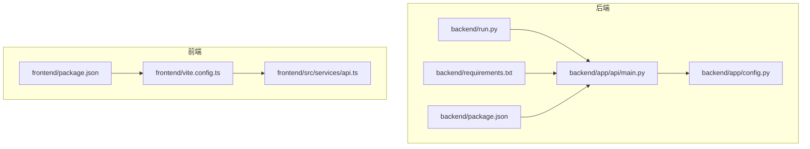
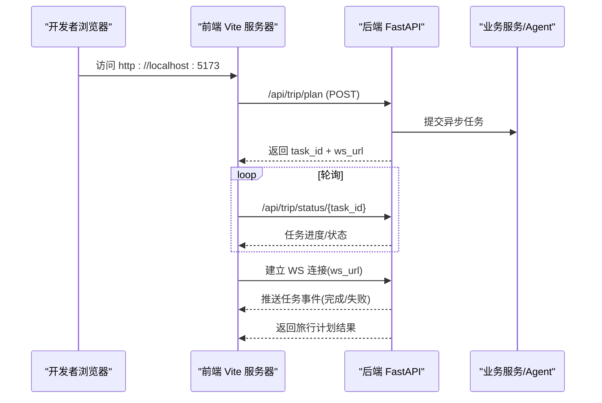
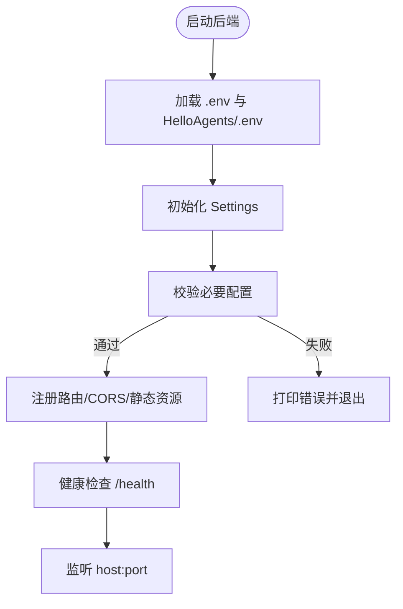
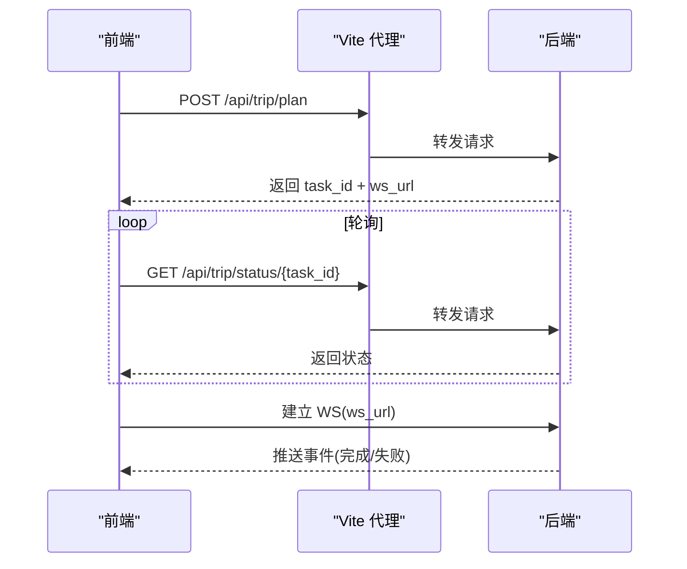
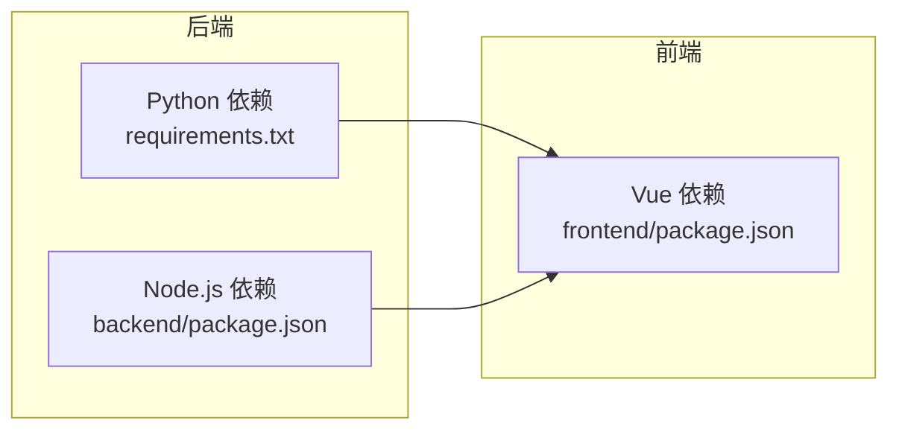

# 本地开发部署

<cite>
**本文引用的文件**
- [README.md](file://README.md)
- [backend/requirements.txt](file://backend/requirements.txt)
- [backend/package.json](file://backend/package.json)
- [frontend/package.json](file://frontend/package.json)
- [backend/app/api/main.py](file://backend/app/api/main.py)
- [backend/app/config.py](file://backend/app/config.py)
- [backend/run.py](file://backend/run.py)
- [frontend/vite.config.ts](file://frontend/vite.config.ts)
- [frontend/src/services/api.ts](file://frontend/src/services/api.ts)
- [docker-compose.yaml](file://docker-compose.yaml)
- [start.sh](file://start.sh)
</cite>

## 目录
1. [简介](#简介)
2. [项目结构](#项目结构)
3. [核心组件](#核心组件)
4. [架构总览](#架构总览)
5. [详细组件分析](#详细组件分析)
6. [依赖分析](#依赖分析)
7. [性能注意事项](#性能注意事项)
8. [故障排查指南](#故障排查指南)
9. [结论](#结论)
10. [附录](#附录)

## 简介
本指南面向希望在本地搭建并运行 TripStar 项目的开发者，涵盖环境准备、后端与前端依赖安装、开发服务器启动、调试方法、热重载与断点调试、API 调试、本地数据库/缓存配置建议，以及常见问题排查。项目采用前后端分离架构：后端基于 FastAPI，前端基于 Vue 3 + Vite，通过异步任务与轮询实现长耗时旅行规划的可靠交付。

## 项目结构
- 后端（Python + FastAPI）位于 backend/，包含 API 路由、配置、服务与多智能体编排。
- 前端（Vue 3 + Vite）位于 frontend/，包含视图、组件、国际化与 API 服务层。
- 顶层提供 Dockerfile、docker-compose.yaml 与启动脚本，便于容器化部署，但本指南聚焦本地开发环境。

图表来源
- [backend/app/api/main.py:1-147](file://backend/app/api/main.py#L1-L147)
- [backend/app/config.py:1-202](file://backend/app/config.py#L1-L202)
- [backend/run.py:1-17](file://backend/run.py#L1-L17)
- [backend/requirements.txt:1-18](file://backend/requirements.txt#L1-L18)
- [backend/package.json:1-7](file://backend/package.json#L1-L7)
- [frontend/vite.config.ts:1-24](file://frontend/vite.config.ts#L1-L24)
- [frontend/src/services/api.ts:1-335](file://frontend/src/services/api.ts#L1-L335)
- [frontend/package.json:1-35](file://frontend/package.json#L1-L35)

章节来源
- [README.md:129-200](file://README.md#L129-L200)
- [backend/app/api/main.py:1-147](file://backend/app/api/main.py#L1-L147)
- [frontend/vite.config.ts:1-24](file://frontend/vite.config.ts#L1-L24)

## 核心组件
- 后端配置与启动
  - 配置加载与校验：通过 pydantic-settings 读取 .env，支持运行时覆盖与持久化。
  - 应用入口：FastAPI 应用注册路由、CORS、静态资源挂载与健康检查。
  - 启动方式：支持 uvicorn 直启与 run.py 启动脚本。
- 前端开发与代理
  - Vite 开发服务器默认端口与代理规则，将 /api 请求转发至后端。
  - 运行时设置：前端可读取/更新后端运行时配置，并持久化到 localStorage。
- 依赖清单
  - 后端：Python 依赖通过 requirements.txt 管理；Node.js 依赖用于小红书签名引擎。
  - 前端：Vue 3、Axios、高德地图 SDK、ECharts 等。

章节来源
- [backend/app/config.py:1-202](file://backend/app/config.py#L1-L202)
- [backend/app/api/main.py:1-147](file://backend/app/api/main.py#L1-L147)
- [backend/run.py:1-17](file://backend/run.py#L1-L17)
- [backend/requirements.txt:1-18](file://backend/requirements.txt#L1-L18)
- [backend/package.json:1-7](file://backend/package.json#L1-L7)
- [frontend/package.json:1-35](file://frontend/package.json#L1-L35)
- [frontend/vite.config.ts:1-24](file://frontend/vite.config.ts#L1-L24)
- [frontend/src/services/api.ts:1-335](file://frontend/src/services/api.ts#L1-L335)

## 架构总览
本地开发采用“前端 Vite 代理 -> 后端 FastAPI”双向通信，后端通过异步任务与 WebSocket 轮询向前端推送进度，最终返回旅行计划结果。

图表来源
- [frontend/src/services/api.ts:216-318](file://frontend/src/services/api.ts#L216-L318)
- [backend/app/api/main.py:56-60](file://backend/app/api/main.py#L56-L60)

## 详细组件分析

### 后端配置与启动
- 配置来源优先级
  - 本地开发：优先加载 backend/.env；若存在 HelloAgents/.env 则合并加载。
  - 运行时覆盖：后端提供运行时设置接口，前端可更新并持久化到 runtime_settings.json。
- 关键配置项
  - 服务器：host、port（默认 0.0.0.0:8000）。
  - CORS：允许的前端地址列表。
  - 高德地图：Web 服务 Key 与 Web 端 JS Key。
  - 小红书：Cookie。
  - LLM：API Key、Base URL、Model ID。
- 启动方式
  - 直接 uvicorn：指定应用入口与 reload。
  - run.py：读取配置并启动 uvicorn。

图表来源
- [backend/app/config.py:11-127](file://backend/app/config.py#L11-L127)
- [backend/app/api/main.py:63-94](file://backend/app/api/main.py#L63-L94)

章节来源
- [backend/app/config.py:1-202](file://backend/app/config.py#L1-L202)
- [backend/app/api/main.py:1-147](file://backend/app/api/main.py#L1-L147)
- [backend/run.py:1-17](file://backend/run.py#L1-L17)

### 前端开发与代理
- 开发服务器
  - 默认端口：5173。
  - 代理：/api 前缀转发至 http://localhost:8000。
- 运行时设置
  - 前端可读取后端运行时设置，也可更新并持久化到 localStorage。
  - 支持动态切换后端 API 基础地址与高德 JS Key。
- 任务轮询与 WebSocket
  - 前端提交任务后，轮询 /api/trip/status/{task_id}，同时建立 WS 连接接收事件，完成后返回旅行计划。

图表来源
- [frontend/vite.config.ts:13-21](file://frontend/vite.config.ts#L13-L21)
- [frontend/src/services/api.ts:216-318](file://frontend/src/services/api.ts#L216-L318)

章节来源
- [frontend/vite.config.ts:1-24](file://frontend/vite.config.ts#L1-L24)
- [frontend/src/services/api.ts:1-335](file://frontend/src/services/api.ts#L1-L335)

### 本地数据库/缓存配置建议
- 本项目未内置数据库或缓存服务，旅行计划与中间状态主要通过异步任务与 WebSocket 推送完成。
- 若需持久化历史计划或缓存中间结果，可在后端新增数据库连接与缓存层（如 Redis），并在配置中扩展相应字段与初始化逻辑。

## 依赖分析
- 后端依赖
  - Python 包：通过 requirements.txt 管理，包含 FastAPI、Uvicorn、pydantic、httpx、aiohttp、loguru、hello-agents 等。
  - Node.js 依赖：用于小红书签名引擎，位于 backend/package.json。
- 前端依赖
  - Vue 3、Axios、高德地图 SDK、ECharts、Ant Design Vue、Swiper、dayjs 等，详见 frontend/package.json。

图表来源
- [backend/requirements.txt:1-18](file://backend/requirements.txt#L1-L18)
- [backend/package.json:1-7](file://backend/package.json#L1-L7)
- [frontend/package.json:1-35](file://frontend/package.json#L1-L35)

章节来源
- [backend/requirements.txt:1-18](file://backend/requirements.txt#L1-L18)
- [backend/package.json:1-7](file://backend/package.json#L1-L7)
- [frontend/package.json:1-35](file://frontend/package.json#L1-L35)

## 性能注意事项
- 异步任务与轮询
  - 后端使用 asyncio.create_task 推送长耗时任务，前端以 3 秒间隔轮询，避免阻塞与超时。
- 日志与编码
  - 强制 UTF-8 编码，避免控制台输出异常。
- 代理与跨域
  - Vite 代理仅限开发环境，生产环境需在后端统一处理 CORS 与静态资源挂载。

章节来源
- [backend/app/api/main.py:10-11](file://backend/app/api/main.py#L10-L11)
- [backend/app/api/main.py:56-60](file://backend/app/api/main.py#L56-L60)
- [frontend/vite.config.ts:13-21](file://frontend/vite.config.ts#L13-L21)

## 故障排查指南
- 端口占用
  - 后端默认 8000，前端默认 5173；若被占用，请修改对应配置或释放端口。
- 权限问题
  - 在类 Unix 系统上，确保 Python 虚拟环境与 Node.js 依赖安装目录具有写权限。
- 依赖冲突
  - 后端使用 uv 与 pip；若出现冲突，建议清理并重新创建虚拟环境后安装 requirements.txt。
  - 前端使用 npm 安装依赖；若遇到版本冲突，清理 node_modules 与锁文件后重装。
- 配置缺失
  - LLM API Key、高德 Web Key、高德 JS Key、小红书 Cookie 未配置会导致相关功能不可用；请在 .env 中补齐。
- CORS 与代理
  - 确保前端代理指向正确的后端地址；若跨域报错，检查后端 CORS 配置与前端代理规则。
- 热重载与断点调试
  - 后端：使用 uvicorn --reload 启动，修改代码后自动重启。
  - 前端：Vite 默认启用热重载；可在浏览器开发者工具中设置断点调试。
- API 调试
  - 后端提供 /docs 与 /redoc 文档；前端通过 axios 发起请求并打印日志，便于定位问题。

章节来源
- [backend/app/config.py:162-179](file://backend/app/config.py#L162-L179)
- [backend/app/api/main.py:25-31](file://backend/app/api/main.py#L25-L31)
- [frontend/src/services/api.ts:117-147](file://frontend/src/services/api.ts#L117-L147)
- [README.md:151-200](file://README.md#L151-L200)

## 结论
通过本指南，您可以在本地完成 TripStar 的环境准备、依赖安装与开发服务器启动，并掌握热重载、断点调试与 API 调试等开发技巧。若需进一步扩展（如引入数据库或缓存），可在现有配置与路由基础上进行增量开发。

## 附录

### 本地开发环境准备与配置
- Python 3.10+ 与虚拟环境
  - 创建并激活虚拟环境，安装后端依赖。
- Node.js 18+
  - 安装前端依赖与后端 Node.js 依赖（小红书签名引擎）。
- Git 工具
  - 用于克隆仓库与版本管理。

章节来源
- [README.md:131-139](file://README.md#L131-L139)

### 后端依赖安装与启动
- 安装 Python 依赖：在 backend/ 目录执行安装命令。
- 安装 Node.js 依赖：在 backend/ 目录执行安装命令。
- 配置 .env：复制示例文件并填入 API Key、高德 Key、小红书 Cookie。
- 启动后端：使用 uvicorn 或 run.py 启动。

章节来源
- [README.md:151-179](file://README.md#L151-L179)
- [backend/requirements.txt:1-18](file://backend/requirements.txt#L1-L18)
- [backend/package.json:1-7](file://backend/package.json#L1-L7)
- [backend/run.py:1-17](file://backend/run.py#L1-L17)

### 前端构建与运行
- 安装依赖：在 frontend/ 目录执行安装命令。
- 配置 .env：确保 VITE_AMAP_WEB_KEY 与 VITE_AMAP_WEB_JS_KEY 与后端一致，并在 index.html 注入安全密钥。
- 启动开发服务器：在 frontend/ 目录执行开发命令。

章节来源
- [README.md:183-199](file://README.md#L183-L199)
- [frontend/package.json:1-35](file://frontend/package.json#L1-L35)
- [frontend/vite.config.ts:1-24](file://frontend/vite.config.ts#L1-L24)

### 本地数据库/缓存配置方法
- 本项目未内置数据库或缓存；如需持久化，可在后端新增数据库连接与缓存层，并在配置中扩展相应字段与初始化逻辑。

章节来源
- [backend/app/config.py:21-67](file://backend/app/config.py#L21-L67)

### 常用命令与调试方法
- 后端
  - 启动：uvicorn 指定应用入口与 reload。
  - 调试：在 IDE 设置断点，结合日志输出定位问题。
- 前端
  - 启动：Vite 开发服务器。
  - 调试：浏览器开发者工具断点调试；查看网络面板确认 /api 请求与 WS 连接。
- API 文档
  - 后端提供 /docs 与 /redoc 文档，便于测试与联调。

章节来源
- [backend/app/api/main.py:25-31](file://backend/app/api/main.py#L25-L31)
- [frontend/src/services/api.ts:117-147](file://frontend/src/services/api.ts#L117-L147)
- [README.md:177-181](file://README.md#L177-L181)