# Nginx 反向代理配置

<cite>
**本文档引用的文件**
- [README.md](file://README.md)
- [docker-compose.yaml](file://docker-compose.yaml)
- [Dockerfile](file://Dockerfile)
- [start.sh](file://start.sh)
- [backend/app/api/main.py](file://backend/app/api/main.py)
- [backend/app/config.py](file://backend/app/config.py)
- [frontend/vite.config.ts](file://frontend/vite.config.ts)
- [frontend/src/services/api.ts](file://frontend/src/services/api.ts)
- [frontend/index.html](file://frontend/index.html)
- [backend/app/api/routes/trip.py](file://backend/app/api/routes/trip.py)
- [backend/app/api/routes/chat.py](file://backend/app/api/routes/chat.py)
- [backend/app/models/schemas.py](file://backend/app/models/schemas.py)
</cite>

## 目录
1. [简介](#简介)
2. [项目结构](#项目结构)
3. [核心组件](#核心组件)
4. [架构概览](#架构概览)
5. [详细组件分析](#详细组件分析)
6. [依赖分析](#依赖分析)
7. [性能考虑](#性能考虑)
8. [故障排除指南](#故障排除指南)
9. [结论](#结论)
10. [附录](#附录)

## 简介

本文档提供了基于 TripStar 项目的 Nginx 反向代理完整配置指南。TripStar 是一个基于 HelloAgents 框架的多智能体协作文旅规划平台，采用前后端分离架构，包含 Vue 3 前端、FastAPI 后端和 LLM/Agents 智能推理层。

该指南涵盖了 Nginx 的安装和基础配置、主配置文件和站点配置文件结构、静态资源服务配置、HTTPS 配置、负载均衡配置、反向代理规则配置以及缓存策略配置等关键内容。

## 项目结构

TripStar 项目采用标准的前后端分离架构，主要组件包括：

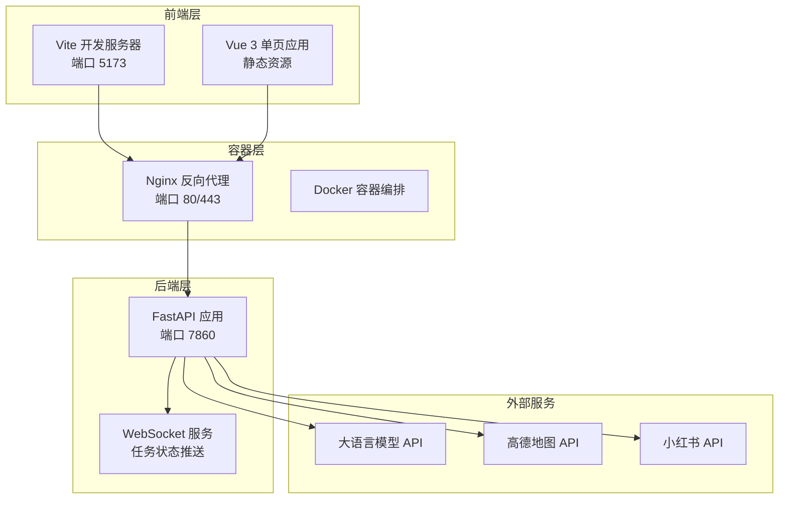

**图表来源**
- [docker-compose.yaml:1-24](file://docker-compose.yaml#L1-L24)
- [Dockerfile:1-64](file://Dockerfile#L1-L64)
- [backend/app/api/main.py:1-147](file://backend/app/api/main.py#L1-L147)

**章节来源**
- [README.md:43-97](file://README.md#L43-L97)
- [docker-compose.yaml:1-24](file://docker-compose.yaml#L1-L24)
- [Dockerfile:1-64](file://Dockerfile#L1-L64)

## 核心组件

### 服务器端口配置

根据项目配置，各组件使用的端口如下：

| 组件 | 端口 | 用途 | 配置来源 |
|------|------|------|----------|
| 前端开发服务器 | 5173 | Vue 开发环境 | [vite.config.ts:14-21](file://frontend/vite.config.ts#L14-L21) |
| 后端 API 服务 | 7860 | FastAPI 应用 | [docker-compose.yaml:11-21](file://docker-compose.yaml#L11-L21) |
| Nginx 反向代理 | 80/443 | 外部访问入口 | Nginx 配置 |
| WebSocket | 7860 | 实时任务状态推送 | [trip.py:390-440](file://backend/app/api/routes/trip.py#L390-L440) |

### API 路由结构

后端 API 采用统一的路由前缀 `/api`，包含以下主要路由：

```mermaid
graph TD
API_ROOT[/api] --> TRIP[/trip - 旅行规划]
API_ROOT --> CHAT[/chat - AI 问答]
API_ROOT --> POI[/poi - POI 搜索]
API_ROOT --> MAP[/map - 地图服务]
API_ROOT --> SETTINGS[/settings - 配置管理]
TRIP --> PLAN[/plan - 规划任务]
TRIP --> STATUS[/status/{task_id} - 状态查询]
TRIP --> WS[/ws/{task_id} - WebSocket]
TRIP --> HISTORY[/history - 历史记录]
CHAT --> ASK[/ask - 问答接口]
```

**图表来源**
- [backend/app/api/main.py:55-60](file://backend/app/api/main.py#L55-L60)
- [backend/app/api/routes/trip.py:17](file://backend/app/api/routes/trip.py#L17)
- [backend/app/api/routes/chat.py:7](file://backend/app/api/routes/chat.py#L7)

**章节来源**
- [backend/app/api/main.py:55-60](file://backend/app/api/main.py#L55-L60)
- [backend/app/api/routes/trip.py:17](file://backend/app/api/routes/trip.py#L17)
- [backend/app/api/routes/chat.py:7](file://backend/app/api/routes/chat.py#L7)

## 架构概览

### 整体系统架构

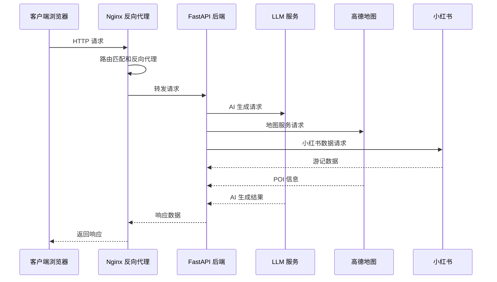

**图表来源**
- [backend/app/api/main.py:138-147](file://backend/app/api/main.py#L138-L147)
- [backend/app/api/routes/trip.py:315-388](file://backend/app/api/routes/trip.py#L315-L388)

### 静态资源服务架构

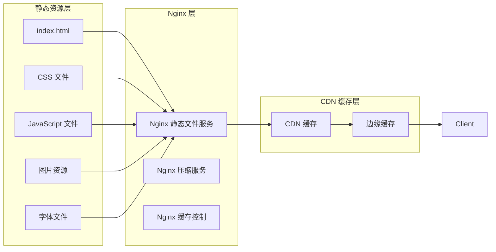

**图表来源**
- [backend/app/api/main.py:121-136](file://backend/app/api/main.py#L121-L136)

## 详细组件分析

### Nginx 安装和基础配置

#### 基础环境准备

```bash
# Ubuntu/Debian 系统
sudo apt update
sudo apt install nginx

# CentOS/RHEL 系统
sudo yum install epel-release
sudo yum install nginx

# 验证安装
nginx -v
systemctl status nginx
```

#### 主配置文件结构

Nginx 主配置文件通常位于 `/etc/nginx/nginx.conf`，包含以下关键部分：

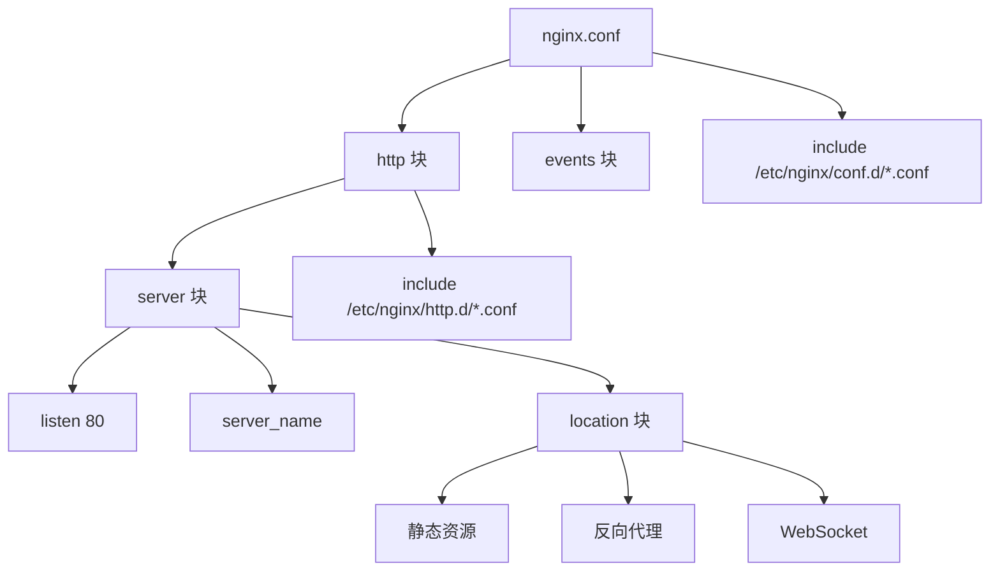

**图表来源**
- [docker-compose.yaml:11-21](file://docker-compose.yaml#L11-L21)

### 站点配置文件结构

#### 主要站点配置

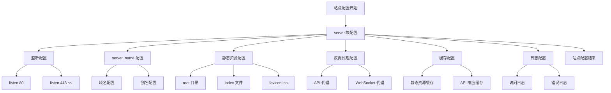

**图表来源**
- [backend/app/api/main.py:121-136](file://backend/app/api/main.py#L121-L136)

### 静态资源服务配置

#### 前端构建产物服务

根据项目配置，前端构建产物位于 `frontend/dist` 目录，需要配置静态文件服务：

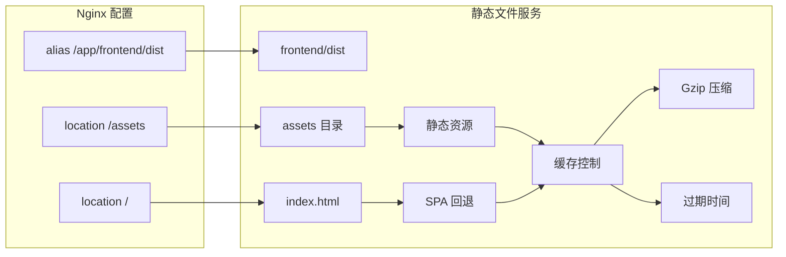

**图表来源**
- [backend/app/api/main.py:121-136](file://backend/app/api/main.py#L121-L136)

#### 缓存策略配置

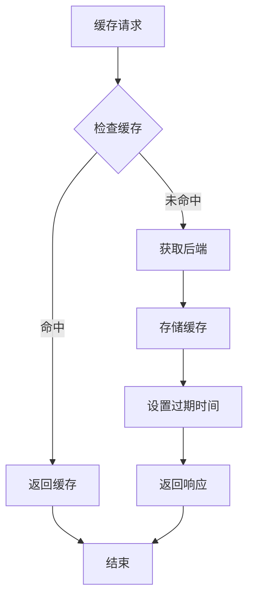

**图表来源**
- [backend/app/api/main.py:121-136](file://backend/app/api/main.py#L121-L136)

### HTTPS 配置

#### SSL 证书配置

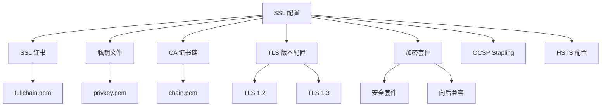

**图表来源**
- [docker-compose.yaml:11-21](file://docker-compose.yaml#L11-L21)

#### TLS 版本和加密套件选择

根据现代安全最佳实践，建议配置：

- **TLS 版本**: TLS 1.2 和 TLS 1.3
- **加密套件**: 优先使用 ECDHE 密码套件
- **禁用弱加密**: 禁用 RC4、3DES 等弱加密算法
- **启用 OCSP Stapling**: 提升证书验证性能

### 负载均衡配置

#### upstream 服务器组配置

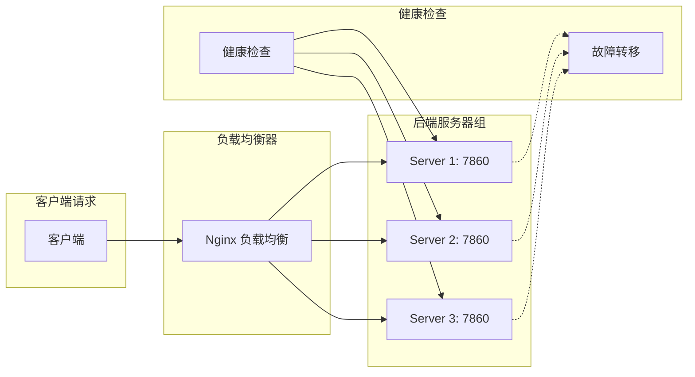

**图表来源**
- [docker-compose.yaml:11-21](file://docker-compose.yaml#L11-L21)

#### 负载均衡算法选择

根据应用特点，推荐以下算法：

- **轮询算法**: 默认算法，适合服务器性能相近的情况
- **最少连接**: 适合请求处理时间差异较大的情况
- **IP 哈希**: 适合需要粘性会话的应用

### 反向代理规则配置

#### API 路由转发

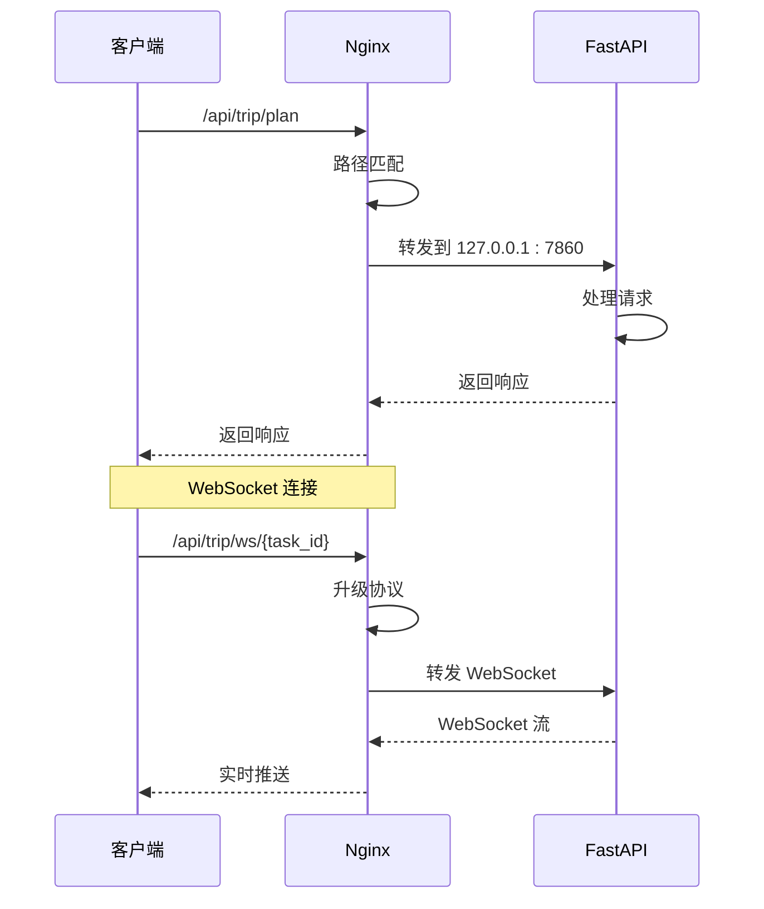

**图表来源**
- [backend/app/api/routes/trip.py:390-440](file://backend/app/api/routes/trip.py#L390-L440)
- [frontend/src/services/api.ts:268-318](file://frontend/src/services/api.ts#L268-L318)

#### 请求头处理

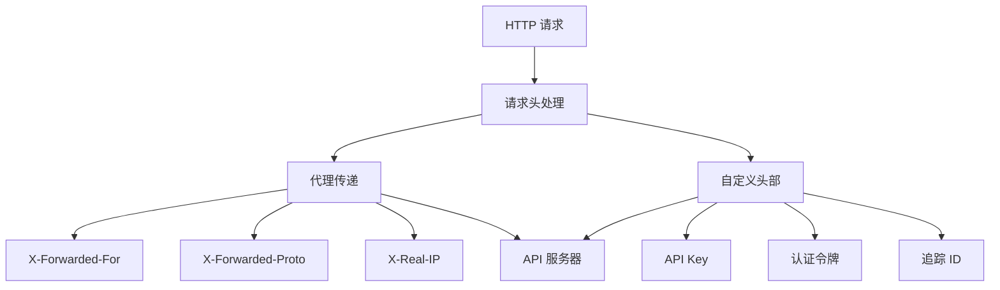

**图表来源**
- [backend/app/api/main.py:33-44](file://backend/app/api/main.py#L33-L44)

### 缓存策略配置

#### 静态资源缓存

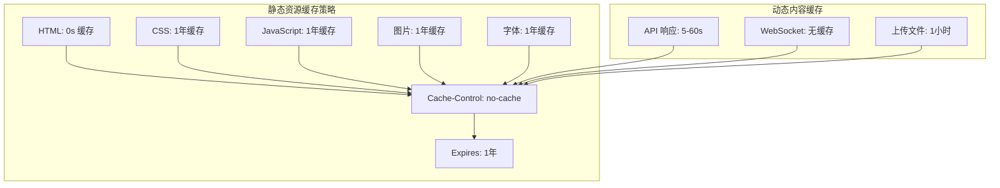

**图表来源**
- [backend/app/api/main.py:121-136](file://backend/app/api/main.py#L121-L136)

#### API 响应缓存

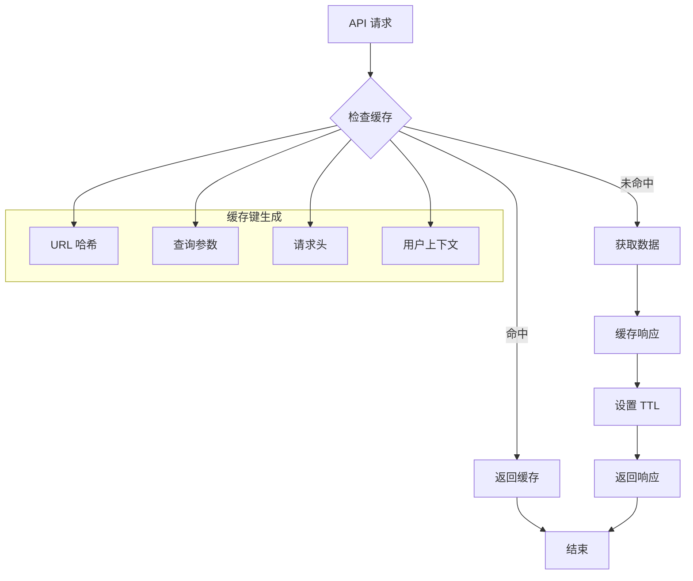

**图表来源**
- [backend/app/api/routes/trip.py:243-274](file://backend/app/api/routes/trip.py#L243-L274)

### WebSocket 支持配置

#### WebSocket 协议升级

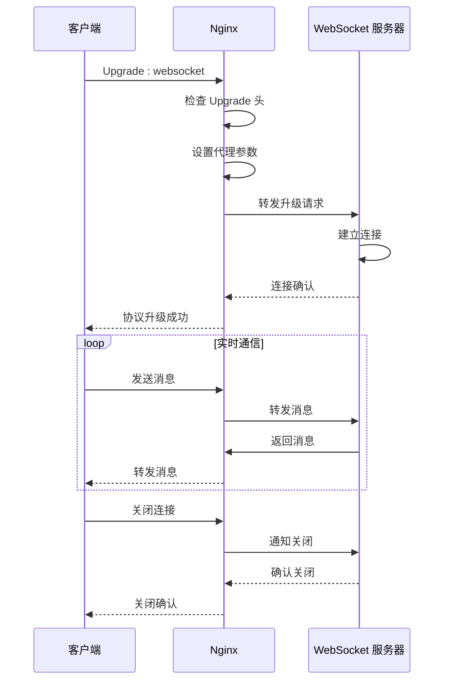

**图表来源**
- [backend/app/api/routes/trip.py:390-440](file://backend/app/api/routes/trip.py#L390-L440)
- [frontend/src/services/api.ts:268-318](file://frontend/src/services/api.ts#L268-L318)

## 依赖分析

### 组件耦合关系

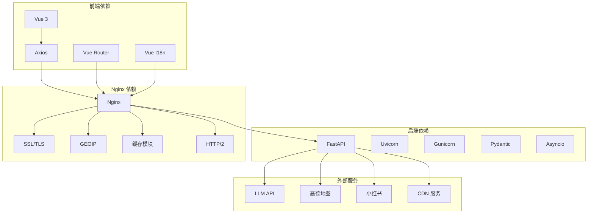

**图表来源**
- [backend/app/api/main.py:138-147](file://backend/app/api/main.py#L138-L147)
- [docker-compose.yaml:1-24](file://docker-compose.yaml#L1-24)

### 数据流分析

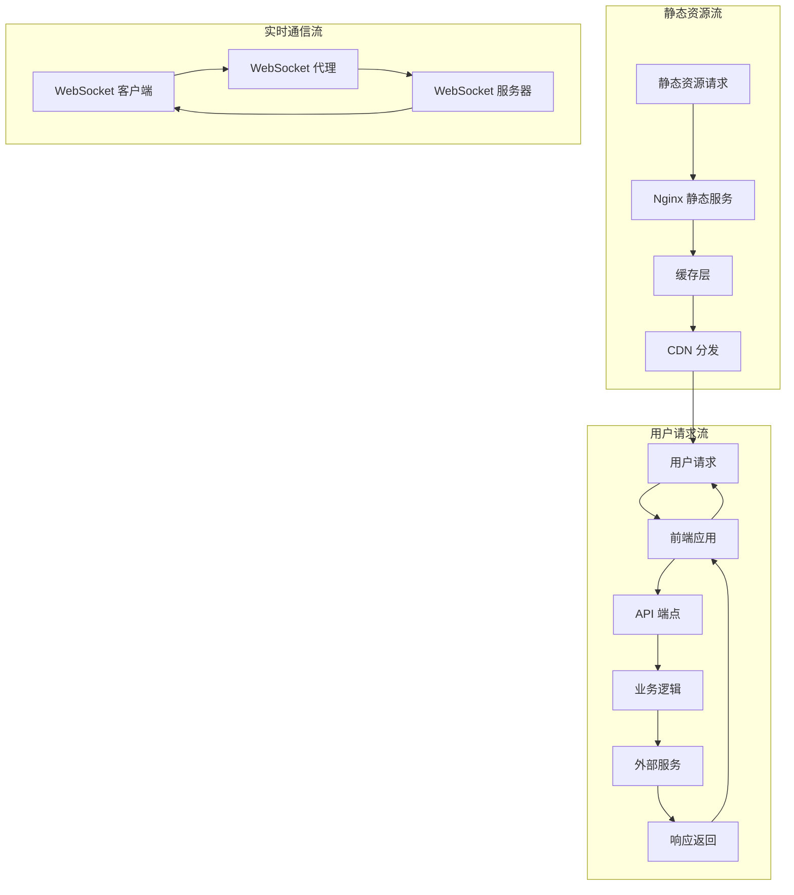

**图表来源**
- [backend/app/api/main.py:121-136](file://backend/app/api/main.py#L121-L136)
- [backend/app/api/routes/trip.py:390-440](file://backend/app/api/routes/trip.py#L390-L440)

**章节来源**
- [backend/app/api/main.py:121-136](file://backend/app/api/main.py#L121-L136)
- [backend/app/api/routes/trip.py:390-440](file://backend/app/api/routes/trip.py#L390-L440)

## 性能考虑

### 缓存优化策略

#### 多层缓存架构

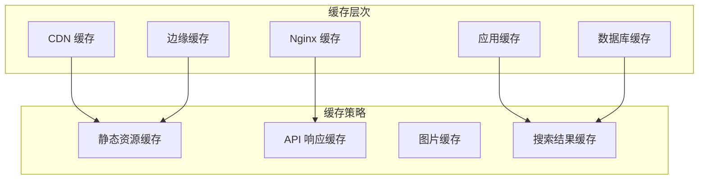

#### 性能监控指标

- **响应时间**: 目标 < 200ms
- **并发连接数**: 支持 > 1000 concurrent connections
- **吞吐量**: > 100 requests/second
- **缓存命中率**: > 90%
- **CPU 使用率**: < 70%
- **内存使用率**: < 80%

### 压缩配置

#### Gzip 压缩策略

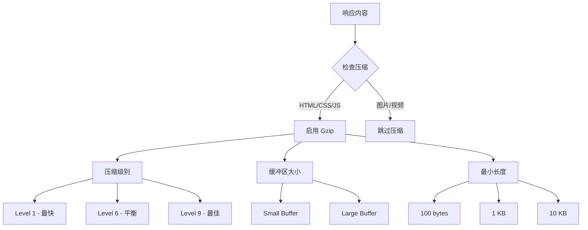

**图表来源**
- [backend/app/api/main.py:121-136](file://backend/app/api/main.py#L121-L136)

## 故障排除指南

### 常见问题诊断

#### 连接问题排查

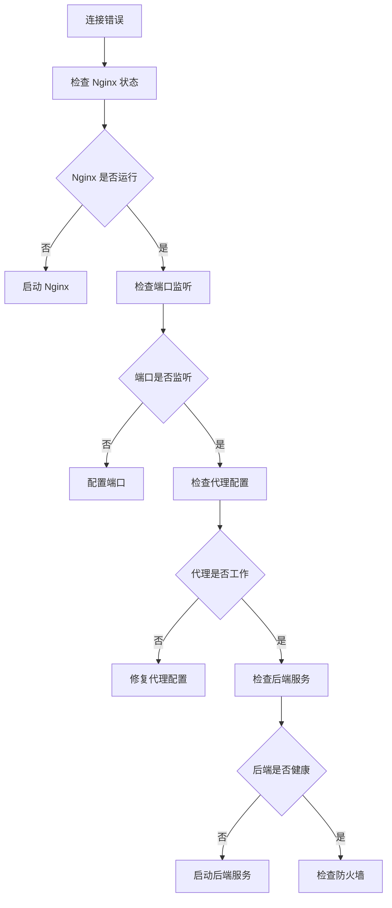

#### 性能问题排查

```mermaid
flowchart TD
PERFORMANCE_ISSUE[性能问题] --> CHECK_LOAD[检查系统负载]
CHECK_LOAD --> LOAD_HIGH{负载过高?}
LOAD_HIGH --> |是| OPTIMIZE_RESOURCES[优化资源使用]
LOAD_HIGH --> |否| CHECK_CONNECTIONS[检查连接数]
CHECK_CONNECTIONS --> TOO_MANY_CONN{连接数过多?}
TOO_MANY_CONN --> |是| LIMIT_CONNECTIONS[限制连接数]
TOO_MANY_CONN --> |否| CHECK_CACHE[检查缓存效率]
CHECK_CACHE --> LOW_HIT_RATE{缓存命中率低?}
LOW_HIT_RATE --> |是| TUNE_CACHE[调整缓存策略]
LOW_HIT_RATE --> |否| CHECK_DATABASE[检查数据库性能]
CHECK_DATABASE --> SLOW_QUERY{慢查询?}
SLOW_QUERY --> |是| OPTIMIZE_QUERIES[优化查询]
SLOW_QUERY --> |否| CHECK_NETWORK[检查网络延迟]
```

### 日志分析

#### Nginx 日志配置

```mermaid
graph LR
subgraph "访问日志"
ACCESS_LOG[access.log]
LOG_FORMAT[自定义日志格式]
LOG_ROTATION[日志轮转]
end
subgraph "错误日志"
ERROR_LOG[error.log]
DEBUG_LOG[调试日志]
WARN_LOG[警告日志]
end
subgraph "分析工具"
AWSTATS[AWStats]
GOACCESS[GoAccess]
ELK_STACK[ELK Stack]
end
ACCESS_LOG --> LOG_FORMAT
ACCESS_LOG --> LOG_ROTATION
ERROR_LOG --> DEBUG_LOG
ERROR_LOG --> WARN_LOG
LOG_FORMAT --> AWSTATS
LOG_ROTATION --> AWSTATS
DEBUG_LOG --> GOACCESS
WARN_LOG --> GOACCESS
```

**图表来源**
- [docker-compose.yaml:11-21](file://docker-compose.yaml#L11-L21)

**章节来源**
- [docker-compose.yaml:11-21](file://docker-compose.yaml#L11-L21)

## 结论

本文档提供了基于 TripStar 项目的完整 Nginx 反向代理配置指南。通过合理配置 Nginx，可以实现：

1. **高性能静态资源服务**: 通过多级缓存和压缩提升用户体验
2. **可靠的 API 代理**: 支持 HTTP 和 WebSocket 协议
3. **安全的 HTTPS 传输**: 配置现代 TLS 版本和加密套件
4. **灵活的负载均衡**: 支持多种算法和健康检查
5. **完善的缓存策略**: 针对静态资源和动态内容的不同缓存需求

建议在生产环境中实施以下最佳实践：
- 定期更新 SSL 证书和加密套件
- 监控系统性能指标和缓存效果
- 配置适当的超时和重试机制
- 实施安全防护措施和访问控制
- 建立完善的日志记录和分析体系

## 附录

### 配置文件模板

#### 基础 Nginx 配置模板

```nginx
# 基础配置
user nginx;
worker_processes auto;
error_log /var/log/nginx/error.log;
pid /run/nginx.pid;

# 事件模块
events {
    worker_connections 1024;
    use epoll;
    multi_accept on;
}

# HTTP 核心配置
http {
    # 基本设置
    include /etc/nginx/mime.types;
    default_type application/octet-stream;
    
    # 日志格式
    log_format main '$remote_addr - $remote_user [$time_local] "$request" '
                   '$status $body_bytes_sent "$http_referer" '
                   '"$http_user_agent" "$http_x_forwarded_for"';
    
    access_log /var/log/nginx/access.log main;
    
    # 性能优化
    sendfile on;
    tcp_nopush on;
    tcp_nodelay on;
    keepalive_timeout 65;
    types_hash_max_size 2048;
    
    # Gzip 压缩
    gzip on;
    gzip_vary on;
    gzip_min_length 1024;
    gzip_comp_level 6;
    gzip_buffers 16 8k;
    gzip_http_version 1.1;
    gzip_types text/plain text/css application/json application/javascript text/xml application/xml;
    
    # 包含其他配置
    include /etc/nginx/conf.d/*.conf;
    include /etc/nginx/http.d/*.conf;
}
```

#### 站点配置模板

```nginx
# 站点配置
server {
    # 监听配置
    listen 80;
    listen 443 ssl http2;
    server_name tripstar.example.com www.tripstar.example.com;
    
    # SSL 配置
    ssl_certificate /path/to/fullchain.pem;
    ssl_certificate_key /path/to/privkey.pem;
    ssl_trusted_certificate /path/to/chain.pem;
    
    # TLS 配置
    ssl_protocols TLSv1.2 TLSv1.3;
    ssl_ciphers ECDHE-RSA-AES256-GCM-SHA512:DHE-RSA-AES256-GCM-SHA512:ECDHE-RSA-AES256-GCM-SHA384:DHE-RSA-AES256-GCM-SHA384;
    ssl_prefer_server_ciphers off;
    ssl_session_cache shared:SSL:10m;
    ssl_session_timeout 10m;
    
    # 安全头
    add_header X-Frame-Options "SAMEORIGIN" always;
    add_header X-XSS-Protection "1; mode=block" always;
    add_header X-Content-Type-Options "nosniff" always;
    add_header Referrer-Policy "no-referrer-when-downgrade" always;
    
    # 静态资源配置
    location / {
        root /app/frontend/dist;
        try_files $uri $uri/ /index.html;
        expires 1y;
        add_header Cache-Control "public, immutable";
    }
    
    # API 代理配置
    location /api/ {
        proxy_pass http://127.0.0.1:7860/;
        proxy_set_header Host $host;
        proxy_set_header X-Real-IP $remote_addr;
        proxy_set_header X-Forwarded-For $proxy_add_x_forwarded_for;
        proxy_set_header X-Forwarded-Proto $scheme;
        
        # 超时设置
        proxy_connect_timeout 300s;
        proxy_send_timeout 300s;
        proxy_read_timeout 300s;
        
        # 缓冲设置
        proxy_buffering on;
        proxy_buffer_size 128k;
        proxy_buffers 4 256k;
        proxy_busy_buffers_size 256k;
    }
    
    # WebSocket 配置
    location /api/trip/ws/ {
        proxy_pass http://127.0.0.1:7860/;
        proxy_http_version 1.1;
        proxy_set_header Upgrade $http_upgrade;
        proxy_set_header Connection "upgrade";
        proxy_set_header Host $host;
        proxy_set_header X-Real-IP $remote_addr;
        proxy_set_header X-Forwarded-For $proxy_add_x_forwarded_for;
        proxy_set_header X-Forwarded-Proto $scheme;
        
        # WebSocket 超时
        proxy_read_timeout 86400;
        proxy_send_timeout 86400;
    }
    
    # 健康检查
    location /health {
        access_log off;
        return 200 "healthy\n";
        add_header Content-Type text/plain;
    }
}
```

#### 负载均衡配置模板

```nginx
# 负载均衡配置
upstream tripstar_backend {
    # 轮询算法
    server 127.0.0.1:7860 weight=1 max_fails=3 fail_timeout=30s;
    server 127.0.0.1:7861 weight=1 max_fails=3 fail_timeout=30s;
    server 127.0.0.1:7862 weight=1 max_fails=3 fail_timeout=30s;
    
    # 健康检查
    keepalive 32;
}

# 负载均衡服务器配置
server {
    listen 80;
    server_name tripstar.example.com;
    
    # 负载均衡代理
    location / {
        proxy_pass http://tripstar_backend;
        proxy_set_header Host $host;
        proxy_set_header X-Real-IP $remote_addr;
        proxy_set_header X-Forwarded-For $proxy_add_x_forwarded_for;
        proxy_set_header X-Forwarded-Proto $scheme;
        
        # 连接池
        proxy_http_version 1.1;
        proxy_set_header Connection "";
        
        # 健康检查
        proxy_next_upstream on;
        proxy_next_upstream_timeout 0;
        proxy_next_upstream_tries 3;
    }
}
```

### 性能调优建议

#### 系统级优化

```bash
# 文件描述符限制
echo '* soft nofile 65536' >> /etc/security/limits.conf
echo '* hard nofile 65536' >> /etc/security/limits.conf

# 内核参数优化
echo 'net.core.somaxconn = 65535' >> /etc/sysctl.conf
echo 'net.ipv4.tcp_max_syn_backlog = 65535' >> /etc/sysctl.conf
echo 'net.ipv4.ip_local_port_range = 1024 65535' >> /etc/sysctl.conf

# 应用程序优化
ulimit -n 65536
sysctl -p
```

#### Nginx 优化配置

```nginx
# worker 进程优化
worker_processes auto;
worker_cpu_affinity auto;
worker_rlimit_nofile 65536;

# 事件模型优化
events {
    use epoll;
    worker_connections 65536;
    multi_accept on;
    accept_mutex off;
}

# HTTP 优化
http {
    # 连接池优化
    keepalive_timeout 65;
    keepalive_requests 1000;
    
    # 缓冲区优化
    client_body_buffer_size 128k;
    client_max_body_size 10m;
    client_body_timeout 300s;
    
    # 发送缓冲区优化
    send_timeout 300s;
    send_lowat 16384;
    
    # 网络优化
    tcp_nopush on;
    tcp_nodelay on;
}
```

**章节来源**
- [docker-compose.yaml:11-21](file://docker-compose.yaml#L11-L21)
- [backend/app/api/main.py:121-136](file://backend/app/api/main.py#L121-L136)
- [backend/app/api/routes/trip.py:390-440](file://backend/app/api/routes/trip.py#L390-L440)