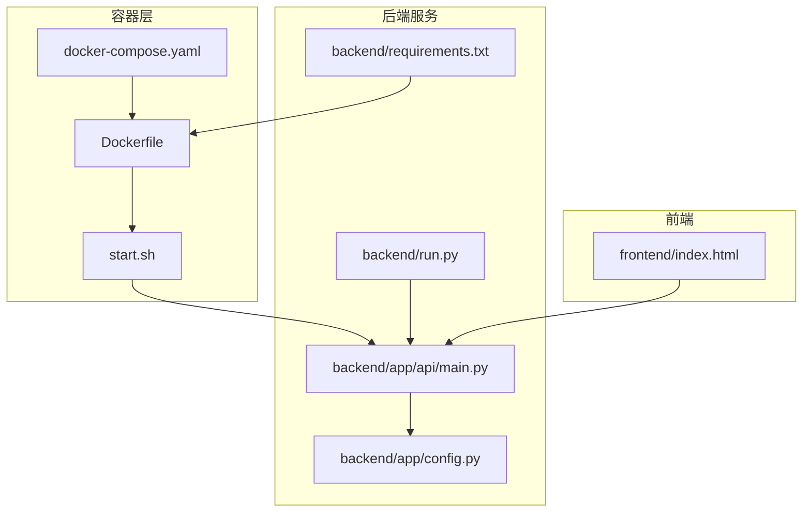
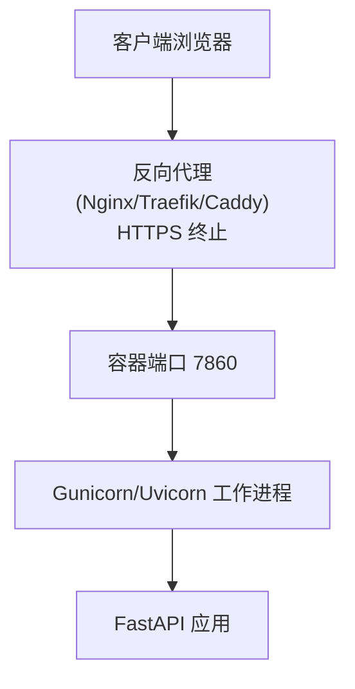
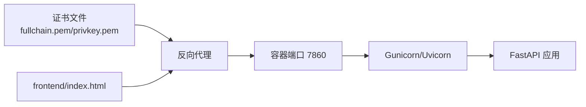

# SSL 证书配置

<cite>
**本文引用的文件**
- [README.md](file://README.md)
- [Dockerfile](file://Dockerfile)
- [docker-compose.yaml](file://docker-compose.yaml)
- [start.sh](file://start.sh)
- [backend/app/api/main.py](file://backend/app/api/main.py)
- [backend/app/config.py](file://backend/app/config.py)
- [backend/requirements.txt](file://backend/requirements.txt)
- [backend/run.py](file://backend/run.py)
- [frontend/index.html](file://frontend/index.html)
</cite>

## 目录
1. [引言](#引言)
2. [项目结构](#项目结构)
3. [核心组件](#核心组件)
4. [架构总览](#架构总览)
5. [详细组件分析](#详细组件分析)
6. [依赖分析](#依赖分析)
7. [性能考虑](#性能考虑)
8. [故障排查指南](#故障排查指南)
9. [结论](#结论)
10. [附录](#附录)

## 引言
本指南围绕 SSL/TLS 证书在本项目的部署与运维实践展开，结合项目现有容器化与反向代理的典型场景，系统讲解以下内容：
- 证书类型与适用场景：域名验证型（DV）、组织验证型（OV）、扩展验证型（EV）的差异与选择建议
- Let’s Encrypt 自动化：certbot 工具使用、自动续期、证书文件管理
- 自签名证书：OpenSSL 命令行生成、有效期设置、私钥保护
- 证书链与中间证书：安装与配置要点
- 证书监控与告警：到期提醒、变更检测、自动重载
- 不同部署环境：Docker 容器、Kubernetes、传统服务器的差异化配置

本项目后端基于 Python FastAPI，容器化部署，服务端口默认 7860。当前仓库未包含任何 SSL 证书相关配置文件，因此本指南提供通用且可落地的实施步骤与最佳实践。

## 项目结构
本项目采用前后端分离架构，后端通过容器编排对外提供服务。与 SSL 证书相关的关键位置包括：
- 容器镜像与启动脚本：Dockerfile、docker-compose.yaml、start.sh
- 后端服务入口与配置：backend/app/api/main.py、backend/app/config.py、backend/run.py
- 前端入口与高德 JS API 安全密钥注入：frontend/index.html

**图表来源**
- [Dockerfile:1-64](file://Dockerfile#L1-L64)
- [docker-compose.yaml:1-24](file://docker-compose.yaml#L1-L24)
- [start.sh:1-20](file://start.sh#L1-L20)
- [backend/app/api/main.py:1-147](file://backend/app/api/main.py#L1-L147)
- [backend/app/config.py:1-202](file://backend/app/config.py#L1-L202)
- [backend/run.py:1-17](file://backend/run.py#L1-L17)
- [backend/requirements.txt:1-18](file://backend/requirements.txt#L1-L18)
- [frontend/index.html:1-25](file://frontend/index.html#L1-L25)

**章节来源**
- [README.md:129-200](file://README.md#L129-L200)
- [Dockerfile:1-64](file://Dockerfile#L1-L64)
- [docker-compose.yaml:1-24](file://docker-compose.yaml#L1-L24)
- [start.sh:1-20](file://start.sh#L1-L20)
- [backend/app/api/main.py:1-147](file://backend/app/api/main.py#L1-L147)
- [backend/app/config.py:1-202](file://backend/app/config.py#L1-L202)
- [backend/run.py:1-17](file://backend/run.py#L1-L17)
- [frontend/index.html:1-25](file://frontend/index.html#L1-L25)

## 核心组件
- 容器编排与暴露端口：docker-compose.yaml 将宿主机 7860 映射至容器内 7860，服务通过 start.sh 启动 gunicorn+uvicorn 工作进程对外提供 HTTP 服务。
- 后端配置与监听：backend/app/config.py 定义 host/port 等运行参数；backend/app/api/main.py 注册路由与中间件；backend/run.py 支持本地开发 uvicorn 直启。
- 前端入口与高德 JS API 安全密钥：frontend/index.html 注入高德安全密钥，与 SSL/TLS 无直接关联，但涉及前端资源加载的安全策略。

**章节来源**
- [docker-compose.yaml:11-23](file://docker-compose.yaml#L11-L23)
- [start.sh:13-19](file://start.sh#L13-L19)
- [backend/app/config.py:29-31](file://backend/app/config.py#L29-L31)
- [backend/app/api/main.py:24-31](file://backend/app/api/main.py#L24-L31)
- [backend/run.py:6-15](file://backend/run.py#L6-L15)
- [frontend/index.html:17-21](file://frontend/index.html#L17-L21)

## 架构总览
本项目在容器内运行后端服务，通常通过反向代理（Nginx/Traefik/Caddy）统一接入 HTTPS，并将明文 HTTP 流量转发至容器内的 7860 端口。该模式下，SSL 终止于反向代理层，容器内无需直接处理证书文件。

[此图为概念性示意，不对应具体源码文件，故不附“图表来源”]

## 详细组件分析

### 1) 证书类型与适用场景
- 域名验证型（DV）：仅验证域名所有权，适合个人站点、测试环境、开发环境。
- 组织验证型（OV）：除域名验证外，还需验证组织身份，适合企业官网、内部系统。
- 扩展验证型（EV）：最严格验证，浏览器地址栏显示公司名称，适合银行、政府等高度信任场景。

[本节为通用概念说明，不直接分析具体文件]

### 2) Let’s Encrypt 自动化配置
- 证书申请与安装
  - 使用 certbot 申请证书，选择 webroot 或 standalone 模式进行域名验证。
  - 将证书与私钥放置于反向代理可读目录（如 /etc/letsencrypt/live/example.com/）。
- 自动续期
  - 配置定时任务定期执行 renew；注意测试续期命令后再上线。
- 证书文件管理
  - 证书链文件（fullchain.pem）与私钥（privkey.pem）权限应严格控制（仅 root 可读）。
- 反向代理配置
  - Nginx/Traefik/Caddy 指向上述证书路径；重启或热重载使生效。

[本节为通用流程说明，不直接分析具体文件]

### 3) 自签名证书生成与配置
- OpenSSL 生成
  - 生成私钥与自签证书，指定有效期（如 365 天）。
  - 如需中间证书链，按 CA → 中间 CA → 服务证书顺序生成并合并。
- 私钥保护
  - 限制权限（chmod 600），妥善备份，避免泄露。
- 反向代理导入
  - 将证书链与私钥配置到反向代理；确保客户端信任根/中间 CA。

[本节为通用流程说明，不直接分析具体文件]

### 4) 证书链与中间证书安装
- 证书链顺序
  - 服务证书在前，中间证书在后，根证书可省略（多数代理会自动补全）。
- 安装与校验
  - 使用 openssl s_client 或在线工具验证链完整性与过期时间。

[本节为通用流程说明，不直接分析具体文件]

### 5) 证书监控与告警
- 到期提醒
  - 使用 crontab 定时检查证书过期时间，提前预警。
- 变更检测
  - 对比证书指纹（如 SHA256），发现变更立即告警。
- 自动重载
  - 变更证书后触发反向代理热重载（如 nginx -s reload）。

[本节为通用流程说明，不直接分析具体文件]

### 6) 不同部署环境下的差异化配置

#### Docker 容器
- 证书文件挂载
  - 将 /etc/letsencrypt 或自签证书目录以只读方式挂载到反向代理容器。
- 端口与网络
  - 反向代理映射 443:443，容器内服务监听 7860（HTTP）。
- 重启策略
  - 证书续期后，重启反向代理容器以加载新证书。

**章节来源**
- [docker-compose.yaml:11-23](file://docker-compose.yaml#L11-L23)
- [Dockerfile:60-63](file://Dockerfile#L60-L63)

#### Kubernetes
- Secret 管理
  - 将 TLS 证书与私钥保存为 k8s Secret，挂载到反向代理 Pod。
- Ingress 配置
  - 通过 Ingress 指向 Secret，启用 TLS；或在反向代理中使用注解管理证书。
- 自动续期
  - 使用 cert-manager 与 ACME 集成，自动签发与续期。

[本节为通用流程说明，不直接分析具体文件]

#### 传统服务器（裸机/VM）
- 文件权限与路径
  - 证书与私钥置于安全目录，权限 600；反向代理以非 root 用户运行。
- 证书更新
  - 通过 cron 或 systemd timer 触发 renew，随后重载服务。

[本节为通用流程说明，不直接分析具体文件]

### 7) 与本项目的结合点
- 当前项目未内置 SSL 配置，建议在反向代理层统一终止 TLS，容器内仅提供 HTTP 服务。
- 若需本地 HTTPS 开发，可在反向代理层使用自签名证书或 Let’s Encrypt 测试证书；生产环境务必使用受信 CA 的正式证书。
- 前端高德 JS API 安全密钥注入与 SSL 无直接关系，但需确保 HTTPS 环境下资源加载正常。

**章节来源**
- [README.md:129-200](file://README.md#L129-L200)
- [frontend/index.html:17-21](file://frontend/index.html#L17-L21)

## 依赖分析
- 反向代理依赖
  - Nginx/Traefik/Caddy 需要读取证书与私钥文件；容器内无需直接持有证书。
- 容器内服务
  - 后端通过 gunicorn+uvicorn 提供 HTTP 服务；监听地址与端口由环境变量与启动脚本决定。
- 前端资源
  - 高德 JS API 依赖安全密钥注入；与 SSL 无直接耦合，但需在 HTTPS 环境下使用。

[此图为概念性示意，不对应具体源码文件，故不附“图表来源”]

**章节来源**
- [Dockerfile:60-63](file://Dockerfile#L60-L63)
- [start.sh:13-19](file://start.sh#L13-L19)
- [backend/app/api/main.py:24-31](file://backend/app/api/main.py#L24-L31)
- [frontend/index.html:17-21](file://frontend/index.html#L17-L21)

## 性能考虑
- 反向代理层统一处理 TLS，可启用 HTTP/2/3、ALPN、OCSP Stapling 等优化。
- 证书链合并与缓存，减少握手开销。
- 容器内服务尽量保持轻量，避免频繁重启带来的连接中断。

[本节为通用指导，不直接分析具体文件]

## 故障排查指南
- 证书过期
  - 使用 openssl 命令检查证书有效期；续期后确认反向代理已重载。
- 证书链不完整
  - 使用 openssl s_client 验证链；确保证书链顺序正确。
- 权限问题
  - 私钥权限必须为 600；反向代理进程需具备读取权限。
- 反向代理无法读取证书
  - 检查挂载路径与只读权限；确认容器内路径与宿主机一致。
- 前端资源加载失败
  - 确认 HTTPS 环境与安全密钥配置；检查 CSP 与混合内容策略。

[本节为通用指导，不直接分析具体文件]

## 结论
本项目当前未包含 SSL 证书配置，建议在反向代理层统一终止 TLS，容器内仅提供 HTTP 服务。通过 certbot 或自签名证书满足开发与生产需求，并建立完善的监控与告警体系，确保证书生命周期管理的可靠性与安全性。

[本节为总结性内容，不直接分析具体文件]

## 附录

### A. 与本项目相关的运行参数与端口
- 默认监听地址与端口：由环境变量 HOST/PORT 控制；容器映射为 7860:7860。
- 启动方式：容器内通过 start.sh 启动；本地开发可通过 run.py 使用 uvicorn。

**章节来源**
- [docker-compose.yaml:20-21](file://docker-compose.yaml#L20-L21)
- [start.sh:5-7](file://start.sh#L5-L7)
- [start.sh:13-19](file://start.sh#L13-L19)
- [backend/run.py:6-15](file://backend/run.py#L6-L15)

### B. 前端高德 JS API 安全密钥
- 安全密钥注入位置：frontend/index.html 中的 window._AMapSecurityConfig.securityJsCode。
- 注意：该配置与 SSL 无直接关系，但 HTTPS 环境下需确保密钥有效。

**章节来源**
- [frontend/index.html:17-21](file://frontend/index.html#L17-L21)