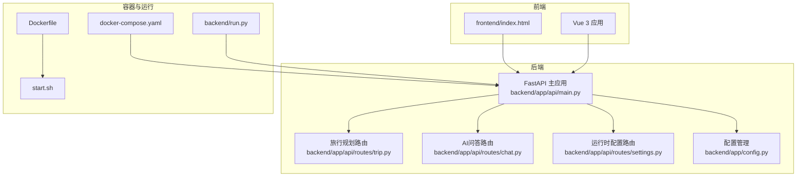
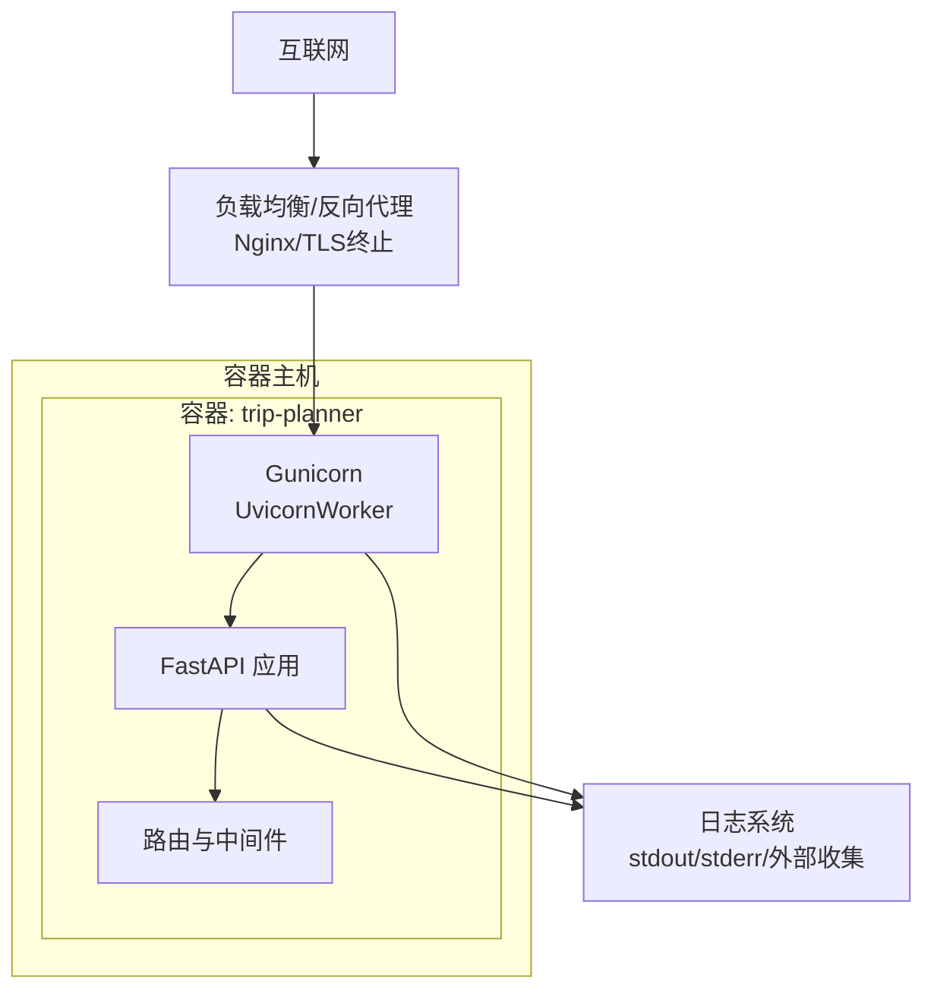
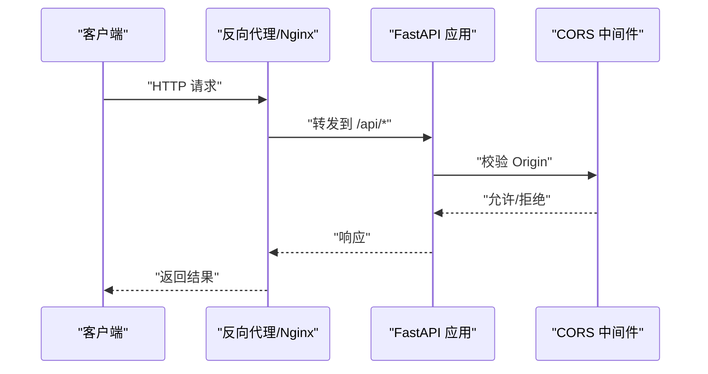
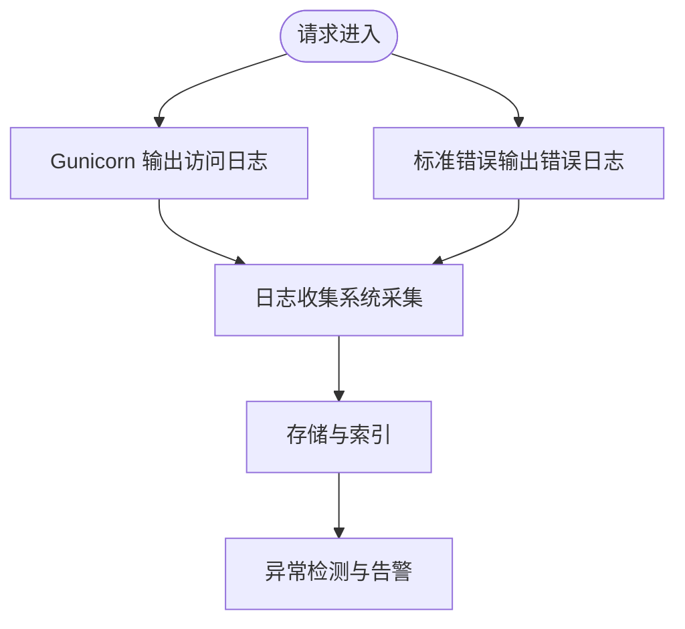
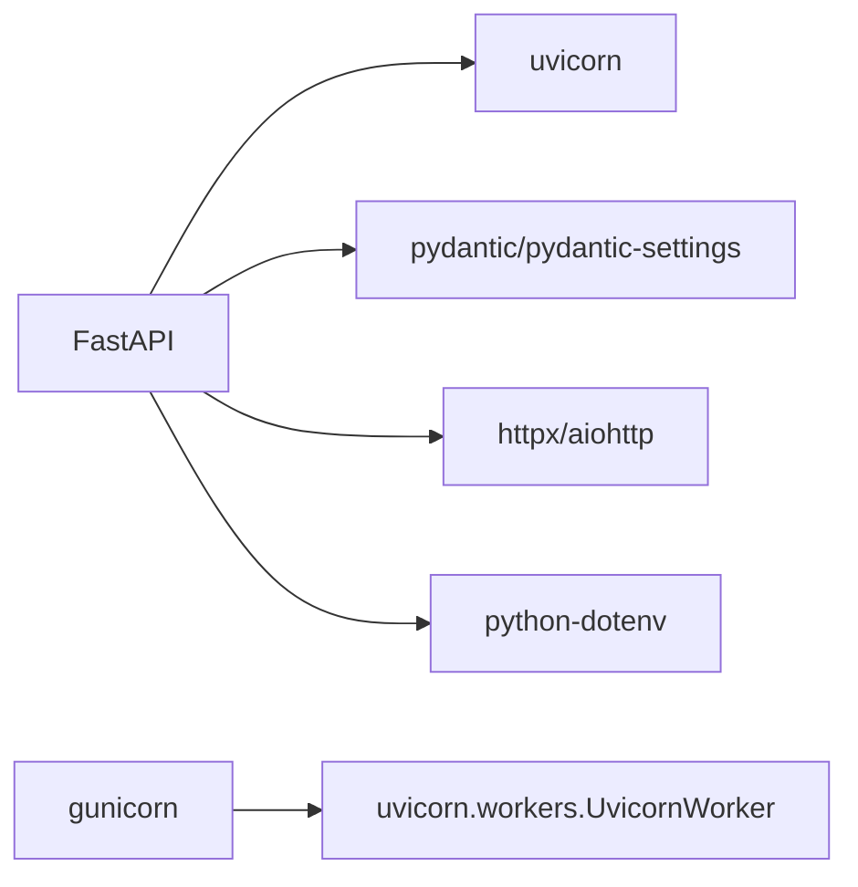

# 安全配置最佳实践

<cite>
**本文档引用的文件**
- [README.md](file://README.md)
- [Dockerfile](file://Dockerfile)
- [docker-compose.yaml](file://docker-compose.yaml)
- [start.sh](file://start.sh)
- [backend/app/config.py](file://backend/app/config.py)
- [backend/run.py](file://backend/run.py)
- [backend/app/api/main.py](file://backend/app/api/main.py)
- [backend/app/api/routes/trip.py](file://backend/app/api/routes/trip.py)
- [backend/app/api/routes/chat.py](file://backend/app/api/routes/chat.py)
- [backend/app/api/routes/settings.py](file://backend/app/api/routes/settings.py)
- [backend/app/models/schemas.py](file://backend/app/models/schemas.py)
- [frontend/index.html](file://frontend/index.html)
- [backend/requirements.txt](file://backend/requirements.txt)
</cite>

## 目录
1. [简介](#简介)
2. [项目结构](#项目结构)
3. [核心组件](#核心组件)
4. [架构总览](#架构总览)
5. [详细组件分析](#详细组件分析)
6. [依赖分析](#依赖分析)
7. [性能考虑](#性能考虑)
8. [故障排除指南](#故障排除指南)
9. [结论](#结论)
10. [附录](#附录)

## 简介
本指南面向生产环境的安全配置，结合 TripStar 项目的实际代码结构，提供从网络边界、访问控制、数据加密、安全审计到应用与容器安全的全栈最佳实践。文档同时给出与代码映射的架构图与流程图，帮助读者快速定位配置点并落地实施。

## 项目结构
TripStar 采用前后端分离架构，后端基于 FastAPI，前端基于 Vue 3，容器化部署通过 Docker 与 docker-compose 编排。生产部署默认监听 0.0.0.0:7860，通过 Nginx 或反向代理暴露对外服务。

**图表来源**
- [backend/app/api/main.py:24-60](file://backend/app/api/main.py#L24-L60)
- [backend/app/api/routes/trip.py:17-20](file://backend/app/api/routes/trip.py#L17-L20)
- [backend/app/api/routes/chat.py:7-15](file://backend/app/api/routes/chat.py#L7-L15)
- [backend/app/api/routes/settings.py:13-25](file://backend/app/api/routes/settings.py#L13-L25)
- [backend/app/config.py:21-67](file://backend/app/config.py#L21-L67)
- [Dockerfile:29-63](file://Dockerfile#L29-L63)
- [docker-compose.yaml:4-23](file://docker-compose.yaml#L4-L23)
- [start.sh:13-19](file://start.sh#L13-L19)
- [backend/run.py:6-15](file://backend/run.py#L6-L15)

**章节来源**
- [README.md:129-200](file://README.md#L129-L200)
- [Dockerfile:1-64](file://Dockerfile#L1-L64)
- [docker-compose.yaml:1-24](file://docker-compose.yaml#L1-L24)
- [backend/app/api/main.py:24-60](file://backend/app/api/main.py#L24-L60)

## 核心组件
- 配置管理：集中管理运行时配置与敏感参数，支持持久化覆盖与热更新。
- API 网关：统一注册路由、CORS 中间件、代理路径修正中间件。
- 任务系统：旅行规划采用异步任务+WebSocket/轮询双通道，具备持久化与状态广播。
- 运行时配置接口：允许前端安全地更新部分运行时参数并触发服务组件重置。
- 容器与进程：Gunicorn + Uvicorn Worker，统一访问日志与错误日志输出。

**章节来源**
- [backend/app/config.py:21-160](file://backend/app/config.py#L21-L160)
- [backend/app/api/main.py:33-60](file://backend/app/api/main.py#L33-L60)
- [backend/app/api/routes/trip.py:276-312](file://backend/app/api/routes/trip.py#L276-L312)
- [backend/app/api/routes/settings.py:37-55](file://backend/app/api/routes/settings.py#L37-L55)
- [start.sh:13-19](file://start.sh#L13-L19)

## 架构总览
下图展示了生产环境的典型网络拓扑与安全边界，包括反向代理、后端服务、容器隔离与日志采集。

**图表来源**
- [start.sh:13-19](file://start.sh#L13-L19)
- [backend/app/api/main.py:24-60](file://backend/app/api/main.py#L24-L60)

## 详细组件分析

### 防火墙与网络访问控制
- 本项目容器暴露端口 7860，建议仅在内网或通过反向代理暴露到公网。
- 建议在宿主机或云平台安全组中仅开放反向代理端口（如 443/80），后端服务仅监听 127.0.0.1 或内部网络。
- 如需 iptables/ufw，建议仅放行反向代理与监控端口，拒绝其余入站连接。

**章节来源**
- [docker-compose.yaml:11-12](file://docker-compose.yaml#L11-L12)
- [Dockerfile:61](file://Dockerfile#L61)

### 访问控制与身份认证
- CORS 配置：允许指定来源，建议生产环境限定为前端域名。
- 代理路径修正中间件：解决云厂商或反代在路径前缀拼接导致的 API 访问问题。
- 运行时配置接口：提供安全更新能力，但不包含鉴权逻辑，建议配合反向代理或网关进行鉴权与速率限制。

**图表来源**
- [backend/app/api/main.py:33-60](file://backend/app/api/main.py#L33-L60)

**章节来源**
- [backend/app/api/main.py:46-53](file://backend/app/api/main.py#L46-L53)
- [backend/app/api/main.py:33-44](file://backend/app/api/main.py#L33-L44)

### 数据加密与密钥管理
- 传输层加密：通过反向代理启用 TLS 终止，确保客户端与代理之间的 HTTPS。
- 存储层加密：建议对敏感配置文件与任务持久化目录启用磁盘加密。
- 密钥管理：后端通过环境变量注入 LLM、高德地图、小红书 Cookie 等密钥；建议使用密钥管理服务（KMS）与只读挂载。
- 加密算法：建议使用业界标准算法（如 AES-256、RSA-2048+），并与密钥轮换策略配套。

**章节来源**
- [backend/app/config.py:44-55](file://backend/app/config.py#L44-L55)
- [backend/app/config.py:74-80](file://backend/app/config.py#L74-L80)
- [docker-compose.yaml:13-22](file://docker-compose.yaml#L13-L22)

### 安全审计与日志
- 访问日志：Gunicorn 已将访问日志输出到标准输出，建议对接日志收集系统（如 Fluentd/Fluent Bit/Vector）统一采集。
- 错误日志：同样输出到标准错误，便于集中告警。
- 操作审计：建议在 API 层增加审计日志（如用户、IP、时间戳、请求路径、状态码）并落库或发送到 SIEM。

**图表来源**
- [start.sh:18-19](file://start.sh#L18-L19)

**章节来源**
- [start.sh:18-19](file://start.sh#L18-L19)

### 应用安全配置
- CSRF 防护：当前未见专用 CSRF 中间件，建议在反向代理或网关层启用 Referer/Origin 校验，或引入专门中间件。
- XSS 防护：前端模板与渲染由 Vue 管理，建议开启 Content-Security-Policy（CSP），限制脚本来源与内联脚本。
- SQL 注入防护：后端未直接使用原生 SQL，主要依赖第三方服务与 HTTP 客户端，建议对所有外部请求进行参数校验与限流。
- 文件上传安全：当前未见文件上传接口，若后续新增，建议限制文件类型、大小与存储路径，并进行病毒扫描。

**章节来源**
- [frontend/index.html:17-21](file://frontend/index.html#L17-L21)

### 容器安全配置
- 镜像扫描：建议在 CI 中集成镜像扫描（Trivy/Snyk），扫描基础镜像与依赖漏洞。
- 运行时安全：使用只读根文件系统、丢弃不必要的 Linux 能力、以非 root 用户运行（如需）。
- 网络安全：容器网络与主机网络隔离，仅暴露必要端口；启用容器网络策略（NetworkPolicy）。
- 权限最小化：挂载卷仅授予必要权限，避免敏感密钥明文写入卷。

**章节来源**
- [Dockerfile:29-51](file://Dockerfile#L29-L51)
- [docker-compose.yaml:4-23](file://docker-compose.yaml#L4-L23)

### 安全更新与补丁管理
- 定期安全扫描：CI 集成依赖与镜像扫描，发现漏洞及时修复。
- 漏洞修复：建立补丁发布流程，优先修复高危漏洞；对第三方依赖进行版本锁定与升级。
- 安全基线维护：容器基础镜像与系统基线定期更新，遵循最小化原则。

**章节来源**
- [backend/requirements.txt:1-18](file://backend/requirements.txt#L1-L18)

## 依赖分析
后端依赖以 FastAPI 为核心，结合异步任务与外部服务调用。安全相关的关键依赖包括 CORS、Uvicorn/Gunicorn、Python-dotenv、Pydantic/Settings 等。

**图表来源**
- [backend/requirements.txt:2-17](file://backend/requirements.txt#L2-L17)
- [start.sh:13-16](file://start.sh#L13-L16)

**章节来源**
- [backend/requirements.txt:1-18](file://backend/requirements.txt#L1-L18)

## 性能考虑
- 任务持久化与状态广播：旅行规划任务采用内存+磁盘持久化，避免服务重启丢失状态。
- WebSocket 与轮询：双通道兼容，降低前端复杂度，提升用户体验。
- 超时与并发：Gunicorn 超时配置为 600 秒，适合长任务；建议结合限流与队列策略。

**章节来源**
- [backend/app/api/routes/trip.py:82-104](file://backend/app/api/routes/trip.py#L82-L104)
- [backend/app/api/routes/trip.py:390-440](file://backend/app/api/routes/trip.py#L390-L440)
- [start.sh:17](file://start.sh#L17)

## 故障排除指南
- 配置验证失败：检查环境变量是否正确注入，确认 .env 或容器环境变量。
- CORS 跨域问题：核对 CORS 允许来源列表，确保与前端域名一致。
- 代理路径异常：确认反向代理未在路径前缀拼接动态 ID，或依赖路径修正中间件。
- 运行时配置更新无效：确认 settings 接口已调用且触发了相关服务重置。

**章节来源**
- [backend/app/config.py:163-179](file://backend/app/config.py#L163-L179)
- [backend/app/api/main.py:46-53](file://backend/app/api/main.py#L46-L53)
- [backend/app/api/main.py:33-44](file://backend/app/api/main.py#L33-L44)
- [backend/app/api/routes/settings.py:37-55](file://backend/app/api/routes/settings.py#L37-L55)

## 结论
本指南基于 TripStar 代码库梳理了生产环境安全配置的关键要点：网络边界控制、访问控制、数据与密钥保护、安全审计、应用与容器安全，以及持续的安全更新流程。建议结合企业安全策略与合规要求，逐步完善并落地各项措施。

## 附录
- 高德地图安全密钥：前端入口文件中预设安全密钥字段，需在部署时替换为有效值。
- LLM 与第三方服务：通过环境变量注入密钥，建议使用只读挂载与密钥轮换。

**章节来源**
- [frontend/index.html:18-20](file://frontend/index.html#L18-L20)
- [backend/app/config.py:44-55](file://backend/app/config.py#L44-L55)