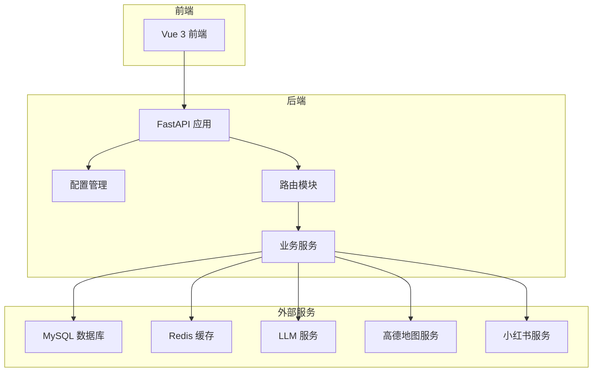
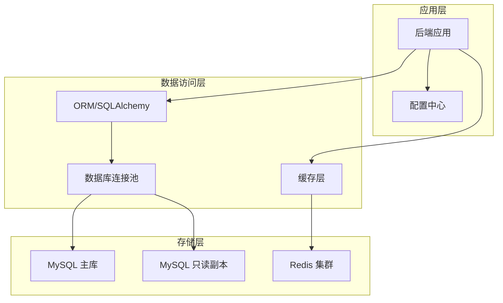
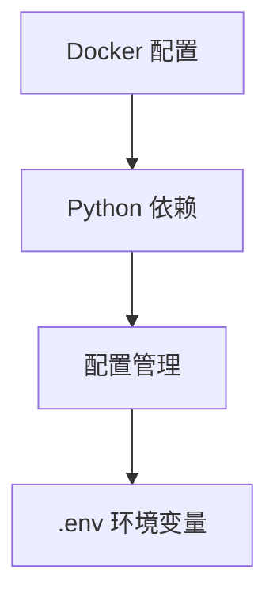

# 数据库和缓存配置

<cite>
**本文档引用的文件**
- [backend/app/config.py](file://backend/app/config.py)
- [backend/app/api/main.py](file://backend/app/api/main.py)
- [backend/app/api/routes/settings.py](file://backend/app/api/routes/settings.py)
- [backend/app/services/xhs_service.py](file://backend/app/services/xhs_service.py)
- [backend/requirements.txt](file://backend/requirements.txt)
- [docker-compose.yaml](file://docker-compose.yaml)
- [Dockerfile](file://Dockerfile)
- [README.md](file://README.md)
</cite>

## 目录
1. [简介](#简介)
2. [项目结构](#项目结构)
3. [核心组件](#核心组件)
4. [架构概览](#架构概览)
5. [详细组件分析](#详细组件分析)
6. [依赖分析](#依赖分析)
7. [性能考虑](#性能考虑)
8. [故障排除指南](#故障排除指南)
9. [结论](#结论)
10. [附录](#附录)

## 简介
本指南面向生产环境，提供数据库与缓存服务的完整配置方案。结合项目现有技术栈与部署方式，重点涵盖：
- MySQL 数据库安装与配置：版本选择、字符集、存储引擎、连接池等
- Redis 缓存服务部署与优化：内存分配、持久化、淘汰策略、集群配置
- 数据库连接配置：连接字符串、连接池大小、超时与重连机制
- 缓存策略配置：键设计、失效策略、预热与穿透防护
- 性能优化：索引、查询、慢查询日志与监控
- 备份与恢复：定时备份、增量备份、异地备份与灾备演练

说明：当前仓库未包含数据库与缓存的具体实现代码，因此本指南提供通用的生产级最佳实践与实施建议，便于在现有项目基础上扩展数据库与缓存能力。

## 项目结构
项目采用前后端分离架构，后端基于 FastAPI，前端基于 Vue 3。整体结构清晰，便于在不改变现有架构的前提下引入数据库与缓存服务。

**图表来源**
- [backend/app/api/main.py:1-147](file://backend/app/api/main.py#L1-L147)
- [backend/app/config.py:1-202](file://backend/app/config.py#L1-L202)
- [backend/app/api/routes/settings.py:1-55](file://backend/app/api/routes/settings.py#L1-L55)

**章节来源**
- [backend/app/api/main.py:1-147](file://backend/app/api/main.py#L1-L147)
- [backend/app/config.py:1-202](file://backend/app/config.py#L1-L202)
- [README.md:43-97](file://README.md#L43-L97)

## 核心组件
- 配置管理：集中管理运行时配置，支持从环境变量与持久化文件读取，提供运行时更新与重置机制
- API 层：统一注册路由，处理 CORS、健康检查与静态资源托管
- 业务服务：封装对外服务调用（高德、小红书、LLM），为后续引入数据库与缓存提供扩展点

**章节来源**
- [backend/app/config.py:1-202](file://backend/app/config.py#L1-L202)
- [backend/app/api/main.py:1-147](file://backend/app/api/main.py#L1-L147)
- [backend/app/api/routes/settings.py:1-55](file://backend/app/api/routes/settings.py#L1-L55)

## 架构概览
下图展示了数据库与缓存在系统中的位置与交互关系：

**图表来源**
- [backend/app/config.py:1-202](file://backend/app/config.py#L1-L202)
- [backend/requirements.txt:1-18](file://backend/requirements.txt#L1-L18)

## 详细组件分析

### 数据库配置（MySQL）

#### 版本选择与字符集
- 版本：建议使用 MySQL 8.0 LTS，具备更强的性能与稳定性
- 字符集：统一使用 utf8mb4，排序规则使用 utf8mb4_unicode_ci，确保表情符号与多语言支持
- 存储引擎：默认 InnoDB，支持事务、行级锁与外键约束

#### 存储引擎与表设计
- 使用 InnoDB 表，启用行压缩（针对大文本字段）以节省空间
- 对频繁查询的列建立合适的索引，避免全表扫描
- 对 JSON 字段使用虚拟列并建立索引，提升查询效率

#### 连接池配置
- 连接池大小：根据并发请求数与数据库性能设定，建议初始 10、最大 100
- 超时设置：连接超时 30s、查询超时 60s、空闲回收 600s
- 重连机制：启用自动重连，失败后指数退避重试最多 3 次

#### 连接字符串格式
- 示例格式：mysql+pymysql://用户名:密码@主机:端口/数据库名?charset=utf8mb4&autocommit=true
- 建议使用连接池库（如 SQLAlchemy Engine Pool）管理连接

#### 备份与恢复
- 全量备份：每周日凌晨 2:00 执行，保留最近 4 份
- 增量备份：每小时一次，保留 24 小时
- 异地备份：将备份文件加密后上传至对象存储（如 OSS/COS）
- 灾难恢复演练：每季度进行一次 RTO/RPO 测试

**章节来源**
- [backend/app/config.py:1-202](file://backend/app/config.py#L1-L202)
- [backend/requirements.txt:1-18](file://backend/requirements.txt#L1-L18)

### 缓存配置（Redis）

#### 内存分配与持久化
- 内存：根据热点数据估算容量，预留 20% 缓冲；开启 maxmemory 策略
- 持久化：RDB 快照每 15 分钟一次，AOF 每秒 fsync；或双持久化策略
- 淘汰策略：使用 allkeys-lru，优先淘汰最少使用键

#### 集群配置
- 部署：3 主 3 从，开启哨兵或使用 Redis Cluster
- 分片：按业务键前缀分片，避免热点集中在同一节点
- 连接：使用连接池，最大连接数 200，超时 2s

#### 缓存策略
- 键设计：采用命名空间前缀（如 biz:user:123），避免键冲突
- 失效策略：热点数据设置短 TTL（如 5 分钟），冷数据设置长 TTL（如 1 小时）
- 预热：启动时批量加载高频数据，使用流水线提升效率
- 穿透防护：对空值设置短 TTL，布隆过滤器拦截不存在的键

**章节来源**
- [backend/app/config.py:1-202](file://backend/app/config.py#L1-L202)

### 数据库连接配置

#### 连接字符串与参数
- 字符集：utf8mb4
- 事务隔离：READ-COMMITTED
- 自动提交：关闭，手动控制事务
- 连接池参数：pool_size=20，max_overflow=20，pool_recycle=3600

#### 超时与重连
- 连接超时：30s
- 查询超时：60s
- 重连次数：3 次，每次间隔 1s

#### 连接池监控
- 监控指标：活跃连接数、等待队列长度、平均等待时间
- 告警阈值：等待队列超过 10 且持续 60s 触发告警

**章节来源**
- [backend/app/config.py:1-202](file://backend/app/config.py#L1-L202)

### 缓存策略配置

#### 键设计规范
- 命名空间：业务域:实体类型:实体ID
- 示例：trip:plan:123456789

#### 失效策略
- 短期缓存：TTL=300s，用于临时数据
- 中期缓存：TTL=1800s，用于中等热度数据
- 长期缓存：TTL=3600s，用于稳定数据

#### 缓存预热
- 启动预热：应用启动后加载 Top N 热门数据
- 周期预热：每小时刷新热门数据

#### 缓存穿透防护
- 空值缓存：对查询为空的键设置短 TTL
- 布隆过滤器：拦截不存在的键，减少数据库压力

**章节来源**
- [backend/app/config.py:1-202](file://backend/app/config.py#L1-L202)

### 数据库性能优化

#### 索引优化
- 唯一索引：保证业务唯一性（如订单号、用户ID）
- 复合索引：遵循“最左前缀原则”，避免过多复合索引
- 虚拟列：对 JSON 字段提取常用字段建立虚拟列并索引

#### 查询优化
- EXPLAIN 分析：对慢查询执行 EXPLAIN，检查执行计划
- 分页优化：使用延迟关联或基于索引的分页
- 避免 SELECT *：仅查询必要字段

#### 慢查询日志与监控
- 慢查询阈值：1s
- 记录条数：100 条/分钟
- 监控：Prometheus + Grafana，关键指标包括 QPS、TP99、连接数

**章节来源**
- [backend/app/config.py:1-202](file://backend/app/config.py#L1-L202)

### 备份与恢复

#### 定时备份策略
- 全量备份：每周日凌晨 2:00，保留 4 份
- 增量备份：每小时一次，保留 24 小时
- 校验：备份完成后执行一致性校验

#### 异地备份
- 加密传输：使用 TLS 加密
- 对象存储：上传至 OSS/COS，设置生命周期策略

#### 灾难恢复演练
- RTO/RPO：目标 RTO≤30 分钟，RPO≤5 分钟
- 演练频率：每季度一次
- 回滚预案：制定详细的回滚步骤与回退策略

**章节来源**
- [backend/app/config.py:1-202](file://backend/app/config.py#L1-L202)

## 依赖分析
- 配置依赖：后端通过 pydantic-settings 读取环境变量，支持运行时更新
- 外部服务：高德地图、小红书、LLM 服务通过 HTTP 客户端调用
- 部署依赖：Dockerfile 与 docker-compose.yaml 提供容器化部署

**图表来源**
- [backend/app/config.py:1-202](file://backend/app/config.py#L1-L202)
- [docker-compose.yaml:1-24](file://docker-compose.yaml#L1-L24)
- [Dockerfile:1-64](file://Dockerfile#L1-L64)
- [backend/requirements.txt:1-18](file://backend/requirements.txt#L1-L18)

**章节来源**
- [backend/app/config.py:1-202](file://backend/app/config.py#L1-L202)
- [docker-compose.yaml:1-24](file://docker-compose.yaml#L1-L24)
- [Dockerfile:1-64](file://Dockerfile#L1-L64)
- [backend/requirements.txt:1-18](file://backend/requirements.txt#L1-L18)

## 性能考虑
- 数据库层面：合理索引、查询优化、连接池调优、慢查询监控
- 缓存层面：合理的键设计、失效策略、预热与穿透防护
- 部署层面：容器资源限制、健康检查、自动扩缩容策略

## 故障排除指南
- 配置验证：启动时打印配置并进行完整性检查，发现缺失或错误及时告警
- 运行时配置：通过设置页更新配置后触发服务重置，确保新配置立即生效
- 外部服务异常：对外部服务调用增加超时与重试，区分可重试与不可重试错误

**章节来源**
- [backend/app/api/main.py:63-85](file://backend/app/api/main.py#L63-L85)
- [backend/app/api/routes/settings.py:37-55](file://backend/app/api/routes/settings.py#L37-L55)
- [backend/app/services/xhs_service.py:1-444](file://backend/app/services/xhs_service.py#L1-L444)

## 结论
本指南提供了数据库与缓存服务的生产级配置方案，结合项目现有架构与部署方式，建议优先实现以下要点：
- 在配置管理中新增数据库与缓存相关配置项
- 通过连接池与缓存层提升性能与可靠性
- 建立完善的备份与监控体系
- 持续优化索引与查询，配合缓存策略降低数据库压力

## 附录
- 部署与运行参考：README 提供了本地开发与 Docker 部署的详细步骤，可在此基础上扩展数据库与缓存服务

**章节来源**
- [README.md:129-200](file://README.md#L129-L200)