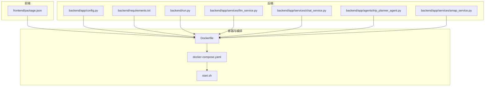
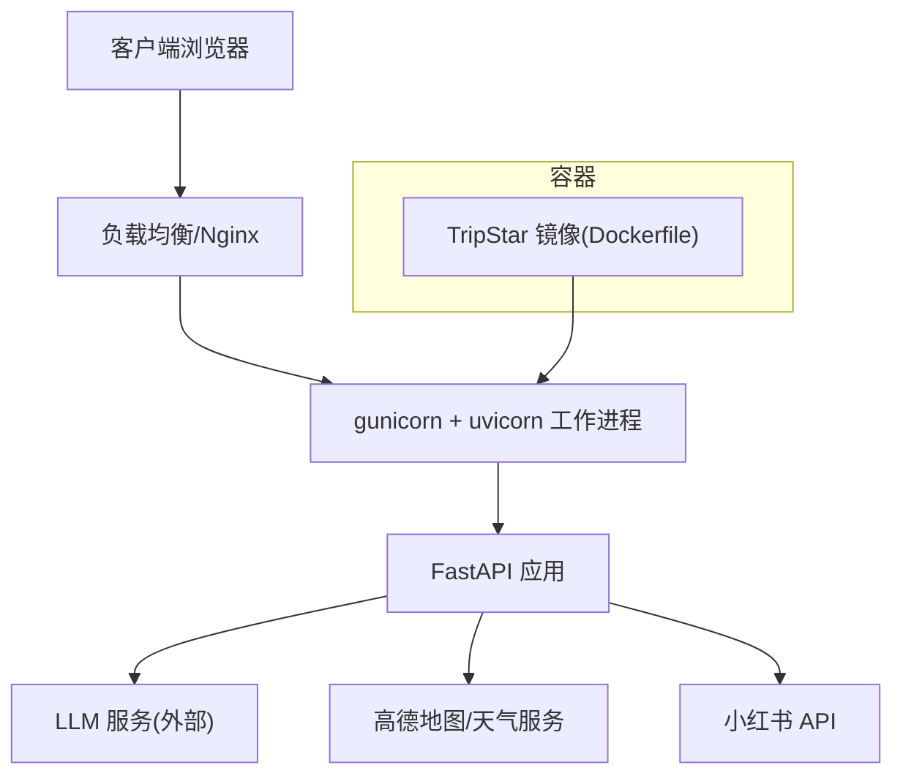
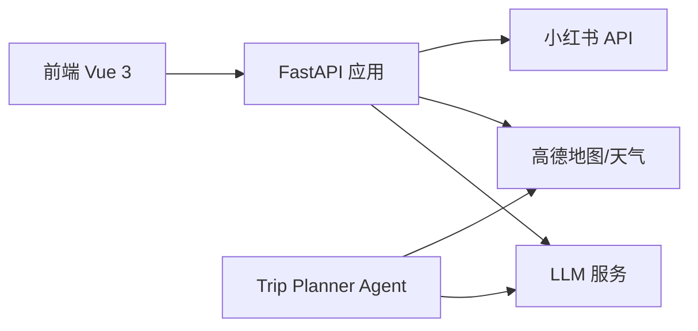

# 服务器硬件配置

<cite>
**本文引用的文件**
- [README.md](file://README.md)
- [Dockerfile](file://Dockerfile)
- [docker-compose.yaml](file://docker-compose.yaml)
- [start.sh](file://start.sh)
- [backend/app/config.py](file://backend/app/config.py)
- [backend/requirements.txt](file://backend/requirements.txt)
- [backend/run.py](file://backend/run.py)
- [backend/app/services/llm_service.py](file://backend/app/services/llm_service.py)
- [backend/app/services/chat_service.py](file://backend/app/services/chat_service.py)
- [backend/app/agents/trip_planner_agent.py](file://backend/app/agents/trip_planner_agent.py)
- [backend/app/services/amap_service.py](file://backend/app/services/amap_service.py)
- [frontend/package.json](file://frontend/package.json)
</cite>

## 目录
1. [简介](#简介)
2. [项目结构](#项目结构)
3. [核心组件](#核心组件)
4. [架构总览](#架构总览)
5. [详细组件分析](#详细组件分析)
6. [依赖分析](#依赖分析)
7. [性能考量](#性能考量)
8. [故障排查指南](#故障排查指南)
9. [结论](#结论)
10. [附录](#附录)

## 简介
本指南面向在生产环境中部署 TripStar 项目的运维与平台工程团队，围绕服务器硬件规格、操作系统选择、性能监控指标、以及高可用与冗余方案给出系统性的建议。结合项目采用的前后端分离架构、FastAPI 服务、异步任务与多智能体协作流程，以及对外部服务（高德地图、LLM 服务、小红书）的依赖，本指南将给出不同负载规模下的硬件建议与实施要点。

## 项目结构
TripStar 采用前后端分离架构，后端基于 FastAPI，前端基于 Vue 3，整体通过 Docker 容器化交付。生产运行时通过 gunicorn + uvicorn 工作进程承载服务，容器暴露固定端口并在 compose 中映射到宿主机。

**图表来源**
- [Dockerfile:1-64](file://Dockerfile#L1-L64)
- [docker-compose.yaml:1-24](file://docker-compose.yaml#L1-L24)
- [start.sh:1-20](file://start.sh#L1-L20)
- [backend/app/config.py:1-202](file://backend/app/config.py#L1-L202)
- [backend/requirements.txt:1-18](file://backend/requirements.txt#L1-L18)
- [backend/run.py:1-17](file://backend/run.py#L1-L17)
- [backend/app/services/llm_service.py:1-75](file://backend/app/services/llm_service.py#L1-L75)
- [backend/app/services/chat_service.py:1-133](file://backend/app/services/chat_service.py#L1-L133)
- [backend/app/agents/trip_planner_agent.py:1-826](file://backend/app/agents/trip_planner_agent.py#L1-L826)
- [backend/app/services/amap_service.py:1-200](file://backend/app/services/amap_service.py#L1-L200)
- [frontend/package.json:1-35](file://frontend/package.json#L1-L35)

**章节来源**
- [README.md:129-149](file://README.md#L129-L149)
- [Dockerfile:1-64](file://Dockerfile#L1-L64)
- [docker-compose.yaml:1-24](file://docker-compose.yaml#L1-L24)
- [start.sh:1-20](file://start.sh#L1-L20)

## 核心组件
- 服务端口与运行方式
  - 容器内服务监听地址与端口由环境变量控制，compose 将容器 7860 端口映射到宿主机。
  - 启动脚本使用 gunicorn + uvicorn 工作进程承载服务，支持超时与日志配置。
- 配置管理
  - 后端通过 pydantic-settings 读取环境变量，支持运行时覆盖与持久化。
  - LLM 服务、高德地图、小红书 Cookie 等关键配置通过环境变量注入。
- 依赖与运行时
  - Python 3.10、Node.js 18、FastAPI、uvicorn、gunicorn、hello-agents 等。
  - 前端构建参数注入高德 JS API Key，后端容器内安装 Node.js 以执行小红书签名脚本。

**章节来源**
- [docker-compose.yaml:1-24](file://docker-compose.yaml#L1-L24)
- [start.sh:1-20](file://start.sh#L1-L20)
- [backend/app/config.py:1-202](file://backend/app/config.py#L1-L202)
- [backend/requirements.txt:1-18](file://backend/requirements.txt#L1-L18)
- [backend/app/services/llm_service.py:1-75](file://backend/app/services/llm_service.py#L1-L75)
- [backend/app/services/chat_service.py:1-133](file://backend/app/services/chat_service.py#L1-L133)
- [frontend/package.json:1-35](file://frontend/package.json#L1-L35)

## 架构总览
下图展示了生产环境的典型部署形态：单机容器或集群容器，前置 Nginx/负载均衡，后端由 gunicorn + uvicorn 承载，外部依赖高德地图、天气服务、LLM 服务与小红书 API。

**图表来源**
- [Dockerfile:1-64](file://Dockerfile#L1-L64)
- [docker-compose.yaml:1-24](file://docker-compose.yaml#L1-L24)
- [start.sh:1-20](file://start.sh#L1-L20)
- [backend/app/services/llm_service.py:1-75](file://backend/app/services/llm_service.py#L1-L75)
- [backend/app/services/amap_service.py:1-200](file://backend/app/services/amap_service.py#L1-L200)

## 详细组件分析

### 服务端口与运行参数
- 端口绑定
  - 容器内默认绑定 0.0.0.0:7860，compose 映射至宿主机端口。
- 启动参数
  - gunicorn 工作进程数、超时、日志等参数在启动脚本中集中配置。
- 环境变量
  - HOST、PORT、LLM_*、VITE_AMAP_*、XHS_COOKIE 等通过 compose 注入。

**章节来源**
- [docker-compose.yaml:1-24](file://docker-compose.yaml#L1-L24)
- [start.sh:1-20](file://start.sh#L1-L20)
- [backend/app/config.py:1-202](file://backend/app/config.py#L1-L202)

### 配置与依赖
- 配置来源
  - 优先级：运行时覆盖文件 > 环境变量；支持 CORS、日志级别、高德与小红书密钥等。
- 依赖清单
  - FastAPI、uvicorn、pydantic、hello-agents、httpx/aiohttp、loguru、amap-mcp-server、huggingface_hub 等。
- 前端构建
  - 通过 VITE_* 变量注入高德 JS Key，构建产物复制进最终镜像。

**章节来源**
- [backend/app/config.py:1-202](file://backend/app/config.py#L1-L202)
- [backend/requirements.txt:1-18](file://backend/requirements.txt#L1-L18)
- [frontend/package.json:1-35](file://frontend/package.json#L1-L35)
- [Dockerfile:1-64](file://Dockerfile#L1-L64)

### LLM 与超时策略
- LLM 初始化
  - 从环境变量读取 API Key、Base URL、Model ID，并设置超时。
  - 为规避第三方 WAF/Cloudflare 拦截，注入浏览器 UA。
- 对话服务
  - 通过 httpx AsyncClient 发起请求，统一超时控制。
- 规划 Agent
  - 旅行规划阶段使用更长超时并允许一次重试，避免因 LLM 输出截断或超时导致失败。

**章节来源**
- [backend/app/services/llm_service.py:1-75](file://backend/app/services/llm_service.py#L1-L75)
- [backend/app/services/chat_service.py:1-133](file://backend/app/services/chat_service.py#L1-L133)
- [backend/app/agents/trip_planner_agent.py:350-420](file://backend/app/agents/trip_planner_agent.py#L350-L420)

### 高德地图与天气服务
- 天气查询
  - 通过 amap-mcp-server 工具调用天气接口，返回解析占位，便于后续完善。
- 路线规划
  - 支持步行/驾车/公交等多种路线类型，参数化传入起点、终点与城市。

**章节来源**
- [backend/app/services/amap_service.py:90-160](file://backend/app/services/amap_service.py#L90-L160)

### 容器化与编排
- 多阶段构建
  - 前端使用 Node 18 slim 构建，后端使用 Python 3.10 slim，安装 gunicorn/uvicorn 与 amap-mcp-server。
- 运行时
  - CMD 执行启动脚本，容器暴露 7860 端口，compose 映射到宿主机。

**章节来源**
- [Dockerfile:1-64](file://Dockerfile#L1-L64)
- [docker-compose.yaml:1-24](file://docker-compose.yaml#L1-L24)

## 依赖分析
- 外部依赖
  - LLM 服务（OpenAI 兼容）、高德地图 MCP 服务、小红书 API（需 Cookie）。
- 内部耦合
  - FastAPI 路由依赖 LLM 与地图服务；Agent 层负责编排与超时重试；前端通过 API 获取 POI 图片与聊天问答。

**图表来源**
- [backend/app/services/llm_service.py:1-75](file://backend/app/services/llm_service.py#L1-L75)
- [backend/app/services/amap_service.py:1-200](file://backend/app/services/amap_service.py#L1-L200)
- [backend/app/agents/trip_planner_agent.py:1-826](file://backend/app/agents/trip_planner_agent.py#L1-L826)
- [frontend/package.json:1-35](file://frontend/package.json#L1-L35)

**章节来源**
- [backend/app/services/llm_service.py:1-75](file://backend/app/services/llm_service.py#L1-L75)
- [backend/app/services/amap_service.py:1-200](file://backend/app/services/amap_service.py#L1-L200)
- [backend/app/agents/trip_planner_agent.py:1-826](file://backend/app/agents/trip_planner_agent.py#L1-L826)
- [frontend/package.json:1-35](file://frontend/package.json#L1-L35)

## 性能考量

### 生产环境最低硬件规格建议
- CPU
  - 单实例最小建议：4 核（2GHz+）；推荐 8 核以上，以应对并发与 LLM 推理开销。
- 内存
  - 单实例最小建议：8 GB；推荐 16 GB，保障 gunicorn 工作进程与 LLM 推理缓存。
- 存储
  - 系统盘：50 GB SSD（含系统、容器镜像、日志）；数据盘按日志与缓存需求评估。
- 网络
  - 上下行带宽建议：100 Mbps 以上；低延迟至 LLM 与地图服务提供商。

### 不同负载场景的推荐配置
- 小规模部署（单实例，低并发）
  - CPU：4 核；内存：8 GB；存储：50 GB SSD；网络：100 Mbps。
- 中等规模部署（多实例，中等并发）
  - CPU：8 核；内存：16 GB；存储：100 GB SSD；网络：500 Mbps。
- 大规模部署（多实例 + 负载均衡，高并发）
  - CPU：16 核+；内存：32 GB+；存储：200 GB+ SSD；网络：1 Gbps+。

### 硬件性能监控指标
- CPU
  - 使用率、上下文切换、中断；关注 gunicorn 工作进程的 CPU 分布。
- 内存
  - 物理内存使用率、交换分区使用情况、Python 进程 RSS。
- 磁盘 I/O
  - 读写吞吐、队列长度、IOPS；关注日志与缓存目录。
- 网络
  - 连接数、带宽利用率、RTT；重点监控 LLM 与地图服务的往返时延。
- 应用层指标
  - QPS、P95/P99 延迟、错误率、超时率；gunicorn 访问日志与错误日志。

### 操作系统与发行版
- 推荐
  - Ubuntu 20.04/22.04 LTS、CentOS Stream 9、Debian 12。
- 要点
  - 确保内核支持 systemd、容器运行时（Docker/Podman）与必要系统工具。
  - 时区与 NTP 配置一致，避免证书与时间相关问题。

### 高可用与冗余
- 双机热备
  - 使用 keepalived + LVS/HAProxy 实现 VIP 高可用；数据库/缓存建议使用主从或托管服务。
- 负载均衡
  - Nginx/HAProxy/云负载均衡器分发请求至多实例 gunicorn。
- 故障转移
  - 健康检查与自动重启（restart 策略）；容器编排中设置优雅退出与超时。
- 存储与日志
  - 日志集中采集（如 Fluent Bit/Fluentd）与远端存储；重要数据定期备份。

## 故障排查指南
- LLM 调用失败
  - 检查 API Key、Base URL、Model ID 是否正确；确认超时设置合理；观察第三方 WAF/Cloudflare 拦截。
- 高德地图/天气接口异常
  - 核对 Web 服务 Key 与 JS API Key；确认 amap-mcp-server 可用；检查网络连通性。
- 小红书 Cookie 失效
  - 更新 Cookie；确认签名脚本可用；检查 UA 与风控策略变化。
- gunicorn 启动与超时
  - 检查 HOST/PORT、工作进程数、超时参数；查看访问/错误日志定位慢请求。
- 前后端联调
  - 确认 CORS 配置；检查 VITE_API_BASE_URL 与同源策略；验证高德 JS Key 注入。

**章节来源**
- [backend/app/services/llm_service.py:1-75](file://backend/app/services/llm_service.py#L1-L75)
- [backend/app/services/chat_service.py:1-133](file://backend/app/services/chat_service.py#L1-L133)
- [backend/app/services/amap_service.py:1-200](file://backend/app/services/amap_service.py#L1-L200)
- [backend/app/config.py:1-202](file://backend/app/config.py#L1-L202)
- [start.sh:1-20](file://start.sh#L1-L20)

## 结论
TripStar 的生产部署应以“容器化 + 负载均衡 + 外部服务依赖”为核心，结合不同业务负载选择合适的 CPU/内存/存储与网络规格。通过合理的超时与重试策略、完善的监控与告警体系，以及高可用与冗余方案，可稳定支撑多智能体协作与 LLM 推理的复杂场景。

## 附录

### 端口与环境变量对照
- 端口
  - 容器内：7860；compose 映射至宿主机端口。
- 关键环境变量
  - HOST、PORT、LLM_API_KEY、LLM_BASE_URL、LLM_MODEL_ID、LLM_TIMEOUT、VITE_AMAP_WEB_KEY、VITE_AMAP_WEB_JS_KEY、XHS_COOKIE。

**章节来源**
- [docker-compose.yaml:1-24](file://docker-compose.yaml#L1-L24)
- [start.sh:1-20](file://start.sh#L1-L20)
- [backend/app/config.py:1-202](file://backend/app/config.py#L1-L202)