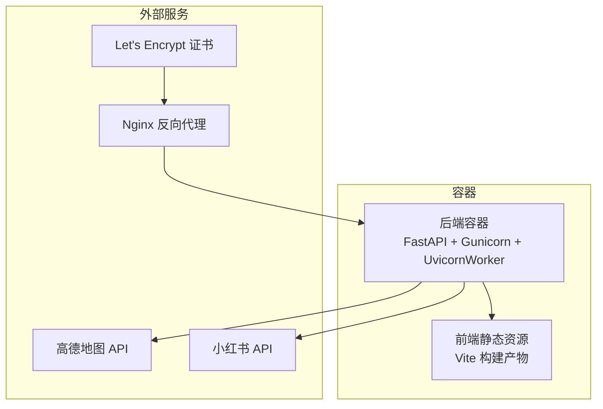
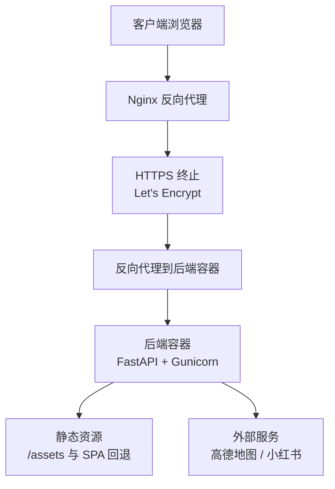
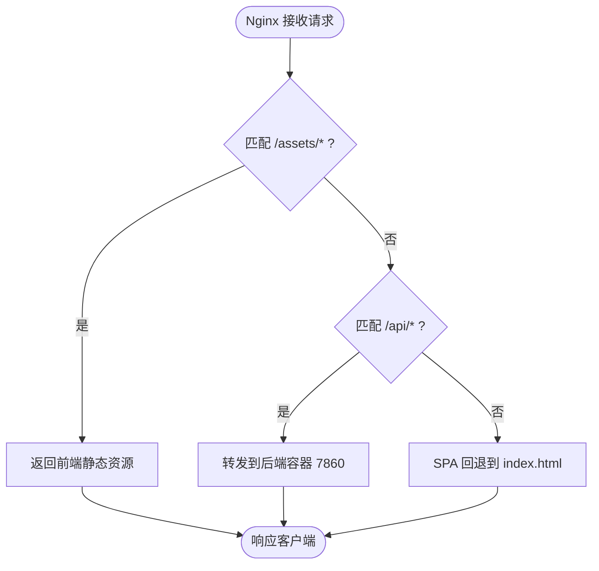
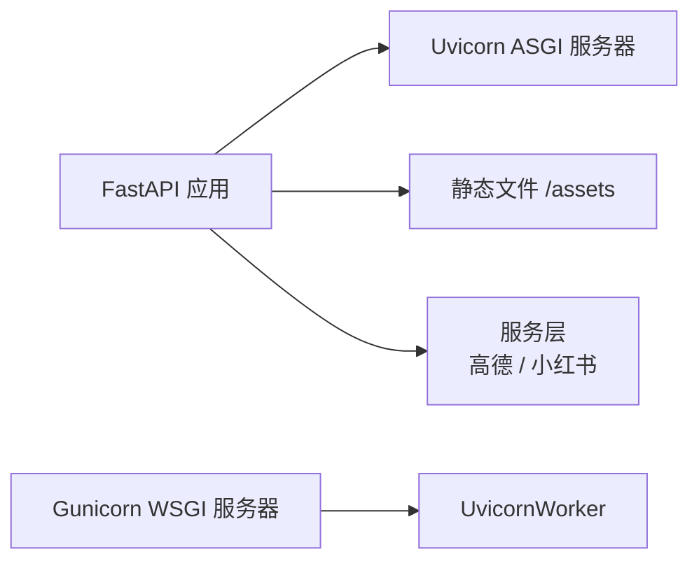

# 生产环境配置

<cite>
**本文档引用的文件**
- [README.md](file://README.md)
- [Dockerfile](file://Dockerfile)
- [docker-compose.yaml](file://docker-compose.yaml)
- [start.sh](file://start.sh)
- [backend/app/config.py](file://backend/app/config.py)
- [backend/run.py](file://backend/run.py)
- [backend/app/api/main.py](file://backend/app/api/main.py)
- [backend/app/api/routes/trip.py](file://backend/app/api/routes/trip.py)
- [backend/app/api/routes/poi.py](file://backend/app/api/routes/poi.py)
- [backend/requirements.txt](file://backend/requirements.txt)
- [frontend/package.json](file://frontend/package.json)
</cite>

## 目录
1. [简介](#简介)
2. [项目结构](#项目结构)
3. [核心组件](#核心组件)
4. [架构总览](#架构总览)
5. [详细组件分析](#详细组件分析)
6. [依赖分析](#依赖分析)
7. [性能考虑](#性能考虑)
8. [故障排查指南](#故障排查指南)
9. [结论](#结论)
10. [附录](#附录)

## 简介
本指南面向生产环境部署 TripStar 项目，涵盖服务器硬件与操作系统要求、Nginx 反向代理配置、SSL 证书申请与配置、数据库与缓存服务部署、进程管理与监控、安全最佳实践、性能优化以及备份与恢复策略。文档基于仓库现有配置与代码实现，结合实际部署场景给出可操作的建议与流程。

## 项目结构
项目采用前后端分离架构，后端基于 FastAPI，前端基于 Vue 3，通过 Docker 容器化统一打包与部署。核心目录与职责如下：
- backend：Python FastAPI 后端，包含 API 路由、配置管理、服务层与多智能体编排。
- frontend：Vue 3 前端，包含路由视图、组件与 API 服务。
- 根目录：Dockerfile、docker-compose.yaml、start.sh 等容器化与启动脚本。

图表来源
- [Dockerfile:1-64](file://Dockerfile#L1-L64)
- [docker-compose.yaml:1-24](file://docker-compose.yaml#L1-L24)
- [backend/app/api/main.py:121-136](file://backend/app/api/main.py#L121-L136)

章节来源
- [README.md:205-232](file://README.md#L205-L232)
- [Dockerfile:1-64](file://Dockerfile#L1-L64)
- [docker-compose.yaml:1-24](file://docker-compose.yaml#L1-L24)

## 核心组件
- 配置管理：集中管理应用运行参数、CORS、日志级别、高德与小红书等外部服务密钥。
- API 层：提供旅行规划、POI 查询、图片获取、健康检查等接口。
- 任务系统：基于内存任务状态与文件持久化，支持 WebSocket 与轮询两种状态订阅方式。
- 容器化：统一构建前端与后端，暴露固定端口并通过 Gunicorn 提供服务。

章节来源
- [backend/app/config.py:21-71](file://backend/app/config.py#L21-L71)
- [backend/app/api/main.py:14-61](file://backend/app/api/main.py#L14-L61)
- [backend/app/api/routes/trip.py:17-23](file://backend/app/api/routes/trip.py#L17-L23)
- [Dockerfile:29-63](file://Dockerfile#L29-L63)

## 架构总览
生产环境典型拓扑：
- Nginx 作为反向代理与 TLS 终止，负责静态资源分发、HTTPS、缓存与上游健康检查。
- 后端容器运行在 7860 端口，通过 Gunicorn + UvicornWorker 提供高性能异步服务。
- 前端静态资源由后端挂载或 Nginx 直接提供。
- 外部服务：高德地图 API、小红书 API（需相应密钥与 Cookie）。

图表来源
- [backend/app/api/main.py:121-136](file://backend/app/api/main.py#L121-L136)
- [docker-compose.yaml:11-23](file://docker-compose.yaml#L11-L23)

## 详细组件分析

### 服务器与容器配置
- 端口与绑定：容器暴露 7860 端口，可通过 compose 映射到宿主机端口。
- 进程管理：使用 Gunicorn + UvicornWorker，单实例默认 1 个工作进程，支持扩展。
- 环境变量：通过 compose 的 environment 字段注入 LLM、高德、小红书等密钥。
- 前端构建：构建时注入高德 JS API Key，运行时通过环境变量注入 API 基础地址。

章节来源
- [docker-compose.yaml:11-23](file://docker-compose.yaml#L11-L23)
- [Dockerfile:15-23](file://Dockerfile#L15-L23)
- [Dockerfile:56-63](file://Dockerfile#L56-L63)
- [start.sh:13-19](file://start.sh#L13-L19)

### Nginx 反向代理配置
- 静态资源服务：将 /assets 挂载到前端静态目录，或由 Nginx 直接提供。
- HTTPS 配置：启用 TLS，使用 Let's Encrypt 证书，配置强密码套件与安全头。
- 负载均衡：若部署多实例，可在 Nginx 层配置 upstream，结合健康检查。
- 缓存策略：对静态资源设置长期缓存，对 API 请求设置短缓存或禁用缓存。
- 反向代理规则：将 /api/* 转发至后端容器，处理路径前缀问题（如动态 ID）。

图表来源
- [backend/app/api/main.py:121-136](file://backend/app/api/main.py#L121-L136)

章节来源
- [backend/app/api/main.py:33-44](file://backend/app/api/main.py#L33-L44)
- [backend/app/api/main.py:121-136](file://backend/app/api/main.py#L121-L136)

### SSL 证书申请与配置
- 证书来源：推荐使用 Let's Encrypt（acme-certbot），自动化签发与续期。
- 证书安装：将证书与私钥放置在 Nginx 可读目录，配置 ssl_certificate 与 ssl_certificate_key。
- 续期策略：配置定时任务（如 cron）执行 certbot renew，失败时自动回滚。
- 自签名证书：仅限测试环境，不建议用于生产。

章节来源
- [README.md:131-148](file://README.md#L131-L148)

### 数据库与缓存服务
- 数据库存储：旅行规划任务状态采用本地 JSON 文件持久化（单实例），生产环境建议迁移到数据库（如 PostgreSQL/MySQL）。
- 缓存策略：可引入 Redis 缓存热点数据（如 POI 详情、图片链接），减少对外部 API 调用压力。
- 配置迁移：将持久化路径与连接信息通过环境变量注入容器。

章节来源
- [backend/app/api/routes/trip.py:82-104](file://backend/app/api/routes/trip.py#L82-L104)

### 进程管理与监控
- 进程池配置：Gunicorn 默认 1 个工作进程，可根据 CPU 核心数调整（如 workers = CPU 核数 × 2 + 1）。
- 进程健康检查：后端提供 /health 与 /api/trip/health 接口，Nginx upstream 健康检查可基于这些接口。
- 自动重启：compose 使用 restart: unless-stopped，配合 systemd 或 Docker 守护进程实现自动拉起。
- 日志采集：将 Gunicorn 访问日志与错误日志输出到标准输出，由容器日志系统收集。

章节来源
- [start.sh:13-19](file://start.sh#L13-L19)
- [backend/app/api/main.py:112-119](file://backend/app/api/main.py#L112-L119)
- [backend/app/api/routes/trip.py:495-508](file://backend/app/api/routes/trip.py#L495-L508)

### 安全配置最佳实践
- 防火墙：仅开放 Nginx 对外端口（如 80/443），后端容器仅监听 127.0.0.1 或内部网络。
- 访问控制：限制 /api/* 的来源 IP，使用 WAF 或 Nginx geo 模块。
- 数据加密：TLS 1.2+，禁用弱密码套件；敏感配置通过环境变量或密钥管理服务注入。
- CORS：生产环境严格限定允许来源，避免通配符。
- 机密保护：禁止将密钥写入镜像或日志；使用只读挂载与最小权限原则。

章节来源
- [backend/app/config.py:33-67](file://backend/app/config.py#L33-L67)
- [backend/app/api/main.py:46-53](file://backend/app/api/main.py#L46-L53)

### 性能优化配置
- 内存优化：合理设置 Gunicorn worker_class 与 worker 数量，避免内存碎片与频繁 GC。
- CPU 亲和性：在容器编排层绑定 CPU 亲和性，提升缓存命中率。
- I/O 优化：将静态资源与 API 分离，使用 CDN；对高频接口开启压缩（gzip/br）。
- 连接池：对外部 API（高德、小红书）设置合理的连接池与超时时间。

章节来源
- [Dockerfile:42-47](file://Dockerfile#L42-L47)
- [backend/requirements.txt:1-18](file://backend/requirements.txt#L1-L18)

### 备份与恢复策略
- 数据备份：定期备份旅行规划任务 JSON 文件与外部服务配置；对数据库迁移做好增量备份。
- 配置备份：备份 docker-compose.yaml、Nginx 配置、证书与密钥。
- 灾难恢复：制定 RTO/RPO 指标，演练跨节点恢复流程；使用容器编排工具（如 Kubernetes）实现滚动升级与回滚。

章节来源
- [backend/app/api/routes/trip.py:82-104](file://backend/app/api/routes/trip.py#L82-L104)
- [README.md:131-148](file://README.md#L131-L148)

## 依赖分析
后端依赖与运行时关系如下：
- FastAPI 提供 API 框架与中间件（CORS、静态文件）。
- Uvicorn 提供 ASGI 服务器，Gunicorn 作为 WSGI 服务器，UvicornWorker 作为 Gunicorn worker。
- 外部服务：高德地图、小红书 API，通过服务层封装调用。
- 前端静态资源：由后端挂载或 Nginx 提供。

图表来源
- [backend/app/api/main.py:14-61](file://backend/app/api/main.py#L14-L61)
- [Dockerfile:42-47](file://Dockerfile#L42-L47)
- [backend/requirements.txt:1-18](file://backend/requirements.txt#L1-L18)

章节来源
- [backend/app/api/main.py:14-61](file://backend/app/api/main.py#L14-L61)
- [Dockerfile:42-47](file://Dockerfile#L42-L47)
- [backend/requirements.txt:1-18](file://backend/requirements.txt#L1-L18)

## 性能考虑
- 启动与绑定：容器启动时通过环境变量决定绑定地址与端口，建议在生产环境固定端口并启用健康检查。
- 任务并发：旅行规划任务通过异步队列与回调推进进度，建议在容器外层增加队列服务（如 Celery）以提升吞吐。
- 资源隔离：使用 systemd 或 Docker 资源限制，避免单实例资源争用。
- 缓存与 CDN：对图片与静态资源使用 CDN，降低后端带宽压力。

章节来源
- [start.sh:5-11](file://start.sh#L5-L11)
- [backend/app/api/routes/trip.py:315-388](file://backend/app/api/routes/trip.py#L315-L388)

## 故障排查指南
- 健康检查：通过 /health 与 /api/trip/health 判断服务状态，Nginx 健康检查应基于这些接口。
- 日志定位：关注启动日志、配置验证输出与任务持久化失败信息。
- CORS 问题：核对生产环境 CORS 来源列表，避免通配符导致的安全风险。
- 任务失败：旅行规划任务失败时会记录错误信息，必要时清理持久化文件并重试。

章节来源
- [backend/app/api/main.py:63-85](file://backend/app/api/main.py#L63-L85)
- [backend/app/api/main.py:112-119](file://backend/app/api/main.py#L112-L119)
- [backend/app/api/routes/trip.py:365-388](file://backend/app/api/routes/trip.py#L365-L388)

## 结论
本指南基于仓库现有配置与代码实现，给出了生产环境部署的完整路径：容器化打包、Nginx 反向代理、证书管理、进程与监控、安全加固、性能优化与备份恢复。建议在实际部署中结合业务规模与合规要求，进一步细化配置并建立完善的运维体系。

## 附录
- 环境变量清单（示例）
  - LLM_API_KEY、LLM_BASE_URL、LLM_MODEL_ID、LLM_TIMEOUT
  - VITE_AMAP_WEB_KEY、VITE_AMAP_WEB_JS_KEY
  - XHS_COOKIE
  - HOST、PORT、LOG_LEVEL
- 前端构建参数
  - VITE_AMAP_WEB_JS_KEY：构建时注入高德 JS API Key
  - VITE_API_BASE_URL：运行时 API 基础地址（同源部署时为空）

章节来源
- [docker-compose.yaml:13-23](file://docker-compose.yaml#L13-L23)
- [Dockerfile:15-23](file://Dockerfile#L15-L23)
- [backend/app/config.py:43-56](file://backend/app/config.py#L43-L56)