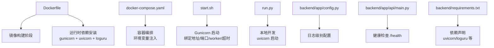
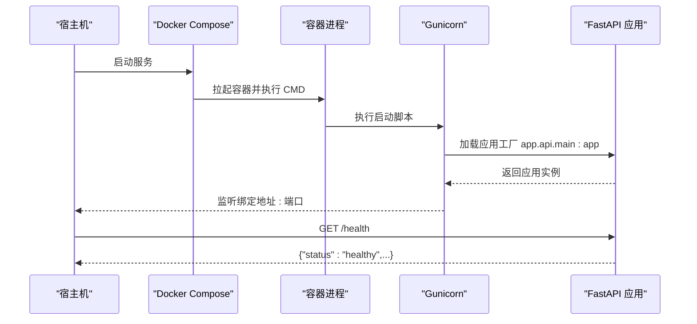
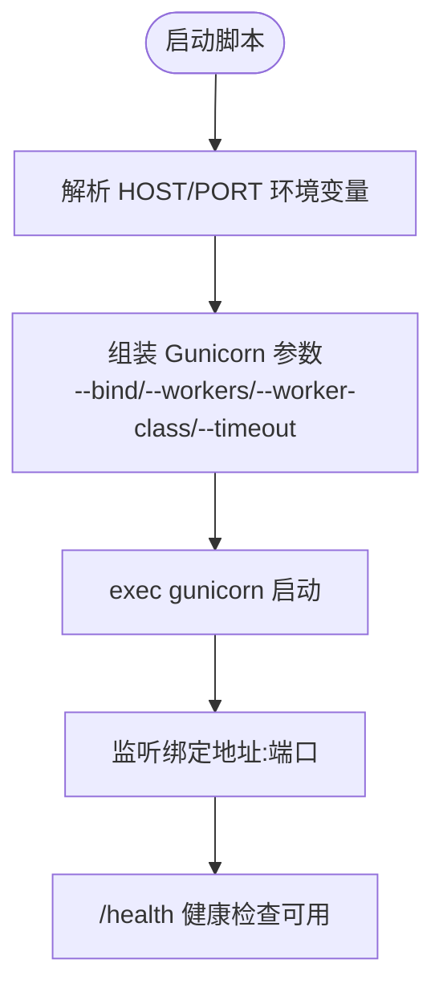
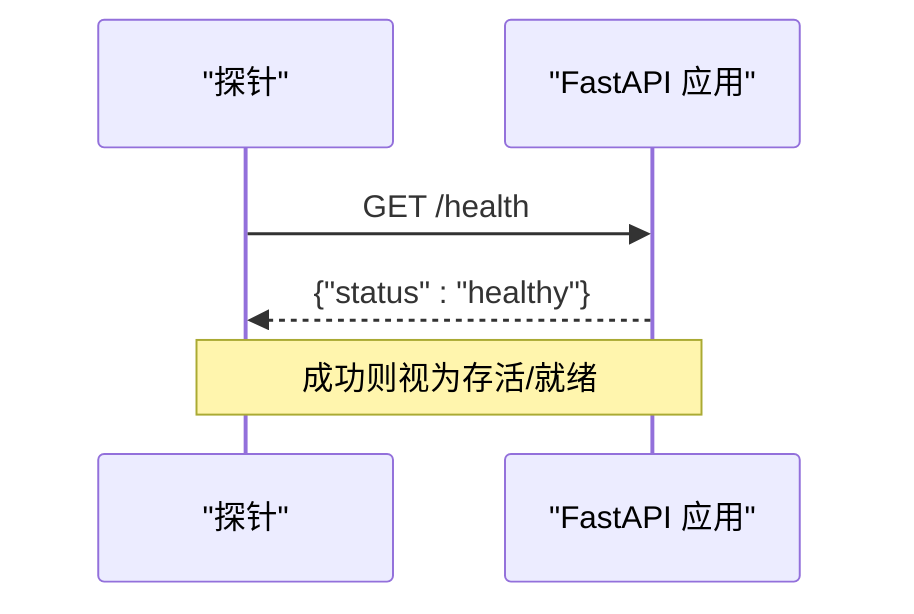
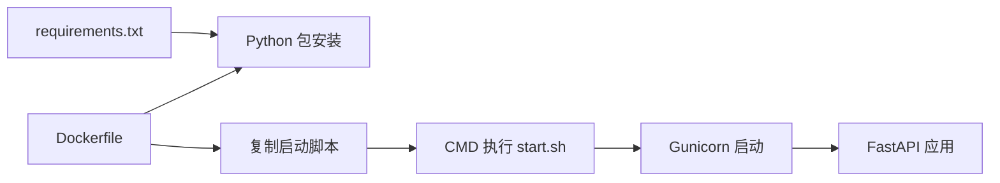

# 进程管理和监控配置

<cite>
**本文引用的文件**
- [Dockerfile](file://Dockerfile)
- [docker-compose.yaml](file://docker-compose.yaml)
- [start.sh](file://start.sh)
- [run.py](file://backend/run.py)
- [backend/app/config.py](file://backend/app/config.py)
- [backend/app/api/main.py](file://backend/app/api/main.py)
- [backend/requirements.txt](file://backend/requirements.txt)
- [README.md](file://README.md)
</cite>

## 目录
1. [引言](#引言)
2. [项目结构](#项目结构)
3. [核心组件](#核心组件)
4. [架构总览](#架构总览)
5. [详细组件分析](#详细组件分析)
6. [依赖分析](#依赖分析)
7. [性能考量](#性能考量)
8. [故障排查指南](#故障排查指南)
9. [结论](#结论)
10. [附录](#附录)

## 引言
本指南围绕进程管理与监控配置展开，结合项目现有实现，系统阐述以下方面：
- Gunicorn 进程池配置：workers 数量、worker 类型、进程启动参数、优雅关闭
- 进程健康检查：存活探针、就绪探针、健康检查间隔与失败阈值
- 进程监控：Prometheus 指标、Grafana 仪表板、告警规则
- 进程日志：日志级别、日志轮转、日志聚合与分析
- 自动重启：重启策略、重启延迟、重启次数限制
- 资源限制：CPU、内存、文件描述符
- 容器化：Docker 健康检查、Kubernetes Pod 配置与服务发现

本指南严格依据仓库中的实际文件与配置进行说明，并提供可操作的落地建议。

## 项目结构
项目采用前后端分离架构，后端基于 FastAPI + Uvicorn Worker（通过 Gunicorn 启动），容器化部署。关键与进程管理、监控相关的文件如下：
- Dockerfile：镜像构建与运行时依赖安装
- docker-compose.yaml：容器编排与环境变量注入
- start.sh：生产环境启动脚本（Gunicorn + Uvicorn Worker）
- run.py：本地开发启动脚本（Uvicorn）
- backend/app/config.py：配置管理（含日志级别）
- backend/app/api/main.py：应用生命周期事件与健康检查端点
- backend/requirements.txt：依赖清单（含 Uvicorn、Loguru 等）

图表来源
- [Dockerfile:1-64](file://Dockerfile#L1-L64)
- [docker-compose.yaml:1-24](file://docker-compose.yaml#L1-L24)
- [start.sh:1-20](file://start.sh#L1-L20)
- [run.py:1-17](file://backend/run.py#L1-L17)
- [backend/app/config.py:57-59](file://backend/app/config.py#L57-L59)
- [backend/app/api/main.py:111-119](file://backend/app/api/main.py#L111-L119)
- [backend/requirements.txt:3-10](file://backend/requirements.txt#L3-L10)

章节来源
- [Dockerfile:1-64](file://Dockerfile#L1-L64)
- [docker-compose.yaml:1-24](file://docker-compose.yaml#L1-L24)
- [start.sh:1-20](file://start.sh#L1-L20)
- [run.py:1-17](file://backend/run.py#L1-L17)
- [backend/app/config.py:57-59](file://backend/app/config.py#L57-L59)
- [backend/app/api/main.py:111-119](file://backend/app/api/main.py#L111-L119)
- [backend/requirements.txt:3-10](file://backend/requirements.txt#L3-L10)

## 核心组件
- 进程管理与启动
  - 生产：Gunicorn + Uvicorn Worker，绑定主机与端口，设置超时与日志输出
  - 开发：Uvicorn 直启，支持热重载与日志级别
- 健康检查
  - 提供 /health 端点，返回服务状态
- 日志
  - 通过配置控制日志级别；容器内标准输出/错误输出被重定向至 Gunicorn
- 监控
  - 当前未内置 Prometheus 指标导出；可扩展接入
- 自动重启
  - compose 中设置 restart: unless-stopped
- 资源限制
  - 未在容器层设置 CPU/内存/文件描述符限制
- 容器化
  - Dockerfile 显式暴露端口；compose 暴露端口映射与环境变量

章节来源
- [start.sh:13-19](file://start.sh#L13-L19)
- [run.py:6-15](file://backend/run.py#L6-L15)
- [backend/app/api/main.py:111-119](file://backend/app/api/main.py#L111-L119)
- [docker-compose.yaml:22-23](file://docker-compose.yaml#L22-L23)
- [Dockerfile:60-63](file://Dockerfile#L60-L63)

## 架构总览
下图展示了容器内进程启动流程与健康检查端点：

图表来源
- [start.sh:13-19](file://start.sh#L13-L19)
- [backend/app/api/main.py:111-119](file://backend/app/api/main.py#L111-L119)

## 详细组件分析

### Gunicorn 进程池配置
- workers 数量
  - 当前固定为 1，适合开发与低并发场景；生产建议根据 CPU 核心数与业务特性调整
- worker 类型
  - 使用 uvicorn.workers.UvicornWorker，基于 uvicorn 的高性能 ASGI worker
- 进程启动参数
  - 绑定地址与端口来自环境变量 HOST/PORT
  - 超时设置为 600 秒
  - 访问日志与错误日志输出到标准流
- 优雅关闭
  - 未显式配置优雅停止超时；可在生产环境中补充

图表来源
- [start.sh:5-19](file://start.sh#L5-L19)

章节来源
- [start.sh:5-19](file://start.sh#L5-L19)
- [Dockerfile:42-43](file://Dockerfile#L42-L43)

### 进程健康检查配置
- 存活探针（Liveness Probe）
  - 建议使用 /health 端点进行探测
- 就绪探针（Readiness Probe）
  - 可在应用内部增加更细粒度的就绪条件（如依赖服务可用）
- 健康检查间隔与失败阈值
  - 建议：探针间隔 10-30 秒，超时 3-5 秒，失败阈值 1-3 次
- 健康检查端点
  - 已提供 /health，返回服务状态

图表来源
- [backend/app/api/main.py:111-119](file://backend/app/api/main.py#L111-L119)

章节来源
- [backend/app/api/main.py:111-119](file://backend/app/api/main.py#L111-L119)

### 进程监控工具配置
- Prometheus 指标
  - 当前未内置指标导出；建议引入指标库并在应用中暴露指标端点
- Grafana 仪表板
  - 基于 Prometheus 数据源创建仪表板，展示请求速率、错误率、响应时间、进程状态等
- 告警规则
  - 建议规则：HTTP 5xx 错误率、P95/P99 响应时间、健康检查失败、进程重启频率

说明：以上为通用实践建议，需结合具体指标库与数据源进行实现。

### 进程日志管理配置
- 日志级别
  - 通过配置项控制日志级别
- 日志轮转
  - 建议在容器层使用日志驱动轮转（如 json-file 配置 max-size/max-file）
- 日志聚合与分析
  - 建议将标准输出接入集中式日志系统（如 ELK/Fluent Bit/Loki）
- 日志格式
  - 建议统一 JSON 格式，便于结构化采集与检索

章节来源
- [backend/app/config.py:57-59](file://backend/app/config.py#L57-L59)
- [start.sh:18-19](file://start.sh#L18-L19)

### 进程自动重启配置
- 重启策略
  - compose 中设置 restart: unless-stopped，容器退出后自动重启
- 重启延迟与次数限制
  - 建议在 compose 中增加 restart 策略的 delay 和 max_retries，避免频繁重启

章节来源
- [docker-compose.yaml:22-23](file://docker-compose.yaml#L22-L23)

### 进程资源限制配置
- CPU 限制
  - 建议在 compose 中设置 deploy.resources.limits.cpus
- 内存限制
  - 建议设置 deploy.resources.limits.memory 或容器运行时的 memory.limit_in_bytes
- 文件描述符限制
  - 建议在容器运行时设置 ulimit -n，或在 systemd/systemd-nspawn 中配置

说明：以上为通用实践建议，需结合编排平台与运行时进行配置。

### 容器化环境下的进程管理
- Docker 健康检查
  - 建议在 Dockerfile 中添加 HEALTHCHECK 指令，配合 /health 端点
- Kubernetes Pod 配置
  - 建议在 Deployment 中配置 livenessProbe/readinessProbe
  - 通过 Service 暴露服务，结合 Headless Service 实现服务发现
- 服务发现
  - 建议使用集群 DNS 或服务网格进行服务发现与流量治理

章节来源
- [Dockerfile:60-63](file://Dockerfile#L60-L63)
- [docker-compose.yaml:11-12](file://docker-compose.yaml#L11-L12)

## 依赖分析
- 运行时依赖
  - gunicorn、uvicorn[standard]、loguru 等
- 启动流程
  - Dockerfile 安装依赖 → 复制代码与启动脚本 → CMD 执行启动脚本 → Gunicorn 启动应用

图表来源
- [backend/requirements.txt:3-10](file://backend/requirements.txt#L3-L10)
- [Dockerfile:42-58](file://Dockerfile#L42-L58)
- [start.sh:13-19](file://start.sh#L13-L19)

章节来源
- [backend/requirements.txt:3-10](file://backend/requirements.txt#L3-L10)
- [Dockerfile:42-58](file://Dockerfile#L42-L58)
- [start.sh:13-19](file://start.sh#L13-L19)

## 性能考量
- workers 数量
  - 生产环境建议根据 CPU 核心数与业务并发进行调优，避免过多 worker 导致上下文切换开销
- worker 类型
  - UvicornWorker 适合高并发 I/O 密集型场景；若业务涉及大量 CPU 计算，可评估其他 worker 类型
- 超时设置
  - 当前超时为 600 秒，适合长耗时任务；需结合业务特性与负载进行评估
- 日志输出
  - 标准输出/错误输出到容器日志，建议启用 JSON 格式与结构化字段，便于性能分析

## 故障排查指南
- 启动失败
  - 检查 HOST/PORT 环境变量是否正确
  - 检查依赖安装与 Python 版本
- 健康检查失败
  - 确认 /health 端点可达且返回健康状态
  - 检查应用启动日志与错误日志
- 日志问题
  - 确认日志级别配置与容器日志驱动
  - 检查日志轮转与磁盘空间
- 重启频繁
  - 检查 restart 策略与失败原因
  - 结合探针与日志定位根因

章节来源
- [start.sh:5-19](file://start.sh#L5-L19)
- [backend/app/api/main.py:111-119](file://backend/app/api/main.py#L111-L119)
- [docker-compose.yaml:22-23](file://docker-compose.yaml#L22-L23)

## 结论
本指南基于仓库现有实现，给出了 Gunicorn 进程池、健康检查、日志、自动重启与容器化等配置要点与实践建议。建议在生产环境中进一步完善监控指标、资源限制与健康检查策略，以提升稳定性与可观测性。

## 附录
- 环境变量与端口
  - HOST/PORT：容器内绑定地址与端口
  - LOG_LEVEL：日志级别
  - 其他业务相关环境变量：LLM_API_KEY、LLM_BASE_URL、LLM_MODEL_ID、VITE_AMAP_WEB_KEY、XHS_COOKIE 等
- 端口暴露
  - 容器暴露 7860 端口，compose 中映射到宿主机端口

章节来源
- [docker-compose.yaml:20-22](file://docker-compose.yaml#L20-L22)
- [Dockerfile:60-63](file://Dockerfile#L60-L63)
- [README.md:140-148](file://README.md#L140-L148)