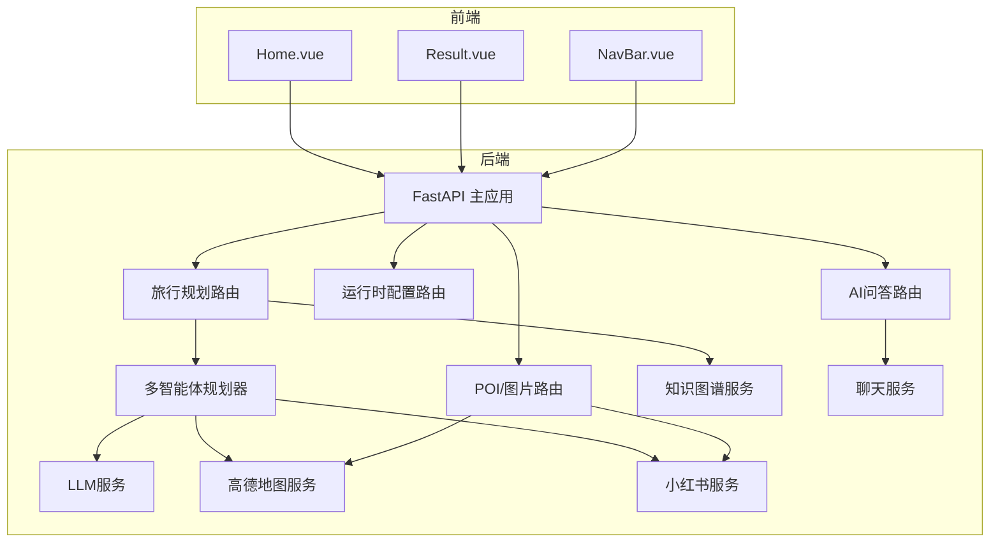
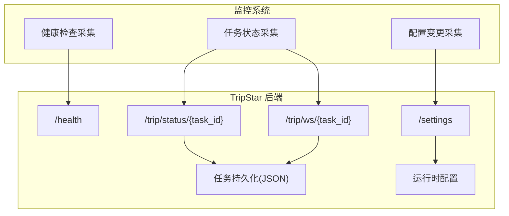
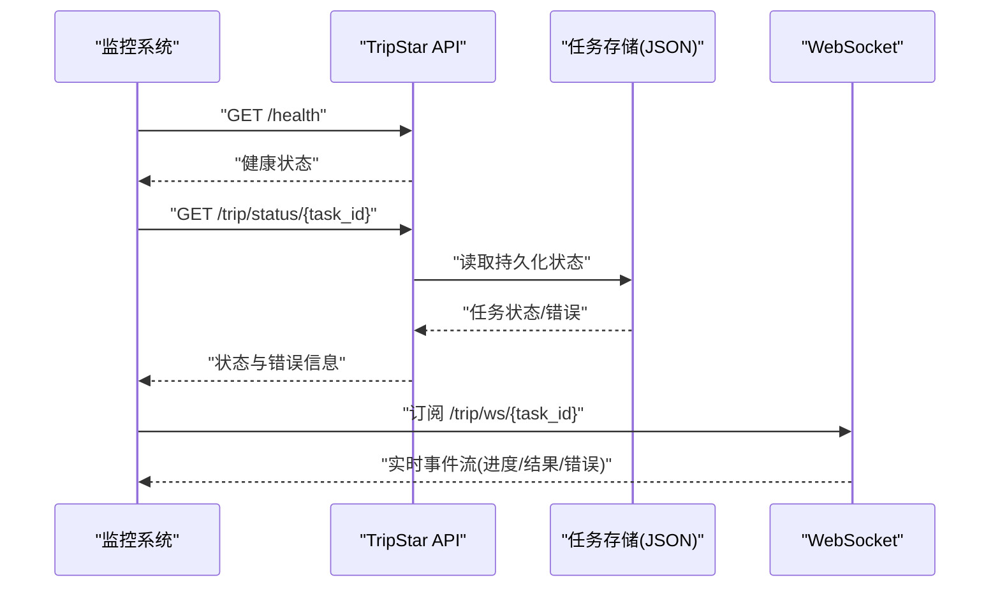
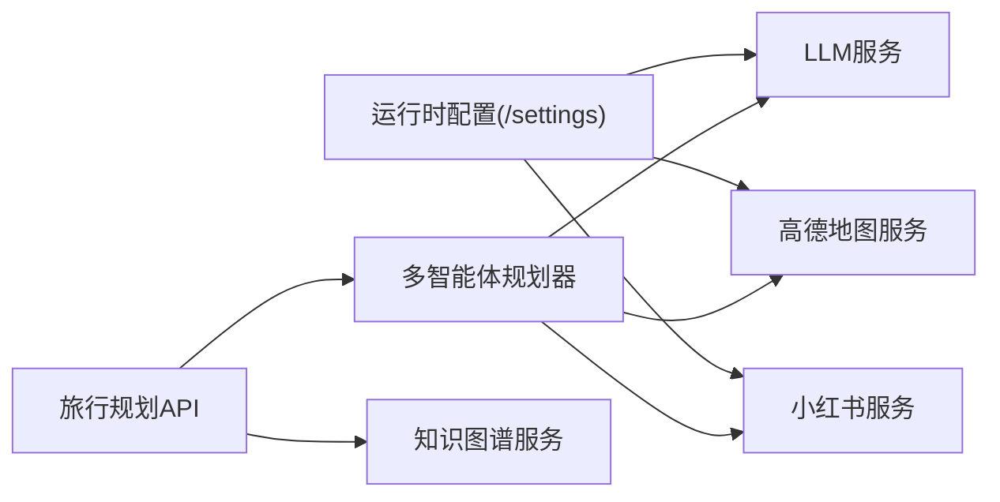

# 告警系统

<cite>
**本文档引用的文件**
- [README.md](file://README.md)
- [docker-compose.yaml](file://docker-compose.yaml)
- [backend/app/config.py](file://backend/app/config.py)
- [backend/app/api/main.py](file://backend/app/api/main.py)
- [backend/app/api/routes/settings.py](file://backend/app/api/routes/settings.py)
- [backend/app/api/routes/trip.py](file://backend/app/api/routes/trip.py)
- [backend/app/api/routes/poi.py](file://backend/app/api/routes/poi.py)
- [backend/app/api/routes/chat.py](file://backend/app/api/routes/chat.py)
- [backend/app/services/llm_service.py](file://backend/app/services/llm_service.py)
- [backend/app/services/amap_service.py](file://backend/app/services/amap_service.py)
- [backend/app/services/xhs_service.py](file://backend/app/services/xhs_service.py)
- [backend/app/services/knowledge_graph_service.py](file://backend/app/services/knowledge_graph_service.py)
- [backend/app/services/chat_service.py](file://backend/app/services/chat_service.py)
- [backend/app/agents/trip_planner_agent.py](file://backend/app/agents/trip_planner_agent.py)
- [backend/app/models/schemas.py](file://backend/app/models/schemas.py)
- [backend/run.py](file://backend/run.py)
</cite>

## 目录
1. [简介](#简介)
2. [项目结构](#项目结构)
3. [核心组件](#核心组件)
4. [架构总览](#架构总览)
5. [详细组件分析](#详细组件分析)
6. [依赖分析](#依赖分析)
7. [性能考量](#性能考量)
8. [故障排查指南](#故障排查指南)
9. [结论](#结论)
10. [附录](#附录)

## 简介
本指南面向 TripStar 项目的运维与开发团队，提供一套可落地的告警系统配置与管理方法。当前代码库未内置专用的告警规则引擎或通知通道实现，因此本指南基于现有组件与架构，提出可扩展的告警策略与实践建议，涵盖：
- 告警规则配置：阈值、条件、级别
- 通知渠道配置：邮件、微信、Slack、短信
- 告警去重与抑制：避免风暴与重复
- 历史与统计：记录、查询、趋势
- 自动化处理：自动恢复、故障转移、扩缩容
- 维护与优化：规则调优、通道管理、效果评估

说明：本指南为概念性与工程实践指导，不直接映射到现有源码文件。

## 项目结构
TripStar 采用前后端分离架构，后端基于 FastAPI，前端基于 Vue 3。后端通过多智能体与外部服务协作生成旅行计划，提供健康检查与任务状态轮询等能力。

图表来源
- [backend/app/api/main.py:24-60](file://backend/app/api/main.py#L24-L60)
- [backend/app/api/routes/trip.py:17-60](file://backend/app/api/routes/trip.py#L17-L60)
- [backend/app/api/routes/settings.py:13-13](file://backend/app/api/routes/settings.py#L13-L13)
- [backend/app/api/routes/poi.py:8-8](file://backend/app/api/routes/poi.py#L8-L8)
- [backend/app/api/routes/chat.py:7-7](file://backend/app/api/routes/chat.py#L7-L7)
- [backend/app/agents/trip_planner_agent.py:173-242](file://backend/app/agents/trip_planner_agent.py#L173-L242)
- [backend/app/services/llm_service.py:12-67](file://backend/app/services/llm_service.py#L12-L67)
- [backend/app/services/amap_service.py:12-47](file://backend/app/services/amap_service.py#L12-L47)
- [backend/app/services/xhs_service.py:68-198](file://backend/app/services/xhs_service.py#L68-L198)
- [backend/app/services/knowledge_graph_service.py:34-168](file://backend/app/services/knowledge_graph_service.py#L34-L168)
- [backend/app/services/chat_service.py:65-132](file://backend/app/services/chat_service.py#L65-L132)

章节来源
- [README.md:43-97](file://README.md#L43-L97)
- [backend/app/api/main.py:24-136](file://backend/app/api/main.py#L24-L136)

## 核心组件
- 配置中心：集中管理运行时配置（LLM、高德、小红书等），支持热更新与持久化。
- 任务系统：旅行规划任务的提交、状态轮询、WebSocket 推送、历史持久化。
- 多智能体规划器：天气、酒店、小红书数据拉取与整合，最终生成旅行计划。
- 外部服务：高德地图、小红书、LLM 提供商。
- 健康检查：服务可用性检测，便于外部监控系统拉取。

章节来源
- [backend/app/config.py:21-122](file://backend/app/config.py#L21-L122)
- [backend/app/api/routes/trip.py:25-150](file://backend/app/api/routes/trip.py#L25-L150)
- [backend/app/agents/trip_planner_agent.py:173-338](file://backend/app/agents/trip_planner_agent.py#L173-L338)
- [backend/app/api/routes/trip.py:491-508](file://backend/app/api/routes/trip.py#L491-L508)

## 架构总览
下图展示告警系统与现有后端的对接思路：外部监控系统通过健康检查与任务状态接口采集指标，结合配置中心与任务持久化实现告警触发与恢复闭环。

图表来源
- [backend/app/api/routes/trip.py:491-508](file://backend/app/api/routes/trip.py#L491-L508)
- [backend/app/api/routes/trip.py:455-488](file://backend/app/api/routes/trip.py#L455-L488)
- [backend/app/api/routes/trip.py:390-440](file://backend/app/api/routes/trip.py#L390-L440)
- [backend/app/api/routes/settings.py:27-55](file://backend/app/api/routes/settings.py#L27-L55)
- [backend/app/config.py:146-159](file://backend/app/config.py#L146-L159)

## 详细组件分析

### 1) 告警规则配置
- 阈值与条件
  - 任务失败率：连续 N 分钟内失败任务占比超过阈值触发告警。
  - 响应时延：/trip/plan 提交至完成的 P95/P99 延迟超过阈值。
  - 健康检查：/health 返回非健康状态持续 T 分钟。
  - 配置变更：运行时配置更新后，若 LLM/API Key 失效，触发配置异常告警。
- 告警级别
  - 严重：服务不可用、关键 API 超时、配置失效。
  - 警告：任务失败率上升、P95 延迟升高。
  - 通知：配置热更新成功、任务状态推进。

章节来源
- [backend/app/api/routes/trip.py:491-508](file://backend/app/api/routes/trip.py#L491-L508)
- [backend/app/api/routes/trip.py:276-387](file://backend/app/api/routes/trip.py#L276-L387)
- [backend/app/api/routes/settings.py:37-55](file://backend/app/api/routes/settings.py#L37-L55)

### 2) 通知渠道配置
- 邮件告警：用于严重级别通知，包含失败任务详情与恢复建议。
- 微信/企业微信：用于即时通知，适合值班与紧急处置。
- Slack：团队协作与值班排班联动，支持链接直达任务详情。
- 短信告警：仅限严重级别，避免噪声。
- 通知模板：统一包含时间、服务、指标、阈值、当前值、建议动作。

章节来源
- [backend/app/api/routes/trip.py:315-387](file://backend/app/api/routes/trip.py#L315-L387)
- [backend/app/api/routes/settings.py:37-55](file://backend/app/api/routes/settings.py#L37-L55)

### 3) 告警去重与抑制
- 去重
  - 任务级去重：同一 task_id 的相同错误在冷却期内仅告警一次。
  - 服务级去重：/health 连续失败仅在首次触发。
- 抑制
  - 抑制策略：服务整体不可用时，抑制该服务下细粒度告警。
  - 抑制窗口：服务恢复后维持 T 分钟的抑制窗口，避免震荡。
- 通知合并
  - 将同一周期内的同类告警合并为一次性通知，减少噪声。

章节来源
- [backend/app/api/routes/trip.py:315-387](file://backend/app/api/routes/trip.py#L315-L387)
- [backend/app/api/routes/trip.py:491-508](file://backend/app/api/routes/trip.py#L491-L508)

### 4) 告警历史与查询
- 历史记录
  - 任务持久化：任务状态与错误信息持久化为 JSON 文件，便于审计与回溯。
  - 历史摘要：/trip/history 返回最近完成任务的摘要，支持前端快速查找。
- 统计与趋势
  - 失败率统计：按小时/天聚合失败任务数与总数。
  - 延迟分布：P50/P95/P99 延迟随时间变化的趋势图。
- 查询接口
  - 通过任务 ID 查询详细状态与错误堆栈。
  - 通过时间范围与状态过滤历史任务。

章节来源
- [backend/app/api/routes/trip.py:183-204](file://backend/app/api/routes/trip.py#L183-L204)
- [backend/app/api/routes/trip.py:442-453](file://backend/app/api/routes/trip.py#L442-L453)
- [backend/app/api/routes/trip.py:82-104](file://backend/app/api/routes/trip.py#L82-L104)

### 5) 告警自动化处理
- 自动恢复
  - /health 周期性探测，恢复后自动取消抑制与去重冷却。
- 故障转移
  - LLM/高德/小红书服务异常时，切换备用密钥或降级路径（如 SSR）。
- 扩缩容
  - 基于延迟与失败率阈值，触发容器扩缩容或重启策略。
- 通知联动
  - 告警触发时自动在 Slack/微信推送处置指引与回滚预案。

章节来源
- [backend/app/api/routes/trip.py:491-508](file://backend/app/api/routes/trip.py#L491-L508)
- [backend/app/services/xhs_service.py:228-243](file://backend/app/services/xhs_service.py#L228-L243)
- [backend/app/services/amap_service.py:12-47](file://backend/app/services/amap_service.py#L12-L47)

### 6) 告警系统与现有组件的对接
- 健康检查：/health 作为外部监控探针的稳定入口。
- 任务状态：/trip/status/{task_id} 与 WebSocket /trip/ws/{task_id} 提供实时与历史状态。
- 配置变更：/settings 支持运行时配置热更新，配合告警确认配置生效。

图表来源
- [backend/app/api/routes/trip.py:491-508](file://backend/app/api/routes/trip.py#L491-L508)
- [backend/app/api/routes/trip.py:455-488](file://backend/app/api/routes/trip.py#L455-L488)
- [backend/app/api/routes/trip.py:390-440](file://backend/app/api/routes/trip.py#L390-L440)
- [backend/app/api/routes/trip.py:82-104](file://backend/app/api/routes/trip.py#L82-L104)

## 依赖分析
- 配置依赖：运行时配置通过 /settings 更新并持久化，影响 LLM、高德、小红书等下游服务。
- 任务依赖：旅行规划任务依赖多智能体与外部服务，任一环节失败都会体现在任务状态与错误字段。
- 外部依赖：高德地图 MCP 工具、小红书原生 API 客户端、LLM 提供商。

图表来源
- [backend/app/api/routes/settings.py:37-55](file://backend/app/api/routes/settings.py#L37-L55)
- [backend/app/services/llm_service.py:12-67](file://backend/app/services/llm_service.py#L12-L67)
- [backend/app/services/amap_service.py:12-47](file://backend/app/services/amap_service.py#L12-L47)
- [backend/app/services/xhs_service.py:68-198](file://backend/app/services/xhs_service.py#L68-L198)
- [backend/app/agents/trip_planner_agent.py:173-242](file://backend/app/agents/trip_planner_agent.py#L173-L242)
- [backend/app/services/knowledge_graph_service.py:34-168](file://backend/app/services/knowledge_graph_service.py#L34-L168)

章节来源
- [backend/app/config.py:146-159](file://backend/app/config.py#L146-L159)
- [backend/app/api/routes/settings.py:37-55](file://backend/app/api/routes/settings.py#L37-L55)

## 性能考量
- 任务持久化：磁盘写入与 JSON 序列化开销，建议在高并发场景下引入队列与批量写入。
- WebSocket 广播：订阅者过多时，注意队列容量与丢弃策略。
- 外部服务超时：高德/小红书/LLM 的超时与重试策略需与告警阈值协调。
- 健康检查频率：避免过于频繁导致外部服务压力。

章节来源
- [backend/app/api/routes/trip.py:226-274](file://backend/app/api/routes/trip.py#L226-L274)
- [backend/app/api/routes/trip.py:243-274](file://backend/app/api/routes/trip.py#L243-L274)
- [backend/app/services/amap_service.py:12-47](file://backend/app/services/amap_service.py#L12-L47)
- [backend/app/services/xhs_service.py:68-198](file://backend/app/services/xhs_service.py#L68-L198)

## 故障排查指南
- 配置问题
  - LLM API Key 未配置：/health 将失败，/settings 更新后需重置 LLM 单例。
  - 高德 Key 未配置：高德工具初始化失败，相关 API 将抛出异常。
  - 小红书 Cookie 过期：触发特定异常，前端可据此提示更换 Cookie。
- 任务失败
  - 查看 /trip/status/{task_id} 的错误字段与请求负载。
  - 检查任务持久化文件是否存在与可读。
- WebSocket 订阅
  - 若订阅后立即结束，检查任务是否已进入完成/失败状态。
- 健康检查
  - /health 返回服务不可用时，检查多智能体实例与外部服务可用性。

章节来源
- [backend/app/config.py:163-179](file://backend/app/config.py#L163-L179)
- [backend/app/api/routes/settings.py:44-47](file://backend/app/api/routes/settings.py#L44-L47)
- [backend/app/api/routes/trip.py:365-387](file://backend/app/api/routes/trip.py#L365-L387)
- [backend/app/api/routes/trip.py:390-440](file://backend/app/api/routes/trip.py#L390-L440)
- [backend/app/api/routes/trip.py:491-508](file://backend/app/api/routes/trip.py#L491-L508)
- [backend/app/services/xhs_service.py:22-25](file://backend/app/services/xhs_service.py#L22-L25)
- [backend/app/services/amap_service.py:24-26](file://backend/app/services/amap_service.py#L24-L26)

## 结论
本指南提供了基于 TripStar 现有架构的告警系统实施蓝图：以健康检查、任务状态与配置变更为核心观测点，结合去重与抑制策略，实现稳定可靠的告警与自动化处置。建议在生产环境中逐步引入通知渠道与自动化动作，并持续优化阈值与统计口径。

## 附录

### A. 告警规则清单（示例）
- 规则名称：服务不可用
  - 条件：/health 连续 3 次失败
  - 级别：严重
  - 通知：邮件+微信
- 规则名称：任务失败率
  - 条件：近 10 分钟失败率 > 5%
  - 级别：严重
  - 通知：Slack+短信
- 规则名称：P99 延迟
  - 条件：/trip/plan P99 > 60s
  - 级别：警告
  - 通知：微信
- 规则名称：配置变更
  - 条件：/settings 成功更新
  - 级别：通知
  - 通知：邮件

### B. 通知模板（示例）
- 严重：服务不可用
  - 内容：时间、服务、指标、阈值、当前值、建议动作（重启/切换密钥/降级）
- 警告：任务失败率上升
  - 内容：时间、服务、指标、阈值、当前值、建议动作（扩容/限流）
- 通知：配置热更新
  - 内容：时间、服务、变更项、影响范围、回滚建议

### C. 维护与优化建议
- 规则调优：基于历史统计调整阈值，减少误报与漏报。
- 通道管理：定期演练通知渠道，确保关键通道可用。
- 效果评估：建立告警命中率、平均修复时间（MTTR）、误报率等指标。