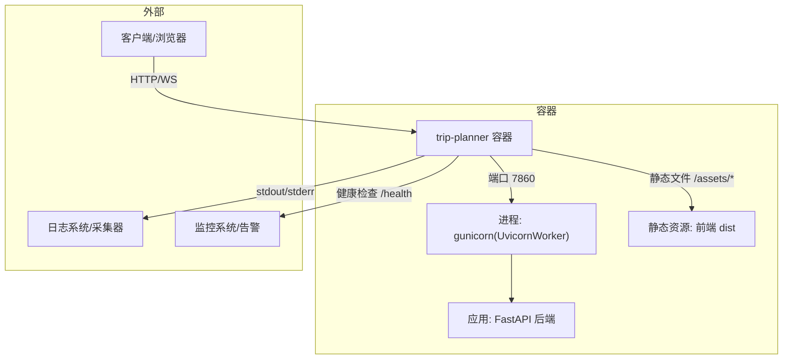
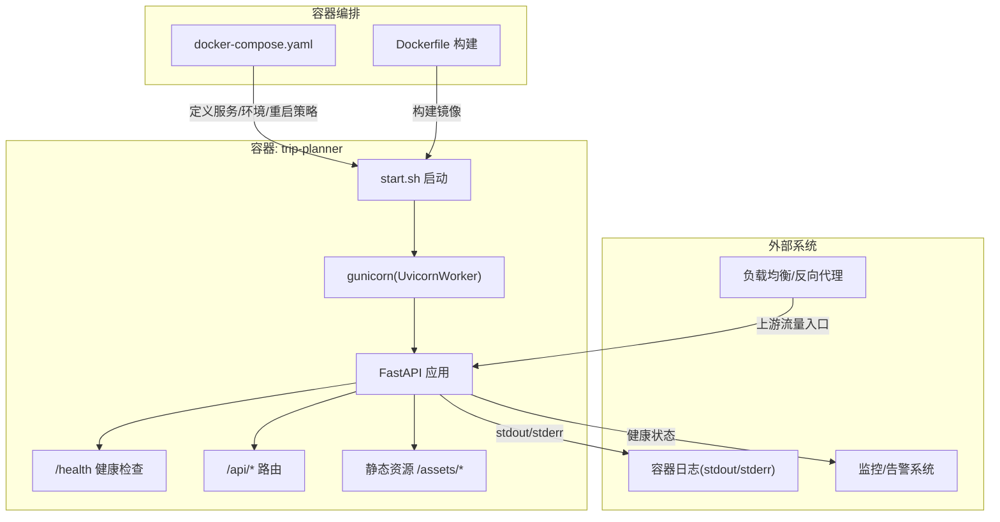
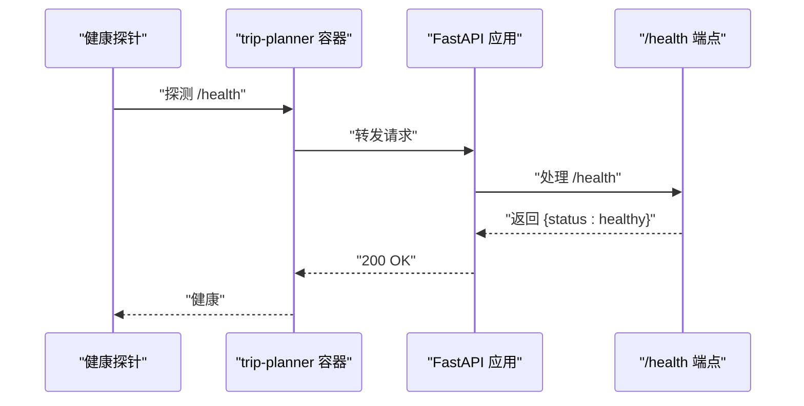
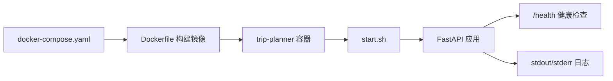

# 容器监控

<cite>
**本文引用的文件**
- [Dockerfile](file://Dockerfile)
- [docker-compose.yaml](file://docker-compose.yaml)
- [start.sh](file://start.sh)
- [backend/app/api/main.py](file://backend/app/api/main.py)
- [backend/app/config.py](file://backend/app/config.py)
- [backend/requirements.txt](file://backend/requirements.txt)
- [backend/app/api/routes/trip.py](file://backend/app/api/routes/trip.py)
- [backend/app/api/routes/map.py](file://backend/app/api/routes/map.py)
- [README.md](file://README.md)
</cite>

## 目录
1. [引言](#引言)
2. [项目结构](#项目结构)
3. [核心组件](#核心组件)
4. [架构总览](#架构总览)
5. [详细组件分析](#详细组件分析)
6. [依赖分析](#依赖分析)
7. [性能考量](#性能考量)
8. [故障排查指南](#故障排查指南)
9. [结论](#结论)
10. [附录](#附录)

## 引言
本指南面向在容器环境中运行 TripStar 的运维与开发团队，围绕 Docker 容器的资源使用监控（CPU、内存、磁盘 I/O、网络）、容器健康状态监控（重启策略、运行状态、异常告警）、容器日志聚合（收集、格式化、转发）、容器性能分析（瓶颈识别、趋势分析、容量规划）、容器编排监控（服务发现、负载均衡、故障转移）以及容器安全监控（镜像扫描、运行时安全、访问控制）给出可操作的配置建议与最佳实践。本文所有建议均基于仓库现有配置与代码实现，结合容器与应用层面的可观测性落地方法。

## 项目结构
TripStar 采用前后端分离架构，后端基于 FastAPI，前端基于 Vue。容器化通过 Dockerfile 与 docker-compose.yaml 实现，启动脚本 start.sh 使用 gunicorn + uvicorn worker 托管后端服务。应用通过 /health 健康检查端点对外暴露健康状态，日志通过标准输出/错误输出输出至容器日志系统。

图表来源
- [docker-compose.yaml:1-24](file://docker-compose.yaml#L1-L24)
- [Dockerfile:56-64](file://Dockerfile#L56-L64)
- [start.sh:13-20](file://start.sh#L13-L20)
- [backend/app/api/main.py:112-119](file://backend/app/api/main.py#L112-L119)

章节来源
- [Dockerfile:1-64](file://Dockerfile#L1-L64)
- [docker-compose.yaml:1-24](file://docker-compose.yaml#L1-L24)
- [start.sh:1-20](file://start.sh#L1-L20)
- [backend/app/api/main.py:96-136](file://backend/app/api/main.py#L96-L136)

## 核心组件
- 容器镜像与编排
  - Dockerfile 定义多阶段构建流程，最终镜像基于 Python slim，安装必要系统依赖与后端依赖，并复制前端构建产物。
  - docker-compose.yaml 定义服务、端口映射、环境变量注入与重启策略。
  - start.sh 使用 gunicorn + uvicorn worker 启动应用，同时将访问日志与错误日志输出到标准流，便于容器日志采集。
- 应用健康检查
  - /health 端点返回健康状态，配合容器重启策略实现健康状态监控与自动恢复。
- 配置与日志
  - 后端通过 pydantic-settings 读取环境变量，支持运行时配置覆盖与持久化，日志级别由环境变量控制。
  - 启动脚本与应用启动脚本均支持通过环境变量调整绑定地址、端口与日志级别。

章节来源
- [Dockerfile:29-64](file://Dockerfile#L29-L64)
- [docker-compose.yaml:3-24](file://docker-compose.yaml#L3-L24)
- [start.sh:13-20](file://start.sh#L13-L20)
- [backend/app/api/main.py:112-119](file://backend/app/api/main.py#L112-L119)
- [backend/app/config.py:57-58](file://backend/app/config.py#L57-L58)

## 架构总览
下图展示了容器内应用的运行时拓扑与可观测性接入点：

图表来源
- [docker-compose.yaml:3-24](file://docker-compose.yaml#L3-L24)
- [Dockerfile:29-64](file://Dockerfile#L29-L64)
- [start.sh:13-20](file://start.sh#L13-L20)
- [backend/app/api/main.py:112-136](file://backend/app/api/main.py#L112-L136)

## 详细组件分析

### 容器资源使用监控（CPU、内存、磁盘 I/O、网络）
- CPU 使用率
  - 在容器编排层，通过资源限制与预留（如 docker-compose 的 deploy.resources 或 Kubernetes 的 resources）约束 CPU 使用，避免“饿死”其他容器。
  - 在应用层，gunicorn 的 worker 数量与类型（UvicornWorker）影响并发与 CPU 占用，建议结合实际负载与 CPU 核心数进行调优。
- 内存占用
  - 通过容器内存限制与 OOM Killer 配置，防止内存泄漏导致主机不稳定。
  - 应用层注意避免大对象常驻内存，及时释放缓存与中间结果。
- 磁盘 I/O
  - 任务持久化与日志写盘会产生 I/O 压力，建议将任务数据目录与日志目录挂载到高性能磁盘或使用独立卷。
  - 对于高频写盘场景，可考虑使用内存盘临时缓存，降低机械盘磨损。
- 网络流量
  - 通过容器网络隔离与出口带宽限制，避免突发流量影响其他服务。
  - 对外 API（如高德地图、小红书）建议开启连接池与超时控制，减少连接堆积。

章节来源
- [docker-compose.yaml:11-23](file://docker-compose.yaml#L11-L23)
- [start.sh:15-17](file://start.sh#L15-L17)
- [backend/app/api/routes/trip.py:82-104](file://backend/app/api/routes/trip.py#L82-L104)

### 容器健康状态监控（重启次数、运行状态、异常告警）
- 健康检查端点
  - /health 返回健康状态，可用于容器编排的健康探针（liveness/readiness probe）。
- 重启策略
  - docker-compose 中设置了 unless-stopped，可在容器异常退出时自动重启，提升可用性。
- 运行状态与异常告警
  - 结合容器日志采集与告警规则，对 /health 异常、启动失败、端口不可达等事件触发告警。
  - 建议在监控系统中设置“容器重启次数统计”与“连续失败阈值”告警。

图表来源
- [docker-compose.yaml:23](file://docker-compose.yaml#L23)
- [backend/app/api/main.py:112-119](file://backend/app/api/main.py#L112-L119)

章节来源
- [docker-compose.yaml:23](file://docker-compose.yaml#L23)
- [backend/app/api/main.py:112-119](file://backend/app/api/main.py#L112-L119)

### 容器日志聚合（收集、格式化、转发）
- 日志来源
  - 应用通过标准输出/错误输出输出日志，start.sh 显式将访问日志与错误日志输出到标准流，便于容器日志系统统一采集。
- 日志格式
  - 建议在应用层统一日志格式（JSON），包含时间戳、级别、服务名、请求 ID、消息体等字段，便于检索与分析。
- 日志转发
  - 通过容器日志驱动（如 json-file、journald）与集中式日志系统（如 ELK/EFK、Loki+Grafana、Splunk）对接，实现日志采集、索引与可视化。

章节来源
- [start.sh:18-19](file://start.sh#L18-L19)
- [backend/app/config.py:57-58](file://backend/app/config.py#L57-L58)

### 容器性能分析（瓶颈识别、趋势分析、容量规划）
- 瓶颈识别
  - CPU：观察容器 CPU 使用率与 gunicorn worker 数量是否匹配；若队列积压明显，可适当增加 worker 数量或优化慢请求。
  - 内存：关注容器内存使用曲线与 GC 行为；对大对象与缓存进行优化。
  - I/O：任务持久化与日志写盘是否成为瓶颈；必要时迁移至 SSD 或使用内存盘。
  - 网络：对外 API 调用耗时与失败率；对慢依赖进行降级与超时控制。
- 趋势分析
  - 基于容器指标与应用指标（QPS、P95/P99、错误率）建立趋势图，识别周期性波动与异常尖峰。
- 容量规划
  - 以峰值 QPS、平均响应时间与资源占用为依据，结合弹性伸缩策略（如副本数、CPU/内存上限）进行容量规划。

章节来源
- [start.sh:15-17](file://start.sh#L15-L17)
- [backend/app/api/routes/trip.py:82-104](file://backend/app/api/routes/trip.py#L82-L104)

### 容器编排监控（服务发现、负载均衡、故障转移）
- 服务发现
  - 在容器编排平台（如 Swarm/Kubernetes）中，通过服务名与 DNS 实现服务发现；确保 /health 端点稳定可用，以便健康探针正确识别实例状态。
- 负载均衡
  - 通过反向代理或编排平台的入口控制器分发流量；结合健康探针剔除不健康实例，保障流量仅投递到健康容器。
- 故障转移
  - 配置合理的重启策略与副本数；当容器频繁重启或健康探针失败时，自动将流量切换到其他副本。

章节来源
- [docker-compose.yaml:11-23](file://docker-compose.yaml#L11-L23)
- [backend/app/api/main.py:112-119](file://backend/app/api/main.py#L112-L119)

### 容器安全监控（镜像扫描、运行时安全、访问控制）
- 镜像扫描
  - 在 CI 流水线中集成镜像漏洞扫描（如 Trivy、Clair），在构建完成后对最终镜像进行扫描并阻断高危漏洞进入生产。
- 运行时安全
  - 限制容器权限（如只读根文件系统、移除不必要的 Linux Capabilities），最小化攻击面。
  - 使用非 root 用户运行应用，避免特权容器。
- 访问控制
  - 通过网络策略限制容器间通信；对外暴露端口仅开放必要范围。
  - 在反向代理层启用认证与速率限制，保护 /health 与 /api 端点。

章节来源
- [Dockerfile:34-36](file://Dockerfile#L34-L36)
- [docker-compose.yaml:11-23](file://docker-compose.yaml#L11-L23)

## 依赖分析
- 容器与应用的耦合关系
  - 容器通过 docker-compose.yaml 暴露端口、注入环境变量并设置重启策略；应用通过 /health 对外暴露健康状态。
  - 启动脚本 start.sh 与应用启动脚本分别负责进程生命周期与服务绑定，二者共同决定容器的可用性与可观测性。
- 外部依赖
  - 对外 API（高德地图、小红书）的可用性直接影响应用稳定性，需纳入健康检查与告警范围。

图表来源
- [docker-compose.yaml:3-24](file://docker-compose.yaml#L3-L24)
- [Dockerfile:29-64](file://Dockerfile#L29-L64)
- [start.sh:13-20](file://start.sh#L13-L20)
- [backend/app/api/main.py:112-119](file://backend/app/api/main.py#L112-L119)

章节来源
- [docker-compose.yaml:3-24](file://docker-compose.yaml#L3-L24)
- [Dockerfile:29-64](file://Dockerfile#L29-L64)
- [start.sh:13-20](file://start.sh#L13-L20)
- [backend/app/api/main.py:112-119](file://backend/app/api/main.py#L112-L119)

## 性能考量
- 进程与并发
  - gunicorn 的 worker 数量与类型直接影响吞吐与延迟；建议在压力测试后确定最优配置。
- I/O 与缓存
  - 任务持久化与日志写盘是潜在瓶颈，建议优化存储介质与写入策略。
- 外部依赖
  - 对外 API 的超时与重试策略需合理设置，避免拖垮整体性能。

章节来源
- [start.sh:15-17](file://start.sh#L15-L17)
- [backend/app/api/routes/trip.py:82-104](file://backend/app/api/routes/trip.py#L82-L104)

## 故障排查指南
- 健康检查失败
  - 检查 /health 端点是否可达；确认应用已启动且监听正确端口；查看容器日志定位异常。
- 启动失败
  - 查看容器日志中的启动输出与错误堆栈；核对环境变量与配置文件是否正确注入。
- 端口冲突
  - docker-compose 中的端口映射与宿主机端口冲突会导致容器无法启动，需调整映射或释放宿主机端口。
- 日志缺失
  - 确认应用将日志输出到 stdout/stderr；检查容器日志驱动与采集器配置。

章节来源
- [backend/app/api/main.py:112-119](file://backend/app/api/main.py#L112-L119)
- [start.sh:18-19](file://start.sh#L18-L19)
- [docker-compose.yaml:11-23](file://docker-compose.yaml#L11-L23)

## 结论
通过在容器编排层设置健康检查与重启策略，在应用层提供 /health 端点与标准日志输出，并结合集中式日志与监控告警体系，TripStar 可实现对容器资源、健康状态、性能与安全的全链路可观测。建议在生产环境中进一步完善镜像扫描、运行时安全与访问控制策略，并基于指标趋势进行容量规划与弹性伸缩。

## 附录
- 关键配置与端点
  - 端口与绑定：容器端口 7860；应用绑定地址与端口由环境变量控制。
  - 健康检查：/health。
  - 日志级别：由环境变量控制。
  - 任务持久化：旅行任务状态写入本地 JSON 文件，位于 data/trip_tasks 目录。

章节来源
- [docker-compose.yaml:11-23](file://docker-compose.yaml#L11-L23)
- [backend/app/api/main.py:112-119](file://backend/app/api/main.py#L112-L119)
- [backend/app/config.py:57-58](file://backend/app/config.py#L57-L58)
- [backend/app/api/routes/trip.py:82-104](file://backend/app/api/routes/trip.py#L82-L104)