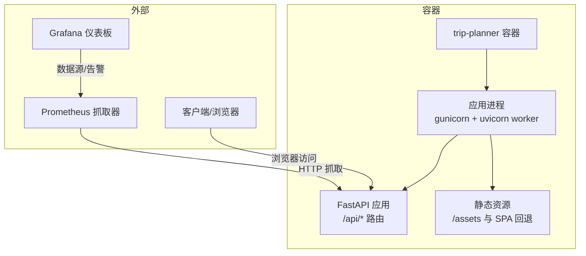
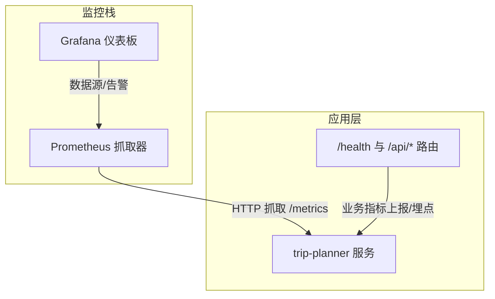
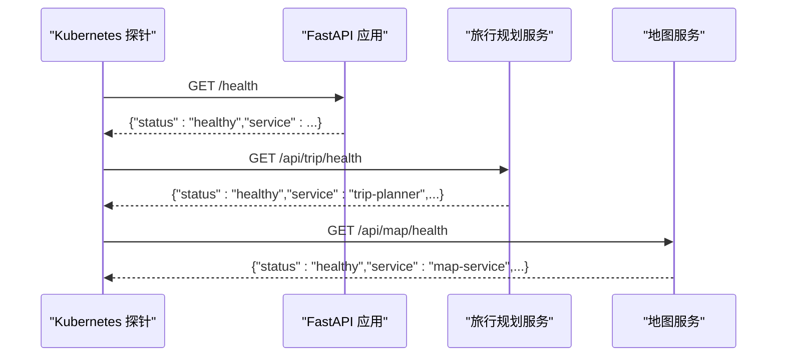
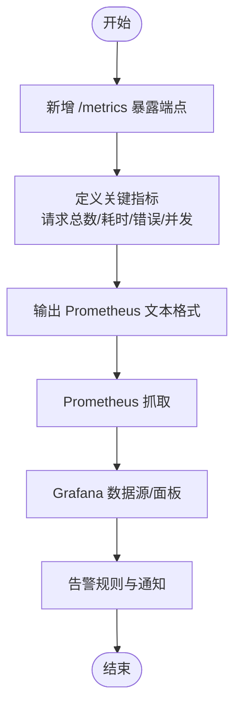
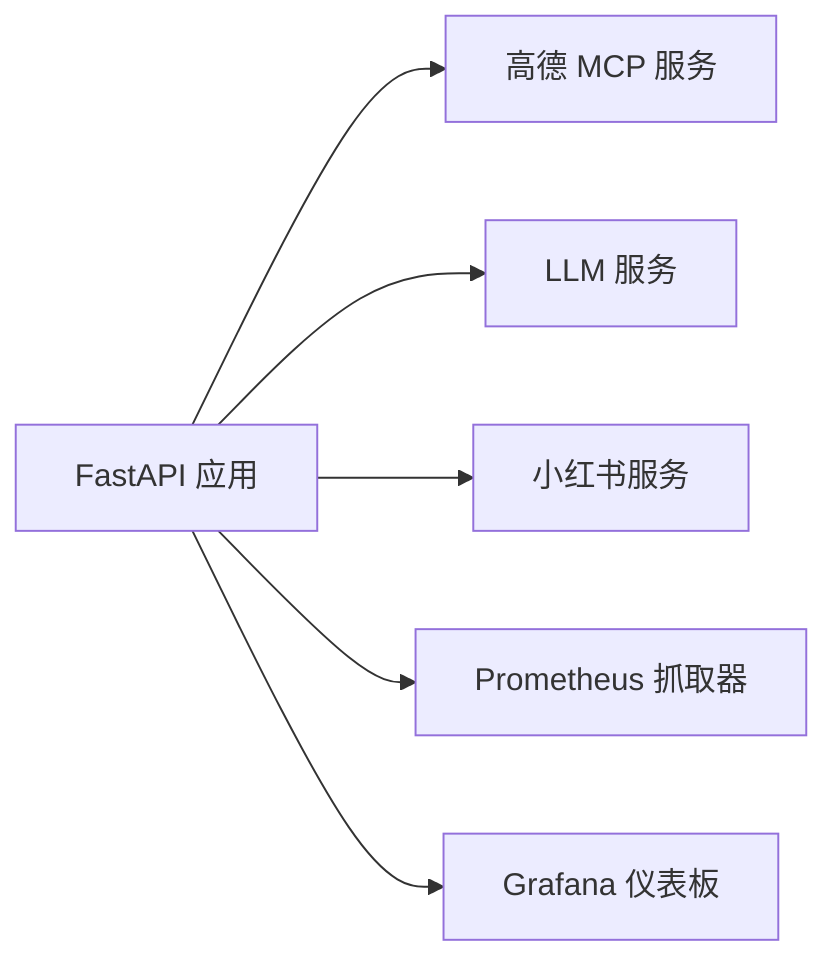

# 应用监控

<cite>
**本文引用的文件**
- [README.md](file://README.md)
- [docker-compose.yaml](file://docker-compose.yaml)
- [Dockerfile](file://Dockerfile)
- [start.sh](file://start.sh)
- [backend/app/api/main.py](file://backend/app/api/main.py)
- [backend/app/api/routes/trip.py](file://backend/app/api/routes/trip.py)
- [backend/app/api/routes/map.py](file://backend/app/api/routes/map.py)
- [backend/app/config.py](file://backend/app/config.py)
- [backend/run.py](file://backend/run.py)
- [backend/requirements.txt](file://backend/requirements.txt)
- [backend/app/services/xhs_sign/xhs_xray.js](file://backend/app/services/xhs_sign/xhs_xray.js)
</cite>

## 目录
1. [引言](#引言)
2. [项目结构](#项目结构)
3. [核心组件](#核心组件)
4. [架构总览](#架构总览)
5. [详细组件分析](#详细组件分析)
6. [依赖分析](#依赖分析)
7. [性能考量](#性能考量)
8. [故障排查指南](#故障排查指南)
9. [结论](#结论)
10. [附录](#附录)

## 引言
本指南面向运维与开发团队，围绕 TripStar 应用的监控体系提供“从零到一”的落地配置方案。内容涵盖：
- 应用性能指标监控：响应时间、吞吐量、错误率等关键指标的采集与展示思路
- Prometheus 监控系统集成：指标暴露端点、抓取间隔、监控目标配置
- Grafana 仪表板搭建：数据源配置、面板创建、告警规则设置
- 应用健康检查：存活探针、就绪探针的设置建议
- 分布式追踪：链路追踪、性能分析与问题定位
- 监控数据存储与保留：清理、压缩、备份策略

说明：当前仓库未包含 Prometheus/Grafana/Tracing 等外部组件的集成代码，本指南提供“如何在现有应用上扩展”和“最佳实践”，帮助您在不侵入业务代码的前提下完成监控落地。

## 项目结构
TripStar 采用前后端分离架构，后端基于 FastAPI，容器化部署通过 Docker Compose 编排。核心运行路径如下：
- 后端入口：FastAPI 应用位于 backend/app/api/main.py
- 启动方式：本地开发通过 run.py 使用 uvicorn；生产通过 start.sh 使用 gunicorn + uvicorn worker
- 容器编排：docker-compose.yaml 定义服务端口、环境变量与重启策略
- 健康检查：应用根路径与各路由均提供 /health 接口

图表来源
- [docker-compose.yaml:1-24](file://docker-compose.yaml#L1-L24)
- [Dockerfile:56-64](file://Dockerfile#L56-L64)
- [start.sh:13-20](file://start.sh#L13-L20)
- [backend/app/api/main.py:112-136](file://backend/app/api/main.py#L112-L136)

章节来源
- [README.md:129-200](file://README.md#L129-L200)
- [docker-compose.yaml:1-24](file://docker-compose.yaml#L1-L24)
- [Dockerfile:1-64](file://Dockerfile#L1-L64)
- [start.sh:1-20](file://start.sh#L1-L20)
- [backend/app/api/main.py:112-136](file://backend/app/api/main.py#L112-L136)

## 核心组件
- 应用进程与绑定
  - 生产：gunicorn + UvicornWorker 绑定 HOST:PORT，访问日志与错误日志输出至标准流
  - 本地：uvicorn 直接运行
- 健康检查
  - 应用级：GET /health 返回服务状态与版本
  - 业务级：/api/trip/health 与 /api/map/health 返回对应子服务可用性
- 配置管理
  - Settings 读取环境变量，支持运行时覆盖与持久化
- 日志
  - 通过环境变量控制日志级别，生产建议 INFO 或更高

章节来源
- [start.sh:13-20](file://start.sh#L13-L20)
- [backend/run.py:6-16](file://backend/run.py#L6-L16)
- [backend/app/api/main.py:112-119](file://backend/app/api/main.py#L112-L119)
- [backend/app/api/routes/trip.py:491-508](file://backend/app/api/routes/trip.py#L491-L508)
- [backend/app/api/routes/map.py:142-162](file://backend/app/api/routes/map.py#L142-L162)
- [backend/app/config.py:21-71](file://backend/app/config.py#L21-L71)

## 架构总览
下图展示了监控视角下的系统交互：Prometheus 作为抓取器定期拉取指标，Grafana 作为可视化与告警平台消费指标，客户端通过浏览器访问应用。

图表来源
- [backend/app/api/main.py:112-136](file://backend/app/api/main.py#L112-L136)
- [docker-compose.yaml:11-23](file://docker-compose.yaml#L11-L23)

## 详细组件分析

### 应用健康检查配置
- 存活探针（Liveness Probe）
  - 建议使用 HTTP GET 访问 /health，超时与周期根据业务压力调整
- 就绪探针（Readiness Probe）
  - 建议对 /api/trip/health 与 /api/map/health 进行探测，确保子服务可用后再对外提供流量
- 健康检查实现要点
  - 应用级 /health 返回服务与版本信息
  - 业务级 /health 对应服务内部依赖（如地图服务可用性）进行校验

图表来源
- [backend/app/api/main.py:112-119](file://backend/app/api/main.py#L112-L119)
- [backend/app/api/routes/trip.py:491-508](file://backend/app/api/routes/trip.py#L491-L508)
- [backend/app/api/routes/map.py:142-162](file://backend/app/api/routes/map.py#L142-L162)

章节来源
- [backend/app/api/main.py:112-119](file://backend/app/api/main.py#L112-L119)
- [backend/app/api/routes/trip.py:491-508](file://backend/app/api/routes/trip.py#L491-L508)
- [backend/app/api/routes/map.py:142-162](file://backend/app/api/routes/map.py#L142-L162)

### 性能指标采集与展示（基于现有应用的扩展建议）
当前仓库未内置指标暴露端点，建议通过以下方式扩展：
- 指标暴露端点
  - 新增 /metrics 路由，返回符合 Prometheus 文本格式的指标
  - 关键指标建议：请求总数、请求耗时（直方图/摘要）、错误计数、并发请求数、业务成功率
- 指标采集与展示
  - Prometheus 以固定抓取间隔拉取 /metrics
  - Grafana 作为数据源连接 Prometheus，创建面板展示响应时间、吞吐量、错误率等

（本图为概念流程，无需图表来源）

### 分布式追踪配置（链路追踪、性能分析、问题定位）
- 追踪目标
  - 从 /api/trip/plan 到旅行规划完成的全链路调用
  - 地图服务、LLM 服务、小红书服务等外部依赖
- 建议方案
  - 在 FastAPI 中引入 OpenTelemetry SDK，自动注入 HTTP 客户端/服务器插桩
  - 采样策略：生产环境建议 1%~5%
  - 追踪数据导出：支持 Zipkin/Jaeger/OTLP 等后端
- 问题定位
  - 通过 Trace ID 快速定位慢请求与异常节点
  - 结合日志与指标进行根因分析

（本节为概念性指导，无需章节来源）

### 监控数据存储与保留策略
- 数据保留
  - Prometheus 通过 retention 参数控制本地数据保留时长
- 数据清理
  - 使用 remote write 将热数据导出到长期存储（如 Cortex/Mimir/Loki+Prometheus）
- 数据压缩与备份
  - 通过远程存储的压缩与快照能力实现
- 备份
  - 对 Prometheus 的 WAL 与快照进行周期性备份

（本节为通用运维建议，无需章节来源）

## 依赖分析
- 运行时依赖
  - gunicorn + uvicorn worker：生产进程模型
  - uvicorn：本地开发与调试
- 外部服务
  - 高德地图 MCP 服务：地图能力依赖
  - LLM 服务：模型推理依赖
  - 小红书：内容抓取与图片检索依赖

图表来源
- [backend/requirements.txt:1-18](file://backend/requirements.txt#L1-L18)
- [backend/app/api/main.py:112-136](file://backend/app/api/main.py#L112-L136)

章节来源
- [backend/requirements.txt:1-18](file://backend/requirements.txt#L1-L18)
- [backend/app/api/main.py:112-136](file://backend/app/api/main.py#L112-L136)

## 性能考量
- 进程模型
  - 生产使用 gunicorn + UvicornWorker，具备更好的稳定性与资源隔离
- 超时与并发
  - 适当设置请求超时与并发上限，避免突发流量导致 OOM
- 日志级别
  - 生产环境建议 INFO，避免过多 DEBUG 日志影响性能
- 健康检查频率
  - 探针周期与超时需结合实例规模与网络状况调整，避免误判

（本节为通用建议，无需章节来源）

## 故障排查指南
- 健康检查失败
  - 应用级：确认 /health 返回值与日志
  - 业务级：检查 /api/trip/health 与 /api/map/health 的依赖服务可用性
- 端口与绑定
  - 确认容器映射端口与 HOST:PORT 配置一致
- 日志定位
  - 查看 gunicorn 访问日志与错误日志，结合业务异常堆栈定位问题
- 配置校验
  - 使用配置校验函数检查必要参数是否齐全

章节来源
- [backend/app/api/main.py:112-119](file://backend/app/api/main.py#L112-L119)
- [backend/app/api/routes/trip.py:491-508](file://backend/app/api/routes/trip.py#L491-L508)
- [backend/app/api/routes/map.py:142-162](file://backend/app/api/routes/map.py#L142-L162)
- [docker-compose.yaml:11-23](file://docker-compose.yaml#L11-L23)
- [start.sh:13-20](file://start.sh#L13-L20)
- [backend/app/config.py:162-180](file://backend/app/config.py#L162-L180)

## 结论
- 当前仓库提供了健康检查与基础运行环境，但缺少指标暴露与可视化集成
- 建议在不侵入业务代码的前提下，通过 /metrics 暴露端点、Prometheus 抓取与 Grafana 展示完成监控闭环
- 结合存活/就绪探针与分布式追踪，可实现从“可用性”到“性能与根因”的全链路可观测

（本节为总结性内容，无需章节来源）

## 附录
- 快速对照清单
  - 是否暴露 /metrics？是否符合 Prometheus 文本格式？
  - Prometheus 是否能成功抓取？抓取间隔与超时是否合理？
  - Grafana 是否配置 Prometheus 数据源并创建关键面板？
  - 是否设置存活/就绪探针？是否启用告警规则？
  - 是否启用分布式追踪？Trace ID 是否可追踪？

（本节为通用清单，无需章节来源）