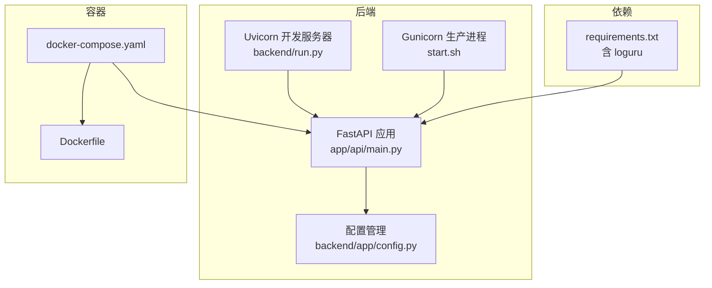
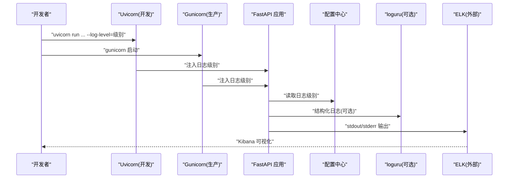
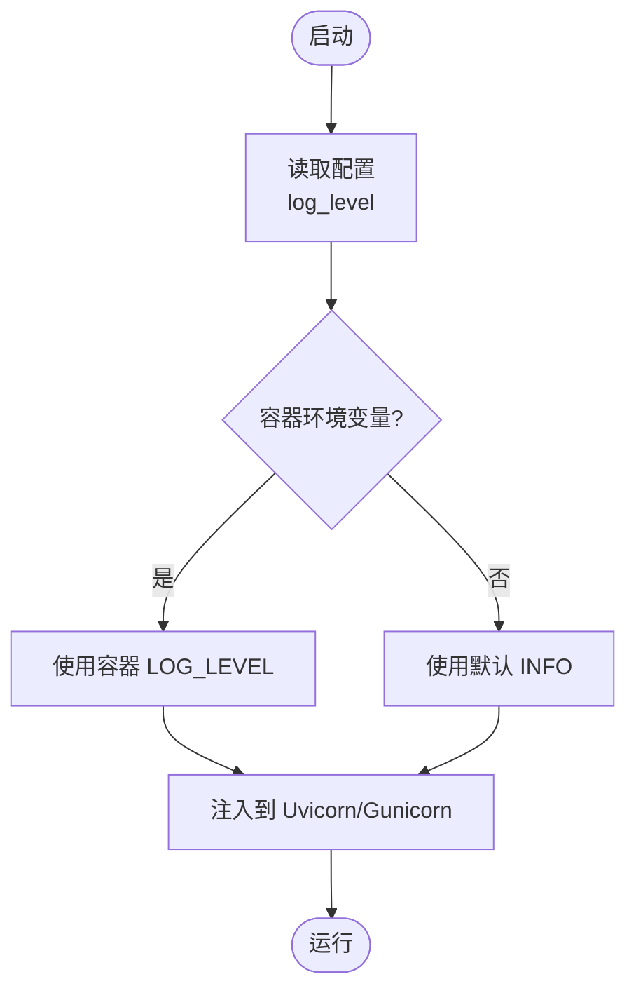
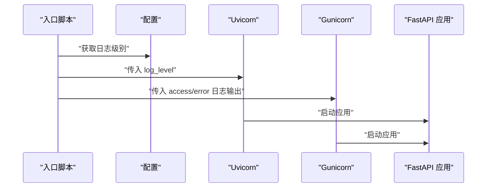
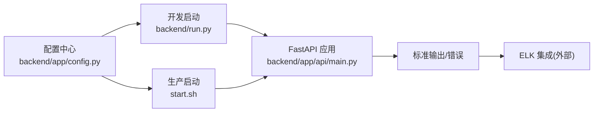

# 日志管理

<cite>
**本文引用的文件**
- [backend/app/config.py](file://backend/app/config.py)
- [backend/run.py](file://backend/run.py)
- [backend/app/api/main.py](file://backend/app/api/main.py)
- [docker-compose.yaml](file://docker-compose.yaml)
- [Dockerfile](file://Dockerfile)
- [start.sh](file://start.sh)
- [backend/requirements.txt](file://backend/requirements.txt)
- [backend/app/agents/trip_planner_agent.py](file://backend/app/agents/trip_planner_agent.py)
- [README.md](file://README.md)
</cite>

## 目录
1. [简介](#简介)
2. [项目结构](#项目结构)
3. [核心组件](#核心组件)
4. [架构总览](#架构总览)
5. [详细组件分析](#详细组件分析)
6. [依赖分析](#依赖分析)
7. [性能考量](#性能考量)
8. [故障排查指南](#故障排查指南)
9. [结论](#结论)
10. [附录](#附录)

## 简介
本指南面向 TripStar 项目的日志管理配置与运维，聚焦以下方面：
- 应用日志输出格式与日志级别设置
- 日志轮转与外部 ELK Stack（Elasticsearch、Logstash、Kibana）集成方案
- Kibana 仪表板与告警配置思路
- 日志分析最佳实践（聚合、过滤、搜索）
- 日志存储优化（空间、压缩、归档）
- 日志安全与权限控制（访问控制、脱敏、审计）

说明：当前仓库未内置日志轮转与 ELK 配置文件，本文提供可落地的配置建议与实施步骤，便于在现有启动流程基础上扩展。

## 项目结构
后端采用 FastAPI + Uvicorn（开发）或 Gunicorn + UvicornWorker（生产）的组合，日志级别由配置统一注入。Docker 环境通过环境变量传递运行时配置。

**图示来源**
- [backend/app/api/main.py](file://backend/app/api/main.py)
- [backend/run.py](file://backend/run.py)
- [start.sh](file://start.sh)
- [docker-compose.yaml](file://docker-compose.yaml)
- [Dockerfile](file://Dockerfile)
- [backend/requirements.txt](file://backend/requirements.txt)

**章节来源**
- [backend/app/api/main.py](file://backend/app/api/main.py)
- [backend/run.py](file://backend/run.py)
- [start.sh](file://start.sh)
- [docker-compose.yaml](file://docker-compose.yaml)
- [Dockerfile](file://Dockerfile)
- [backend/requirements.txt](file://backend/requirements.txt)

## 核心组件
- 配置中心：集中管理日志级别等运行时参数，支持环境变量与运行时覆盖持久化。
- 启动入口：开发模式使用 Uvicorn，生产模式使用 Gunicorn + UvicornWorker，二者均支持日志级别注入。
- 日志库：项目依赖 loguru，可用于补充结构化日志与轮转策略。

**章节来源**
- [backend/app/config.py](file://backend/app/config.py)
- [backend/run.py](file://backend/run.py)
- [start.sh](file://start.sh)
- [backend/requirements.txt](file://backend/requirements.txt)

## 架构总览
下图展示日志在不同环境下的流向与关键控制点：

**图示来源**
- [backend/run.py](file://backend/run.py)
- [start.sh](file://start.sh)
- [backend/app/config.py](file://backend/app/config.py)
- [backend/app/api/main.py](file://backend/app/api/main.py)
- [backend/requirements.txt](file://backend/requirements.txt)

## 详细组件分析

### 配置与日志级别
- 配置项：日志级别通过配置对象统一管理，开发与生产均可读取该值。
- 注入方式：开发模式通过 Uvicorn 启动参数注入；生产模式通过 Gunicorn 参数注入。
- 默认值：默认 INFO 级别，可在环境变量中调整。

**图示来源**
- [backend/app/config.py](file://backend/app/config.py)
- [backend/run.py](file://backend/run.py)
- [start.sh](file://start.sh)

**章节来源**
- [backend/app/config.py](file://backend/app/config.py)
- [backend/run.py](file://backend/run.py)
- [start.sh](file://start.sh)

### 启动与日志输出
- 开发模式：Uvicorn 直接启动，日志级别来自配置。
- 生产模式：Gunicorn 作为 WSGI 容器，Uvicorn 作为 Worker，日志输出至标准输出/错误，便于外部收集。

**图示来源**
- [backend/run.py](file://backend/run.py)
- [start.sh](file://start.sh)
- [backend/app/api/main.py](file://backend/app/api/main.py)

**章节来源**
- [backend/run.py](file://backend/run.py)
- [start.sh](file://start.sh)
- [backend/app/api/main.py](file://backend/app/api/main.py)

### 日志轮转与外部 ELK 集成
当前仓库未包含日志轮转与 ELK 配置文件。以下为可落地的建议步骤（概念性说明，不对应具体文件）：
- 在容器侧启用标准输出/错误日志收集，交由外部日志系统统一处理。
- 在宿主机或容器内部署日志轮转工具（如 logrotate），对 stdout/stderr 的符号链接文件进行轮转。
- 部署 ELK Stack：Elasticsearch 存储、Logstash 进行解析与过滤、Kibana 进行可视化。
- 在 Logstash 中编写管道规则，将日志按时间字段切分索引，清洗字段并标准化结构。
- 在 Kibana 中创建索引模式、仪表板与告警规则。

[本节为概念性说明，不直接分析具体文件，故无“章节来源”]

### Kibana 仪表板与告警配置
- 索引模式：基于 Logstash 输出的索引命名规则建立索引模式。
- 查询与可视化：使用日志中的服务名、路径、方法、状态码、异常堆栈等字段构建查询与图表。
- 告警规则：基于错误率、响应时间、特定异常关键字等触发告警。

[本节为概念性说明，不直接分析具体文件，故无“章节来源”]

### 日志分析最佳实践
- 聚合：按服务名、路径、状态码、用户标识等维度聚合统计。
- 过滤：优先过滤健康检查与静态资源，聚焦业务日志。
- 搜索：使用通配符与正则表达式定位异常堆栈与关键错误信息。
- 时间范围：结合业务高峰时段进行分析，关注延迟与错误峰值。

[本节为概念性说明，不直接分析具体文件，故无“章节来源”]

### 日志存储优化
- 存储空间：通过日志轮转与保留策略限制磁盘占用。
- 压缩：对旧日志进行压缩归档，降低存储成本。
- 归档：按月/季度归档至对象存储，保留合规周期内的日志。

[本节为概念性说明，不直接分析具体文件，故无“章节来源”]

### 日志安全与权限控制
- 访问控制：仅授权人员可访问日志系统与 Kibana。
- 日志脱敏：对敏感字段（如 Cookie、Token、手机号、邮箱）进行脱敏处理。
- 审计日志：记录对日志系统的访问与操作行为，定期审计。

[本节为概念性说明，不直接分析具体文件，故无“章节来源”]

## 依赖分析
- 启动链路：配置 → 启动脚本 → 应用 → 日志输出。
- 外部依赖：ELK Stack（Elasticsearch、Logstash、Kibana）与日志轮转工具。

**图示来源**
- [backend/app/config.py](file://backend/app/config.py)
- [backend/run.py](file://backend/run.py)
- [start.sh](file://start.sh)
- [backend/app/api/main.py](file://backend/app/api/main.py)

**章节来源**
- [backend/app/config.py](file://backend/app/config.py)
- [backend/run.py](file://backend/run.py)
- [start.sh](file://start.sh)
- [backend/app/api/main.py](file://backend/app/api/main.py)

## 性能考量
- 日志级别：生产环境建议 INFO 或更高，减少低价值日志对 IO 的影响。
- 结构化日志：使用结构化字段（服务名、请求 ID、路径、状态码、耗时）便于检索与聚合。
- 异步写入：在高吞吐场景下，建议将日志写入与业务处理解耦，避免阻塞请求。
- 采样：对高频接口进行采样输出，平衡可观测性与性能。

[本节为一般性指导，不直接分析具体文件，故无“章节来源”]

## 故障排查指南
- 启动日志缺失：确认容器启动命令是否正确传递日志级别参数。
- 日志乱码：确保标准输出编码为 UTF-8，必要时在启动脚本中强制 reconfigure。
- 权限问题：检查容器内用户对日志输出目录的写入权限。
- 配置未生效：核对环境变量键名大小写与拼写，确认容器环境变量覆盖顺序。

**章节来源**
- [backend/app/api/main.py](file://backend/app/api/main.py)
- [start.sh](file://start.sh)
- [docker-compose.yaml](file://docker-compose.yaml)

## 结论
- 本项目已具备统一的日志级别配置与启动注入能力，满足基础可观测性需求。
- 建议在生产环境中引入外部日志系统与轮转策略，配合 Kibana 实现可视化与告警。
- 通过结构化日志与规范化字段，可显著提升日志分析效率与安全性。

[本节为总结性内容，不直接分析具体文件，故无“章节来源”]

## 附录

### A. 日志级别与启动参数对照
- 开发模式：通过 Uvicorn 启动参数设置日志级别。
- 生产模式：通过 Gunicorn 启动参数设置访问/错误日志输出。

**章节来源**
- [backend/run.py](file://backend/run.py)
- [start.sh](file://start.sh)

### B. 容器环境变量与日志
- 容器启动时通过环境变量传递日志级别，便于统一管理。

**章节来源**
- [docker-compose.yaml](file://docker-compose.yaml)

### C. 依赖与日志库
- 项目依赖包含结构化日志库，可按需扩展为结构化输出与轮转策略。

**章节来源**
- [backend/requirements.txt](file://backend/requirements.txt)

### D. 启动脚本与标准输出
- 生产启动脚本将访问日志与错误日志输出到标准输出，便于外部收集。

**章节来源**
- [start.sh](file://start.sh)

### E. 配置与运行时覆盖
- 配置支持运行时覆盖并持久化，日志级别亦可动态调整。

**章节来源**
- [backend/app/config.py](file://backend/app/config.py)

### F. 多智能体模块中的打印输出
- 模块内部使用 print 输出进度与状态，建议逐步迁移到结构化日志。

**章节来源**
- [backend/app/agents/trip_planner_agent.py](file://backend/app/agents/trip_planner_agent.py)