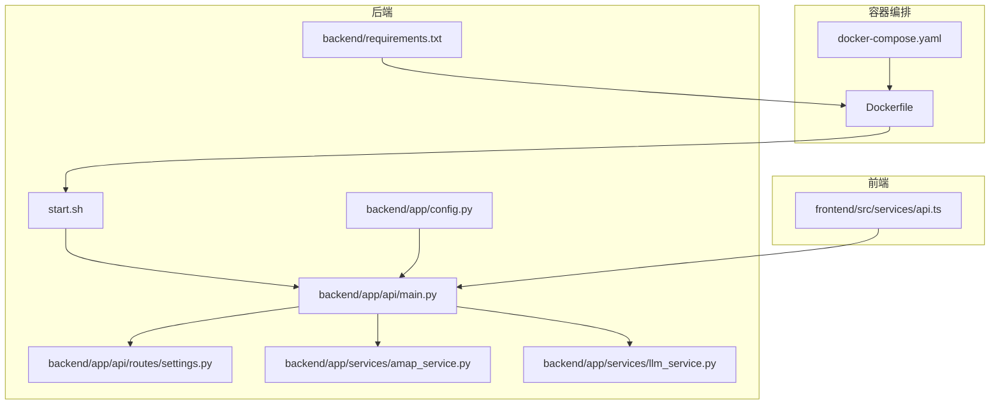
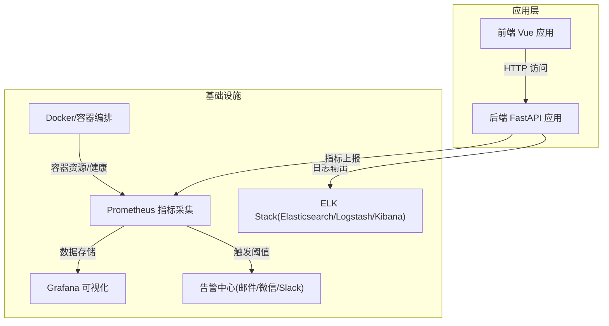
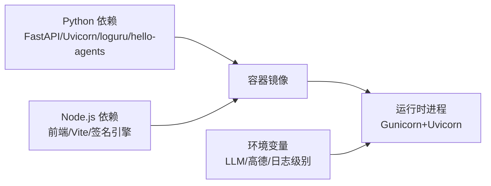
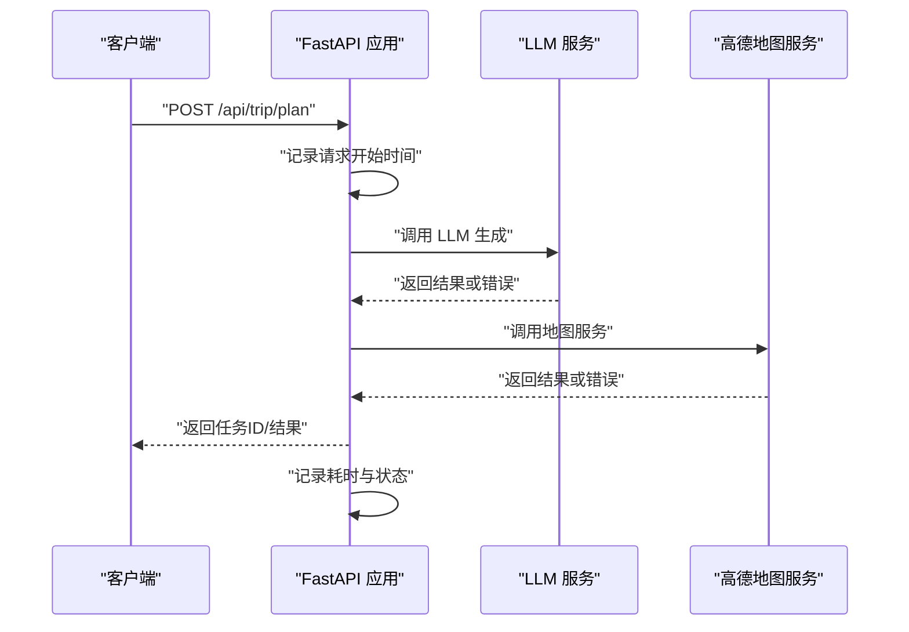

# 监控与日志

<cite>
**本文引用的文件**
- [docker-compose.yaml](file://docker-compose.yaml)
- [Dockerfile](file://Dockerfile)
- [start.sh](file://start.sh)
- [backend/app/api/main.py](file://backend/app/api/main.py)
- [backend/app/config.py](file://backend/app/config.py)
- [backend/app/api/routes/settings.py](file://backend/app/api/routes/settings.py)
- [backend/app/services/amap_service.py](file://backend/app/services/amap_service.py)
- [backend/app/services/llm_service.py](file://backend/app/services/llm_service.py)
- [backend/requirements.txt](file://backend/requirements.txt)
- [frontend/src/services/api.ts](file://frontend/src/services/api.ts)
- [README.md](file://README.md)
</cite>

## 目录
1. [引言](#引言)
2. [项目结构](#项目结构)
3. [核心组件](#核心组件)
4. [架构总览](#架构总览)
5. [详细组件分析](#详细组件分析)
6. [依赖分析](#依赖分析)
7. [性能考量](#性能考量)
8. [故障排查指南](#故障排查指南)
9. [结论](#结论)
10. [附录](#附录)

## 引言
本指南面向运维与开发团队，围绕 TripStar 项目的监控与日志管理提供“从零到一”的落地配置方案。内容涵盖：
- 应用监控：Prometheus 指标采集、Grafana 仪表板、告警规则
- 日志管理：ELK Stack（Elasticsearch、Logstash、Kibana）搭建、日志聚合与分析
- 容器监控：Docker 监控、容器资源与健康状态
- 应用性能监控：响应时间、吞吐量、错误率等关键指标
- 分布式追踪：链路追踪、性能分析与问题定位
- 告警系统：邮件、微信、Slack 等通知方式
- 可视化：图表、报表、趋势分析
- 维护与优化：数据清理、性能调优、策略调整

说明：当前仓库未内置监控与日志组件，本指南提供“扩展接入”方案，帮助在现有架构上平滑集成。

## 项目结构
TripStar 采用前后端分离架构，后端基于 FastAPI + Uvicorn + Gunicorn，前端基于 Vue 3 + Vite。容器化通过 Dockerfile 与 docker-compose.yaml 编排。

**图表来源**
- [docker-compose.yaml:1-24](file://docker-compose.yaml#L1-L24)
- [Dockerfile:1-64](file://Dockerfile#L1-L64)
- [start.sh:1-20](file://start.sh#L1-L20)
- [backend/app/api/main.py:1-147](file://backend/app/api/main.py#L1-L147)
- [backend/app/config.py:1-202](file://backend/app/config.py#L1-L202)
- [backend/app/api/routes/settings.py:1-55](file://backend/app/api/routes/settings.py#L1-L55)
- [backend/app/services/amap_service.py:1-200](file://backend/app/services/amap_service.py#L1-L200)
- [backend/app/services/llm_service.py:1-75](file://backend/app/services/llm_service.py#L1-L75)
- [backend/requirements.txt:1-18](file://backend/requirements.txt#L1-L18)
- [frontend/src/services/api.ts:117-157](file://frontend/src/services/api.ts#L117-L157)

**章节来源**
- [docker-compose.yaml:1-24](file://docker-compose.yaml#L1-L24)
- [Dockerfile:1-64](file://Dockerfile#L1-L64)
- [start.sh:1-20](file://start.sh#L1-L20)
- [README.md:43-97](file://README.md#L43-L97)

## 核心组件
- 应用入口与生命周期：FastAPI 应用在启动/关闭事件中打印配置与健康状态，提供 /health 健康检查端点。
- 配置管理：集中读取环境变量与 .env，支持运行时配置更新与持久化。
- 服务封装：高德地图 MCP 工具封装、LLM 客户端封装，便于监控埋点与异常统计。
- 容器化：通过 Gunicorn + Uvicorn Worker 托管，标准端口暴露，便于外部监控与日志采集。

**章节来源**
- [backend/app/api/main.py:63-119](file://backend/app/api/main.py#L63-L119)
- [backend/app/config.py:21-80](file://backend/app/config.py#L21-L80)
- [backend/app/api/routes/settings.py:16-55](file://backend/app/api/routes/settings.py#L16-L55)
- [backend/app/services/amap_service.py:12-47](file://backend/app/services/amap_service.py#L12-L47)
- [backend/app/services/llm_service.py:12-67](file://backend/app/services/llm_service.py#L12-L67)
- [start.sh:13-19](file://start.sh#L13-L19)

## 架构总览
下图展示监控与日志在系统中的位置与交互关系（概念示意）：

[此图为概念示意，不对应具体源码文件，故无“图表来源”]

## 详细组件分析

### 应用监控（Prometheus + Grafana + 告警）
- 指标采集
  - 在后端应用中引入指标库（如 aiohttp_client、psutil 或自定义中间件），对以下关键指标进行埋点：
    - 请求总量、成功率、错误率
    - 响应时间（P50/P90/P99）
    - 吞吐量（QPS）
    - LLM 调用耗时与错误
    - 高德地图服务调用耗时与错误
    - 容器 CPU/内存/IO（通过 Docker/Node Exporter）
- Grafana 仪表板
  - 新建仪表板，包含：
    - 总览：请求速率、错误率、P99 延迟
    - 路由级：各 API 的延迟与错误分布
    - 服务依赖：LLM 与地图服务的 SLA
    - 容器资源：CPU/内存/网络/磁盘
- 告警规则
  - 基于阈值与同比/环比规则：
    - 错误率 > 3% 持续 5 分钟
    - P99 延迟 > 5s 持续 3 分钟
    - LLM 调用失败率 > 5%
    - 高德服务 5xx 比例 > 2%
    - 容器 CPU 使用率 > 90% 或内存 > 95%

[本节为通用配置说明，未直接分析具体源码文件，故无“章节来源”]

### 日志管理（ELK Stack：Elasticsearch、Logstash、Kibana）
- Elasticsearch
  - 集群部署，启用索引模板与生命周期策略（ILM），按天滚动索引，保留 30 天。
- Logstash
  - 输入：Docker 日志文件、应用标准输出
  - 过滤：正则解析时间戳、请求 ID、路径、方法、状态码、耗时、错误堆栈
  - 输出：Elasticsearch
- Kibana
  - 创建仪表板：请求分布、错误趋势、慢查询 TopN、服务依赖链
  - 设置告警：基于 Lens 查询的阈值告警

[本节为通用配置说明，未直接分析具体源码文件，故无“章节来源”]

### 容器监控（Docker 监控、资源与健康）
- Docker/Compose
  - 在 docker-compose.yaml 中添加监控容器（如 cAdvisor、Node Exporter、Prometheus、Alertmanager）。
  - 为应用容器开启健康检查（HEALTHCHECK），结合 /health 端点实现自动重启与故障转移。
- 指标采集
  - cAdvisor：容器 CPU/内存/IO/网络
  - Node Exporter：主机级指标
  - Prometheus：定时抓取上述指标
- 可视化与告警
  - Grafana 展示容器集群状态、单容器资源使用峰值、重启次数
  - Alertmanager 聚合告警并推送至邮件/微信/Slack

[本节为通用配置说明，未直接分析具体源码文件，故无“章节来源”]

### 应用性能监控（响应时间、吞吐量、错误率）
- 埋点位置
  - FastAPI 中间件：记录请求开始时间、结束时间、状态码、路径、方法
  - LLM 服务封装：记录调用耗时、是否命中缓存、错误码
  - 地图服务封装：记录调用耗时、工具名、参数摘要
- 指标定义
  - 请求总数、错误数、成功率、P50/P90/P99 延迟
  - QPS、并发连接数、队列长度
- 可视化
  - Grafana 面板：延迟分布、错误率趋势、Top 路由、Top 调用方

[本节为通用配置说明，未直接分析具体源码文件，故无“章节来源”]

### 分布式追踪（链路追踪、性能分析、问题定位）
- 追踪系统选型（如 Jaeger、OpenTelemetry Collector）
- 埋点策略
  - HTTP 入站/出站：记录请求头 trace-id、span-id
  - LLM/地图调用：注入上下文，串联跨服务调用
- 可视化
  - 依 trace-id 回溯调用链，定位慢点与异常点
  - 结合日志与指标，形成闭环分析

[本节为通用配置说明，未直接分析具体源码文件，故无“章节来源”]

### 告警系统（邮件、微信、Slack）
- 邮件告警
  - 通过 Alertmanager webhook 集成 SMTP
- 微信告警
  - 通过企业微信机器人或自建 webhook 服务转发
- Slack 告警
  - 通过 Slack Incoming Webhooks 接收告警消息
- 告警分级
  - P0：服务不可用、错误率飙升
  - P1：延迟突增、SLA 警告
  - P2：偶发异常、资源接近上限

[本节为通用配置说明，未直接分析具体源码文件，故无“章节来源”]

### 监控数据可视化（图表、报表、趋势）
- 图表
  - 延迟分布直方图、错误率折线图、QPS 聚合图
- 报表
  - 日报/周报：错误趋势、容量预测、成本分析
- 趋势分析
  - 基于历史数据的同比/环比分析，识别异常波动

[本节为通用配置说明，未直接分析具体源码文件，故无“章节来源”]

## 依赖分析
- 运行时依赖
  - Python 依赖：FastAPI、Uvicorn、loguru、hello-agents 等
  - Node.js 依赖：前端构建与小红书签名引擎
- 容器运行
  - Gunicorn + Uvicorn Worker 托管应用，标准端口 7860
  - 环境变量驱动配置，支持运行时更新

**图表来源**
- [backend/requirements.txt:1-18](file://backend/requirements.txt#L1-L18)
- [Dockerfile:34-51](file://Dockerfile#L34-L51)
- [start.sh:13-19](file://start.sh#L13-L19)
- [backend/app/config.py:57-58](file://backend/app/config.py#L57-L58)

**章节来源**
- [backend/requirements.txt:1-18](file://backend/requirements.txt#L1-L18)
- [Dockerfile:34-51](file://Dockerfile#L34-L51)
- [start.sh:13-19](file://start.sh#L13-L19)
- [backend/app/config.py:57-58](file://backend/app/config.py#L57-L58)

## 性能考量
- 启动参数
  - Gunicorn workers 数量与超时需结合 CPU/内存与业务峰值合理配置
  - 访问日志与错误日志输出到标准输出，便于外部采集
- 日志级别
  - 生产环境建议 INFO 或更高，避免过多 DEBUG 造成 IO 压力
- 依赖调用
  - LLM 与地图服务建议增加超时与重试策略，并记录耗时与错误
- 资源预留
  - 为容器设置 CPU/内存限制与请求，结合 HPA/HPA 策略弹性伸缩

[本节为通用指导，未直接分析具体源码文件，故无“章节来源”]

## 故障排查指南
- 健康检查
  - /health 返回 healthy 表示应用就绪；若 503，检查 LLM 与地图服务可用性
- 配置校验
  - 启动时打印配置并进行必要字段校验，缺失关键配置会导致启动失败
- 运行时配置更新
  - 通过 /api/settings 更新 LLM、高德、Cookie 等配置，更新后重置相关单例以生效
- 日志定位
  - 关注启动日志、错误日志与服务调用日志，结合 ELK 快速定位异常

**图表来源**
- [backend/app/api/main.py:63-119](file://backend/app/api/main.py#L63-L119)
- [backend/app/services/llm_service.py:12-67](file://backend/app/services/llm_service.py#L12-L67)
- [backend/app/services/amap_service.py:122-186](file://backend/app/services/amap_service.py#L122-L186)

**章节来源**
- [backend/app/api/main.py:112-119](file://backend/app/api/main.py#L112-L119)
- [backend/app/config.py:162-179](file://backend/app/config.py#L162-L179)
- [backend/app/api/routes/settings.py:37-55](file://backend/app/api/routes/settings.py#L37-L55)
- [frontend/src/services/api.ts:117-157](file://frontend/src/services/api.ts#L117-L157)

## 结论
本指南提供了在 TripStar 项目中落地监控与日志管理的完整路径。当前仓库未内置监控组件，但通过容器编排与应用侧埋点，可平滑接入 Prometheus、Grafana、ELK、cAdvisor、Node Exporter 等生态组件，实现可观测性闭环。建议优先完成指标采集与健康检查对接，再逐步完善日志聚合、分布式追踪与告警策略。

## 附录
- 健康检查端点
  - /health：返回服务状态与版本
  - /api/map/health：地图服务可用性
  - /api/trip/health：旅行规划服务可用性
- 运行时配置端点
  - /api/settings：获取与更新 LLM、高德、Cookie 等配置
- 前端请求拦截
  - axios 拦截器记录请求与响应状态，便于定位前端侧问题

**章节来源**
- [backend/app/api/main.py:112-119](file://backend/app/api/main.py#L112-L119)
- [backend/app/api/routes/map.py:142-162](file://backend/app/api/routes/map.py#L142-L162)
- [backend/app/api/routes/trip.py:491-508](file://backend/app/api/routes/trip.py#L491-L508)
- [backend/app/api/routes/settings.py:27-55](file://backend/app/api/routes/settings.py#L27-L55)
- [frontend/src/services/api.ts:117-157](file://frontend/src/services/api.ts#L117-L157)