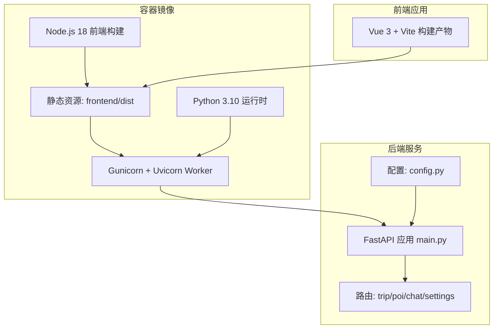
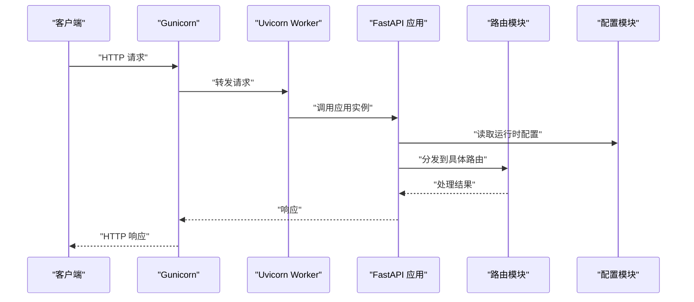
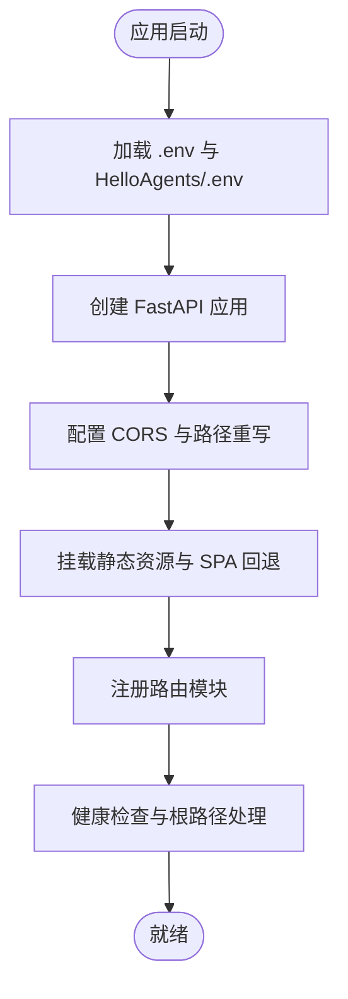
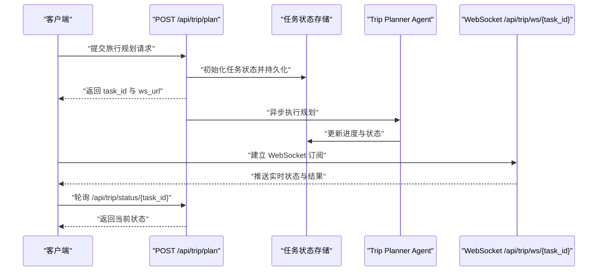
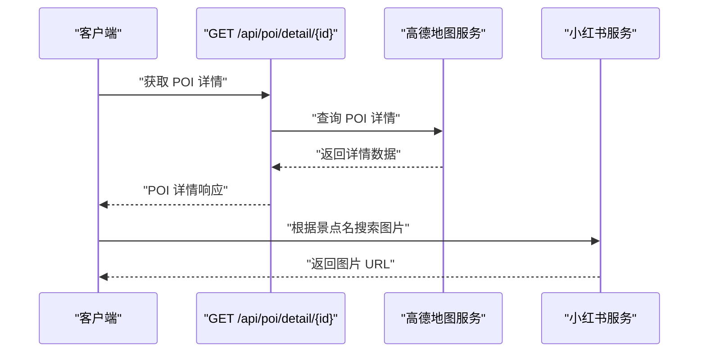
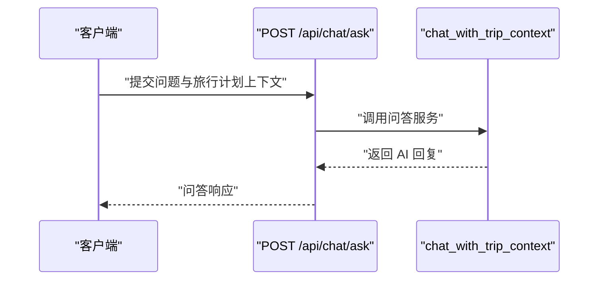
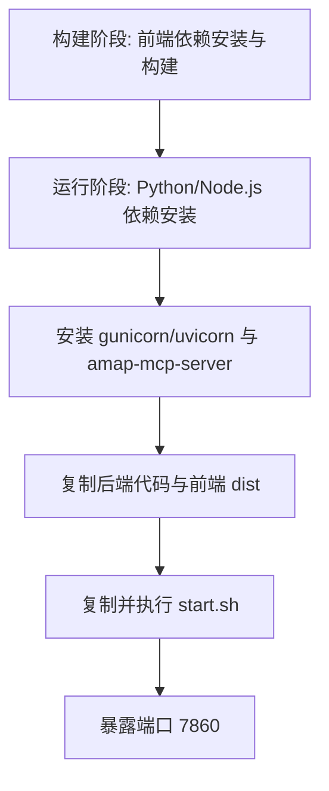
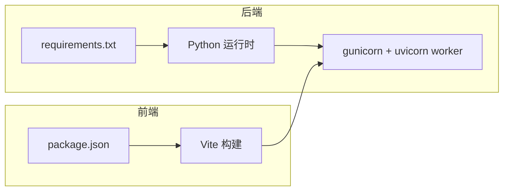

# 部署指南

<cite>
**本文引用的文件**
- [README.md](file://README.md)
- [Dockerfile](file://Dockerfile)
- [docker-compose.yaml](file://docker-compose.yaml)
- [start.sh](file://start.sh)
- [backend/app/api/main.py](file://backend/app/api/main.py)
- [backend/app/config.py](file://backend/app/config.py)
- [backend/app/api/routes/trip.py](file://backend/app/api/routes/trip.py)
- [backend/app/api/routes/poi.py](file://backend/app/api/routes/poi.py)
- [backend/app/api/routes/chat.py](file://backend/app/api/routes/chat.py)
- [backend/run.py](file://backend/run.py)
- [backend/requirements.txt](file://backend/requirements.txt)
- [frontend/package.json](file://frontend/package.json)
</cite>

## 目录
1. [简介](#简介)
2. [项目结构](#项目结构)
3. [核心组件](#核心组件)
4. [架构总览](#架构总览)
5. [详细组件分析](#详细组件分析)
6. [依赖关系分析](#依赖关系分析)
7. [性能考量](#性能考量)
8. [故障排查指南](#故障排查指南)
9. [结论](#结论)
10. [附录](#附录)

## 简介
本指南面向希望部署 TripStar（AI 旅行智能体）的工程师与运维人员，覆盖本地开发与生产环境部署方案，包含传统部署与容器化部署两种路径。文档重点围绕 Docker 容器化部署流程（Dockerfile 构建、docker-compose 编排、镜像管理）、生产环境最佳实践（服务器配置、负载均衡、SSL 证书、备份策略）、CI/CD 自动化部署、监控与日志管理、部署后验证与测试、常见问题排查以及不同部署场景的配置示例与最佳实践。

## 项目结构
项目采用前后端分离架构，后端为 Python FastAPI 应用，前端为 Vue 3 应用。容器化部署通过多阶段 Dockerfile 构建，将前端构建产物与后端服务打包至同一镜像，并通过 gunicorn+uvicorn worker 方式对外提供服务。

图表来源
- [Dockerfile:1-64](file://Dockerfile#L1-L64)
- [backend/app/api/main.py:1-147](file://backend/app/api/main.py#L1-L147)
- [backend/app/config.py:1-202](file://backend/app/config.py#L1-L202)

章节来源
- [README.md:205-232](file://README.md#L205-L232)
- [Dockerfile:1-64](file://Dockerfile#L1-L64)
- [backend/app/api/main.py:1-147](file://backend/app/api/main.py#L1-L147)

## 核心组件
- 后端服务（FastAPI）
  - 应用入口与中间件、CORS、静态文件挂载、健康检查、根路径回退。
  - 配置管理（Settings）与运行时覆盖、环境变量加载、配置校验与打印。
  - 路由模块：旅行规划（trip）、POI 查询与图片、聊天问答、地图与设置。
- 前端应用（Vue 3）
  - 通过 Vite 构建，生产环境静态资源挂载于后端。
- 容器运行时
  - 多阶段构建：前端构建阶段与最终运行阶段。
  - 启动脚本：gunicorn 绑定 HOST/PORT，uvicorn worker 执行应用。
  - docker-compose 编排：端口映射、环境变量注入、重启策略。

章节来源
- [backend/app/api/main.py:1-147](file://backend/app/api/main.py#L1-L147)
- [backend/app/config.py:1-202](file://backend/app/config.py#L1-L202)
- [backend/app/api/routes/trip.py:1-511](file://backend/app/api/routes/trip.py#L1-L511)
- [backend/app/api/routes/poi.py:1-133](file://backend/app/api/routes/poi.py#L1-L133)
- [backend/app/api/routes/chat.py:1-53](file://backend/app/api/routes/chat.py#L1-L53)
- [Dockerfile:1-64](file://Dockerfile#L1-L64)
- [start.sh:1-20](file://start.sh#L1-L20)
- [docker-compose.yaml:1-24](file://docker-compose.yaml#L1-L24)

## 架构总览
容器化部署采用“多阶段构建 + 运行时统一”的方式，前端构建产物与后端服务在同一镜像中，通过 gunicorn+uvicorn worker 提供服务。后端应用在启动时加载配置、注册路由、挂载静态资源，并提供健康检查与根路径回退。

图表来源
- [start.sh:13-19](file://start.sh#L13-L19)
- [backend/app/api/main.py:25-60](file://backend/app/api/main.py#L25-L60)
- [backend/app/config.py:21-72](file://backend/app/config.py#L21-L72)

## 详细组件分析

### 后端服务（FastAPI）
- 应用初始化
  - 中间件：CORS、路径重写（解决代理前缀问题）。
  - 路由注册：trip、poi、map、chat、settings。
  - 静态资源挂载：生产环境挂载前端 assets 与 SPA 回退。
- 配置管理
  - 支持 .env 与 HelloAgents/.env 叠加加载。
  - 运行时覆盖持久化与环境变量同步。
  - 配置校验与敏感信息打印控制。
- 健康检查与根路径
  - /health 返回服务状态。
  - / 返回前端页面或应用元信息。

图表来源
- [backend/app/api/main.py:25-136](file://backend/app/api/main.py#L25-L136)
- [backend/app/config.py:11-19](file://backend/app/config.py#L11-L19)

章节来源
- [backend/app/api/main.py:1-147](file://backend/app/api/main.py#L1-L147)
- [backend/app/config.py:1-202](file://backend/app/config.py#L1-L202)

### 旅行规划任务系统（异步轮询与 WebSocket）
- 任务模型
  - 内存任务池 + 本地 JSON 持久化，支持服务重启后的失败回退。
  - 任务状态字段：status、stage、progress、message、result、error。
- 执行流程
  - 提交任务立即返回 task_id；后台异步执行并回调进度。
  - WebSocket 订阅实时状态；轮询接口兼容旧客户端。
- 健康检查
  - 通过获取 Agent 实例与工具数量进行服务可用性检查。

图表来源
- [backend/app/api/routes/trip.py:276-313](file://backend/app/api/routes/trip.py#L276-L313)
- [backend/app/api/routes/trip.py:390-440](file://backend/app/api/routes/trip.py#L390-L440)
- [backend/app/api/routes/trip.py:442-488](file://backend/app/api/routes/trip.py#L442-L488)

章节来源
- [backend/app/api/routes/trip.py:1-511](file://backend/app/api/routes/trip.py#L1-L511)

### POI 与图片接口
- POI 详情与搜索：对接高德地图服务。
- 景点图片：基于小红书搜索与 SSR 抓取，返回图片直链。

图表来源
- [backend/app/api/routes/poi.py:18-85](file://backend/app/api/routes/poi.py#L18-L85)
- [backend/app/api/routes/poi.py:88-131](file://backend/app/api/routes/poi.py#L88-L131)

章节来源
- [backend/app/api/routes/poi.py:1-133](file://backend/app/api/routes/poi.py#L1-L133)

### 聊天问答接口
- 基于旅行计划上下文的智能问答，支持历史对话传递。

图表来源
- [backend/app/api/routes/chat.py:10-43](file://backend/app/api/routes/chat.py#L10-L43)

章节来源
- [backend/app/api/routes/chat.py:1-53](file://backend/app/api/routes/chat.py#L1-L53)

### 容器化部署（Dockerfile 与 docker-compose）
- 多阶段构建
  - 前端构建阶段：安装依赖、设置构建参数、构建产物 dist。
  - 运行阶段：安装 Python 与 Node.js、安装后端依赖、安装 gunicorn/uvicorn、预热 amap-mcp-server、复制后端与前端产物、启动脚本。
- 运行时绑定
  - 通过 start.sh 读取 HOST/PORT，使用 gunicorn+uvicorn worker 启动。
- 编排与环境变量
  - docker-compose 映射 7860:7860，注入 LLM、高德、小红书等关键环境变量，设置重启策略。

图表来源
- [Dockerfile:4-23](file://Dockerfile#L4-L23)
- [Dockerfile:29-58](file://Dockerfile#L29-L58)
- [start.sh:5-19](file://start.sh#L5-L19)

章节来源
- [Dockerfile:1-64](file://Dockerfile#L1-L64)
- [docker-compose.yaml:1-24](file://docker-compose.yaml#L1-L24)
- [start.sh:1-20](file://start.sh#L1-L20)

## 依赖关系分析
- 后端依赖
  - FastAPI、uvicorn、pydantic、pydantic-settings、httpx、aiohttp、loguru、hello-agents、fastmcp、huggingface_hub、python-multipart 等。
- 前端依赖
  - Vue 3、Ant Design Vue、Axios、ECharts、Swiper、Day.js、Vue I18n、Vite 等。
- 运行时依赖
  - gunicorn + uvicorn worker、Node.js（用于小红书签名引擎）。

图表来源
- [backend/requirements.txt:1-18](file://backend/requirements.txt#L1-L18)
- [frontend/package.json:1-35](file://frontend/package.json#L1-L35)

章节来源
- [backend/requirements.txt:1-18](file://backend/requirements.txt#L1-L18)
- [frontend/package.json:1-35](file://frontend/package.json#L1-L35)

## 性能考量
- 异步任务与轮询
  - 旅行规划任务通过异步队列与持久化避免超时与重启丢失，WebSocket 与轮询双通道降低前端等待成本。
- 静态资源与 SPA
  - 生产环境挂载前端静态资源与 SPA 回退，减少二次请求与路由抖动。
- 运行时绑定
  - 通过 gunicorn+uvicorn worker 提升并发与稳定性，合理设置超时与日志输出。
- 前端构建参数
  - 构建时注入高德 JS API Key，避免运行时配置开销。

章节来源
- [backend/app/api/routes/trip.py:276-313](file://backend/app/api/routes/trip.py#L276-L313)
- [backend/app/api/main.py:121-135](file://backend/app/api/main.py#L121-L135)
- [Dockerfile:15-23](file://Dockerfile#L15-L23)
- [start.sh:13-19](file://start.sh#L13-L19)

## 故障排查指南
- 端口冲突
  - 默认端口 7860，若被占用需调整 docker-compose 端口映射或停止占用进程。
- 权限问题
  - 容器内写入任务持久化文件需确保数据目录可写；确认宿主机卷挂载权限。
- 依赖缺失
  - 前端构建依赖 Node.js 与 npm；后端依赖 gcc、curl 等系统包，确保镜像构建成功。
- 配置错误
  - LLM API Key、高德 Web Key、小红书 Cookie 未配置会导致功能不可用；启动日志会打印配置摘要与警告。
- 代理路径问题
  - 若通过反向代理部署，确保路径前缀正确或启用路径重写中间件。
- WebSocket/轮询异常
  - 检查任务持久化文件是否可读写，确认任务状态机与订阅队列无泄漏。

章节来源
- [docker-compose.yaml:11-23](file://docker-compose.yaml#L11-L23)
- [backend/app/config.py:162-179](file://backend/app/config.py#L162-L179)
- [backend/app/api/main.py:33-44](file://backend/app/api/main.py#L33-L44)
- [backend/app/api/routes/trip.py:82-104](file://backend/app/api/routes/trip.py#L82-L104)

## 结论
本指南提供了从本地开发到生产部署的完整路径，强调容器化部署的多阶段构建与统一运行时，结合异步任务与静态资源挂载提升用户体验与稳定性。建议在生产环境中配合负载均衡、SSL 证书、备份策略与监控告警体系，确保系统高可用与可观测性。

## 附录

### 本地开发部署
- 后端
  - 进入 backend，安装 Node.js 依赖与 Python 依赖，复制并填写 .env，使用 uvicorn 启动。
- 前端
  - 进入 frontend，安装依赖，配置 .env，启动 Vite 开发服务器。

章节来源
- [README.md:151-200](file://README.md#L151-L200)

### 容器化部署（Docker）
- 构建镜像
  - 使用 Dockerfile 多阶段构建，前端构建参数注入高德 JS Key。
- 运行容器
  - 通过 docker-compose 启动，映射端口 7860:7860，注入 LLM、高德、小红书等环境变量。
- 启动脚本
  - start.sh 读取 HOST/PORT，使用 gunicorn+uvicorn worker 启动应用。

章节来源
- [Dockerfile:1-64](file://Dockerfile#L1-L64)
- [docker-compose.yaml:1-24](file://docker-compose.yaml#L1-L24)
- [start.sh:1-20](file://start.sh#L1-L20)

### 生产环境最佳实践
- 服务器配置
  - 使用 systemd 或容器编排管理服务生命周期，设置 CPU/内存限制与健康检查。
- 负载均衡
  - 前置 Nginx/HAProxy，开启 gzip/缓存与健康探针。
- SSL 证书
  - 通过 Let’s Encrypt 自动签发与续期，强制 HTTPS。
- 备份策略
  - 定期备份任务持久化目录与日志，制定恢复演练计划。
- 监控与日志
  - 集成应用日志（stdout/stderr）、访问日志与错误日志，结合指标采集与告警。

章节来源
- [backend/app/api/main.py:112-119](file://backend/app/api/main.py#L112-L119)
- [start.sh:18-19](file://start.sh#L18-L19)

### CI/CD 流水线与自动化部署
- 触发条件
  - 分支保护、PR 校验、单元/集成测试通过后触发构建。
- 构建步骤
  - 前端构建（带高德 JS Key 参数）、后端依赖安装、镜像构建与标签打标。
- 部署步骤
  - docker-compose 拉取镜像、更新服务、健康检查、滚动回滚策略。
- 安全与审计
  - 依赖扫描、镜像漏洞扫描、变更审计与权限最小化。

章节来源
- [Dockerfile:15-23](file://Dockerfile#L15-L23)
- [docker-compose.yaml:5-23](file://docker-compose.yaml#L5-L23)

### 部署后验证与测试
- 健康检查
  - 访问 /health 与 /api/trip/health，确认服务可用。
- 功能测试
  - 发起旅行规划任务，验证 WebSocket/轮询状态推送与最终结果。
- 性能测试
  - 压测工具模拟并发请求，观察响应时间与错误率。

章节来源
- [backend/app/api/main.py:112-119](file://backend/app/api/main.py#L112-L119)
- [backend/app/api/routes/trip.py:276-313](file://backend/app/api/routes/trip.py#L276-L313)

### 不同部署场景的配置示例与建议
- 单机部署（docker-compose）
  - 端口映射、环境变量注入、重启策略、日志输出到标准流。
- 多实例部署（Kubernetes）
  - Deployment + Service + Ingress，配置 HPA、PDB、Secret 与 ConfigMap。
- 云厂商托管
  - 使用云原生容器服务，结合托管数据库与对象存储，启用自动扩缩容与蓝绿发布。

章节来源
- [docker-compose.yaml:1-24](file://docker-compose.yaml#L1-L24)
- [backend/app/config.py:21-72](file://backend/app/config.py#L21-L72)