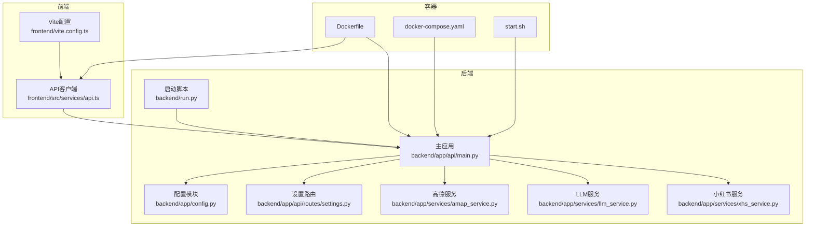
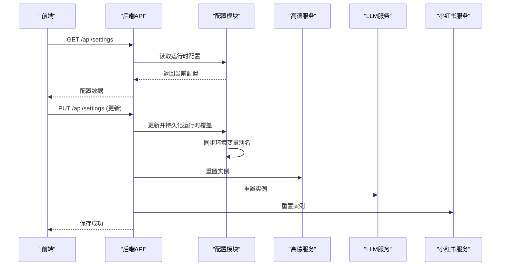
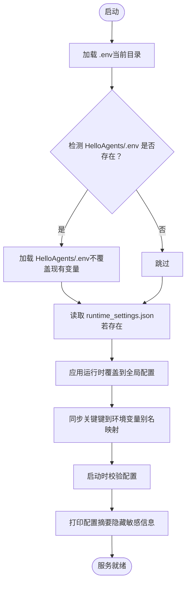
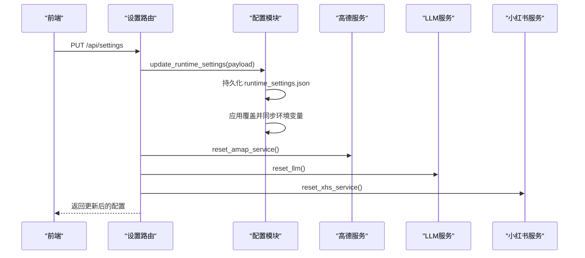
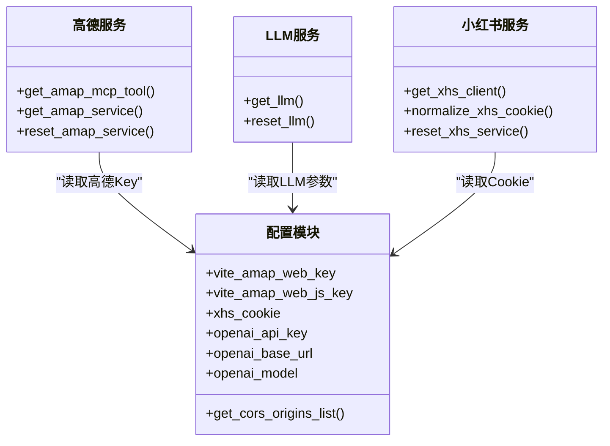
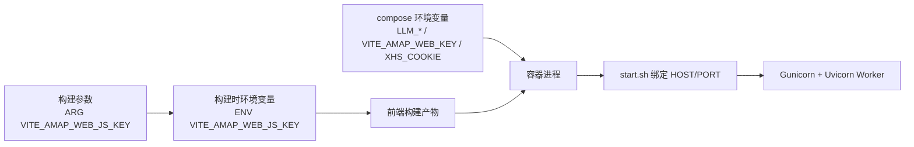

# 配置管理

<cite>
**本文引用的文件**
- [backend/app/config.py](file://backend/app/config.py)
- [backend/app/api/main.py](file://backend/app/api/main.py)
- [backend/app/api/routes/settings.py](file://backend/app/api/routes/settings.py)
- [backend/app/services/amap_service.py](file://backend/app/services/amap_service.py)
- [backend/app/services/llm_service.py](file://backend/app/services/llm_service.py)
- [backend/app/services/xhs_service.py](file://backend/app/services/xhs_service.py)
- [backend/run.py](file://backend/run.py)
- [backend/requirements.txt](file://backend/requirements.txt)
- [Dockerfile](file://Dockerfile)
- [docker-compose.yaml](file://docker-compose.yaml)
- [start.sh](file://start.sh)
- [frontend/vite.config.ts](file://frontend/vite.config.ts)
- [frontend/src/services/api.ts](file://frontend/src/services/api.ts)
- [.gitignore](file://.gitignore)
</cite>

## 目录
1. [简介](#简介)
2. [项目结构](#项目结构)
3. [核心组件](#核心组件)
4. [架构总览](#架构总览)
5. [详细组件分析](#详细组件分析)
6. [依赖分析](#依赖分析)
7. [性能考虑](#性能考虑)
8. [故障排查指南](#故障排查指南)
9. [结论](#结论)
10. [附录](#附录)

## 简介
本文件系统性梳理 TripStar 项目的配置管理策略，覆盖后端配置、前端配置、Docker 环境变量、多环境差异、配置文件结构与优先级、API Key 的配置方法、安全最佳实践以及容器化部署中的配置传递与挂载。目标是帮助开发者在不同环境下快速正确地完成配置，稳定运行系统。

## 项目结构
- 后端采用 Python + FastAPI，配置集中于配置模块，通过 Pydantic Settings 管理环境变量与运行时覆盖。
- 前端采用 Vue + Vite，通过 import.meta.env 读取构建期与运行期配置。
- Docker 采用多阶段构建，前端构建参数与后端环境变量在镜像构建与运行时分别注入。
- 配置验证与调试在启动阶段执行，便于早期发现问题。

图表来源
- [backend/app/config.py:1-202](file://backend/app/config.py#L1-L202)
- [backend/app/api/main.py:1-147](file://backend/app/api/main.py#L1-L147)
- [backend/app/api/routes/settings.py:1-56](file://backend/app/api/routes/settings.py#L1-L56)
- [backend/app/services/amap_service.py:1-276](file://backend/app/services/amap_service.py#L1-L276)
- [backend/app/services/llm_service.py:1-75](file://backend/app/services/llm_service.py#L1-L75)
- [backend/app/services/xhs_service.py:1-444](file://backend/app/services/xhs_service.py#L1-L444)
- [backend/run.py:1-17](file://backend/run.py#L1-L17)
- [Dockerfile:1-64](file://Dockerfile#L1-L64)
- [docker-compose.yaml:1-24](file://docker-compose.yaml#L1-L24)
- [start.sh:1-20](file://start.sh#L1-L20)
- [frontend/vite.config.ts:1-24](file://frontend/vite.config.ts#L1-L24)
- [frontend/src/services/api.ts:1-335](file://frontend/src/services/api.ts#L1-L335)

章节来源
- [backend/app/config.py:1-202](file://backend/app/config.py#L1-L202)
- [backend/app/api/main.py:1-147](file://backend/app/api/main.py#L1-L147)
- [Dockerfile:1-64](file://Dockerfile#L1-L64)
- [docker-compose.yaml:1-24](file://docker-compose.yaml#L1-L24)
- [frontend/vite.config.ts:1-24](file://frontend/vite.config.ts#L1-L24)
- [frontend/src/services/api.ts:1-335](file://frontend/src/services/api.ts#L1-L335)

## 核心组件
- 配置模块：集中定义配置项、加载顺序、运行时覆盖、校验与调试打印。
- 设置路由：提供运行时配置的读取与更新接口，并触发相关服务的热重载。
- 服务层：高德、LLM、小红书服务均从配置模块读取所需密钥与参数。
- 前端 API 客户端：支持运行时设置的读取与保存，并可覆盖 API 基础地址与地图 JS Key。
- 容器化：Dockerfile 与 docker-compose.yaml 负责构建期与运行时的环境变量注入。

章节来源
- [backend/app/config.py:21-127](file://backend/app/config.py#L21-L127)
- [backend/app/api/routes/settings.py:16-56](file://backend/app/api/routes/settings.py#L16-L56)
- [backend/app/services/amap_service.py:12-47](file://backend/app/services/amap_service.py#L12-L47)
- [backend/app/services/llm_service.py:12-67](file://backend/app/services/llm_service.py#L12-L67)
- [backend/app/services/xhs_service.py:192-198](file://backend/app/services/xhs_service.py#L192-L198)
- [frontend/src/services/api.ts:149-214](file://frontend/src/services/api.ts#L149-L214)

## 架构总览
下图展示配置在系统中的流向与作用范围：前端通过 API 客户端读取/更新后端运行时配置，后端服务从配置模块读取密钥与参数，启动时进行配置校验与打印，容器化部署时通过 Dockerfile 与 docker-compose.yaml 注入环境变量。

图表来源
- [frontend/src/services/api.ts:149-214](file://frontend/src/services/api.ts#L149-L214)
- [backend/app/api/routes/settings.py:27-56](file://backend/app/api/routes/settings.py#L27-L56)
- [backend/app/config.py:117-160](file://backend/app/config.py#L117-L160)
- [backend/app/services/amap_service.py:271-276](file://backend/app/services/amap_service.py#L271-L276)
- [backend/app/services/llm_service.py:70-75](file://backend/app/services/llm_service.py#L70-L75)
- [backend/app/services/xhs_service.py:192-198](file://backend/app/services/xhs_service.py#L192-L198)

## 详细组件分析

### 配置模块与优先级
- 加载顺序
  - 首先加载当前目录的 .env。
  - 若检测到特定路径存在 .env，则加载该 .env 且不覆盖已存在的环境变量（避免覆盖运行时配置）。
- 配置来源与优先级
  - 运行时覆盖文件：backend/runtime_settings.json（仅影响受支持的键）。
  - 环境变量：容器环境变量、系统环境变量。
  - .env 文件：本地开发时提供默认值。
  - 命令行参数：当前代码未显式解析命令行参数，因此不在优先级链路中。
- 关键行为
  - 支持将运行时覆盖同步到环境变量，以兼容第三方组件对环境变量的读取。
  - 对部分 LLM 相关键提供别名映射，提升兼容性。
  - 提供配置校验与调试打印，便于快速定位缺失项。

图表来源
- [backend/app/config.py:11-19](file://backend/app/config.py#L11-L19)
- [backend/app/config.py:83-127](file://backend/app/config.py#L83-L127)
- [backend/app/config.py:104-122](file://backend/app/config.py#L104-L122)
- [backend/app/config.py:162-180](file://backend/app/config.py#L162-L180)
- [backend/app/config.py:183-202](file://backend/app/config.py#L183-L202)

章节来源
- [backend/app/config.py:11-19](file://backend/app/config.py#L11-L19)
- [backend/app/config.py:83-127](file://backend/app/config.py#L83-L127)
- [backend/app/config.py:104-122](file://backend/app/config.py#L104-L122)
- [backend/app/config.py:162-180](file://backend/app/config.py#L162-L180)
- [backend/app/config.py:183-202](file://backend/app/config.py#L183-L202)

### 设置路由与运行时配置
- 接口
  - GET /api/settings：返回当前运行时配置。
  - PUT /api/settings：接收前端提交的配置更新，立即持久化并重置相关服务实例以生效。
- 前端交互
  - 前端 API 客户端支持运行时设置的读取与保存，并可覆盖 API 基础地址与地图 JS Key。
  - 运行时设置会同时写入后端 runtime_settings.json 与前端本地存储。

图表来源
- [backend/app/api/routes/settings.py:27-56](file://backend/app/api/routes/settings.py#L27-L56)
- [backend/app/config.py:146-160](file://backend/app/config.py#L146-L160)
- [backend/app/services/amap_service.py:271-276](file://backend/app/services/amap_service.py#L271-L276)
- [backend/app/services/llm_service.py:70-75](file://backend/app/services/llm_service.py#L70-L75)
- [backend/app/services/xhs_service.py:192-198](file://backend/app/services/xhs_service.py#L192-L198)

章节来源
- [backend/app/api/routes/settings.py:16-56](file://backend/app/api/routes/settings.py#L16-L56)
- [frontend/src/services/api.ts:149-214](file://frontend/src/services/api.ts#L149-L214)
- [backend/app/config.py:146-160](file://backend/app/config.py#L146-L160)

### 服务层配置使用
- 高德服务
  - 通过配置模块读取 Web Key，初始化 MCP 工具并抛出明确的未配置错误提示。
- LLM 服务
  - 从配置模块与环境变量读取 API Key、Base URL、Model、Timeout，支持别名映射与兜底值。
- 小红书服务
  - 从配置模块读取 Cookie，提供多种 Cookie 格式兼容处理；未配置时抛出明确错误。

图表来源
- [backend/app/config.py:21-80](file://backend/app/config.py#L21-L80)
- [backend/app/services/amap_service.py:12-47](file://backend/app/services/amap_service.py#L12-L47)
- [backend/app/services/llm_service.py:12-67](file://backend/app/services/llm_service.py#L12-L67)
- [backend/app/services/xhs_service.py:192-198](file://backend/app/services/xhs_service.py#L192-L198)

章节来源
- [backend/app/services/amap_service.py:12-47](file://backend/app/services/amap_service.py#L12-L47)
- [backend/app/services/llm_service.py:12-67](file://backend/app/services/llm_service.py#L12-L67)
- [backend/app/services/xhs_service.py:192-198](file://backend/app/services/xhs_service.py#L192-L198)

### 前端配置与运行时覆盖
- 构建期配置
  - Vite 通过 import.meta.env 读取 VITE_API_BASE_URL 与 VITE_AMAP_WEB_JS_KEY。
  - Vite 配置中提供开发代理，将 /api 代理至后端。
- 运行期配置
  - 前端 API 客户端支持运行时覆盖 API 基础地址与地图 JS Key，并持久化到本地存储。
  - 前端通过 /api/settings 与后端同步运行时配置。

章节来源
- [frontend/vite.config.ts:13-21](file://frontend/vite.config.ts#L13-L21)
- [frontend/src/services/api.ts:12-37](file://frontend/src/services/api.ts#L12-L37)
- [frontend/src/services/api.ts:149-214](file://frontend/src/services/api.ts#L149-L214)

### Docker 容器化配置
- 构建阶段
  - 通过 ARG 接收前端构建参数（如 VITE_AMAP_WEB_JS_KEY），并在构建时注入到前端环境变量。
- 运行阶段
  - docker-compose.yaml 注入后端环境变量（如 LLM_*、VITE_AMAP_WEB_KEY、XHS_COOKIE 等）。
  - start.sh 读取 HOST/PORT 并以 Gunicorn + Uvicorn Worker 启动后端应用。
  - Dockerfile 暴露 7860 端口并以 CMD 启动脚本。

图表来源
- [Dockerfile:15-23](file://Dockerfile#L15-L23)
- [Dockerfile:56-63](file://Dockerfile#L56-L63)
- [docker-compose.yaml:8-23](file://docker-compose.yaml#L8-L23)
- [start.sh:5-19](file://start.sh#L5-L19)

章节来源
- [Dockerfile:15-23](file://Dockerfile#L15-L23)
- [Dockerfile:56-63](file://Dockerfile#L56-L63)
- [docker-compose.yaml:8-23](file://docker-compose.yaml#L8-L23)
- [start.sh:5-19](file://start.sh#L5-L19)

## 依赖分析
- 配置模块依赖
  - python-dotenv：加载 .env。
  - pydantic / pydantic-settings：配置模型与环境变量绑定。
  - fastapi：在主应用中读取配置并注册中间件与路由。
- 服务层依赖
  - hello-agents：LLM 与 MCP 工具。
  - fastmcp：高德 MCP 工具。
  - requests/httpx：网络请求。
  - PyExecJS：小红书签名引擎调用。
- 前端依赖
  - axios：HTTP 客户端。
  - @amap/amap-jsapi-loader：地图 SDK 加载。
  - vite：开发与构建工具。

章节来源
- [backend/requirements.txt:1-18](file://backend/requirements.txt#L1-L18)
- [backend/app/api/main.py:18](file://backend/app/api/main.py#L18)
- [backend/app/services/amap_service.py:4](file://backend/app/services/amap_service.py#L4)
- [backend/app/services/llm_service.py:5](file://backend/app/services/llm_service.py#L5)
- [backend/app/services/xhs_service.py:17](file://backend/app/services/xhs_service.py#L17)
- [frontend/package.json:11-33](file://frontend/package.json#L11-L33)

## 性能考虑
- 配置加载与校验
  - 启动阶段一次性加载并校验配置，避免运行时反复 IO 与解析。
- 运行时覆盖
  - 仅对受支持键进行覆盖与持久化，减少不必要的磁盘写入。
- 服务热重载
  - 更新运行时配置后重置相关服务实例，避免重启带来的停机时间。
- 前端缓存
  - 运行时设置在前端本地存储，减少重复请求。

## 故障排查指南
- 启动阶段
  - 启动日志会打印配置摘要与校验结果，若出现“配置验证失败”，请检查对应环境变量或 .env。
- 常见问题
  - 高德地图 Key 未配置：高德服务初始化会抛出明确错误，需在前端设置页或运行时配置中补全。
  - LLM Key 未配置：LLM 初始化会使用别名与兜底值，但功能受限，需在前端设置页或运行时配置中补全。
  - 小红书 Cookie 未配置：小红书服务初始化会抛出明确错误，需在前端设置页或运行时配置中补全。
- 调试步骤
  - 查看启动日志中的配置摘要与校验提示。
  - 使用 /api/settings 接口确认运行时配置是否正确持久化。
  - 在前端本地存储中确认 API 基础地址与地图 JS Key 的覆盖是否生效。

章节来源
- [backend/app/api/main.py:63-85](file://backend/app/api/main.py#L63-L85)
- [backend/app/config.py:162-180](file://backend/app/config.py#L162-L180)
- [backend/app/services/amap_service.py:24-25](file://backend/app/services/amap_service.py#L24-L25)
- [backend/app/services/llm_service.py:24-41](file://backend/app/services/llm_service.py#L24-L41)
- [backend/app/services/xhs_service.py:195-196](file://backend/app/services/xhs_service.py#L195-L196)

## 结论
本项目通过统一的配置模块与运行时覆盖机制，结合前后端协同的设置接口，实现了灵活且可追溯的配置管理。配合 Dockerfile 与 docker-compose.yaml 的环境变量注入，可在不同环境中稳定运行。建议在团队协作中遵循安全最佳实践，严格控制敏感信息的暴露与版本化管理。

## 附录

### 环境变量与配置项对照
- 后端关键配置项
  - 应用与服务器：app_name、app_version、host、port、log_level
  - CORS：cors_origins
  - 高德地图：vite_amap_web_key、vite_amap_web_js_key
  - 小红书：xhs_cookie
  - LLM：openai_api_key（别名：LLM_API_KEY）、openai_base_url（别名：LLM_BASE_URL）、openai_model（别名：LLM_MODEL_ID）
- 前端关键配置项
  - VITE_API_BASE_URL：后端 API 基础地址
  - VITE_AMAP_WEB_JS_KEY：高德 JS SDK Key（构建期注入）

章节来源
- [backend/app/config.py:24-55](file://backend/app/config.py#L24-L55)
- [frontend/src/services/api.ts:12-13](file://frontend/src/services/api.ts#L12-L13)
- [Dockerfile:16-20](file://Dockerfile#L16-L20)

### 多环境配置策略
- 开发环境
  - 本地 .env 提供默认值；前端通过 Vite 开发服务器代理后端。
- 测试/生产环境
  - 通过 docker-compose.yaml 注入环境变量；Dockerfile 构建期注入前端 Key；容器内以 start.sh 绑定 HOST/PORT 启动。

章节来源
- [frontend/vite.config.ts:13-21](file://frontend/vite.config.ts#L13-L21)
- [docker-compose.yaml:8-23](file://docker-compose.yaml#L8-L23)
- [Dockerfile:15-23](file://Dockerfile#L15-L23)
- [start.sh:5-19](file://start.sh#L5-L19)

### API Key 配置方法
- 大模型 API Key
  - 在前端设置页或运行时配置中填写 openai_api_key（或 LLM_API_KEY）。
  - 可选填写 openai_base_url（或 LLM_BASE_URL）与 openai_model（或 LLM_MODEL_ID）。
- 高德地图 Key
  - 在前端设置页或运行时配置中填写 vite_amap_web_key 与 vite_amap_web_js_key。
- 小红书 Cookie
  - 在前端设置页或运行时配置中填写 xhs_cookie；支持多种格式兼容。

章节来源
- [backend/app/config.py:36-42](file://backend/app/config.py#L36-L42)
- [backend/app/config.py:44-55](file://backend/app/config.py#L44-L55)
- [frontend/src/services/api.ts:16-23](file://frontend/src/services/api.ts#L16-L23)

### 安全配置最佳实践
- 敏感信息保护
  - 不将 .env 与 runtime_settings.json 提交至版本库；.gitignore 已忽略 runtime_settings.json。
  - 在 docker-compose.yaml 中使用环境变量注入，避免硬编码在镜像中。
- 版本控制
  - 使用 .env.example 或文档说明各配置项含义，避免将真实密钥纳入仓库。
- 访问控制
  - 限制对 /api/settings 的访问权限，仅允许授权用户修改运行时配置。

章节来源
- [.gitignore:1](file://.gitignore#L1)
- [docker-compose.yaml:13-22](file://docker-compose.yaml#L13-L22)