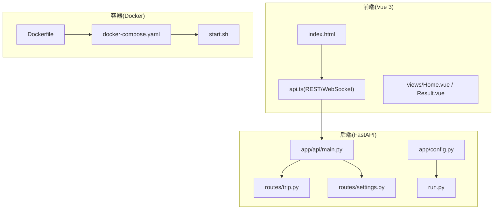
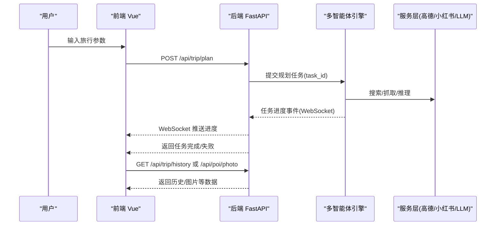
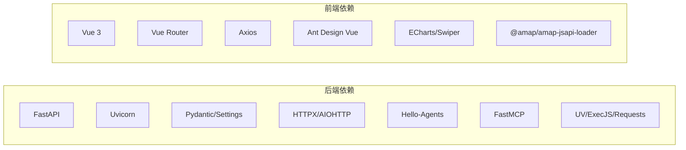

# 快速开始指南

<cite>
**本文引用的文件**
- [README.md](file://README.md)
- [backend/requirements.txt](file://backend/requirements.txt)
- [frontend/package.json](file://frontend/package.json)
- [Dockerfile](file://Dockerfile)
- [docker-compose.yaml](file://docker-compose.yaml)
- [start.sh](file://start.sh)
- [backend/app/config.py](file://backend/app/config.py)
- [backend/app/api/main.py](file://backend/app/api/main.py)
- [backend/app/api/routes/trip.py](file://backend/app/api/routes/trip.py)
- [backend/app/api/routes/settings.py](file://backend/app/api/routes/settings.py)
- [frontend/src/services/api.ts](file://frontend/src/services/api.ts)
- [frontend/index.html](file://frontend/index.html)
- [backend/run.py](file://backend/run.py)
</cite>

## 目录
1. [简介](#简介)
2. [项目结构](#项目结构)
3. [核心组件](#核心组件)
4. [架构总览](#架构总览)
5. [详细组件分析](#详细组件分析)
6. [依赖分析](#依赖分析)
7. [性能考虑](#性能考虑)
8. [故障排除指南](#故障排除指南)
9. [结论](#结论)
10. [附录](#附录)

## 简介
TripStar 是一个基于多智能体协作的 AI 文旅规划平台，提供旅行计划生成、景点地图概览、预算明细、每日行程、知识图谱可视化、沉浸式 AI 问答等核心功能。本指南面向首次使用者，提供完整的环境准备、本地开发与 Docker 部署两种方式的安装步骤与配置说明，并给出常见问题排查与功能验证方法。

## 项目结构
项目采用前后端分离架构，后端为 FastAPI 应用，前端为 Vue 3 应用，二者通过 REST API 与 WebSocket 协同工作。Dockerfile 与 docker-compose.yaml 提供一键容器化部署方案。

图表来源
- [backend/app/api/main.py:1-147](file://backend/app/api/main.py#L1-L147)
- [backend/app/api/routes/trip.py:1-200](file://backend/app/api/routes/trip.py#L1-L200)
- [backend/app/api/routes/settings.py:1-56](file://backend/app/api/routes/settings.py#L1-L56)
- [backend/app/config.py:1-202](file://backend/app/config.py#L1-L202)
- [frontend/src/services/api.ts:1-335](file://frontend/src/services/api.ts#L1-L335)
- [frontend/index.html:1-25](file://frontend/index.html#L1-L25)
- [Dockerfile:1-64](file://Dockerfile#L1-L64)
- [docker-compose.yaml:1-24](file://docker-compose.yaml#L1-L24)
- [start.sh:1-20](file://start.sh#L1-L20)

章节来源
- [README.md:205-232](file://README.md#L205-L232)

## 核心组件
- 后端 FastAPI 服务：提供旅行规划、地图、POI、聊天、设置等 API，并内置运行时配置管理与健康检查。
- 前端 Vue 应用：负责表单输入、结果展示、地图渲染、知识图谱可视化与 AI 问答交互。
- Docker 容器：统一打包前后端产物，提供生产级部署与运行时配置注入。

章节来源
- [backend/app/api/main.py:24-61](file://backend/app/api/main.py#L24-L61)
- [frontend/src/services/api.ts:117-147](file://frontend/src/services/api.ts#L117-L147)
- [Dockerfile:29-63](file://Dockerfile#L29-L63)

## 架构总览
后端采用异步任务与 WebSocket 推送相结合的方式，前端通过轮询或 WebSocket 实时接收任务进度，最终获得结构化旅行计划。

图表来源
- [backend/app/api/routes/trip.py:25-80](file://backend/app/api/routes/trip.py#L25-L80)
- [frontend/src/services/api.ts:219-318](file://frontend/src/services/api.ts#L219-L318)

章节来源
- [README.md:101-118](file://README.md#L101-L118)

## 详细组件分析

### 环境准备清单
- Python 3.10+：用于后端运行与依赖安装。
- Node.js 18+：用于前端开发与构建。
- 大模型 API Key：用于 LLM 推理（推荐兼容 OpenAI 格式的提供商）。
- 高德地图 Key：
  - Web 服务 Key：用于地理编码/POI 搜索等服务端调用。
  - Web 端(JS API) Key：用于前端高德 JS API 2.0，需在 index.html 中注入安全密钥。
- 小红书 Cookie：用于小红书搜索与 SSR 抓取。
- 包管理器：安装 uv 以提升依赖安装效率。

章节来源
- [README.md:131-139](file://README.md#L131-L139)
- [backend/app/config.py:36-56](file://backend/app/config.py#L36-L56)
- [frontend/index.html:17-21](file://frontend/index.html#L17-L21)

### 本地开发部署
- 后端启动
  - 进入后端目录，安装小红书签名引擎依赖。
  - 创建并激活虚拟环境，安装 Python 依赖。
  - 复制示例配置文件并填入相应 Key。
  - 使用 uvicorn 启动 FastAPI 应用。
  - 访问交互文档查看 API。

- 前端启动
  - 进入前端目录，安装依赖。
  - 配置前端环境变量（与后端保持一致的高德 Key）。
  - 启动 Vite 开发服务器。

章节来源
- [README.md:151-200](file://README.md#L151-L200)
- [backend/run.py:6-16](file://backend/run.py#L6-L16)

### Docker 部署
- 构建镜像
  - 前端阶段：使用 Node 18 构建前端产物，注入 VITE_AMAP_WEB_JS_KEY。
  - 后端阶段：使用 Python 3.10 运行时，安装系统依赖与 Python 依赖，复制后端代码与 Node 依赖，复制前端构建产物，设置启动脚本。

- 编排运行
  - docker-compose 通过环境变量注入 LLM、高德、小红书等配置。
  - 容器暴露 7860 端口，使用 gunicorn + uvicorn worker 运行。

- 运行时配置
  - 前端构建期变量通过 build.args 注入。
  - 容器启动时不再读取项目目录中的 .env 文件，需通过环境变量传入。

章节来源
- [Dockerfile:1-64](file://Dockerfile#L1-L64)
- [docker-compose.yaml:1-24](file://docker-compose.yaml#L1-L24)
- [start.sh:1-20](file://start.sh#L1-L20)
- [README.md:140-149](file://README.md#L140-L149)

### 后端 FastAPI 服务启动
- 本地开发：使用 uvicorn 启动，支持热重载与自定义主机/端口。
- 生产部署：使用 gunicorn + uvicorn worker，绑定 0.0.0.0:7860。

章节来源
- [backend/run.py:6-16](file://backend/run.py#L6-L16)
- [start.sh:13-19](file://start.sh#L13-L19)
- [backend/app/api/main.py:138-146](file://backend/app/api/main.py#L138-L146)

### 前端 Vue 应用启动
- 依赖安装：使用 npm/pnpm/yarn。
- 开发服务器：Vite dev，自动代理到后端 API。
- 高德 JS API：需在 index.html 中注入安全密钥，前端运行时可覆盖 JS Key。

章节来源
- [frontend/package.json:6-10](file://frontend/package.json#L6-L10)
- [frontend/index.html:17-21](file://frontend/index.html#L17-L21)
- [frontend/src/services/api.ts:61-91](file://frontend/src/services/api.ts#L61-L91)

### API 与任务流程
- 旅行规划
  - 提交任务：POST /api/trip/plan，立即返回 task_id。
  - 轮询状态：GET /api/trip/status/{task_id}。
  - WebSocket：任务进度通过 WebSocket 推送，前端监听消息并解析事件。

- 运行时配置
  - 获取配置：GET /api/settings。
  - 更新配置：PUT /api/settings，支持即时生效并重置相关单例。

- 健康检查
  - GET /health，返回服务健康状态。

章节来源
- [backend/app/api/routes/trip.py:25-80](file://backend/app/api/routes/trip.py#L25-L80)
- [frontend/src/services/api.ts:219-318](file://frontend/src/services/api.ts#L219-L318)
- [backend/app/api/routes/settings.py:27-55](file://backend/app/api/routes/settings.py#L27-L55)
- [backend/app/api/main.py:112-119](file://backend/app/api/main.py#L112-L119)

## 依赖分析
- 后端依赖
  - FastAPI、Uvicorn、Pydantic、Pydantic Settings、HTTPX、AIOHTTP、Loguru、Hello-Agents、FastMCP、UV、日期解析、HuggingFace Hub、拼音、ExecJS、Requests 等。
- 前端依赖
  - Vue 3、Vue Router、Axios、Ant Design Vue、ECharts、Swiper、Day.js、i18n、高德 JS API Loader 等。

图表来源
- [backend/requirements.txt:1-18](file://backend/requirements.txt#L1-L18)
- [frontend/package.json:11-33](file://frontend/package.json#L11-L33)

章节来源
- [backend/requirements.txt:1-18](file://backend/requirements.txt#L1-L18)
- [frontend/package.json:1-35](file://frontend/package.json#L1-L35)

## 性能考虑
- 任务异步化：旅行规划任务通过后台任务执行，避免阻塞请求。
- WebSocket 推送：前端无需频繁轮询，降低带宽与延迟。
- 容器预热：构建阶段预下载 MCP 服务，减少首次请求超时风险。
- 超时配置：后端与容器均设置合理超时，避免长时间占用资源。

章节来源
- [README.md:103-109](file://README.md#L103-L109)
- [Dockerfile:45-47](file://Dockerfile#L45-L47)
- [start.sh:17](file://start.sh#L17)

## 故障排除指南
- 配置缺失告警
  - 若未配置高德 Web Key 或 LLM Key，系统会打印告警提示，相关功能将不可用。
- CORS 问题
  - 确保前端开发服务器地址在后端 CORS 白名单中。
- 高德 JS API 安全密钥
  - 需在 index.html 中正确注入安全密钥，否则前端地图可能无法加载。
- 小红书 Cookie
  - 需从网页端登录后复制 Cookie，否则小红书相关功能无法使用。
- Docker 环境变量
  - 容器启动时不再读取项目目录中的 .env，需通过 docker-compose 的 environment 显式传入。
- 健康检查
  - 使用 /health 接口确认服务状态，若异常查看容器日志定位问题。

章节来源
- [backend/app/config.py:163-179](file://backend/app/config.py#L163-L179)
- [backend/app/config.py:65-67](file://backend/app/config.py#L65-L67)
- [frontend/index.html:17-21](file://frontend/index.html#L17-L21)
- [README.md:140-149](file://README.md#L140-L149)
- [backend/app/api/main.py:112-119](file://backend/app/api/main.py#L112-L119)

## 结论
通过本指南，您可以在本地或容器环境中快速搭建 TripStar 的开发与生产环境。建议先完成环境准备与基础配置，再启动后端与前端服务，最后通过健康检查与基本 API 验证核心功能。遇到问题时，可依据故障排除指南逐步定位并解决。

## 附录

### 启动后的基本使用方法与功能验证
- 启动后端与前端服务后，打开浏览器访问前端页面。
- 在首页填写旅行参数（目的地、日期、偏好等），提交后立即返回 task_id。
- 前端通过 WebSocket 实时显示任务进度，完成后展示旅行计划。
- 可通过 /api/settings 接口查看与更新运行时配置，验证即时生效。
- 使用 /health 接口确认服务健康状态。

章节来源
- [frontend/src/services/api.ts:219-318](file://frontend/src/services/api.ts#L219-L318)
- [backend/app/api/routes/settings.py:27-55](file://backend/app/api/routes/settings.py#L27-L55)
- [backend/app/api/main.py:112-119](file://backend/app/api/main.py#L112-L119)