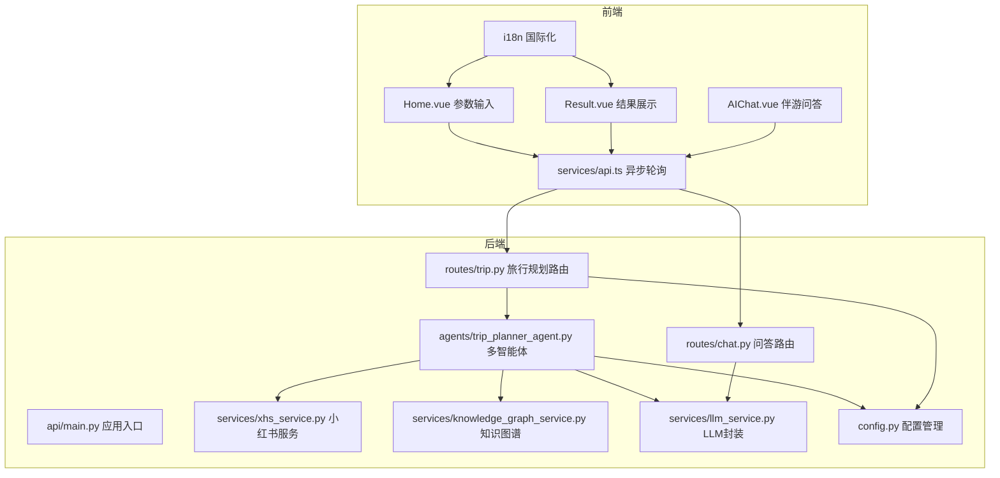
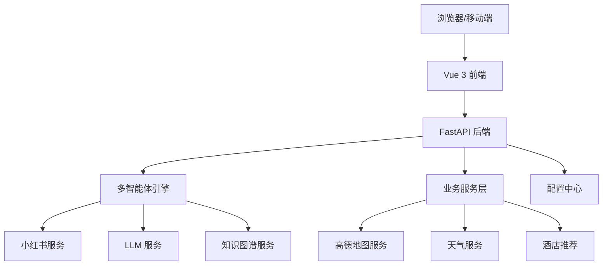
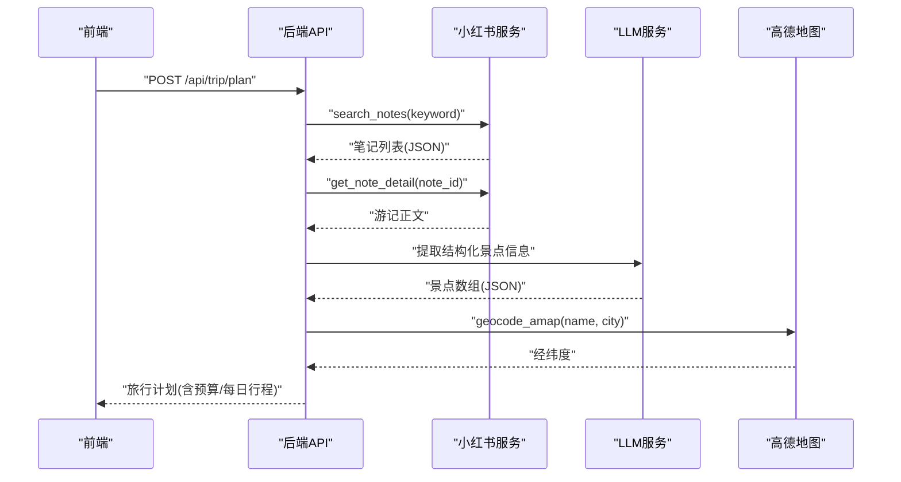
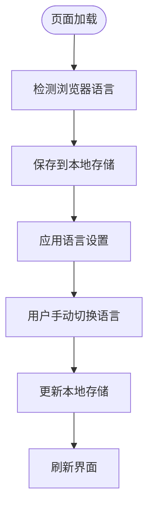
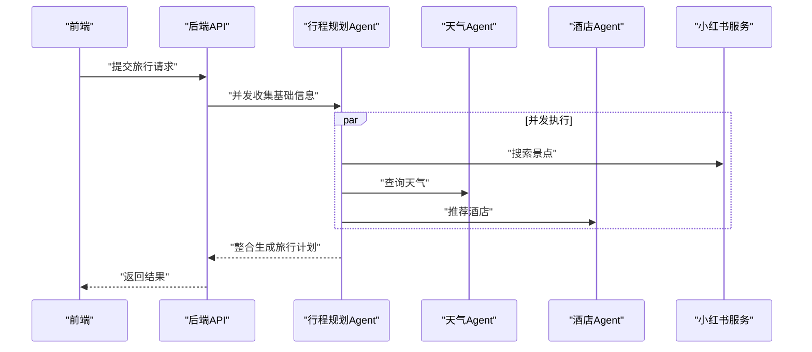
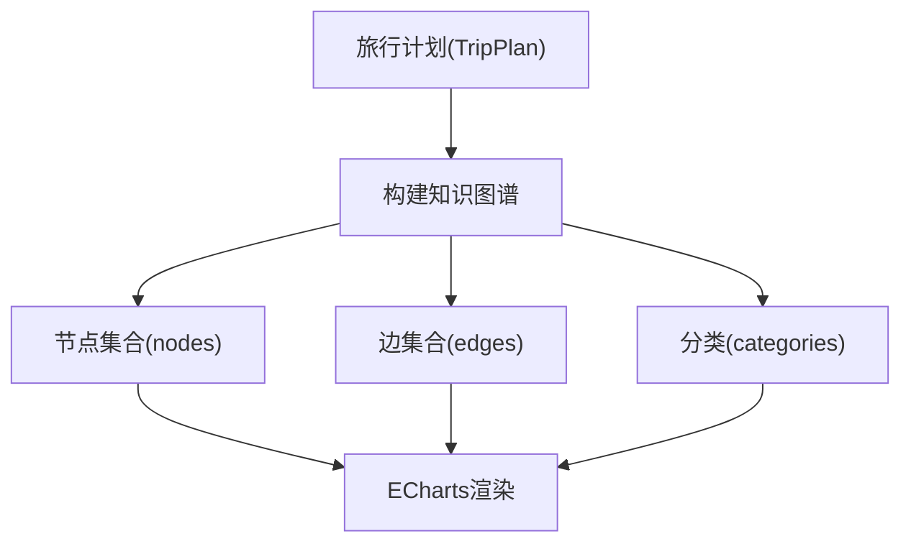
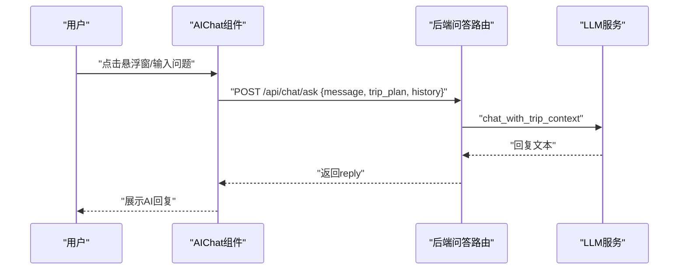
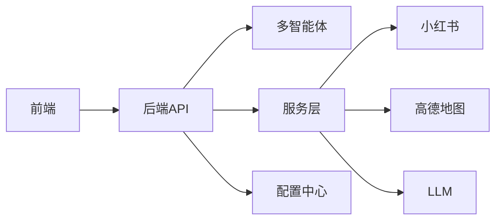

# 核心功能特性

<cite>
**本文档引用的文件**
- [README.md](file://README.md)
- [backend/app/config.py](file://backend/app/config.py)
- [backend/app/services/xhs_service.py](file://backend/app/services/xhs_service.py)
- [backend/app/services/knowledge_graph_service.py](file://backend/app/services/knowledge_graph_service.py)
- [backend/app/services/llm_service.py](file://backend/app/services/llm_service.py)
- [backend/app/agents/trip_planner_agent.py](file://backend/app/agents/trip_planner_agent.py)
- [backend/app/api/routes/trip.py](file://backend/app/api/routes/trip.py)
- [backend/app/api/routes/chat.py](file://backend/app/api/routes/chat.py)
- [backend/app/api/main.py](file://backend/app/api/main.py)
- [frontend/src/i18n/index.ts](file://frontend/src/i18n/index.ts)
- [frontend/src/i18n/messages.ts](file://frontend/src/i18n/messages.ts)
- [frontend/src/components/AIChat.vue](file://frontend/src/components/AIChat.vue)
- [frontend/src/views/Home.vue](file://frontend/src/views/Home.vue)
- [frontend/src/views/Result.vue](file://frontend/src/views/Result.vue)
- [frontend/src/services/api.ts](file://frontend/src/services/api.ts)
- [frontend/src/types/index.ts](file://frontend/src/types/index.ts)
</cite>

## 目录
1. [简介](#简介)
2. [项目结构](#项目结构)
3. [核心组件](#核心组件)
4. [架构总览](#架构总览)
5. [详细功能特性分析](#详细功能特性分析)
6. [依赖关系分析](#依赖关系分析)
7. [性能考量](#性能考量)
8. [故障排除指南](#故障排除指南)
9. [结论](#结论)

## 简介
TripStar 是一个基于 HelloAgents 框架的多智能体协作文旅规划平台，采用前后端分离架构，后端基于 FastAPI，前端基于 Vue 3。项目围绕旅行规划的“信息过载”和“决策疲劳”痛点，通过 LLM 与多智能体协作，提供从参数输入到结果呈现的一站式旅行计划生成体验。核心亮点包括：小红书深度集成、景点预约提醒、多语言支持、高定主题互动地图、精准预算明细面板、多智能体协作协同、知识图谱可视化、沉浸式伴游 AI 问答、奢华暗黑玻璃拟物风等九项核心功能。

## 项目结构
项目采用清晰的分层组织：
- 后端（Python/ FastAPI）：包含配置管理、路由、智能体与服务层
- 前端（Vue 3）：包含国际化、UI 组件、视图与 API 服务层
- Docker 化部署与容器编排

图表来源
- [backend/app/api/main.py:13-61](file://backend/app/api/main.py#L13-L61)
- [backend/app/api/routes/trip.py:17-31](file://backend/app/api/routes/trip.py#L17-L31)
- [backend/app/api/routes/chat.py:7-15](file://backend/app/api/routes/chat.py#L7-L15)
- [backend/app/agents/trip_planner_agent.py:173-242](file://backend/app/agents/trip_planner_agent.py#L173-L242)
- [backend/app/services/xhs_service.py:1-20](file://backend/app/services/xhs_service.py#L1-L20)
- [backend/app/services/knowledge_graph_service.py:1-10](file://backend/app/services/knowledge_graph_service.py#L1-L10)
- [backend/app/services/llm_service.py:1-10](file://backend/app/services/llm_service.py#L1-L10)
- [backend/app/config.py:21-71](file://backend/app/config.py#L21-L71)
- [frontend/src/services/api.ts:117-147](file://frontend/src/services/api.ts#L117-L147)
- [frontend/src/views/Home.vue:197-371](file://frontend/src/views/Home.vue#L197-L371)
- [frontend/src/views/Result.vue:569-567](file://frontend/src/views/Result.vue#L569-L567)
- [frontend/src/components/AIChat.vue:154-249](file://frontend/src/components/AIChat.vue#L154-L249)
- [frontend/src/i18n/index.ts:1-53](file://frontend/src/i18n/index.ts#L1-L53)

章节来源
- [README.md:20-127](file://README.md#L20-L127)
- [backend/app/api/main.py:13-136](file://backend/app/api/main.py#L13-L136)
- [frontend/src/views/Home.vue:197-371](file://frontend/src/views/Home.vue#L197-L371)
- [frontend/src/views/Result.vue:569-567](file://frontend/src/views/Result.vue#L569-L567)
- [frontend/src/components/AIChat.vue:154-249](file://frontend/src/components/AIChat.vue#L154-L249)
- [frontend/src/i18n/index.ts:1-53](file://frontend/src/i18n/index.ts#L1-L53)

## 核心组件
- 配置管理：集中管理运行时配置（高德地图、小红书 Cookie、LLM API Key 等），支持持久化与运行时更新
- 多智能体旅行规划：负责并发执行景点搜索、天气查询、酒店推荐与行程规划
- 小红书服务：原生直连小红书 API，支持 SSR 降级，实现游记内容提取与景点图片搜索
- 知识图谱服务：将旅行计划转换为关系图数据，支持 ECharts 可视化
- LLM 服务：统一的 LLM 客户端封装，支持第三方 API 的反爬伪装
- 前端异步轮询与状态订阅：通过 WebSocket 与轮询机制实时反馈任务进度
- 国际化：基于 vue-i18n 的多语言支持，覆盖中、英、日语
- 伴游 AI 问答：悬浮式聊天组件，基于旅行计划上下文进行智能问答

章节来源
- [backend/app/config.py:21-160](file://backend/app/config.py#L21-L160)
- [backend/app/agents/trip_planner_agent.py:173-339](file://backend/app/agents/trip_planner_agent.py#L173-L339)
- [backend/app/services/xhs_service.py:68-444](file://backend/app/services/xhs_service.py#L68-L444)
- [backend/app/services/knowledge_graph_service.py:34-169](file://backend/app/services/knowledge_graph_service.py#L34-L169)
- [backend/app/services/llm_service.py:12-67](file://backend/app/services/llm_service.py#L12-L67)
- [frontend/src/services/api.ts:216-318](file://frontend/src/services/api.ts#L216-L318)
- [frontend/src/i18n/index.ts:31-53](file://frontend/src/i18n/index.ts#L31-L53)
- [frontend/src/components/AIChat.vue:154-249](file://frontend/src/components/AIChat.vue#L154-L249)

## 架构总览
系统采用“前端交互层—后端网关—智能推理层”的三层架构，通过异步任务与 WebSocket 实现实时状态反馈，通过多智能体协同完成复杂旅行规划任务。

图表来源
- [backend/app/api/main.py:25-61](file://backend/app/api/main.py#L25-L61)
- [backend/app/agents/trip_planner_agent.py:173-242](file://backend/app/agents/trip_planner_agent.py#L173-L242)
- [backend/app/services/xhs_service.py:68-198](file://backend/app/services/xhs_service.py#L68-L198)
- [backend/app/services/llm_service.py:12-67](file://backend/app/services/llm_service.py#L12-L67)
- [backend/app/services/knowledge_graph_service.py:34-169](file://backend/app/services/knowledge_graph_service.py#L34-L169)

章节来源
- [README.md:43-97](file://README.md#L43-L97)
- [backend/app/api/main.py:25-85](file://backend/app/api/main.py#L25-L85)

## 详细功能特性分析

### 1. 小红书深度集成
- 实现原理：通过原生直连小红书 API（edith.xiaohongshu.com），使用本地 JS 签名引擎生成请求签名，绕过风控拦截；支持 SSR 降级抓取，确保稳定性。
- 数据处理：从游记中提取景点名称、真实评价、游玩时长、是否需要预约等结构化信息，并通过高德地理编码补齐经纬度。
- 图片搜索：在行程生成后，前端按景点名称调用后端接口，后端通过小红书搜索最新帖子并提取首图链接，确保展示真实风景照片。
- 用户体验价值：提供最真实的用户视角与图片素材，减少“踩坑”风险，提升行程可信度与吸引力。

图表来源
- [backend/app/services/xhs_service.py:247-354](file://backend/app/services/xhs_service.py#L247-L354)
- [backend/app/agents/trip_planner_agent.py:294-323](file://backend/app/agents/trip_planner_agent.py#L294-L323)
- [backend/app/api/routes/trip.py:281-363](file://backend/app/api/routes/trip.py#L281-L363)

章节来源
- [backend/app/services/xhs_service.py:68-444](file://backend/app/services/xhs_service.py#L68-L444)
- [backend/app/agents/trip_planner_agent.py:294-323](file://backend/app/agents/trip_planner_agent.py#L294-L323)
- [backend/app/api/routes/trip.py:281-363](file://backend/app/api/routes/trip.py#L281-L363)

### 2. 景点预约提醒
- 实现原理：在小红书游记提取过程中，通过关键词识别（如“需要预约”、“提前预约”、“抢票”、“约满”、“官方预约”）判断是否需要预约，并提取预约渠道与提示信息。
- 展示方式：在结果页的景点卡片中醒目标注“需提前预约”，并显示具体预约提示，避免用户白跑一趟。
- 用户体验价值：显著降低行程不确定性，提升实际执行效率与满意度。

章节来源
- [backend/app/services/xhs_service.py:304-354](file://backend/app/services/xhs_service.py#L304-L354)
- [frontend/src/views/Result.vue:354-358](file://frontend/src/views/Result.vue#L354-L358)

### 3. 多语言支持
- 实现原理：基于 vue-i18n，支持 zh-CN、ja-JP、en-US 三种语言；自动检测浏览器语言并持久化到本地存储；提供切换接口。
- 用户体验价值：面向全球旅行者，消除语言障碍，提供无障碍的行程规划体验。

图表来源
- [frontend/src/i18n/index.ts:17-53](file://frontend/src/i18n/index.ts#L17-L53)
- [frontend/src/i18n/messages.ts:11-16](file://frontend/src/i18n/messages.ts#L11-L16)

章节来源
- [frontend/src/i18n/index.ts:1-53](file://frontend/src/i18n/index.ts#L1-L53)
- [frontend/src/i18n/messages.ts:1-16](file://frontend/src/i18n/messages.ts#L1-L16)

### 4. 高定主题互动地图
- 实现原理：基于高德地图 JS API 2.0，在结果页动态绘制“起点-景点-终点”的真实经纬度路线；支持交互式缩放与标记。
- 用户体验价值：直观展示行程地理分布，便于用户理解路线与距离，提升行程规划的可视化与可操作性。

章节来源
- [frontend/src/views/Result.vue:234-239](file://frontend/src/views/Result.vue#L234-L239)
- [frontend/src/services/api.ts:575-576](file://frontend/src/services/api.ts#L575-L576)

### 5. 精准预算明细面板
- 实现原理：后端在行程规划完成后，计算景点门票、餐饮、住宿与交通的总费用与明细；前端提供筛选、排序与编辑功能，支持预算项的增删与恢复。
- 用户体验价值：帮助用户掌控旅行成本，合理分配预算，避免超支。

章节来源
- [backend/app/agents/trip_planner_agent.py:139-146](file://backend/app/agents/trip_planner_agent.py#L139-L146)
- [frontend/src/views/Result.vue:102-239](file://frontend/src/views/Result.vue#L102-L239)

### 6. 多智能体协作协同
- 实现原理：采用分工明确的多个 Agent（天气预报员、酒店推荐专家、行程规划专家），通过工作流（Workflow）协同完成复杂的旅行规划任务；使用 asyncio.gather 并发执行，缩短总耗时。
- 用户体验价值：大幅提升规划效率与质量，减少人工干预，提供稳定可靠的自动化旅行助手。

图表来源
- [backend/app/agents/trip_planner_agent.py:257-339](file://backend/app/agents/trip_planner_agent.py#L257-L339)
- [backend/app/api/routes/trip.py:315-363](file://backend/app/api/routes/trip.py#L315-L363)

章节来源
- [backend/app/agents/trip_planner_agent.py:173-339](file://backend/app/agents/trip_planner_agent.py#L173-L339)
- [backend/app/api/routes/trip.py:315-363](file://backend/app/api/routes/trip.py#L315-L363)

### 7. 知识图谱可视化
- 实现原理：将旅行计划中的城市、天数、景点、酒店、餐饮、天气、预算、偏好等实体与关系映射为图数据，使用 ECharts 进行可视化展示。
- 用户体验价值：以图形化方式呈现旅行空间结构，帮助用户快速理解整体行程与关联关系。

图表来源
- [backend/app/services/knowledge_graph_service.py:34-169](file://backend/app/services/knowledge_graph_service.py#L34-L169)
- [frontend/src/views/Result.vue:242-250](file://frontend/src/views/Result.vue#L242-L250)

章节来源
- [backend/app/services/knowledge_graph_service.py:1-169](file://backend/app/services/knowledge_graph_service.py#L1-L169)
- [frontend/src/views/Result.vue:242-250](file://frontend/src/views/Result.vue#L242-L250)

### 8. 沉浸式伴游 AI 问答
- 实现原理：悬浮式聊天组件，基于旅行计划上下文与历史对话，通过 LLM 提供即时问答；支持快捷问题与输入式提问。
- 用户体验价值：提供随身旅行顾问，随时解答行程细节问题，增强交互性与实用性。

图表来源
- [frontend/src/components/AIChat.vue:219-248](file://frontend/src/components/AIChat.vue#L219-L248)
- [backend/app/api/routes/chat.py:16-43](file://backend/app/api/routes/chat.py#L16-L43)
- [backend/app/services/llm_service.py:12-67](file://backend/app/services/llm_service.py#L12-L67)

章节来源
- [frontend/src/components/AIChat.vue:154-249](file://frontend/src/components/AIChat.vue#L154-L249)
- [backend/app/api/routes/chat.py:1-53](file://backend/app/api/routes/chat.py#L1-L53)
- [backend/app/services/llm_service.py:12-67](file://backend/app/services/llm_service.py#L12-L67)

### 9. 奢华暗黑玻璃拟物风
- 实现原理：前端采用暗黑主题与玻璃拟物（Glassmorphism）设计，结合渐变光晕、毛玻璃卡片与细腻动画，营造沉浸式高级视觉体验。
- 用户体验价值：提升界面质感与沉浸感，符合高端旅行场景的审美需求。

章节来源
- [frontend/src/views/Home.vue:374-800](file://frontend/src/views/Home.vue#L374-L800)
- [frontend/src/views/Result.vue:1-100](file://frontend/src/views/Result.vue#L1-L100)

## 依赖关系分析
- 前端依赖后端 API 提供旅行计划、问答与配置；通过 WebSocket 与轮询实现状态订阅。
- 后端依赖多智能体与服务层完成数据采集与处理；配置中心统一管理外部服务密钥与参数。
- 小红书服务与高德地图服务构成外部依赖，通过 LLM 与知识图谱服务进行数据融合。

图表来源
- [frontend/src/services/api.ts:117-147](file://frontend/src/services/api.ts#L117-L147)
- [backend/app/api/main.py:18-61](file://backend/app/api/main.py#L18-L61)
- [backend/app/agents/trip_planner_agent.py:184-242](file://backend/app/agents/trip_planner_agent.py#L184-L242)
- [backend/app/config.py:21-71](file://backend/app/config.py#L21-L71)

章节来源
- [frontend/src/services/api.ts:117-335](file://frontend/src/services/api.ts#L117-L335)
- [backend/app/api/main.py:18-85](file://backend/app/api/main.py#L18-L85)
- [backend/app/config.py:21-160](file://backend/app/config.py#L21-L160)

## 性能考量
- 异步轮询与 WebSocket：通过 WebSocket 实时推送任务进度，避免频繁轮询带来的网络压力；同时保留轮询兼容接口，确保旧客户端可用。
- 多智能体并发：使用 asyncio.gather 并发执行景点搜索、天气查询与酒店推荐，缩短总耗时。
- LLM 优化：统一 LLM 客户端封装，支持第三方 API 的反爬伪装；对 JSON 输出进行多轮修复与容错，提升稳定性。
- 前端渲染：使用响应式组件与懒加载策略，减少首屏压力；地图与知识图谱采用按需渲染，提升交互流畅度。

章节来源
- [backend/app/api/routes/trip.py:390-440](file://backend/app/api/routes/trip.py#L390-L440)
- [backend/app/agents/trip_planner_agent.py:265-339](file://backend/app/agents/trip_planner_agent.py#L265-L339)
- [backend/app/services/llm_service.py:52-61](file://backend/app/services/llm_service.py#L52-L61)
- [frontend/src/views/Result.vue:234-250](file://frontend/src/views/Result.vue#L234-L250)

## 故障排除指南
- 小红书 Cookie 失效：当小红书返回风控拦截或 Cookie 失效时，后端会抛出特定异常并返回前端，提示更新 Cookie。
- LLM 配置错误：检查 OPENAI_API_KEY、OPENAI_BASE_URL、OPENAI_MODEL 等环境变量；后端会进行配置验证并在启动时打印配置信息。
- 高德地图密钥问题：若未配置高德 Web 服务 Key，地理编码功能将使用默认兜底坐标；建议在前端设置页或运行时配置中补齐。
- 任务状态异常：若服务重启导致任务无法恢复，后端会标记为失败并提示重新生成。

章节来源
- [backend/app/api/routes/trip.py:365-387](file://backend/app/api/routes/trip.py#L365-L387)
- [backend/app/config.py:163-199](file://backend/app/config.py#L163-L199)
- [backend/app/services/xhs_service.py:134-141](file://backend/app/services/xhs_service.py#L134-L141)

## 结论
TripStar 通过多智能体协作与 LLM 能力，将小红书真实游记、高德地图数据与知识图谱可视化有机结合，形成一套高效、可靠、美观的旅行规划解决方案。九项核心特性覆盖了从信息获取、规划生成到可视化呈现与交互问答的全链路体验，显著提升了旅行规划的质量与效率，为用户提供真正“所见即所得”的智能旅行助手。