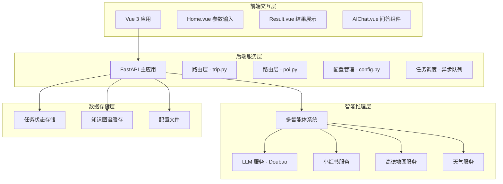
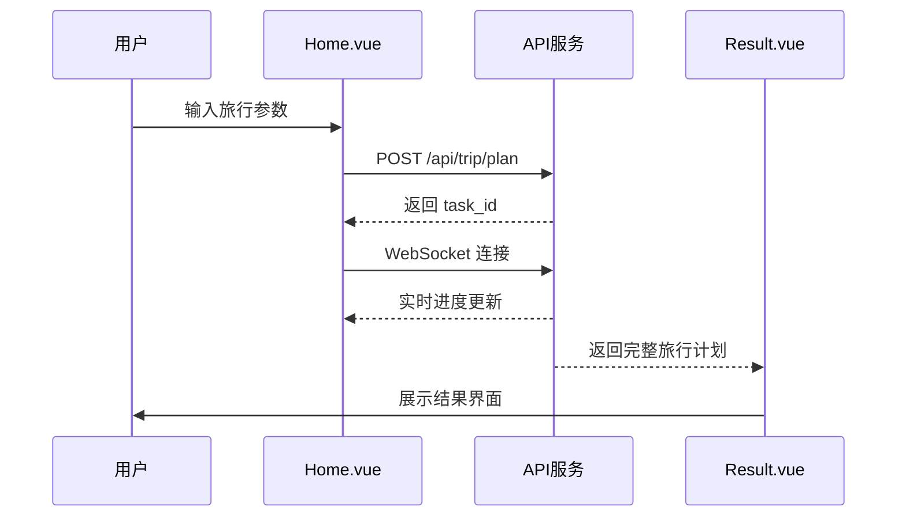
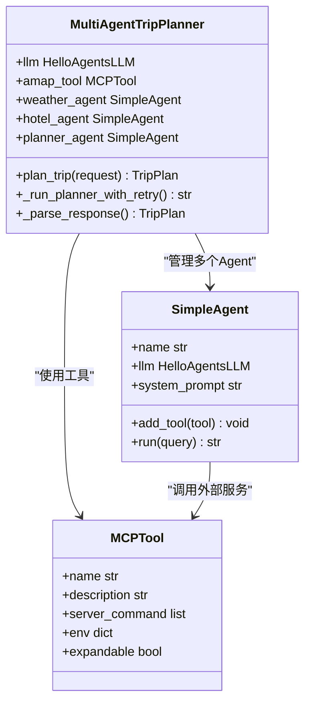
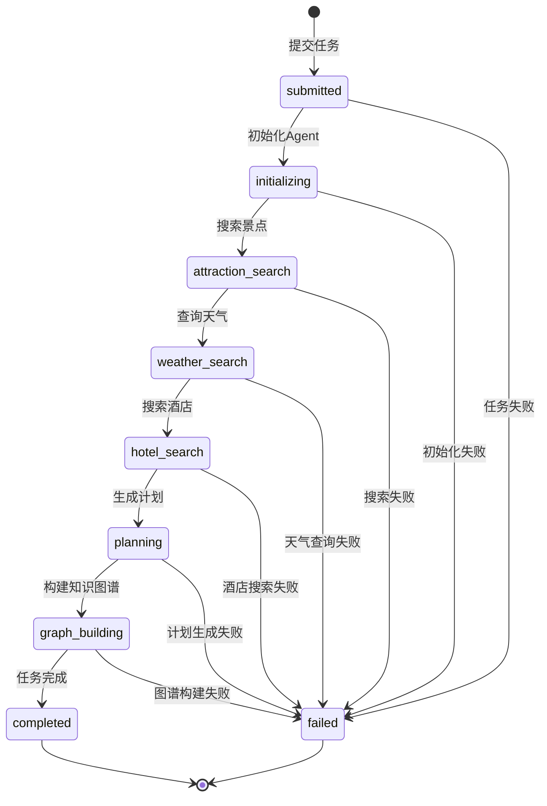
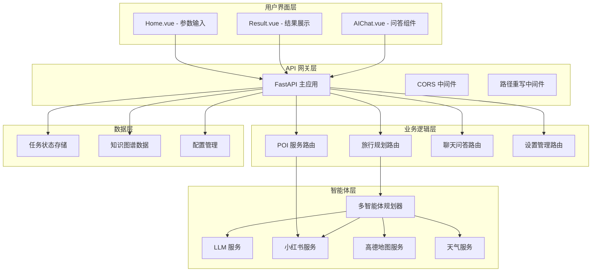
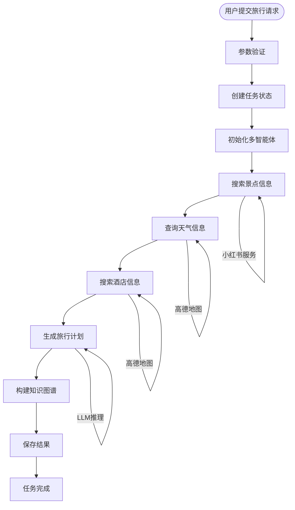
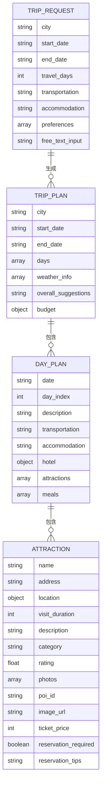

# 系统架构概览

<cite>
**本文档引用的文件**
- [README.md](file://README.md)
- [backend/app/api/main.py](file://backend/app/api/main.py)
- [backend/app/config.py](file://backend/app/config.py)
- [backend/app/agents/trip_planner_agent.py](file://backend/app/agents/trip_planner_agent.py)
- [backend/app/services/llm_service.py](file://backend/app/services/llm_service.py)
- [backend/app/services/xhs_service.py](file://backend/app/services/xhs_service.py)
- [backend/app/api/routes/trip.py](file://backend/app/api/routes/trip.py)
- [backend/app/api/routes/poi.py](file://backend/app/api/routes/poi.py)
- [backend/app/models/schemas.py](file://backend/app/models/schemas.py)
- [backend/app/services/knowledge_graph_service.py](file://backend/app/services/knowledge_graph_service.py)
- [backend/run.py](file://backend/run.py)
- [frontend/src/main.ts](file://frontend/src/main.ts)
- [frontend/src/views/Home.vue](file://frontend/src/views/Home.vue)
- [frontend/src/views/Result.vue](file://frontend/src/views/Result.vue)
- [frontend/src/services/api.ts](file://frontend/src/services/api.ts)
- [frontend/src/types/index.ts](file://frontend/src/types/index.ts)
- [docker-compose.yaml](file://docker-compose.yaml)
</cite>

## 目录
1. [项目简介](#项目简介)
2. [整体架构设计](#整体架构设计)
3. [前后端分离架构](#前后端分离架构)
4. [多智能体协作架构](#多智能体协作架构)
5. [异步任务处理架构](#异步任务处理架构)
6. [技术栈与选型分析](#技术栈与选型分析)
7. [系统架构图](#系统架构图)
8. [数据流与处理流程](#数据流与处理流程)
9. [性能特性与可扩展性](#性能特性与可扩展性)
10. [部署与运维](#部署与运维)
11. [总结](#总结)

## 项目简介

TripStar 是一个基于 HelloAgents 框架打造的多智能体协作文旅规划平台，采用前后端分离架构，结合 LLM/Agents 智能推理能力，为用户提供个性化的旅行规划服务。系统通过多智能体协作，整合小红书内容、高德地图数据、天气信息等多源数据，生成包含预算明细、每日行程、景点安排、天气信息等的完整旅行计划。

## 整体架构设计

系统采用标准的三层架构设计，分为前端交互层、后端服务层和智能推理层：



**图表来源**
- [backend/app/api/main.py:25-31](file://backend/app/api/main.py#L25-L31)
- [backend/app/config.py:21-67](file://backend/app/config.py#L21-L67)
- [backend/app/agents/trip_planner_agent.py:173-242](file://backend/app/agents/trip_planner_agent.py#L173-L242)

## 前后端分离架构

### 前端架构

前端采用 Vue 3 + TypeScript 技术栈，使用 Vite 作为构建工具，实现了现代化的单页应用架构：

- **路由系统**: 基于 Vue Router 实现 SPA 路由，支持首页和结果页的切换
- **状态管理**: 使用响应式数据绑定，通过 sessionStorage 持久化旅行计划数据
- **组件化设计**: 采用 Ant Design Vue 组件库，实现统一的 UI 设计规范
- **国际化支持**: 集成 Vue I18n，支持中英日多语言切换



**图表来源**
- [frontend/src/views/Home.vue:292-370](file://frontend/src/views/Home.vue#L292-L370)
- [frontend/src/services/api.ts:257-318](file://frontend/src/services/api.ts#L257-L318)

### 后端架构

后端基于 FastAPI 构建，提供了 RESTful API 和 WebSocket 服务：

- **中间件支持**: CORS 跨域支持、路径重写中间件
- **路由组织**: 按功能模块划分路由，清晰的 API 结构
- **任务调度**: 异步任务队列，支持长时间运行的 LLM 任务
- **配置管理**: 环境变量驱动的配置系统，支持运行时配置更新

**章节来源**
- [backend/app/api/main.py:13-61](file://backend/app/api/main.py#L13-L61)
- [backend/app/api/main.py:96-136](file://backend/app/api/main.py#L96-L136)

## 多智能体协作架构

系统采用基于 HelloAgents 框架的多智能体协作模式，通过专门的 Agent 处理不同领域的任务：

### 智能体分工



**图表来源**
- [backend/app/agents/trip_planner_agent.py:173-242](file://backend/app/agents/trip_planner_agent.py#L173-L242)
- [backend/app/agents/trip_planner_agent.py:257-339](file://backend/app/agents/trip_planner_agent.py#L257-L339)

### 智能体协作流程

1. **景点搜索 Agent**: 专门负责从高德地图搜索景点信息
2. **天气查询 Agent**: 负责获取目标城市的天气信息  
3. **酒店推荐 Agent**: 根据预算和位置推荐合适的住宿
4. **行程规划 Agent**: 综合所有信息生成完整的旅行计划

**章节来源**
- [backend/app/agents/trip_planner_agent.py:15-80](file://backend/app/agents/trip_planner_agent.py#L15-L80)

## 异步任务处理架构

系统采用异步任务处理机制，解决 LLM 生成超长文本导致的网关超时问题：

### 任务状态管理



**图表来源**
- [backend/app/api/routes/trip.py:25-38](file://backend/app/api/routes/trip.py#L25-L38)
- [backend/app/api/routes/trip.py:315-388](file://backend/app/api/routes/trip.py#L315-L388)

### WebSocket 实时通信

系统支持 WebSocket 实时推送任务状态，提供更好的用户体验：

- **状态推送**: 任务执行过程中的实时进度更新
- **错误处理**: 小红书 Cookie 过期等特定错误的友好提示
- **历史恢复**: 服务重启后任务状态的处理策略

**章节来源**
- [backend/app/api/routes/trip.py:390-440](file://backend/app/api/routes/trip.py#L390-L440)

## 技术栈与选型分析

### 后端技术栈

- **Python 3.10+**: 现代 Python 版本，支持最新的语法特性和性能优化
- **FastAPI**: 高性能 ASGI 框架，自动生成 API 文档，类型安全
- **HelloAgents**: 多智能体框架，简化 Agent 开发和协作
- **uvicorn**: ASGI 服务器，支持异步处理

### 前端技术栈

- **Vue 3**: 最新的 Vue 版本，Composition API 提供更好的逻辑组织
- **TypeScript**: 类型安全，提升代码质量和开发体验
- **Vite**: 快速的构建工具和开发服务器
- **Ant Design Vue**: 企业级 UI 组件库

### 服务集成

- **高德地图**: 提供地理编码、POI 搜索、路线规划等服务
- **小红书**: 获取真实的旅行攻略和景点图片
- **Doubao LLM**: 支持结构化输出的大语言模型

**章节来源**
- [README.md:9-11](file://README.md#L9-L11)
- [backend/app/config.py:43-55](file://backend/app/config.py#L43-L55)

## 系统架构图



**图表来源**
- [README.md:47-97](file://README.md#L47-L97)
- [backend/app/api/main.py:13-61](file://backend/app/api/main.py#L13-L61)

## 数据流与处理流程

### 旅行计划生成流程



**图表来源**
- [backend/app/api/routes/trip.py:315-388](file://backend/app/api/routes/trip.py#L315-L388)
- [backend/app/agents/trip_planner_agent.py:257-339](file://backend/app/agents/trip_planner_agent.py#L257-L339)

### 数据模型设计

系统采用 Pydantic 模型定义数据结构，确保数据的完整性和一致性：



**图表来源**
- [backend/app/models/schemas.py:10-33](file://backend/app/models/schemas.py#L10-L33)
- [backend/app/models/schemas.py:146-155](file://backend/app/models/schemas.py#L146-L155)

**章节来源**
- [backend/app/models/schemas.py:1-264](file://backend/app/models/schemas.py#L1-L264)

## 性能特性与可扩展性

### 性能优化策略

1. **异步并发处理**: 多智能体任务采用并发执行，显著提升处理效率
2. **任务持久化**: 任务状态持久化到文件系统，支持服务重启后的状态恢复
3. **缓存机制**: 知识图谱数据的缓存，减少重复计算
4. **连接池管理**: LLM 服务和数据库连接的连接池优化

### 可扩展性设计

1. **模块化架构**: 各个服务模块相对独立，便于功能扩展
2. **插件化设计**: 支持新增智能体和外部服务集成
3. **配置驱动**: 通过环境变量和配置文件管理系统行为
4. **容器化部署**: 支持 Docker 容器化部署，便于水平扩展

**章节来源**
- [backend/app/agents/trip_planner_agent.py:265-267](file://backend/app/agents/trip_planner_agent.py#L265-L267)
- [backend/app/api/routes/trip.py:82-104](file://backend/app/api/routes/trip.py#L82-L104)

## 部署与运维

### Docker 部署

系统提供完整的 Docker 配置，支持一键部署：

```yaml
version: '3.8'
services:
  trip-planner:
    build:
      context: .
      dockerfile: Dockerfile
      args:
        VITE_AMAP_WEB_JS_KEY: ${VITE_AMAP_WEB_JS_KEY:-your_amap_web_js_api_key_here}
    container_name: helloagents-trip-planner
    ports:
      - "7860:7860"
    environment:
      - LLM_API_KEY=${LLM_API_KEY:-your_key}
      - LLM_BASE_URL=${LLM_BASE_URL:-your_url}
      - LLM_MODEL_ID=${LLM_MODEL_ID:-your_model}
      - LLM_TIMEOUT=${LLM_TIMEOUT:-600}
      - VITE_AMAP_WEB_KEY=${VITE_AMAP_WEB_KEY:-your_web_api_key_here}
      - XHS_COOKIE=${XHS_COOKIE:-your_xhs_cookie_here}
      - HOST=0.0.0.0
      - PORT=7860
      - LOG_LEVEL=INFO
    restart: unless-stopped
```

**图表来源**
- [docker-compose.yaml:1-24](file://docker-compose.yaml#L1-L24)

### 环境配置

系统支持多种环境配置方式：

- **开发环境**: 使用 `.env` 文件配置本地开发参数
- **生产环境**: 通过 Docker 环境变量配置运行参数
- **运行时配置**: 支持前端设置页面动态更新配置

**章节来源**
- [backend/app/config.py:125-160](file://backend/app/config.py#L125-L160)
- [docker-compose.yaml:13-22](file://docker-compose.yaml#L13-L22)

## 总结

TripStar 项目通过精心设计的架构，成功实现了前后端分离、多智能体协作和异步任务处理的有机结合。系统采用现代技术栈，具备良好的性能表现和可扩展性，为用户提供了智能化的旅行规划服务。

### 核心优势

1. **架构清晰**: 分层设计明确，职责划分合理
2. **技术先进**: 采用最新的前端和后端技术栈
3. **智能协作**: 多智能体系统提升了服务的智能化水平
4. **用户体验**: 异步处理和实时反馈提供了优秀的用户体验
5. **可扩展性强**: 模块化设计支持功能的持续扩展

### 发展方向

未来可以考虑的功能增强包括：
- Google Maps 集成替代高德地图
- 多城市旅行支持
- 美食推荐增强
- 代理配置支持