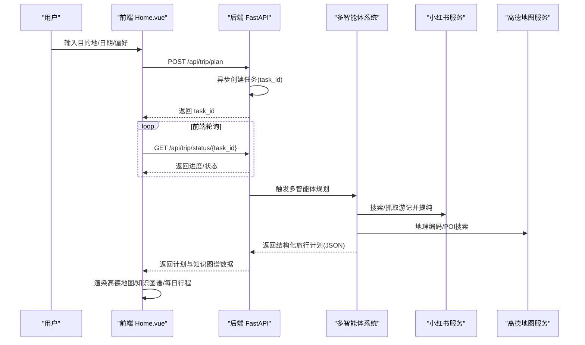
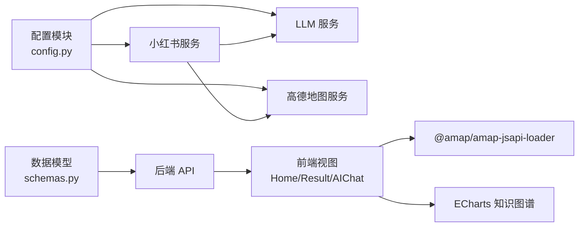

# 项目概述

<cite>
**本文档引用的文件**
- [README.md](file://README.md)
- [backend/app/config.py](file://backend/app/config.py)
- [backend/app/agents/trip_planner_agent.py](file://backend/app/agents/trip_planner_agent.py)
- [backend/app/api/main.py](file://backend/app/api/main.py)
- [backend/app/services/xhs_service.py](file://backend/app/services/xhs_service.py)
- [backend/app/services/knowledge_graph_service.py](file://backend/app/services/knowledge_graph_service.py)
- [backend/app/models/schemas.py](file://backend/app/models/schemas.py)
- [frontend/src/main.ts](file://frontend/src/main.ts)
- [frontend/src/views/Home.vue](file://frontend/src/views/Home.vue)
- [frontend/src/views/Result.vue](file://frontend/src/views/Result.vue)
- [frontend/src/components/AIChat.vue](file://frontend/src/components/AIChat.vue)
- [frontend/src/i18n/index.ts](file://frontend/src/i18n/index.ts)
- [docker-compose.yaml](file://docker-compose.yaml)
</cite>

## 目录
1. [项目简介](#项目简介)
2. [核心价值主张](#核心价值主张)
3. [技术创新点](#技术创新点)
4. [主要功能特性](#主要功能特性)
5. [系统架构](#系统架构)
6. [技术栈概览](#技术栈概览)
7. [应用场景与目标用户](#应用场景与目标用户)
8. [核心工作流程](#核心工作流程)
9. [依赖关系分析](#依赖关系分析)
10. [性能与可用性考量](#性能与可用性考量)
11. [故障排查指南](#故障排查指南)
12. [结论](#结论)

## 项目简介
TripStar 是一个基于 HelloAgents 框架的多智能体协作文旅规划平台，旨在解决用户在旅行规划中的“信息过载”和“决策疲劳”。项目采用大语言模型（LLM）与多智能体协作架构，结合真实用户游记与权威地理数据，为用户提供从行程规划、预算明细到沉浸式伴游问答的一站式解决方案。

## 核心价值主张
- 以“真实用户游记”为数据源，通过 LLM 提纯生成可信的景点推荐与避坑指南，减少无效信息干扰。
- 通过多智能体分工协作，自动整合天气、酒店、POI 等多方数据，形成结构化旅行计划。
- 提供高定主题的交互体验与多语言支持，降低跨语言旅行的信息门槛。
- 以知识图谱可视化与伴游问答增强旅行体验，实现“所想即所得”的智能旅行助手。

**章节来源**
- [README.md:20-37](file://README.md#L20-L37)

## 技术创新点
- 多智能体协作模式：将“景点搜索、天气查询、酒店推荐、行程规划”拆分为独立 Agent，通过主控 Agent 协同编排，提升复杂任务的可扩展性与鲁棒性。
- 小红书深度集成：通过原生签名与 SSR 抓取相结合的方式，稳定获取游记正文与图片，再由 LLM 提纯结构化信息，确保数据质量与时效性。
- 异步任务与进度回调：针对 LLM 生成耗时较长的问题，采用异步任务 + 前端轮询机制，避免网关超时并提供实时进度反馈。
- 知识图谱可视化：将旅行计划抽象为节点与关系，构建“城市-天数-行程节点-预算”的关系图谱，帮助用户快速理解行程结构。
- 低代码工具集成：通过 MCP 工具桥接高德地图服务，统一 Agent 的外部能力调用方式，降低耦合度。

**章节来源**
- [README.md:101-127](file://README.md#L101-L127)
- [backend/app/agents/trip_planner_agent.py:173-339](file://backend/app/agents/trip_planner_agent.py#L173-L339)
- [backend/app/services/xhs_service.py:247-354](file://backend/app/services/xhs_service.py#L247-L354)
- [backend/app/services/knowledge_graph_service.py:34-169](file://backend/app/services/knowledge_graph_service.py#L34-L169)

## 主要功能特性
- 小红书深度集成：从真实游记中提取景点名称、评价、游玩时长与预约信息，结合高德地理编码补齐经纬度。
- 景点图片实时获取：在行程生成后，前端按景点名称调用后端接口，后端通过小红书搜索最新帖子并抓取首图直链。
- 多语言支持：基于 Vue I18n 的国际化方案，支持中、英、日等多语种无缝切换。
- 高定主题交互：采用暗黑玻璃拟物风格，提供沉浸式视觉体验。
- 知识图谱可视化：将行程数据转换为 ECharts 图谱，直观呈现“城市-天数-景点-预算”等关系。
- 伴游 AI 问答：在结果页提供悬浮式聊天窗口，支持针对行程细节的持续追问与上下文记忆。

**章节来源**
- [README.md:26-36](file://README.md#L26-L36)
- [frontend/src/i18n/index.ts:1-53](file://frontend/src/i18n/index.ts#L1-L53)
- [frontend/src/views/Result.vue:242-250](file://frontend/src/views/Result.vue#L242-L250)
- [frontend/src/components/AIChat.vue:1-152](file://frontend/src/components/AIChat.vue#L1-L152)

## 系统架构
系统采用前后端分离架构，分为前端交互层、后端服务层与智能推理层（多智能体 + LLM）：

- 前端交互层：Vue 3 + TypeScript，负责参数输入、结果展示、地图渲染、知识图谱与 AI 问答。
- 后端服务层：FastAPI，提供异步任务调度、多智能体编排、第三方服务集成与 API 网关。
- 智能推理层：基于 HelloAgents 的多智能体系统，结合 LLM 与 MCP 工具，完成数据采集、清洗与规划。

```mermaid
graph TB
subgraph "前端交互视图"
A1["参数输入 Home.vue"]
A2["沉浸加载动画"]
A3["高定路书 Result.vue"]
A4["知识图谱侧边栏"]
A5["AI 旅行智能体浮窗"]
end
subgraph "后端网关"
B1["异步轮询机制 POST/plan & GET/status"]
B2["上下文伴游问答 POST/chat/ask"]
B3["景点搜图 API GET/poi/photo"]
end
subgraph "多智能体协同引擎"
C1["旅程总控 Agent"]
C2["小红书景点提取 (SSR + LLM 提纯)"]
C3["天气预报 Agent"]
C4["酒店推荐 Agent"]
end
subgraph "服务层"
D1["LLM模型API"]
D2["高德 MCP Server 地理编码/POI搜索"]
D3["天气/时间检索工具"]
D4["小红书 API 搜索/SSR 抓取"]
end
A1 --> B1
A3 < --> B1
A3 --> B3
A5 < --> B2
B1 --> C1
B2 --> D1
B3 --> D4
C1 --> C2
C1 --> C3
C1 --> C4
C2 < --> D4
C2 --> D1
C2 --> D2
C3 < --> D3
C4 < --> D2
```

**图表来源**
- [README.md:47-97](file://README.md#L47-L97)

**章节来源**
- [README.md:43-97](file://README.md#L43-L97)

## 技术栈概览
- 后端
  - Python 3.10+ 与 FastAPI：提供高性能异步 API 与任务调度。
  - HelloAgents：多智能体框架，支撑 Agent 编排与工具调用。
  - Pydantic：数据模型与校验，保障请求/响应一致性。
- 前端
  - Vue 3 + TypeScript：现代化前端框架，配合路由与状态管理。
  - Ant Design Vue：UI 组件库，提供一致的交互体验。
  - ECharts：知识图谱可视化。
  - @amap/amap-jsapi-loader：高德地图 JS API 集成。
- 第三方服务
  - 高德地图：地理编码、POI 搜索、路线规划。
  - 小红书：游记搜索、详情抓取、图片直链获取。
  - LLM 服务：兼容 OpenAI 格式的模型 API（如豆包）。

**章节来源**
- [README.md:9-11](file://README.md#L9-L11)
- [docker-compose.yaml:1-24](file://docker-compose.yaml#L1-L24)

## 应用场景与目标用户
- 应用场景
  - 国内短途/长途旅行规划：从目的地、日期、偏好到每日行程、预算与天气联动。
  - 多语言旅行：面向国际旅行者，提供多语言界面与问答支持。
  - 智慧出行：结合地图与知识图谱，帮助用户快速理解行程结构与最优路线。
- 目标用户
  - 自由行旅客：追求个性化与灵活性的旅行者。
  - 跨语言旅行者：需要多语言界面与无障碍问答的用户。
  - 决策效率优先用户：希望通过结构化数据与可视化工具减少规划成本。

**章节来源**
- [README.md:20-37](file://README.md#L20-L37)

## 核心工作流程
1. 异步轮询任务系统（解决网关超时）
   - 前端提交旅行请求后，后端立即返回任务 ID，并在后台异步执行多智能体规划。
   - 前端以固定间隔轮询任务状态，实时显示进度（如“正在搜索景点…”）。
2. 多智能体架构（Agentic Workflow）
   - 主控 Agent 接收用户指令，拆解为若干子任务：
     - 小红书景点提取：搜索城市旅游攻略帖，SSR 抓取正文，LLM 提纯结构化信息，再通过高德 POI 补齐经纬度。
     - 天气与酒店：天气管家查询目标日期气候，酒店专员根据预算与偏好推荐落脚点。
     - 路线编排：整合三方数据，计算最优游玩顺序与交通方式，输出结构化 JSON。
   - 景点搜图：行程生成后，前端按景点名称调用后端接口，后端抓取小红书最新帖子首图直链。
3. 数据驱动的动态组件渲染
   - 前端通过响应式变量读取后端返回的 JSON，动态渲染高德地图连线、ECharts 知识图谱与每日行程卡片。



**图表来源**
- [README.md:103-118](file://README.md#L103-L118)
- [backend/app/api/main.py:56-60](file://backend/app/api/main.py#L56-L60)
- [backend/app/agents/trip_planner_agent.py:257-339](file://backend/app/agents/trip_planner_agent.py#L257-L339)

**章节来源**
- [README.md:101-127](file://README.md#L101-L127)

## 依赖关系分析
- 配置管理
  - 后端通过集中配置模块管理 LLM、高德地图与小红书等关键服务的运行时参数，并支持持久化覆盖与环境变量同步。
- 数据模型
  - 前后端共享的 Pydantic 模型定义了旅行计划、每日行程、预算、天气与知识图谱的数据结构，保证接口一致性。
- 服务集成
  - 小红书服务封装了原生签名与 SSR 抓取，LLM 服务提供统一的结构化输出能力，高德 MCP 工具桥接地理服务。
- 前端路由与国际化
  - Vue Router 管理 SPA 路由，I18n 提供多语言支持，Ant Design Vue 提供 UI 组件生态。



**图表来源**
- [backend/app/config.py:21-160](file://backend/app/config.py#L21-L160)
- [backend/app/models/schemas.py:10-264](file://backend/app/models/schemas.py#L10-L264)
- [backend/app/services/xhs_service.py:68-199](file://backend/app/services/xhs_service.py#L68-L199)

**章节来源**
- [backend/app/config.py:21-160](file://backend/app/config.py#L21-L160)
- [backend/app/models/schemas.py:10-264](file://backend/app/models/schemas.py#L10-L264)

## 性能与可用性考量
- 异步任务与超时重试
  - 多智能体规划阶段采用异步执行与超时重试策略，避免长时间阻塞与一次性失败导致的用户体验下降。
- JSON 解析容错
  - 针对 LLM 输出的 JSON 格式污染，内置多轮修复策略（去注释、引号修复、截断修复、正则提取与 LLM 修复），显著提升稳定性。
- 前端轮询与进度反馈
  - 通过固定间隔轮询任务状态，前端可实时展示进度，缓解用户等待焦虑。
- 地图与图谱渲染优化
  - 知识图谱与地图组件按需渲染，避免一次性加载大量数据造成卡顿。

**章节来源**
- [backend/app/agents/trip_planner_agent.py:354-758](file://backend/app/agents/trip_planner_agent.py#L354-L758)
- [backend/app/api/main.py:33-60](file://backend/app/api/main.py#L33-L60)

## 故障排查指南
- 配置项缺失或错误
  - 高德地图 Web 服务 Key 未配置会导致地理编码与 POI 搜索功能受限；小红书 Cookie 未配置或失效会导致游记抓取失败。
- LLM 输出异常
  - 若 JSON 解析失败，系统会自动尝试多种修复策略；必要时可启用 LLM 修复作为最后手段。
- 代理路径问题
  - 在云部署或反向代理环境下，后端已内置路径重写中间件，确保 API 路径前缀不影响实际路由。
- 健康检查
  - 可通过健康检查端点确认服务状态，便于运维监控与快速定位问题。

**章节来源**
- [backend/app/config.py:162-199](file://backend/app/config.py#L162-L199)
- [backend/app/agents/trip_planner_agent.py:604-758](file://backend/app/agents/trip_planner_agent.py#L604-L758)
- [backend/app/api/main.py:33-60](file://backend/app/api/main.py#L33-L60)

## 结论
TripStar 通过“多智能体 + LLM + 第三方服务”的组合，有效解决了旅行规划中的信息过载与决策疲劳问题。其以真实游记为数据源、以结构化输出为目标、以可视化与问答为体验增强，形成了从“输入偏好”到“生成计划”的闭环。项目在架构设计、数据治理与用户体验方面均体现出较高的工程化水平，适合进一步拓展至多城市、多语言与更多旅行场景。