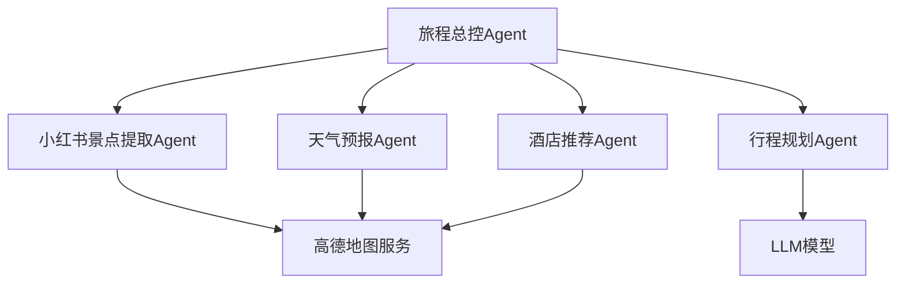
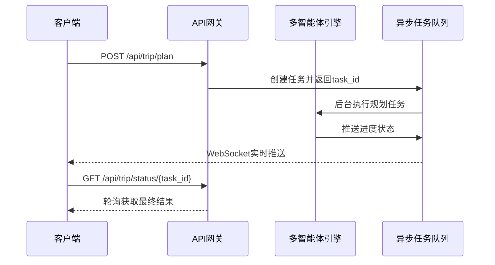
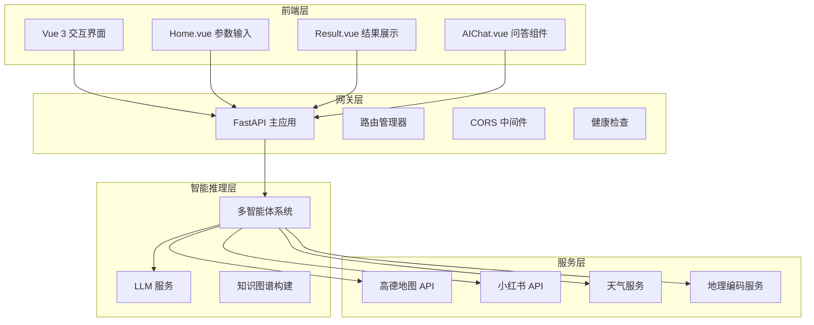
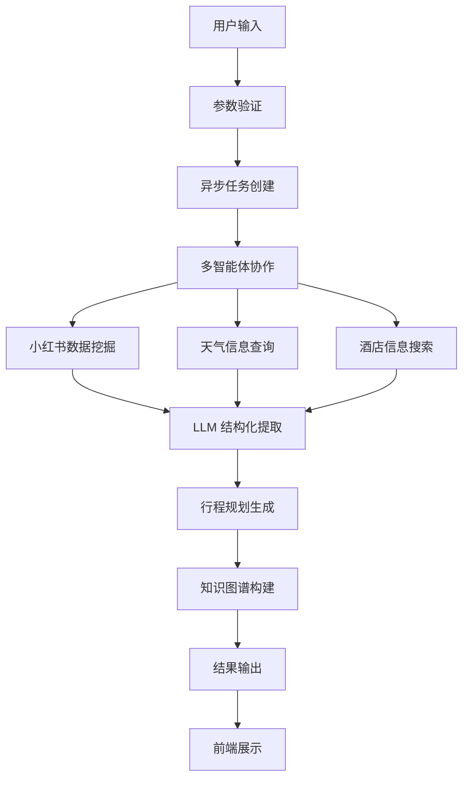

# 项目简介

<cite>
**本文档引用的文件**
- [README.md](file://README.md)
- [config.py](file://backend/app/config.py)
- [trip_planner_agent.py](file://backend/app/agents/trip_planner_agent.py)
- [llm_service.py](file://backend/app/services/llm_service.py)
- [main.py](file://backend/app/api/main.py)
- [schemas.py](file://backend/app/models/schemas.py)
- [trip.py](file://backend/app/api/routes/trip.py)
- [xhs_service.py](file://backend/app/services/xhs_service.py)
- [Home.vue](file://frontend/src/views/Home.vue)
- [Result.vue](file://frontend/src/views/Result.vue)
- [run.py](file://backend/run.py)
- [Dockerfile](file://Dockerfile)
- [docker-compose.yaml](file://docker-compose.yaml)
</cite>

## 目录
1. [项目概述](#项目概述)
2. [核心价值主张](#核心价值主张)
3. [技术创新点](#技术创新点)
4. [系统架构](#系统架构)
5. [核心功能特性](#核心功能特性)
6. [应用场景与目标用户](#应用场景与目标用户)
7. [发展历程与版本演进](#发展历程与版本演进)
8. [部署与运行](#部署与运行)
9. [总结](#总结)

## 项目概述

TripStar（旅途星辰）是一个基于 HelloAgents 框架打造的多智能体协作文旅规划平台。该项目旨在解决用户在旅行规划过程中面临的"信息过载"和"决策疲劳"两大核心痛点，通过人工智能技术为用户提供智能化、个性化的旅行规划解决方案。

项目采用前后端分离架构，结合多智能体协作、大语言模型（LLM）集成、异步任务处理等核心技术，为用户提供从旅行计划制定到行程执行的全流程服务。

## 核心价值主张

### 解决核心痛点
- **信息过载问题**：通过智能筛选和结构化处理，将海量旅行信息转化为可执行的规划方案
- **决策疲劳缓解**：提供基于用户偏好的自动化决策，减少重复性规划工作
- **个性化体验**：充分考虑用户的交通偏好、住宿风格、兴趣爱好等个性化需求

### 独特优势
- **真实数据支撑**：深度整合小红书真实用户游记，提供可信的景点推荐和避坑指南
- **智能协作机制**：多智能体分工协作，每个Agent专注于特定领域任务
- **实时交互体验**：支持WebSocket实时状态推送，提供流畅的用户体验

## 技术创新点

### 多智能体协作架构
项目实现了高度模块化的智能体系统，每个智能体负责特定的专业领域：



**图表来源**
- [trip_planner_agent.py:173-242](file://backend/app/agents/trip_planner_agent.py#L173-L242)

### LLM 集成与优化
- **结构化输出保障**：通过严格的JSON格式约束和多层容错修复机制
- **超时处理优化**：实现智能重试机制，提升大模型调用稳定性
- **浏览器特征伪装**：解决第三方API的WAF拦截问题

### 异步任务处理
项目采用先进的异步任务处理机制，有效解决LLM生成超长文本导致的网关超时问题：



**图表来源**
- [trip.py:276-312](file://backend/app/api/routes/trip.py#L276-L312)
- [trip.py:390-440](file://backend/app/api/routes/trip.py#L390-L440)

**章节来源**
- [trip.py:25-145](file://backend/app/api/routes/trip.py#L25-L145)
- [trip_planner_agent.py:257-339](file://backend/app/agents/trip_planner_agent.py#L257-L339)

## 系统架构

### 整体架构设计
TripStar采用标准的三层架构设计，实现了前后端完全分离：



**图表来源**
- [main.py:24-61](file://backend/app/api/main.py#L24-L61)
- [config.py:21-71](file://backend/app/config.py#L21-L71)

### 数据流架构
项目实现了完整的数据处理流水线，从用户输入到最终结果输出：



**图表来源**
- [trip.py:315-388](file://backend/app/api/routes/trip.py#L315-L388)
- [xhs_service.py:247-354](file://backend/app/services/xhs_service.py#L247-L354)

**章节来源**
- [main.py:138-147](file://backend/app/api/main.py#L138-L147)
- [schemas.py:10-264](file://backend/app/models/schemas.py#L10-L264)

## 核心功能特性

### 1. 智能旅行规划
- **个性化行程生成**：根据用户偏好自动生成定制化旅行计划
- **多维度预算管理**：精确计算景点门票、住宿、餐饮、交通等各项费用
- **动态路线优化**：智能计算最优游览顺序，避免重复往返

### 2. 小红书深度集成
- **真实游记挖掘**：通过原生API和SSR降级方案获取真实用户游记
- **智能内容提取**：使用LLM从长文本中提取结构化景点信息
- **实时图片获取**：根据景点名称从小红书获取最新实拍照片

### 3. 多语言支持
- **国际化界面**：支持中、英、日等多种语言界面切换
- **AI问答本地化**：智能体问答支持多语言交互

### 4. 知识图谱可视化
- **结构化数据展示**：将旅行数据转换为可交互的知识图谱
- **关系网络分析**：直观展示城市-天数-行程节点-预算等关系

### 5. 实时状态监控
- **WebSocket 实时推送**：提供任务执行进度的实时反馈
- **轮询兼容模式**：支持传统HTTP轮询方式
- **任务持久化**：支持服务重启后的任务恢复

**章节来源**
- [README.md:26-37](file://README.md#L26-L37)
- [xhs_service.py:247-354](file://backend/app/services/xhs_service.py#L247-L354)
- [trip_planner_agent.py:354-467](file://backend/app/agents/trip_planner_agent.py#L354-L467)

## 应用场景与目标用户

### 目标用户群体
- **旅行爱好者**：希望获得个性化、高质量旅行建议的用户
- **商务出行者**：需要高效规划商务行程的专业人士
- **自由行游客**：偏好灵活安排行程的自助旅行者
- **多语言旅行者**：需要多语言支持的国际旅行用户

### 典型应用场景
- **周末短途游**：快速生成2-3天的短途旅行计划
- **深度文化游**：针对历史文化感兴趣的用户定制专属路线
- **美食之旅**：专注于美食体验的专项旅行规划
- **家庭亲子游**：考虑儿童需求的全家出行规划

## 发展历程与版本演进

### v1.0 版本（基础功能）
- 实现了基本的旅行规划功能
- 集成了高德地图和天气服务
- 建立了基础的多智能体架构

### v2.0 版本（重大升级）
- **小红书深度集成**：完成小红书API对接，获取真实用户游记
- **智能内容提取**：实现LLM驱动的游记结构化提取
- **图片实时获取**：支持景点图片的实时搜索和展示
- **预约提醒功能**：智能识别并提醒需要预约的景点

### 未来发展规划
- 接入Google Maps，替代高德地图
- 模型返回语言国际化适配
- 历史计划查看和导入功能
- 多城市旅行支持
- 美食推荐增强

**章节来源**
- [README.md:239-250](file://README.md#L239-L250)

## 部署与运行

### 环境要求
- **Python 3.10+**：后端运行环境
- **Node.js 18+**：前端构建和运行
- **Docker**：容器化部署（可选）

### 配置要求
- **LLM API Key**：支持OpenAI格式的大模型服务
- **高德地图API Key**：Web服务和JS API双重配置
- **小红书Cookie**：用于访问小红书API

### 部署方式

#### 本地开发部署
```bash
# 后端启动
cd backend
pip install -r requirements.txt
uvicorn app.api.main:app --host 0.0.0.0 --port 8000 --reload

# 前端启动
cd frontend
npm install
npm run dev
```

#### Docker 容器部署
```bash
# 构建镜像
docker build -t tripstar .

# 启动容器
docker run -d \
  --name tripstar \
  -p 7860:7860 \
  -e LLM_API_KEY=your_key \
  -e VITE_AMAP_WEB_KEY=your_key \
  -e XHS_COOKIE=your_cookie \
  tripstar
```

**章节来源**
- [README.md:129-200](file://README.md#L129-L200)
- [Dockerfile:1-64](file://Dockerfile#L1-L64)
- [docker-compose.yaml:1-24](file://docker-compose.yaml#L1-L24)

## 总结

TripStar项目通过技术创新和精心设计，成功解决了传统旅行规划应用的核心痛点。其基于HelloAgents框架的多智能体协作架构、深度集成的小红书真实数据源、以及先进的异步任务处理机制，共同构成了一个高效、智能、可扩展的旅行规划平台。

项目不仅提供了优秀的用户体验，更重要的是展示了AI技术在实际应用场景中的巨大潜力。随着功能的不断完善和技术的持续演进，TripStar有望成为旅行规划领域的标杆产品，为更多用户提供智能化的旅行服务体验。